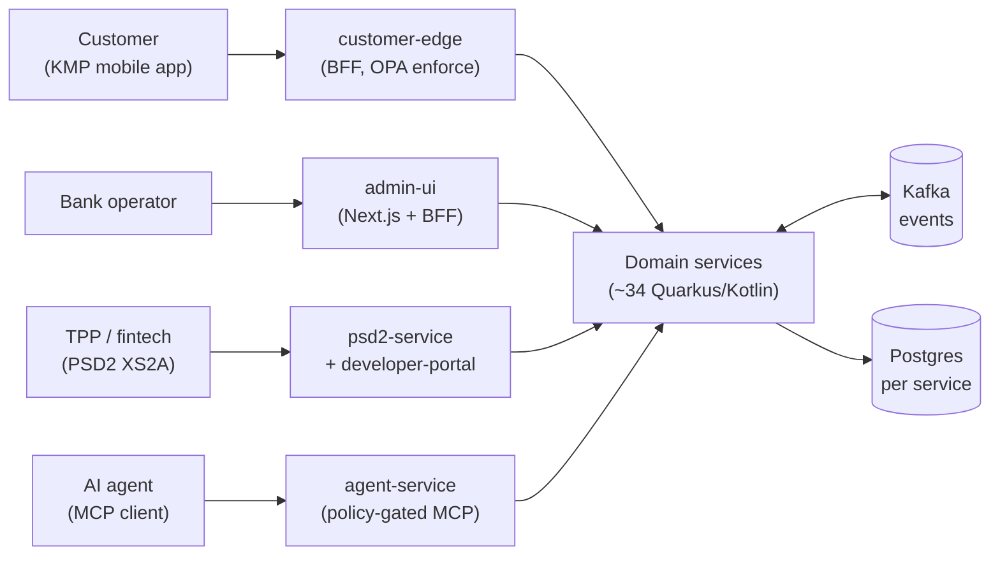
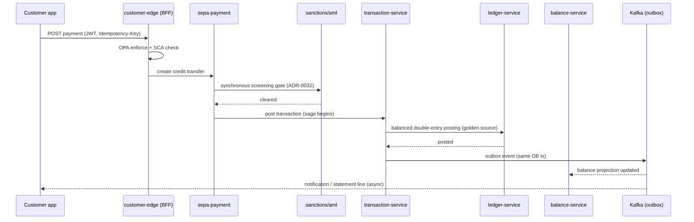

<!--
SPDX-License-Identifier: Apache-2.0
Copyright (c) OpenBank contributors. Licensed under the Apache License, Version 2.0.
-->

# OpenBank — Architecture

This is the contributor-facing technical map of OpenBank: how ~34 microservices, two
front-ends, and a shared library fit into one banking platform, and which patterns you
must follow when you add to it.

It **complements** the [`README.md`](README.md) (which has the project-status overview,
tech stack, and quick-start) and the **Architecture Decision Records**
([`docs/adr/README.md`](docs/adr/README.md) — the index, with a per-decision
*Decision-Status* and *Delivery-Status*). When this document and an ADR disagree, the ADR
wins; when an ADR and [`openbank-libs/governance/rules.yaml`](openbank-libs/governance/rules.yaml)
disagree, `rules.yaml` (what CI enforces) wins.

> **Honesty note.** OpenBank is a *reference implementation*, not a production bank. The
> architecture below is the intended design; delivery maturity varies by service. Every
> ADR carries a `Delivery-Status` (`Shipped` / `Partial` / `Planned`) — read
> [`docs/adr/README.md`](docs/adr/README.md) for the ground truth rather than assuming a
> described capability is fully built. Roughly half the recorded decisions are `Shipped`
> to the sandbox and half are `Partial` (core path in, last-mile gaps open).

---

## 1. System context

Four classes of actor reach the platform, each through a single front door — never
directly to a domain service:



- **Customers** use the Kotlin-Multiplatform app (separate repo, ADR-0064) which talks
  only to **`customer-edge`**, the customer BFF — the sole browser/app-to-cluster path
  for that audience, with OPA in *enforce* mode (ADR-0065; mirrors the admin BFF pattern, ADR-0056).
- **Operators** use **`admin-ui`** (Next.js); its server-side BFF is the only path from the
  operator console into the cluster (ADR-0056). No service is exposed to a browser directly.
- **TPPs** (third parties) reach **`psd2-service`** (Berlin Group NextGenPSD2 + Czech ČOBS
  profile, ADR-0090) via the public **`developer-portal`** (ADR-0093), gated by consent
  (`consent-service`) and SCA (`sca-service`).
- **AI agents** call **`agent-service`** over MCP; every tool call is OPA-gated and
  AI-attributed in the audit trail (ADR-0031, ADR-0034).

---

## 2. The unit of architecture: a hexagonal service

Every `openbank-*-service` follows the same hexagonal layout (ADR-0002). The
**dependency rule** points inward and is **enforced in CI** — the domain layer has *zero*
framework imports:

```
domain/                 pure Kotlin — entities, value objects, domain events. No Quarkus, no JPA.
application/
  port/in/              use-case interfaces (commands + queries) — the service's API to itself
  port/out/             repository + event-publisher interfaces (what the domain needs)
  usecase/              use-case implementations — orchestration, no framework leakage
infrastructure/
  persistence/          Panache entities + repositories (implements port/out)
  kafka/ | messaging/   transactional-outbox publishers + event consumers (implements port/out)
  rest/                 JAX-RS resources, DTOs, exception mappers (drives port/in)
```

Why it matters for contributors: business logic is testable without a container (fast unit
tests with mocked ports), and a framework swap never reaches the domain. Shared runtime
plumbing — `Money`, IBAN, idempotency, audit, outbox base entity, `ServiceInfo`,
API-version filter, authz — lives in **`openbank-libs`** (being split into `openbank-libs-domain`
and `openbank-libs-runtime` per ADR-0122) so the 33 services don't re-implement it
(ADR-0013, ADR-0014, ADR-0049).

Each service owns its **own Postgres database** (ADR-0009) — no shared schema, no
cross-service joins. Services integrate only via **synchronous REST** (queries / commands)
or **asynchronous Kafka events** (facts), never by reaching into another service's tables.

---

## 3. Bounded contexts

The fleet groups into coherent domains. The flat list with ports lives in the README
[service catalogue](README.md#project-status); here is the *mental model* and where the
governance weight sits.

| Context | Services | Anchoring ADRs |
|---|---|---|
| **Ledger & balances** (the money core) | `ledger-service` (golden source), `balance-service` (projection), `transaction-service` (posting, saga, idempotency, rail settlement), `account-service` | 0039, 0108, 0003 |
| **Party & identity** | `party-service` (master data + GDPR lifecycle), `pid-service` (dedup + EUDI/PID), `sca-service`, `consent-service` | 0072, 0094, 0021, 0118 |
| **Onboarding & financial crime** | `onboarding-service` (funnel projection), `kyc-service`, `aml-service`, `sanctions-service` (pg_trgm fuzzy match), `fraud-service` (velocity signal plane) | 0069, 0116, 0084, 0032 |
| **Payment rails** | `sepa-payment`, `sepa-instant`, `domestic-payment`, `swift-service`, `sdd-service` (direct debit), `standing-order-service`, `clearing-service`, `settlement-service`, `clearing-simulator`, `fx-service` | 0104, 0108, 0036, 0114 |
| **Cards & disputes** | `card-issuance-service`, `dispute-service` (PSD2 deadlines, chargebacks) | 0113, 0117 |
| **Products & servicing** | `product-catalog`, `interest-service` (+ withholding tax), `lending-service` (four-eyes), `statement-service` (camt.053 / MT940 / PDF) | 0028, 0033, 0035 |
| **Open Banking (PSD2 / XS2A)** | `psd2-service` (Berlin + ČOBS), `tpp-registry-service`, `developer-portal`, `consent-service` | 0090, 0093 |
| **Regulatory reporting** | `anacredit-service`, `finrep-service` (FINREP / COREP) | 0037, 0097 |
| **Edges & AI** | `customer-edge` (mobile BFF), `admin-ui` (operator console), `copilot-service` (customer AI), `agent-service` / `finops-agent` / `devops-agent` (autonomous ops), `api-gateway` (Kong) | 0056, 0089, 0031, 0112, 0119 |
| **Platform & data** | `audit-service` (hash-chained audit), `notification-service`, `analytics-sink` (event→ClickHouse), `simulation` (DST harness), `openbank-libs`, `openbank-infra` | 0086, 0022, 0100, 0029 |

---

## 4. Cross-cutting runtime patterns

These are the platform-wide mechanisms. Use the existing one; don't invent a parallel.

### Eventing — transactional outbox over Kafka (ADR-0003, ADR-0013, ADR-0050)
A service that changes state and must publish a fact writes the event to an **outbox table
in the same DB transaction** as the state change, then a relay dispatches it to Kafka
at-least-once. This makes "state changed but event lost" (or vice-versa) impossible.
- Outbox base entity + relay live in `openbank-libs`; a service declares a
  `*OutboxEntity : PanacheOutboxEntity`.
- **Footgun:** `openbank.outbox.dispatch-enabled` defaults to `false` — a service with an
  outbox MUST set it `true` or events silently never dispatch (`attempt_count` stays 0).
- Consumers are idempotent and **poison-pill safe** (parse failure is logged and acked, not
  retried forever). See `PartyErasureConsumer` / `PartyEventConsumer` for the canonical shape.

### Workflow orchestration — saga vs Temporal
Two tools, chosen by durability need:
- **Lightweight saga** (ADR-0004, ADR-0045): a custom in-libs state machine for
  multi-service business transactions with compensation (e.g. a payment that debits, screens,
  posts to the ledger, and compensates on failure). Default for in-process orchestration.
- **Temporal** (ADR-0101): durable execution for flows that must survive process restarts
  and span long time horizons (FX, statement generation, the in-progress transaction-payment
  migration ADR-0120). App-plane workers connect to the Temporal frontend at startup — they
  need explicit NetworkPolicy allowlisting (a boot dependency, not a runtime one).

### Ledger as the golden source (ADR-0039)
The **double-entry ledger is authoritative**; `balance-service` is a *projection* derived
from ledger entries, not a second source of truth. Money never moves without a balanced
ledger posting. Rail settlement runs *through* `transaction-service` (ADR-0108), not a
separate settlement path.

### Inline screening gate (ADR-0032)
Money-moving execution calls **synchronous sanctions/AML screening** as a gate *inside* the
transaction, not as an after-the-fact async check — a blocked party cannot have funds move.

### Authorization — OPA everywhere (ADR-0018, ADR-0034)
Open Policy Agent is the policy decision point. Services carry a Kotlin `@Authorize`
enforcement annotation backed by an OPA sidecar; the same policy plane covers REST and MCP
tool calls. Rollout is `advisory → enforce` per surface; `customer-edge` is already in
*enforce* mode.

### Idempotency, audit, API versioning (openbank-libs)
- **Idempotency:** money-path commands take an `Idempotency-Key`; replays are safe.
- **Audit:** a hash-chained audit trail (ADR-0086) with AI-attributed entries for agent actions.
- **Two version axes (ADR-0048):** the **release** version (`version.txt`, owned by
  release-please) is *independent* from the **API-contract** version
  (`openapi.yaml:info.version`, whose major == the URL `/api/v{N}`). Never force them equal.

---

## 5. A request's life — SEPA credit transfer (illustrative)

How the pieces compose, end to end:



A failure at any step compensates via the saga; the outbox guarantees the downstream
projections and notifications eventually reflect the committed truth.

---

## 6. Data architecture

- **Database-per-service** (ADR-0009): each service owns its Postgres; schema changes go
  through **Flyway** migrations with a rollback note. Never edit an applied migration (a
  checksum mismatch fails startup).
- **CNPG** operates Postgres in-cluster; the fleet is moving **PG 16 → 18** (runbook 0003),
  adopting **UUIDv7** identifiers for index locality (ADR-0106).
- **No shared database, no distributed transaction across services.** Consistency between
  services is *eventual*, carried by outbox events; consistency *within* a service is a local
  DB transaction.
- **Analytics** is a one-way street: events feed `analytics-sink` → ClickHouse for the
  reporting/OLAP plane (ADR-0022), kept separate from the OLTP services.

---

## 7. Platform & deployment

- **Cloud-agnostic substrate** (ADR-0027): everything stateful runs as in-cluster OSS
  (Postgres/CNPG, Kafka, Keycloak, OpenBao, OPA, Valkey, the Grafana stack). The AWS sandbox
  is provisioned with **OpenTofu** ([`openbank-infra`](openbank-infra)); no managed-service lock-in.
- **GitOps with ArgoCD** (ADR-0010): an app-of-apps reconciles the cluster from
  `openbank-infra/gitops`. Application deploys are path-scoped and automated; the desired
  state is always what's on `main`.
- **CI is path-scoped** (ADR-0040): only changed services build. A complementary fleet-lint
  + nightly full build catch drift that path-scoping hides.
- **FinOps-first runners & scaling:** the CI runner fleet prefers cheap always-on hosts
  (Hetzner x86 + Mac mini ARM) with AWS Spot ARC only as scale-to-zero overflow (ADR-0053).
  Workloads use scale-to-zero tiers where latency allows (ADR-0041, ADR-0057).

---

## 8. Governance, security & operations as code

Non-functional concerns are machine-enforced, not prose (README has the summary; the depth):

- **Governance-as-code (ADR-0029):** per-service SemVer, release-please changelogs, a
  CI-derived catalog. [`rules.yaml`](openbank-libs/governance/rules.yaml) is the single source
  both CI gates and [`CLAUDE.md`](CLAUDE.md) read.
- **ADRs are first-class & checked:** `docs/adr/` is the decision log. Create one with
  [`docs/adr/new.sh`](docs/adr/new.sh) (collision-free numbering); the `adr-registry` CI gate
  enforces unique numbers, heading↔filename agreement, and a fresh generated index. Each ADR
  declares both a **Decision-Status** and a **Delivery-Status**.
- **Supply chain & SSDLC (ADR-0030):** SBOM per service image, container signing (cosign/KMS),
  SAST, dependency/CVE scanning (Trivy), gitleaks, OpenAPI lint — all gated in CI.
- **Money-path discipline (ADR-0030):** services in `rules.yaml: money_path_services` require
  2 approvals + a threat model in `docs/threat-models/`.
- **AI-agent governance (ADR-0031):** policy-gated MCP tools, human-in-the-loop gates, and an
  AI-audit trail; agent charters in
  [`agents.yaml`](openbank-libs/governance/agents.yaml). The agent runtime is the
  commercial/AGPL carve-out; the platform itself is Apache-2.0 (ADR-0123).
- **Determinism for the money core (ADR-0100):** clock/UUID injection + a deterministic
  simulation harness (`openbank-simulation`) checks money-path invariants seed-by-seed,
  wired into CI (ADR-0115).

---

## 9. Where to go next

- **Decisions & their delivery status:** [`docs/adr/README.md`](docs/adr/README.md)
- **What CI enforces (authoritative):** [`openbank-libs/governance/rules.yaml`](openbank-libs/governance/rules.yaml)
- **Contributor + agent guide:** [`CLAUDE.md`](CLAUDE.md), [`CONTRIBUTING.md`](CONTRIBUTING.md)
- **Roadmap & milestones:** [`docs/ROADMAP.md`](docs/ROADMAP.md)
- **Per-service specifics:** that service's own `CLAUDE.md`
- **Infra runbooks & GitOps:** [`openbank-infra`](openbank-infra)
