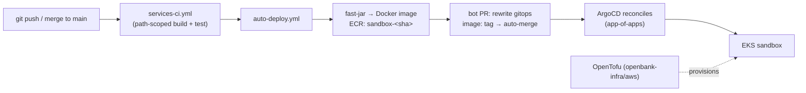

<!--
SPDX-License-Identifier: Apache-2.0
Copyright (c) OpenBank contributors. Licensed under the Apache License, Version 2.0.
-->

# OpenBank — Deployment

How OpenBank is built, shipped, and run — from a laptop to the cluster. This is the
operational companion to [`ARCHITECTURE.md`](ARCHITECTURE.md) (what the system *is*) and
the [`README.md`](README.md) quick-start (the 4-command local spin-up).

> **Honesty note.** There is **one environment today — the AWS sandbox** at
> `open-bank.tech` (EKS + ArgoCD). OpenBank is a *reference implementation*, not a
> production bank: there is no multi-region, no prod change-management, no real customer
> data. "Deploy" below means "deploy the sandbox or your own copy", not "run a bank".
> Running it as a real bank needs your own licensing, compliance, and legal review
> (README → License).

---

## 1. The deployment model in one picture



Two axes, deliberately separate (ADR-0029):
- **Continuous delivery** (the image axis): every merge that touches service source ships
  a new image and a gitops manifest bump — *automatically*.
- **Release** (the versioned axis): release-please cuts per-service SemVer + changelog +
  signed evidence bundle from Conventional Commits — independent of the deploy.

Everything is **GitOps**: the cluster's desired state is whatever is on `main`. Nobody
`kubectl apply`s by hand; ArgoCD reconciles (ADR-0010).

---

## 2. Local development (Docker Compose)

The whole fleet runs on a laptop via [`openbank-infra`](openbank-infra). Prereqs: Docker
Desktop ≥ 4.x (Compose v2), **16 GB RAM** recommended (33 backend services + infra stack).

```bash
cd openbank-infra
cp .env.example .env && $EDITOR .env     # local dev secrets
make up-infra                            # Postgres, Kafka, Apicurio, Keycloak, OpenBao, Valkey, OPA, Grafana stack
make up-all                              # build + start all services + Admin UI
make health-all                          # verify
```

Key local endpoints (full list in the README): Admin UI `:3000`, Keycloak `:8080`,
Apicurio `:8081`, OPA `:8181`, Grafana `:3001`, Prometheus `:9090`, OpenBao `:8200`;
services on `:8100+` (see the [service catalogue](README.md#project-status)).

> **Footgun:** running the full fleet + N Quarkus/Docker builds concurrently can OOM a
> 16 GB Docker Desktop. Build services sequentially or raise Docker's memory to 24 GB+.

The local **pre-PR gate** (mirrors CI):

```bash
./gradlew :<module>:build                       # one service
./gradlew detekt ktlintCheck koverVerify build  # the gate; add :<svc>:quarkusBuild to catch CDI/ArC wiring
```

`/ship-check` runs the exact governance gates CI enforces (version bump, openapi+contract,
migrations, tests, threat model for money-path).

---

## 3. CI/CD pipeline

### Build & test (path-scoped, ADR-0040)
`services-ci.yml` builds **only the changed modules** (per-job Testcontainers; Redpanda +
CNPG-less Postgres). A complementary **fleet-lint** + nightly full build catch the drift
path-scoping hides. CI runs on the **self-hosted FinOps fleet** — Hetzner x86 + Mac mini
ARM first, AWS Spot ARC as scale-to-zero overflow (ADR-0053). GitHub-hosted runners are
budget-blocked; everything that fits runs self-hosted.

### Auto-deploy (`auto-deploy.yml`)
On every merge to `main` touching `openbank-*/src/main/**` or `openbank-libs/**` (governance
catalogs are excluded — they must not trigger a fleet rebuild):
1. detect changed Gradle modules;
2. build a **fast-jar** per service (never uber-jar — uber-jar leaves `quarkus-app/` empty
   → crashloop) using the warm Gradle build cache;
3. bake a `linux/arm64` image, push to **ECR** as `sandbox-<short-SHA>` (auth via **IRSA** —
   no long-lived credentials);
4. rewrite the `image:` line in each service's gitops manifest;
5. open a `chore/gitops-auto-deploy-<sha>` **bot PR** with auto-merge — so the bump lands
   after `Validate manifests` / Gitleaks / Trivy pass, never as a direct push to `main`.

ArgoCD then reconciles the new tag onto the cluster.

> **admin-ui is NOT in auto-deploy** (no `quarkusBuild`). Deploy it with
> `openbank-infra/scripts/build-push-admin-ui.sh` from a clean worktree (`AWS_PROFILE=openbank`),
> or via `admin-ui-deploy.yml`.

> **Concurrency:** two merges in quick succession → the later push cancels the earlier
> deploy. Re-dispatch with `gh workflow run auto-deploy.yml -f services=<svc>`.

### Release (`release-please.yml`)
Per-service components: merging to `main` opens a per-service Release PR; merging *that*
bumps `version.txt`, writes the changelog, tags `<component>-v<version>`, and produces a
**signed evidence bundle** (SBOM + SLSA + OpenVEX via cosign/KMS, ADR-0030). release-please
owns the **release axis only** — never hand-edit `version.txt`, `CHANGELOG.md`, or a tag.

### Manual image build
Generic path: `openbank-infra/scripts/build-push-service.sh <service>` — builds the
fast-jar **host-side** (in-image Gradle hits download timeouts), `chmod -R a+r` on
`quarkus-app/lib/` (else non-root → `ClassNotFoundException`), then `docker buildx`.
Verify `git status src/main/` is clean first — a dirty worktree bakes a corrupted image.

---

## 4. Infrastructure provisioning

The AWS sandbox is **OpenTofu** ([`openbank-infra/aws`](openbank-infra/aws)) — cloud-agnostic
on Kubernetes, no managed-service lock-in (ADR-0027). Tofu provisions the substrate (EKS,
VPC + the required Interface endpoints — STS, ECR dkr+api, EC2, CodeArtifact, S3 gateway —
to keep traffic off the NAT gateway), ECR, IAM/IRSA. CI applies platform Tofu via
`platform-tofu.yml` (ADR-0060).

Everything **stateful runs in-cluster as OSS**, reconciled by ArgoCD's app-of-apps from
[`openbank-infra/gitops`](openbank-infra/gitops):
- **Postgres** — CloudNativePG (CNPG), one cluster per service (ADR-0009); PG 16→18 in
  progress (runbook 0003).
- **Kafka** (Strimzi), **Apicurio** schema registry, **Keycloak** (IAM), **OpenBao**
  (secrets; the Vault LF fork, runbook 0005), **OPA** (authz), **Valkey** (cache),
  **Temporal** (durable execution), and the **Grafana** stack (Prometheus, Loki, Tempo,
  Pyroscope) + GoAlert + Pyrra.

### Secrets
No long-lived credentials in git or Tofu state. In-cluster secrets live in **OpenBao**;
workloads get cloud creds via **IRSA / EKS Pod Identity**. Break-glass recovery keys are
stored in **AWS Secrets Manager** (`openbank/openbao/break-glass`) — save them at init or
the cluster is unrecoverable.

---

## 5. Runbooks & operations

Infra lifecycle changes follow numbered runbooks in [`docs/runbooks/`](docs/runbooks):
Loki, Vault upgrade, **PG 16→18** (0003), low-risk bumps (0004), **Vault→OpenBao** (0005),
Temporal settlement go-live (0006), OpenBao agent identity (0007). Per-service operational
runbooks (`svc-*.md`) are generated by `scripts/generate-service-runbooks.py`.

Operational guardrails worth knowing before you deploy:
- **Money-path services** (`rules.yaml: money_path_services`) need 2 approvals + a threat
  model — auto-merge is disabled for them (ADR-0030).
- **Flyway:** never edit an applied migration (checksum mismatch → boot fail); use
  `QUARKUS_FLYWAY_REPAIR_AT_START=true` to recover, then remove.
- **Scale-to-zero tiers** (ADR-0041/0057): latency-tolerant workloads scale to zero via
  KEDA; a cold first request pays the spin-up.
- **Images via ECR pull-through:** always reference `docker.io/library/` explicitly —
  a bare `nginx:tag` bypasses the Kyverno ECR rewrite and pulls via the NAT gateway.

---

## 6. Where to go next

- **What the platform is:** [`ARCHITECTURE.md`](ARCHITECTURE.md)
- **Evaluator's reference (topology, sizing, cost, production delta):** [`docs/deployment-reference.md`](docs/deployment-reference.md)
- **Local spin-up:** [`README.md`](README.md#quick-start-local-docker) · [`openbank-infra`](openbank-infra)
- **Infra-as-code & GitOps:** [`openbank-infra/aws`](openbank-infra/aws) · [`openbank-infra/gitops`](openbank-infra/gitops)
- **Lifecycle runbooks:** [`docs/runbooks/`](docs/runbooks)
- **Release mechanics (authoritative):** [`openbank-libs/governance/RELEASE.md`](openbank-libs/governance/RELEASE.md)
- **What CI enforces:** [`openbank-libs/governance/rules.yaml`](openbank-libs/governance/rules.yaml)
- **Decisions & delivery status:** [`docs/adr/README.md`](docs/adr/README.md)
