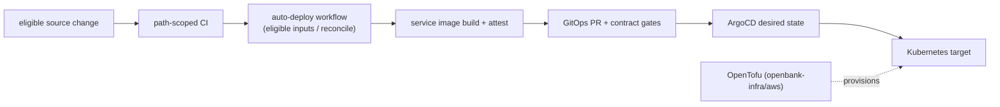

<!--
SPDX-License-Identifier: Apache-2.0
Copyright (c) OpenBank contributors. Licensed under the Apache License, Version 2.0.
-->

# OpenBank — Deployment

How the repository configures local development, CI, image delivery, and infrastructure. This is the
operational companion to the [architecture hub](ARCHITECTURE.md) and the local-development
instructions in [`README.md`](README.md). Check the referenced manifests and workflows for current behavior.

> **Scope.** This repository contains configuration for a sandbox deployment and local
> development. Checked-in manifests describe desired configuration; they do not prove the
> current state of any cluster. OpenBank is a reference implementation, not a licensed bank
> or a production-ready banking service. See the repository license and security policy before
> adapting it to another environment.

---

## 1. The deployment model in one picture


```mermaid
flowchart LR
  dev["eligible source change"] --> ci["path-scoped CI"]
  ci --> ad["auto-deploy workflow<br/>(eligible inputs / reconcile)"]
  ad --> img["service image build + attest"]
  img --> mpr["GitOps PR + contract gates"]
  mpr --> argo["ArgoCD desired state"]
  argo --> eks["Kubernetes target"]
  tofu["OpenTofu (openbank-infra/aws)"] -. provisions .-> eks
```

Two axes, deliberately separate (ADR-0029):
- **Image delivery**: eligible changes to configured build inputs enter the image workflow;
  the workflow applies its contract and GitOps PR gates before a manifest change can merge.
- **Release** (the versioned axis): release-please manages component versions and changelogs
  from Conventional Commits, independently of the image workflow.

The configured deployment path is **GitOps**: reviewed desired-state changes live under
`openbank-infra/gitops` and ArgoCD is configured to reconcile them (ADR-0010).

---

## 2. Local development (Docker Compose)

[`openbank-infra/docker-compose.yml`](openbank-infra/docker-compose.yml) defines a development
subset of the platform, not the full service fleet. It includes infrastructure and selected
applications; use the [`README.md`](README.md) local-development section for the current setup.
The Compose service names are the ones in that file (for example, `openbao`, not `vault`).

From the repository root, after configuring the environment as described in the README, start
the defined Compose services with:

```bash
cd openbank-infra
docker compose up -d --build --wait
```

This starts the Compose subset and builds services that define a build context. Review the
Compose file before starting it if you only want infrastructure or selected applications. The
`make up-infra` target currently references a `vault` service name that is not defined in the
Compose file; do not use that target as a verified setup command.

Run the Gradle build entry points from the repository root:

```bash
./gradlew :<module>:build
./gradlew detekt ktlintCheck koverVerify build
```

The second command is a convenience gate; Gradle stops at the first failing task, so confirm
which tasks actually ran. See the contributor guide and CI workflows for the checks relevant to
a particular change.

---

## 3. CI/CD pipeline

### Build & test (path-scoped, ADR-0040)
`services-ci.yml` uses path-scoped module discovery, with additional workflows and scheduled
checks covering other repository paths. Runner pools and labels are defined by each workflow
and can change; consult the workflow files for the current routing.

### Auto-deploy (`auto-deploy.yml`)
The workflow runs for configured source/build inputs, scheduled reconciliation, and authorized
manual dispatch. Its path filters and input constraints are defined in
[`.github/workflows/auto-deploy.yml`](.github/workflows/auto-deploy.yml); they include selected
service source, Dockerfiles, version files, and shared build inputs, not every repository change:
1. detect changed Gradle modules;
2. build a **fast-jar** per service (never uber-jar — uber-jar leaves `quarkus-app/` empty
   → crashloop) using the configured Gradle build cache;
3. bake a `linux/arm64` image and push it to ECR with a `sandbox-<short-SHA>` tag using the
   workflow-configured AWS authentication;
4. rewrite the `image:` line in each service's gitops manifest;
5. open a `chore/gitops-auto-deploy-<sha>` GitOps PR; the workflow configures merge and
   validation gates before a desired-state change can land.

ArgoCD is configured to reconcile the desired state after the manifest change.

> Admin UI has its own [admin-ui-deploy workflow](.github/workflows/admin-ui-deploy.yml), with
> source, evidence-refresh, scheduled, and manual triggers. Use its workflow definition as the
> current source for the build and deploy path.

> **Concurrency and recovery:** behavior depends on the workflow lane. Check the auto-deploy
> workflow comments and dispatch inputs before rerunning a build or reconciliation.

### Release (`release-please.yml`)
Eligible components are registered in release configuration. The workflow opens release PRs,
then updates version/changelog metadata and tags after those PRs merge. Evidence generation and
attestation are handled by dedicated workflows; see the release workflow and governance release
guide for current behavior. Never hand-edit generated version metadata, changelogs, or tags.

### Manual image build
Generic path: `openbank-infra/scripts/build-push-service.sh <service>` — builds the
fast-jar **host-side** (in-image Gradle hits download timeouts), `chmod -R a+r` on
`quarkus-app/lib/` (else non-root → `ClassNotFoundException`), then `docker buildx`.
Verify `git status src/main/` is clean first — a dirty worktree bakes a corrupted image.

---

## 4. Infrastructure provisioning

AWS infrastructure configuration is maintained with OpenTofu under
[`openbank-infra/aws`](openbank-infra/aws). The repository has separate substrate and platform
environments and CI workflows; inspect those configurations before applying changes. Kubernetes
workload configuration is under [`openbank-infra/gitops`](openbank-infra/gitops).

The checked-in GitOps configuration describes stateful components intended to run in-cluster and
be reconciled by ArgoCD from
[`openbank-infra/gitops`](openbank-infra/gitops):
- **Postgres** — CloudNativePG (CNPG) manifests are maintained per component; most inspected
  application database manifests specify PostgreSQL 18.6, with exceptions. See the component
  manifests and [runbook 0003](docs/runbooks/0003-postgresql-16-to-18-major-upgrade.md) for scope and status.
- **Kafka** (Strimzi), **Apicurio** schema registry, **Keycloak** (IAM), **OpenBao**
  (secrets; the Vault LF fork, runbook 0005), **OPA** (authz), **Valkey** (cache),
  **Temporal** (durable execution), and the **Grafana** stack (Prometheus, Loki, Tempo,
  Pyroscope) + GoAlert + Pyrra.

### Secrets
Secret values and recovery procedures are intentionally kept out of this public guide. The
repository contains OpenBao and workload-identity configuration; consult the approved private
operational runbook for environment-specific recovery.

---

## 5. Runbooks & operations

Infra lifecycle guidance is maintained in [`docs/runbooks/`](docs/runbooks). Use the relevant
runbook and current manifests for the component being changed; generated service runbooks are
kept alongside them.

Operational guardrails worth knowing before you deploy:
- **Money-path services** (`rules.yaml: money_path_services`) need 2 approvals + a threat
  model — auto-merge is disabled for them (ADR-0030).
- **Flyway:** treat applied migrations as immutable. Do not use repair as a generic response to
  checksum drift; follow the service-specific recovery procedure and fix forward with a new migration.

---

## 6. Where to go next

- **Architecture hub:** [`ARCHITECTURE.md`](ARCHITECTURE.md)
- **Evaluator's reference (topology, sizing, cost, production delta):** [`docs/deployment-reference.md`](docs/deployment-reference.md)
- **Local spin-up:** [`README.md`](README.md#quick-start-local-docker) · [`openbank-infra`](openbank-infra)
- **Infra-as-code & GitOps:** [`openbank-infra/aws`](openbank-infra/aws) · [`openbank-infra/gitops`](openbank-infra/gitops)
- **Lifecycle runbooks:** [`docs/runbooks/`](docs/runbooks)
- **Release mechanics (authoritative):** [`openbank-libs/governance/RELEASE.md`](openbank-libs/governance/RELEASE.md)
- **What CI enforces:** [`openbank-libs/governance/rules.yaml`](openbank-libs/governance/rules.yaml)
- **Decisions & delivery status:** [`docs/adr/README.md`](docs/adr/README.md)
