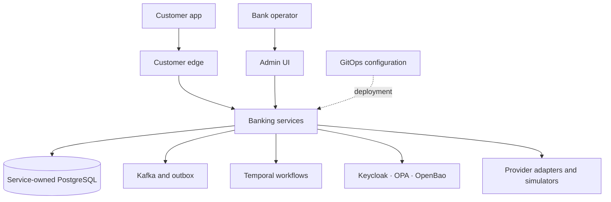

# OpenBank — Architecture Overview

> This is an illustrative, non-exhaustive architecture overview. ADRs record decisions;
> manifests and source describe repository configuration, not proof of live deployment.
> See the [ADR index](adr/README.md) and [architecture contributor guide](architecture-contributor-guide.md).

---

## 1. Context — what OpenBank is and who it talks to

OpenBank is a cloud-native, open-source retail **banking platform**. It is not a bank itself; it is
software that an organisation with the appropriate banking licence may deploy.




**External actors:**

| Actor | Role |
|---|---|
| Retail customer | Uses the mobile app (KMP + Compose) or the PSD2 XS2A developer portal |
| Bank operator | Uses admin-ui for KYC approval, ledger reconciliation, monitoring |
| TPP (Third-Party Provider) | PSD2 AISP/PISP APIs and developer-portal documentation, as configured |
| EUDI hub | PID digital-identity credential exchange (OpenID4VP + OpenID4VCI) |
| Clearing networks | Represented by ISO 20022 clearing components; external integrations are outside this diagram |
| AWS | EKS hosting, ECR images, Secrets Manager, S3, VPC endpoints |

---

## 2. Container diagram — runtime components

### Frontend tier

| Example component | Technology | Illustrative responsibility |
|---|---|---|
| `openbank-admin-ui` | Next.js / React / TypeScript (see package manifest) | Bank operator console — KYC, ledger, service catalog, observability |
| `openbank-customer-edge` | Quarkus / Kotlin (BFF) | Mobile app backend-for-frontend; authorization policy is configured in source and manifests |
| `openbank-developer-portal` | Static site | PSD2 XS2A API explorer; see its source and deployment configuration |

### Representative backend components

The following tables show selected examples, not a complete module inventory. For the current
local Compose subset, see `openbank-infra/docker-compose.yml`; deployment state must be checked
separately.

| Example component | Illustrative responsibility |
|---|---|
| `openbank-account-service` | Account lifecycle (open, freeze, close) |
| `openbank-ledger-service` | Double-entry general ledger |
| `openbank-transaction-service` | Transaction processing and orchestration, idempotency |
| `openbank-balance-service` | Real-time balance projection |
| `openbank-product-catalog` | Banking product catalog |

### Payments

| Example component | Illustrative responsibility |
|---|---|
| `openbank-sepa-payment` | SEPA Credit Transfer |
| `openbank-domestic-payment` | Domestic (CERTIS-style) payment |
| `openbank-sepa-instant` | SEPA Instant Credit Transfer (10s window) |
| `openbank-clearing-service` | Clearing & net settlement |
| `openbank-clearing-simulator` | ISO 20022 clearing simulator (ADR-0104) |
| `openbank-settlement-service` | Net settlement & reconciliation |
| `openbank-swift-service` | SWIFT MT/MX messaging |
| `openbank-standing-order-service` | Recurring payments (daily due-date sweep) |
| `openbank-sdd-service` | SEPA Direct Debit mandates |

### Identity, auth & compliance

| Example component | Illustrative responsibility |
|---|---|
| `openbank-pid-service` | Party identity, dedup; EUDI/PID (ADR-0072/0094) |
| `openbank-party-service` | Customer master data |
| `openbank-consent-service` | PSD2 consent management |
| `openbank-psd2-service` | PSD2 AISP/PISP API |
| `openbank-tpp-registry-service` | Third-party provider registry |
| `openbank-sca-service` | Strong Customer Authentication (passkey + OTP) |
| `openbank-kyc-service` | Know-Your-Customer onboarding |
| `openbank-aml-service` | Anti-money-laundering screening |
| `openbank-sanctions-service` | Sanctions list screening (pg_trgm fuzzy match) |
| `openbank-onboarding-service` | Onboarding funnel projection |

### Risk, operations & AI

| Example component | Illustrative responsibility |
|---|---|
| `openbank-fraud-service` | Fraud detection — velocity-counter signal plane (ADR-0084) |
| `openbank-agent-service` | AI agent integration (MCP, policy-gated, ADR-0031) |
| `openbank-copilot-service` | Customer AI assistant (LLM integration) |
| `openbank-devops-agent` | DevOps/DORA AI agent (ADR-0119) |
| `openbank-finops-agent` | FinOps cost/usage AI agent |

### Supporting services

| Example component | Illustrative responsibility |
|---|---|
| `openbank-notification-service` | Customer notifications (push, email) |
| `openbank-audit-service` | Audit trail aggregation |
| `openbank-card-issuance-service` | Card issuance |
| `openbank-fx-service` | Foreign exchange, multi-currency revaluation |
| `openbank-interest-service` | Interest calculation & accrual |
| `openbank-lending-service` | Loan origination & servicing (four-eyes gate) |
| `openbank-billing-service` | Fee posting to ledger, product fee assessment (ADR-0143; deploy-gated) |
| `openbank-dispute-service` | Card disputes & chargebacks |
| `openbank-statement-service` | Account statements (camt.053 / MT940 / PDF) |
| `openbank-anacredit-service` | AnaCredit regulatory report builder |
| `openbank-finrep-service` | FINREP / COREP regulatory reporting |
| `openbank-analytics-sink` | Event analytics sink |
| `openbank-security-scanner` | Internal security scanning |
| `openbank-simulation` | Deterministic simulation harness (DST, ADR-0100) |

### Shared infrastructure (not microservices)

| Component | Role |
|---|---|
| `openbank-libs-domain` | Pure-Kotlin domain primitives: Money, IBAN, calendar, ISO 20022, lending & identity types — **zero framework imports** (ADR-0122 Phase 1) |
| `openbank-libs-runtime` | Quarkus/Jakarta runtime plumbing: outbox, idempotency, audit, OPA authz, `ServiceInfoResource`, `ApiVersionResponseFilter`, observability, flags (ADR-0122 Phase 1) |
| `openbank-libs` | Transitional composite wrapper around shared modules |
| `openbank-api-gateway` | Local development gateway configuration; see Compose and GitOps manifests for environment-specific edges |

---

## 3. Key architectural decisions

### 3.1 Hexagonal architecture per service (ADR-0002)

Every JVM service follows **ports-and-adapters** (hexagonal) architecture:

```
src/main/kotlin/<base-package>/
  domain/
    model/        — Entities, aggregates, value objects (pure Kotlin, zero framework imports)
    event/        — Domain events
    service/      — Domain services
  application/
    port/in/      — Use case interfaces (commands, queries)
    port/out/     — Repository + event publisher + external client interfaces
    usecase/      — Use case implementations (orchestration only)
  infrastructure/
    persistence/  — JPA / Panache repositories, Flyway migrations
    messaging/    — Kafka producers, consumers, transactional outbox (ADR-0003)
    rest/         — REST resources, DTOs, exception mappers
    client/       — Outbound HTTP clients
    config/       — Quarkus configuration
```

**The domain layer has zero framework imports** — CI enforces this with a Detekt rule.
This means domain logic can be unit-tested without a container, and the infrastructure adapters
can be swapped (e.g., changing the broker or DB) without touching business rules.

Shared plumbing is split across `openbank-libs-domain` and `openbank-libs-runtime`;
`openbank-libs` remains a transitional composite. See the module build files and ADR-0122.

### 3.2 Event-driven with transactional outbox (ADR-0003)

Services communicate via Apache Kafka. State mutations are written to a local PostgreSQL **outbox
table** in the same transaction as the business entity change, and a relay publishes them to Kafka.
This eliminates the dual-write problem and guarantees at-least-once delivery without distributed
transactions.

```
  Service A                          Kafka                   Service B
  ─────────                          ─────                   ─────────
  BEGIN TX
  UPDATE entity
  INSERT outbox_event                              <── Relay reads + publishes ──>  ConsumerRecord
  COMMIT TX
```

Schemas are registered in Apicurio Schema Registry (AsyncAPI for Kafka topics, ADR-0006).

### 3.3 Governance as code (ADR-0029)

Rules that govern the monorepo live in a **machine-readable** file:

```
openbank-libs/governance/rules.yaml
```

This file is the single source of truth. CI gates read it directly; the agent guide (`CLAUDE.md`)
is a human summary. When they conflict, `rules.yaml` wins.

Key invariants enforced by CI:

| Rule | Enforcement |
|---|---|
| No direct commits to `main` | Branch protection + squash-merge only |
| Component SemVer | release-please applies commit type and component-path rules from release config |
| Conventional Commits format | `commitlint` + release-please |
| Changelogs are auto-generated | release-please from Conventional Commits |
| Domain layer has zero framework imports | Detekt custom rule |
| No duplicate YAML keys in `application.yaml` | `check-duplicate-yaml-keys.sh` |
| OpenAPI spec updated for API changes | `oasdiff` in CI |
| Flyway migration for DB changes | Migration presence check |

Generated governance and catalog artifacts are derived from their source inputs; edit the source,
not generated outputs.

### 3.4 Money-path services — two approvals + threat model (ADR-0030)

Money-path membership is defined by
[`openbank-libs/governance/rules.yaml`](../openbank-libs/governance/rules.yaml), not by this
illustrative overview. Services in that list require:

1. **Two human approvals** before merge (CODEOWNERS enforced)
2. **A threat model** in `docs/threat-models/<service>.md` (STRIDE/DFD, checked by CI)
3. **Higher test-coverage floors** (ratchet-only, never reduced)

The money-path list is authoritative in `rules.yaml: money_path_services`.

### 3.5 Unified OPA authorization (ADR-0034)

Authorization uses **Open Policy Agent** as the single policy decision point for both:

- **REST endpoints** — Quarkus interceptor (`@Authorize("scope", resource = "#id")`) queries the
  local OPA sidecar before executing the use case.
- **AI agent MCP tool calls** — authorization policy is part of the intended path; see
  `openbank-agent-service` and the agent charter in `openbank-libs/governance/agents.yaml`.

The intended pattern uses OPA policy checks for selected request paths; deployment varies by
component. Policies and data bundles are maintained in the repository; inspect the relevant
service and GitOps configuration for coverage and audit behavior.

### 3.6 Dual version axes (ADR-0048)

Released components may have **two independent version numbers** that move on different cadences:

| Axis | Source | Who moves it | Cadence |
|---|---|---|---|
| **Release version** | `<component>/version.txt` | release-please, using Conventional Commits and component paths | When a release-triggering commit type touches an eligible component path; see release config |
| **API contract version** | `<component>/openapi.yaml: info.version` | Developer (oasdiff classifies the bump) | When the REST contract changes |

The API contract major version corresponds to the URL path (`/api/v{N}`). Forcing them equal
(as ADR-0029 D2 originally proposed) was a mistake: every internal bug-fix would silently rewrite
the "API contract version", making it useless as a compatibility signal for consumers.

`/api/v1/info` reports both: `version` (release) and `apiVersion` (contract).

---

## 4. Deployment architecture

### Cloud substrate

The repository includes a Kubernetes deployment configuration targeting AWS EKS. Infrastructure
is managed with **OpenTofu** and workload desired state is maintained under
`openbank-infra/gitops` for ArgoCD (ADR-0010). This describes repository configuration, not live status:

```
  Git repo (this repo)
       │
       ▼
  GitHub Actions CI
  (path-scoped checks)
       │  eligible image workflow
       ▼
  openbank-infra/gitops (in this repository)
  (reviewed desired-state changes)
       │
       ▼
  Kubernetes target
  (GitOps applications as configured)
```

CI and image delivery are path-scoped by separate workflow filters. A code or manifest change
may require different checks; see `services-ci.yml` and `auto-deploy.yml` for the current rules.

### CI runners

Runner selection is workflow-specific and can change. Read the `runs-on` and toolchain setup
in the relevant workflow before relying on architecture or capacity details.

### Observability stack

```
  Services (Quarkus)
  ──────────────────
  OpenTelemetry SDK → Otel Collector
                           │
                    ┌──────┼──────────────────┐
                    │      │                  │
               Prometheus  Loki (logs)    Tempo (traces)
                    │      │                  │
                    └──────┼──────────────────┘
                           │
                       Grafana dashboards
                       Pyrra (SLO-as-code)
                       GoAlert (on-call)
                       GlitchTip (error tracking)
                       Pyroscope (continuous profiling)
```

Domain-level metrics use shared `DomainMetrics` patterns where adopted; consult the component
source for its current instrumentation.

---

## 5. Security architecture

| Layer | Mechanism |
|---|---|
| Identity | Keycloak (version is pinned in the GitOps manifest); JWT and EUDI/PID integration |
| Secrets | OpenBao configuration and workload identity are represented in the repository; see component manifests |
| Authorization | OPA policy integration for selected REST and MCP paths (ADR-0034); see component manifests |
| Transport | HTTPS and edge routing are configured through ingress/Gateway API manifests; Istio/mTLS remains a separate design decision |
| Supply chain | SBOM (CycloneDX), container signing (cosign + KMS), SLSA provenance (ADR-0030) |
| SAST / SCA | CodeQL, Trivy, gitleaks — gated in CI |
| Pen testing | See ADR-0030 and the current security policy for scope and status |
| AI governance | Policy-gated MCP tools, HITL gates, AI-attributed audit (ADR-0031) |
| Threat models | Threat-model requirements are defined by `openbank-libs/governance/rules.yaml`; see `docs/threat-models/` |

---

## 6. Where to go next

| Question | Go here |
|---|---|
| How do I contribute? | [`CONTRIBUTING.md`](../CONTRIBUTING.md) |
| What is the project roadmap? | [`docs/ROADMAP.md`](ROADMAP.md) |
| Full decision history | [`docs/adr/README.md`](adr/README.md) |
| How is it deployed? | [`DEPLOYMENT.md`](../DEPLOYMENT.md) |
| Security policy | [`SECURITY.md`](../SECURITY.md) |
| Authoritative rules (CI reads this) | [`openbank-libs/governance/rules.yaml`](../openbank-libs/governance/rules.yaml) |
