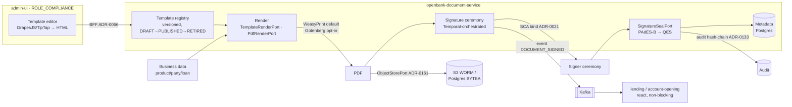

# ADR-0162 — Document management, templating & e-signature architecture

**Delivery note (updated 2026-07-17):** D1–D5 + D7 shipped; D6 partial; D4 phase-2 deferred by this ADR.
- **D1 (`openbank-document-service` bounded context)** — ✅ Shipped: released 0.8.4, gitops + threat model;
  product-catalog `Product.documentTemplateCode`.
- **D2 (versioned templating)** — ✅ Shipped: `HandlebarsTemplateRenderer` + one-published-per-code partial
  unique index (`V5`), atomic `publishReplacing`.
- **D3 (HTML→PDF)** — ✅ Shipped: `openbank-document-renderer` WeasyPrint sidecar (default leg). Gotenberg/Typst
  opt-in adapters are ADR-framed future, not built.
- **D4 (signature ceremony + seal)** — ✅ Shipped (phase-1): `SignatureCeremonyService`, PAdES-B via
  `PdfBoxPadesSealAdapter` (PDFBox + BouncyCastle), two-tier signing via OpenBao PKI. Phase-2 (QES/QSeal, EU DSS
  PAdES-LTA, HSM) deliberately deferred — no DSS dep, `QUALIFIED` unused. Deviation: orchestrated via
  transactional outbox, not Temporal as the D4 prose sketched.
- **D5 (WORM store + metadata index)** — ✅ Shipped: via ADR-0161 `ObjectStorePort`; `governance.yaml`
  restricted / 10-year retention / single-tenant.
- **D6 (admin template management)** — ⬜ Partial: `/document-templates` route + RBAC shipped; the graphical
  WYSIWYG editor (GrapesJS/TipTap) is a textarea (deferred in-code) and the ADR-0155 four-eyes maker-checker
  for PUBLISH of a money-path template is absent.
- **D7 (onboarding wiring)** — ✅ Shipped: `AccountCreatedConsumer` + `OnboardingDocumentService`, idempotent
  (`V6__onboarding_idempotency`).

## Context

The platform can move money, screen customers, and keep a tamper-evident audit chain, but
it **cannot produce a document a human signs.** Concretely, four capabilities are missing
or stubbed (verified against `main`, 2026-07-13):

1. **Templating** — no template engine anywhere; `NotificationTemplate` is an enum of
   message categories and bodies arrive pre-composed.
2. **PDF generation** — `openbank-statement-service` `PdfRenderer.kt` emits `text/plain`;
   `StatementRenderer.kt` maps `StatementFormat.PDF -> "text/plain"`. No PDF library is on
   the classpath. A styled PDF is a documented follow-up (ADR-0035 §F).
3. **E-signature / signing flow** — none. Non-repudiation today is a *hash chain*
   (ADR-0086 payment, ADR-0133 audit); SCA (ADR-0021) is device approval; EUDI/pid-service
   (ADR-0094) asserts *identity*. eIDAS QSeal/HSM signing keys are "Pending" in ADR-0007.
4. **Document store / DMS** — none. dispute-service says outright "No blob storage is
   implemented"; party-service V10 stores files as `BYTEA` with a "replace with S3" TODO.

A stakeholder observed, correctly, that document templates bind to products and are
versioned — the product catalog already carries `TermsAndConditions(version, url,
effectiveFrom/To, …)` bound to a `Product`. But that value object stores **only a URL**;
there is no stored artifact, no template, and no rendering. And many documents are **not**
product-bound: account statements, payment confirmations, GDPR Art. 15 export letters,
dispute correspondence, KYC forms. So the capability cannot live *inside* product-catalog.

We want to assemble this from mature open source where possible and build only the glue,
while satisfying the platform's hexagonal, event, GDPR, audit, supply-chain and licensing
rules. **Licensing is a hard constraint:** the dependency denylist blocks GPL/AGPL for
platform code (`rules.yaml: dependencies`), which rules out iText (AGPL) as an embedded
library and rules out embedding AGPL apps (DocuSeal/Documenso) as linked components.

## Decision

### D1 — A new bounded context: `openbank-document-service`

Document management is its own aggregate set — template registry, rendering, storage,
lifecycle, and signing ceremony — too distinct to fold into product-catalog (a clean JSONB
read-model service) and needed by non-product flows anyway. Product-catalog keeps only the
**reference**: `TermsAndConditions` gains `documentTemplateCode`, a `code`-only pointer into
document-service (see the version-resolution policy under D2 for why not `(code,
version)`). The product↔template *binding* stays with the product; the document *machinery*
lives in the new service.

The service is **not money-path** and must stay off the synchronous fund-release path: it
**emits events** (`DOCUMENT_SIGNED`, `SIGNATURE_CEREMONY_COMPLETED`) that consumers
(lending, account-opening) react to; it is never a blocking gate that releases funds. This
is the ADR-0086 decoupling — a signed-contract event, not an inline authorization call —
and it keeps the service on the light governance rails. Because it introduces a new trust
boundary (customer-facing documents, signing), a **threat model is still required**
(`docs/threat-models/document-service.md`) even though it is non-money-path.

### D2 — Templating: logic-less templates behind a `TemplateRenderPort`

Templates are **HTML with logic-less placeholders** (Handlebars/Mustache semantics). HTML
is deliberate: it is what a graphical editor emits (D6), and logic-less engines cannot
execute arbitrary code, which shrinks the server-side-template-injection surface for
content that non-engineers edit. We reject full engines (Thymeleaf, Velocity, Freemarker)
precisely because they *can* evaluate expressions. All substituted values are HTML-escaped.

Templates are **versioned first-class** (row-per-version, `status ∈ {DRAFT, PUBLISHED,
RETIRED}`, effective-dated) — unlike product-catalog's soft embedded `versionHistory`. A
`PUBLISHED` template version is immutable; edits create a new version.

Rendering sits behind `TemplateRenderPort` (data-merge) and `PdfRenderPort` (HTML→PDF), so
the engine is swappable without touching the domain.

**Version-resolution policy** (added retroactively — this was left implicit long enough
that a real environment accumulated two coexisting `PUBLISHED` versions of the same
template `code` with nothing marking either "current"):

- **A `code` has at most one `PUBLISHED` row at any time.** Publishing a new version
  **retires its predecessor atomically**, in the same transaction — a code is never
  briefly unpublished, nor ever has two rows simultaneously `PUBLISHED`, not even under a
  crash mid-operation or two concurrent publish calls. Enforced at two layers: application
  logic retires the current `PUBLISHED` sibling as part of every publish, and a Postgres
  **partial unique index** (`uq_document_templates_one_published_per_code`) makes the
  invariant a hard DB constraint, not just an application convention — a lost race surfaces
  as an explicit conflict, never a silent second "current" version.
- **A new document render (or a product's `documentTemplateRef`, D1) that names only a
  `code` resolves to whatever is currently `PUBLISHED`** — the "latest" a caller gets when
  it doesn't pin an exact version. A caller pins an exact `(code, version)` only when it
  deliberately needs a non-current version (e.g. re-rendering against a historical version
  for a support case).
- **An already-rendered `Document` keeps the exact `(templateCode, templateVersion)` it was
  actually generated from, permanently** — snapshotted at render time, never re-resolved.
  Publishing a newer template version afterwards cannot retroactively change what a
  customer already saw and signed; a `SignatureCeremony` inherits this same guarantee
  transitively, since it is scoped to one already-rendered `Document`.

### D1 (continued) — `documentTemplateRef` is a code, not a pinned version

Product-catalog's `TermsAndConditions.documentTemplateCode` (D1) intentionally carries only
the template **code**, not a `(code, version)` pair: the product should always mean
"whatever is currently published for this document", so a document-service republish never
requires touching the product. Combined with the version-resolution policy above, this
gives both halves of the guarantee this ADR was missing: the product always gets the
current version, and any document already rendered/signed from an older version is
unaffected by a later republish.

### D3 — PDF rendering: `WeasyPrint` default, `Gotenberg` opt-in, behind `PdfRenderPort`

Our documents are structured, print-oriented layouts (statements, contracts) that do **not
need** modern web CSS (flexbox/grid/JS). So a full headless-Chromium renderer is over-spec:

- **Default adapter: WeasyPrint** (BSD) — HTML/CSS→PDF with paged-media support, no browser
  engine, ~50–150 MB per process vs. Chromium's ~150–400 MB, and a **smaller SSRF surface**
  (run with network access disabled; it does not fetch arbitrary URLs like Chromium will).
  Deployed as a small sidecar/service called over REST.
- **Opt-in adapter: Gotenberg** (MIT) — headless Chromium + LibreOffice, for the rare
  template that genuinely needs full web CSS fidelity or Office (`.docx`) conversion.
  Available per-template via a `renderProfile` flag, not the default.
- **Considered for high volume: Typst** (Apache-2.0, Rust, tens of MB) — excellent for
  mass statement generation, but a non-HTML markup language weakens the WYSIWYG-for-legal
  story (D6), so it is a future high-throughput adapter, not the default.

Because rendering is a port, the choice is per-workload, not global — directly answering
the "is Gotenberg too heavy?" concern: for 95% of documents we run the light engine, and
reach for Chromium only where fidelity demands it.

### D4 — e-Signature: build the ceremony on existing rails, phase the cryptography

**Ceremony (built, phase 1):** the *who-signs-what-in-what-order-with-what-consent* flow is
orchestrated on primitives the platform already has — **SCA** (ADR-0021) to strongly bind
the signer, **consent** capture, the **audit hash-chain** (ADR-0133 / ADR-0086) for
non-repudiation, and **Temporal** (ADR-0101/0120) for durable, resumable multi-party
orchestration (a contract signed by two clients days apart). Supports single- and
multi-signer ceremonies.

**Cryptographic sealing, phased by assurance level behind `SignatureSealPort`:**
- **Phase 1 — Advanced electronic signature (AdES):** a server-applied **PAdES-B** seal
  with an organizational certificate, plus the SCA-bound audit-chain evidence. This is
  legally an *advanced* e-signature and ships without new hardware.
- **Phase 2 — Qualified (QES/QSeal):** **EU DSS** (European Commission reference impl,
  LGPL-2.1 — subject to legal sign-off; it is the EU-canonical eIDAS library) producing
  PAdES-LTA, keyed by the **QSeal/HSM** custody that ADR-0007 earmarked in Vault and
  parked as "Pending until the eIDAS signing use case activates." This ADR activates it.

Phase 1 does not block on HSM procurement; phase 2 raises assurance when the hardware and
legal review land. `SignatureLevel ∈ {ADVANCED, QUALIFIED}` records which was applied.

### D4 (continued) — Two-tier signing: client one-time signature + bank seal, key custody in OpenBao

Phase 1 originally applied a single cryptographic layer (the bank's own seal) and treated
the *signer's* side purely as an audit-trail fact (the SCA-verified evidence). That
conflated two eIDAS concepts that are legally and technically distinct:

- **The signer's own electronic signature** (a natural person, eIDAS Art. 3(10)) —
  `ClientSignatureIssuerPort`. Issues a **fresh, single-use certificate per signing act**
  from a dedicated **OpenBao PKI secrets engine** (`pki-document-signing`, mirroring the
  existing `pki-agent` pattern from ADR-0031 D3b — same OpenBao instance, same
  Kubernetes-auth login-then-issue flow, a different dedicated mount/role), signs with it,
  and lets the private key go out of scope immediately — never written to disk, a
  keystore, or OpenBao itself (`no_store=true`). The signature's value doesn't rest on the
  leaf certificate's own lifetime; it rests on the **issuing CA staying in OpenBao**,
  where every issuance is itself an audited, short-TTL event. A signing environment
  without a reachable OpenBao (local dev, tests, or a real OpenBao outage) falls back to a
  local ephemeral self-signed identity — the same DEV-ONLY posture `PdfBoxPadesSealAdapter`
  already had, worthless as evidence, loudly logged.
- **The bank's institutional electronic seal** (a legal entity, eIDAS Art. 3(25)) —
  `SignatureSealPort`, unchanged from the original phase-1 design: a **stable, long-lived**
  organizational certificate, now sourced from an OpenBao **KV** secret (not the PKI
  engine — the seal's identity is meant to persist across many documents, the opposite of
  the client signature's one-time nature) projected via an ExternalSecrets Operator
  `ExternalSecret` into a mounted PKCS12 keystore — the exact pattern document-service
  already uses for its Kafka mTLS keystore.

**Sequencing**: each signer's own signature is applied immediately when they SIGN (before
their decision is even persisted — an unsigned document must never be recorded as decided),
so a multi-signer ceremony layers one PDF signature per signer as they each decide, in
order. The bank's seal is applied once, last, after the final signer completes — sealing
the fully-signed document, not a partial one. PDF's native multi-signature support (each
signature is an incremental update covering everything before it) is what makes this
layering possible without any of the adapters needing to know about each other.

**No visual signature appearance (yet).** Every signature/seal here is a pure
cryptographic PAdES annotation — there is no rendered signature box, stamp, or image on
the document page. Real electronic-signature products usually show one for the human
reader's benefit; deliberately deferred (a TODO, not a decision) since it has no bearing
on legal validity and would mean deciding on visual design + template placement, which
D6's graphical editor doesn't support yet either.

### D7 — Onboarding integration: the first real caller

Templating, versioning, and e-signature existed end to end but had **no real caller** —
reachable only via direct API calls or the admin-ui editor. Account opening
(`openbank-account-service`) is the first business flow wired to it: `AccountCreatedConsumer`
consumes the existing `account.created` event (the same topic `balance-service`'s
`BalanceInitConsumer` already consumes for zero-balance initialization), looks up the
opened account's product in `product-catalog`, and — if that product has a
`documentTemplateRef`/`documentTemplateCode` bound (D1) — renders the onboarding contract
and opens a single-signer ceremony for the account holder.

This is deliberately **event-driven, not a synchronous call from account-service**: document
rendering and e-signature orchestration stay entirely off the money-path account-opening
gate (ADR-0086) — a slow or unreachable document-service can never delay or fail opening an
account. It also exercises, for the first time, the version-resolution policy from D2
(the render omits `templateVersion`, always resolving to whatever is currently `PUBLISHED`)
and D1's `documentTemplateCode` reference together, end to end. `OnboardingDocumentService`
is idempotent (a no-op if that account already has an issued document) so at-least-once
Kafka delivery / event replay is safe.

### D5 — Storage & lifecycle via ADR-0161

Documents are stored through the `ObjectStorePort` from **ADR-0161** (S3 + Object Lock
WORM in production, Postgres `BYTEA` in dev/test), addressed by content SHA-256. Rich
**metadata** (template lineage, party/case/product refs, classification, retention,
signature status) lives in the service's Postgres and is the queryable index — the metadata
is what many downstream purposes actually consume. `dataClassification: restricted`,
`retentionPolicy: 10 years` (contracts) in `governance.yaml`.

**GDPR (ADR-0118):** consume `PARTY_ERASED` and contribute to the Art. 15 export
aggregation, **but** honor the Art. 17(3)(b) override — signed contracts and AML-relevant
documents are *retained*, not erased, for their statutory period; erasure applies to the
retrievable content/PII where law permits, not to the evidential record. **Single-tenancy
(ADR-0152):** no `tenant_id` in schema, domain, or policy.

### D6 — Graphical template management in admin-ui for legal/compliance

A new admin-ui route (`/document-templates`) lets non-engineers author templates
visually. The editor is an OSS rich/block editor — **GrapesJS** (BSD, drag-and-drop, emits
HTML) or **TipTap** (MIT) — with merge-field tokens and a live preview that renders through
the same `PdfRenderPort`. All backend access is via the **BFF only** (ADR-0056); the UI
never talks to the cluster directly and never generates governance artifacts (admin-ui
read-only-consumer rule). RBAC: there is no dedicated "legal" role, so `ROLE_COMPLIANCE`
(the closest legal/ops persona) plus `ROLE_ADMIN` get new `templates:view` / `templates:edit`
permission keys; editing is subject to the four-eyes maker-checker pattern (ADR-0155) for a
`PUBLISH` of a template that binds to a money-path product.

### Flow

## Alternatives considered

- **Extend product-catalog with document storage & rendering.** Matches the "templates
  bind to products" intuition. Rejected: product-catalog is a clean JSONB read-model; and
  many documents are not product-bound (statements, GDPR letters, dispute correspondence),
  so the machinery must be a shared context. Product-catalog keeps only the template
  *reference*.
- **Adopt a batteries-included OSS e-sign app (DocuSeal / Documenso).** Fast to a demo.
  Rejected as the core: both are AGPL-3.0 — embedding conflicts with the license denylist,
  and even run as a separate network service, a bank's legal typically avoids AGPL; more
  importantly the platform already has the ceremony primitives (SCA, consent, audit chain,
  Temporal), so building the flow reuses proven rails instead of bolting on a foreign app
  with its own identity and data model.
- **iText / OpenPDF for PDF.** iText is AGPL (denylisted); OpenPDF is LGPL and low-level.
  Rejected in favor of an HTML→PDF service (WeasyPrint/Gotenberg) that keeps the heavy
  rendering dependency out of the JVM services entirely and pairs with the HTML editor.
- **Full eIDAS QES from day one (DSS + HSM).** The compliance gold standard. Rejected as
  the v1 scope: it blocks on HSM procurement and legal review of an LGPL library; phasing
  to AdES first delivers a legally-valid signature now and raises to QES later.
- **One big service vs. split now.** We ship one `openbank-document-service` with the
  signing ceremony as an internally-separable module; if signing grows or drifts toward
  money-path it can spin out to `openbank-esign-service` without re-architecting.

## Consequences

**Positive**
- Closes a whole missing capability (template → fill → PDF → sign → store → lifecycle)
  with ~80% assembled from mature OSS (WeasyPrint/Gotenberg, EU DSS, GrapesJS/TipTap, AWS
  S3) and only the glue built.
- Reuses existing rails (SCA, consent, audit chain, Temporal, outbox, ADR-0161 storage)
  rather than inventing parallel mechanisms; activates the long-parked ADR-0007 QSeal
  custody and satisfies the ADR-0035 §F styled-PDF follow-up.
- Legal/compliance get a self-service graphical editor with versioning and four-eyes.

**Negative**
- A new service plus two sidecars (a PDF renderer; later a signing/HSM path) to run and
  secure. Mitigated by the light-rails (non-money-path) posture and phased signing.
- New template content is a new injection surface; mitigated by logic-less templates,
  output escaping, and a network-disabled renderer.

**Neutral**
- Coverage/SBOM/threat-model/registration obligations for a new service apply as usual;
  the service is non-money-path but trust-boundary-changing (threat model required).

## Compliance impact

- PCI DSS: not applicable (documents carry no PAN by policy).
- DORA:    signing/render sidecars are ICT components in the resilience scope; non-money-
  path, so degradation is an availability event, not a payment outage.
- GDPR:    Art. 5(1)(e) retention + Art. 15 export + Art. 17(3)(b) retention override for
  contracts/AML; Art. 32 encryption at rest via ADR-0161 SSE-KMS. eIDAS Reg. (EU) 910/2014
  for AdES→QES assurance levels.
- PSD2:    SCA (ADR-0021) reused to bind the signer; no new PSD2 obligation.
- CNB:     records-retention supported by WORM storage (ADR-0161) and the audit chain.

## References

- ADR-0161 — Object-storage standard (storage substrate)
- ADR-0007 — Vault/HSM for eIDAS QSeal signing keys (activated by phase 2)
- ADR-0021 — SCA decoupled device approval (signer binding)
- ADR-0035 §F — styled/eIDAS-sealed statement PDF (the documented follow-up this satisfies)
- ADR-0086 / ADR-0133 — non-repudiation & tamper-evident audit hash chain
- ADR-0094 — EUDI/eIDAS identity assertion
- ADR-0101 / ADR-0120 — Temporal durable orchestration (ceremony)
- ADR-0118 — GDPR data lifecycle; ADR-0152 — single-tenancy; ADR-0056 — admin-ui BFF
- ADR-0155 — four-eyes; ADR-0105 — product identity & `TermsAndConditions`
