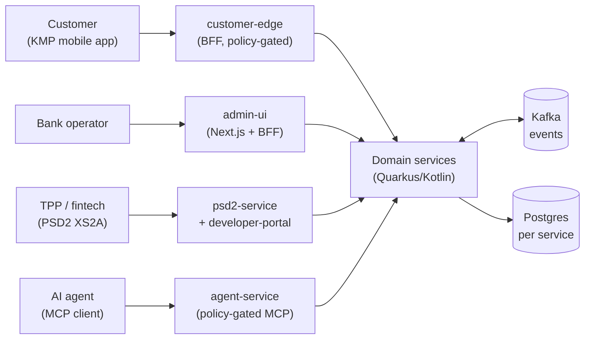
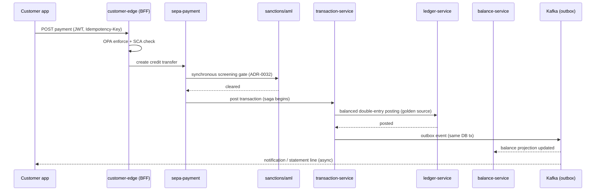

<!--
SPDX-License-Identifier: Apache-2.0
Copyright (c) OpenBank contributors. Licensed under the Apache License, Version 2.0.
-->

# OpenBank — Architecture

This guide explains representative service boundaries and implementation patterns in OpenBank. It is
not an exhaustive component inventory; current rules are defined in governance and component
configuration.

It complements the [`README.md`](../README.md) and the **Architecture Decision Records**
([ADR index](adr/README.md), with each decision’s status and delivery notes). When this document and an ADR disagree, the ADR
wins; when an ADR and [`openbank-libs/governance/rules.yaml`](../openbank-libs/governance/rules.yaml)
disagree, `rules.yaml` (what CI enforces) wins.

> **Scope.** OpenBank is a reference implementation, not a production bank. The architecture
> below describes intended patterns; it does not establish implementation completeness or live
> deployment status. Consult the [ADR index](adr/README.md), source, and manifests for the
> relevant component.

---

## 1. System context

The diagram illustrates the intended entry paths for four actor types; it is a design aid, not
an exhaustive inventory of routes or current deployment state:



- **Customers** are intended to use the Kotlin-Multiplatform app (separate repo, ADR-0064)
  through **`customer-edge`**, the customer BFF (ADR-0065). Check current routing and policy
  configuration before treating it as the only entry path.
- **Operators** use **`admin-ui`** (Next.js); its server-side BFF is the designed access path
  from the operator console into services (ADR-0056).
- **TPPs** (third parties) are modeled to use **`psd2-service`** (Berlin Group NextGenPSD2 +
  Czech ČOBS profile, ADR-0090) and the **`developer-portal`** documentation surface (ADR-0093),
  with consent (`consent-service`) and SCA (`sca-service`) in relevant flows.
- **AI agents** are modeled to call **`agent-service`** over MCP; authorization and audit
  behavior are defined by the service and policy configuration (ADR-0031, ADR-0034).

---

## 2. The unit of architecture: a hexagonal service

Every `openbank-*-service` follows the same hexagonal layout (ADR-0002). The
**dependency rule** points inward and is **enforced in CI** — the domain layer has *zero*
framework imports:

```
domain/                 pure Kotlin — entities, value objects, domain events. No Quarkus, no JPA.
application/
  port/in/              use-case interfaces (commands + queries) — the service's API to itself
  port/out/             repository + event-publisher interfaces (what the domain needs)
  usecase/              use-case implementations — orchestration, no framework leakage
infrastructure/
  persistence/          Panache entities + repositories (implements port/out)
  kafka/ | messaging/   transactional-outbox publishers + event consumers (implements port/out)
  rest/                 JAX-RS resources, DTOs, exception mappers (drives port/in)
```

Why it matters for contributors: business logic is testable without a container (fast unit
tests with mocked ports), and a framework swap never reaches the domain. Shared runtime
plumbing — `Money`, IBAN, idempotency, audit, outbox base entity, `ServiceInfo`,
API-version filter, authz — is split across **`openbank-libs-domain`** and **`openbank-libs-runtime`**, with `openbank-libs`
as a transitional composite (ADR-0122), so services do not re-implement it (ADR-0013, ADR-0014, ADR-0049).

Each service owns its **own Postgres database** (ADR-0009) — no shared schema, no
cross-service joins. Services integrate only via **synchronous REST** (queries / commands)
or **asynchronous Kafka events** (facts), never by reaching into another service's tables.

---

## 3. Bounded contexts

These representative components group into coherent domains. The table is illustrative and
non-exhaustive; use the repository module directories, release configuration, and governance
manifest for current membership. It shows a *mental model* and where governance weight sits.

| Context | Services | Anchoring ADRs |
|---|---|---|
| **Ledger & balances** (the money core) | `ledger-service` (golden source), `balance-service` (projection), `transaction-service` (posting, saga, idempotency, rail settlement), `account-service` | 0039, 0108, 0003 |
| **Party & identity** | `party-service` (master data + GDPR lifecycle), `pid-service` (dedup + EUDI/PID), `sca-service`, `consent-service` | 0072, 0094, 0021, 0118 |
| **Onboarding & financial crime** | `onboarding-service` (funnel projection), `kyc-service`, `aml-service`, `sanctions-service` (pg_trgm fuzzy match), `fraud-service` (velocity signal plane) | 0069, 0116, 0084, 0032 |
| **Payment rails** | `sepa-payment`, `sepa-instant`, `domestic-payment`, `swift-service`, `sdd-service` (direct debit), `standing-order-service`, `clearing-service`, `settlement-service`, `clearing-simulator`, `fx-service` | 0104, 0108, 0036, 0114 |
| **Cards & disputes** | `card-issuance-service`, `dispute-service` (PSD2 deadlines, chargebacks) | 0113, 0117 |
| **Products & servicing** | `product-catalog`, `interest-service` (+ withholding tax), `lending-service` (four-eyes), `statement-service` (camt.053 / MT940 / PDF) | 0028, 0033, 0035 |
| **Open Banking (PSD2 / XS2A)** | `psd2-service` (Berlin + ČOBS), `tpp-registry-service`, `developer-portal`, `consent-service` | 0090, 0093 |
| **Regulatory reporting** | `anacredit-service`, `finrep-service` (FINREP / COREP) | 0037, 0097 |
| **Edges & AI** | `customer-edge` (mobile BFF), `admin-ui` (operator console), `copilot-service` (customer AI), `agent-service` / `finops-agent` / `devops-agent` (autonomous ops), `api-gateway` (local gateway configuration) | 0056, 0089, 0031, 0112, 0119 |
| **Platform & data** | `audit-service` (hash-chained audit), `notification-service`, `analytics-sink` (event→ClickHouse), `simulation` (DST harness), `openbank-libs`, `openbank-infra` | 0086, 0022, 0100, 0029 |

---

## 4. Cross-cutting runtime patterns

These are the platform-wide mechanisms. Use the existing one; don't invent a parallel.

### Eventing — transactional outbox over Kafka (ADR-0003, ADR-0013, ADR-0050)
The transactional-outbox pattern writes an event to an **outbox table in the same DB transaction**
as the state change, then a relay dispatches it to Kafka. Delivery and failure behavior depend on
the service and connector configuration; consult the implementation and manifests.
- Outbox base entity + relay are provided by `openbank-libs-runtime`; a service declares a
  `*OutboxEntity : PanacheOutboxEntity`.
- **Footgun:** `openbank.outbox.dispatch-enabled` defaults to `false` — a service with an
  outbox MUST set it `true` or events silently never dispatch (`attempt_count` stays 0).
- Consumers should define idempotency and poison-message behavior explicitly. See the service
  implementation and connector configuration for its retry and dead-letter behavior.

### Workflow orchestration — Temporal
The former custom saga framework (ADR-0045) was superseded by Temporal in ADR-0120.
Durable workflow implementations and compensation behaviour belong to their owning services;
shared integration support lives in `openbank-libs-temporal`. Workers require the configured
Temporal frontend and task queues. Verify startup dependencies, policy, retry behaviour and
compensation tests for the flow being changed.

### Ledger as the golden source (ADR-0039)
The intended ledger design treats double-entry postings as authoritative and `balance-service` as a
projection derived from ledger entries. The intended money path uses balanced ledger
postings. See ADR-0108 for the settlement boundary.

### Inline screening gate (ADR-0032)
The intended money-moving flow places **synchronous sanctions/AML screening** inside the
transaction path. Check the service implementation and relevant ADRs for each rail.

### Authorization — OPA everywhere (ADR-0018, ADR-0034)
Open Policy Agent is the policy decision point in the shared authorization design. Some services
use a Kotlin `@Authorize` annotation backed by OPA; policy coverage depends on the service and path. Enforcement mode is configured per surface; inspect the service configuration and
GitOps manifests for the environment being discussed.

### Idempotency, audit, API versioning (shared libraries)
- **Idempotency:** money-path commands may use an `Idempotency-Key`; inspect each API contract and implementation.
- **Audit:** ADR-0086 describes a hash-chained audit trail; inspect each publisher and consumer for current coverage.
- **Two version axes (ADR-0048):** the **release** version (`version.txt`, owned by
  release-please) is *independent* from the **API-contract** version
  (`<component>/openapi.yaml:info.version`, whose major corresponds to `/api/v{N}`). Never force them equal. See the component OpenAPI spec and release configuration for exact rules.

---

## 5. A request's life — SEPA credit transfer (illustrative)

The sequence illustrates an intended composition; individual services and routes may differ:



Failure handling, compensation, and event delivery depend on each step’s implementation; use the
relevant ADRs and service tests to understand the configured behavior.

---

## 6. Data architecture

- **Database-per-service** (ADR-0009): the target design gives each service its own Postgres database; schema changes go
  through **Flyway** migrations with a rollback note. Never edit an applied migration (a
  checksum mismatch fails startup).
- **CNPG** is the PostgreSQL operator represented in the GitOps manifests. Many application
  database manifests specify PostgreSQL 18.6, with component-specific exceptions; consult the
  current manifests and runbook 0003. UUIDv7 adoption is described in ADR-0106.
- **Service-owned data:** the intended design avoids cross-service database access; consistency
  between services is coordinated through events and local transactions.
- **Analytics** is a one-way street: events feed `analytics-sink` → ClickHouse for the
  reporting/OLAP plane (ADR-0022), kept separate from the OLTP services.

---

## 7. Platform & deployment

- **Cloud-agnostic substrate** (ADR-0027): the design uses in-cluster OSS components such as
  Postgres/CNPG, Kafka, Keycloak, OpenBao, OPA, Valkey, and observability services. The AWS target
  is configured with **OpenTofu** ([`openbank-infra`](../openbank-infra)); this describes repository
  configuration, not live cluster state.
- **GitOps with ArgoCD** (ADR-0010): the repository maintains desired state under
  [`openbank-infra/gitops`](../openbank-infra/gitops). Check the workflows and the target cluster
  for actual reconciliation status.
- **CI is path-scoped** (ADR-0040): workflow path filters select builds and checks; consult the
  workflow definitions for current coverage.
- **CI and runtime scaling:** runner selection and workload scaling are configured per workflow
  and component. See the current workflow files and GitOps manifests; those settings can change.

---

## 8. Governance, security & operations as code

Non-functional concerns are machine-enforced, not prose (README has the summary; the depth):

- **Governance-as-code (ADR-0029):** component versioning, release-please changelogs, and
  generated catalog data. [`rules.yaml`](../openbank-libs/governance/rules.yaml) is the single source
  both CI gates and [`CLAUDE.md`](../CLAUDE.md) read.
- **ADRs are first-class & checked:** `docs/adr/` is the decision log. Create one with
  [`docs/adr/new.sh`](adr/new.sh) (collision-free numbering); the `adr-registry` CI gate
  enforces unique numbers, heading↔filename agreement, and a fresh generated index. Each ADR
  declares both a **Decision-Status** and a **Delivery-Status**.
- **Supply chain & SSDLC (ADR-0030):** SBOM per service image, container signing (cosign/KMS),
  SAST, dependency/CVE scanning (Trivy), gitleaks, OpenAPI lint — all gated in CI.
- **Money-path discipline (ADR-0030):** services in `rules.yaml: money_path_services` require
  2 approvals + a threat model in `docs/threat-models/`.
- **AI-agent governance (ADR-0031):** policy-gated MCP tools, human-in-the-loop gates, and an
  AI-audit trail; agent charters in
  [`agents.yaml`](../openbank-libs/governance/agents.yaml). The agent runtime is the
  commercial/AGPL carve-out; the platform itself is Apache-2.0 (ADR-0123).
- **Determinism for the money core (ADR-0100):** clock/UUID injection + a deterministic
  simulation harness (`openbank-simulation`) checks money-path invariants seed-by-seed,
  wired into CI (ADR-0115).

---

## 9. Where to go next

- **Decisions & their delivery status:** [`docs/adr/README.md`](adr/README.md)
- **What CI enforces (authoritative):** [`openbank-libs/governance/rules.yaml`](../openbank-libs/governance/rules.yaml)
- **Contributor + agent guide:** [`CLAUDE.md`](../CLAUDE.md), [`CONTRIBUTING.md`](../CONTRIBUTING.md)
- **Roadmap & milestones:** [`docs/ROADMAP.md`](ROADMAP.md)
- **Per-service specifics:** that service's own `CLAUDE.md`
- **Infra runbooks & GitOps:** [`openbank-infra`](../openbank-infra)
