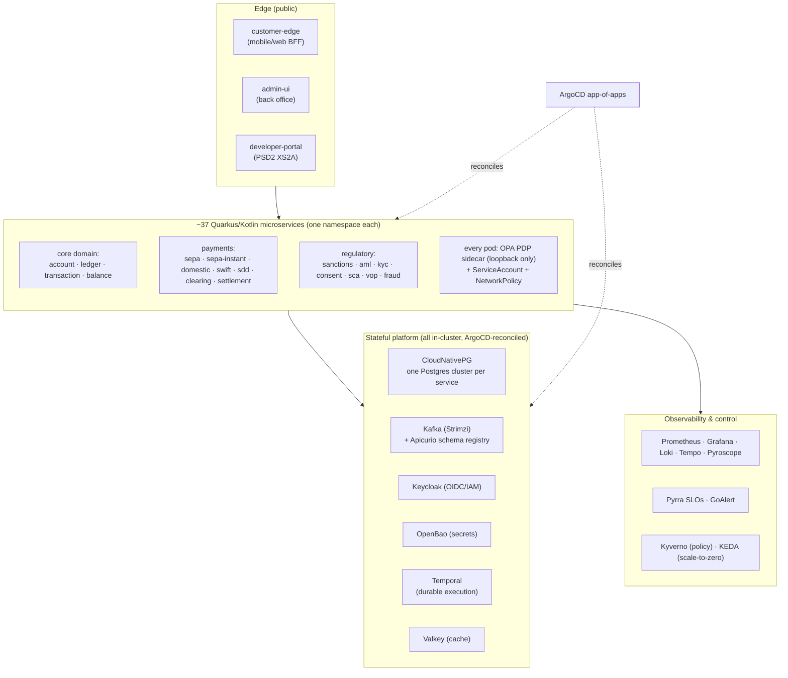

<!--
SPDX-License-Identifier: Apache-2.0
Copyright (c) OpenBank contributors. Licensed under the Apache License, Version 2.0.
-->

# OpenBank — Reference deployment for evaluators

The corporate-evaluator companion to [`DEPLOYMENT.md`](../DEPLOYMENT.md) (operational how-to).
This page answers the four questions an evaluation team asks first: **what does the topology look
like, how big should it be, what does it cost, and what would "real production" change.**

> **Honesty note.** The only live environment today is the AWS sandbox at `open-bank.tech`.
> Everything below marked *tier-A* is a **reference design derived from the running sandbox
> manifests**, not a topology we operate. Cost figures are **order-of-magnitude estimates**
> (assumptions listed with them), not quotes. OpenBank is not licensed to operate as a bank —
> running it as one requires your own regulatory approval (see [README](../README.md) → License
> and [SECURITY.md](../SECURITY.md) → deployer responsibilities).

---

## 1. Reference topology

Everything stateful runs **in-cluster as OSS** — no managed-service lock-in (ADR-0027). The
diagram is the sandbox shape; per-tier deltas are in the sizing table below.

Key topology facts an evaluator should not have to dig for:

- **One Postgres cluster per service** (CNPG, ADR-0009) — no shared database; blast radius of a
  schema incident is one service.
- **Authz is a sidecar, not a library call:** every pod carries an OPA PDP on loopback evaluating
  a signed policy bundle generated from `openbank-libs/governance` (ADR-0034). Money-path verbs
  carry a four-eyes flag (ADR-0280).
- **No long-lived credentials anywhere:** workload identity via IRSA / EKS Pod Identity; in-cluster
  secrets in OpenBao; break-glass keys in AWS Secrets Manager.
- **GitOps only:** desired state is `main`; ArgoCD reconciles; nobody applies by hand (ADR-0010).

---

## 2. Sizing

Grounding: a typical service pod requests **250 mCPU / 512 MiB** plus a **25 mCPU / 32 MiB** OPA
sidecar (see `openbank-infra/gitops/components/ledger/ledger-service.yaml`); the sandbox node
group is **2–4 × c7g.large** (ARM Graviton) in one region
(`openbank-infra/aws/envs/sandbox-substrate/main.tf`).

| | **dev** (evaluation laptop) | **pilot** (single-region, = today's sandbox) | **tier-A** (production-shaped reference) |
|---|---|---|---|
| Where | Docker Compose (`make up-all`) | EKS, 1 region, 1–2 AZ | EKS, 1 region, **3 AZ** |
| Compute | 16 GB RAM min, 24 GB recommended | 2–4 × c7g.large (arm64) | 6–9 × c7g.2xlarge across 3 AZ (baseline services) + burst pool |
| Postgres | one container | CNPG, 1–2 instances per service cluster, gp3 | CNPG **3 instances** (sync standby) per money-path cluster, PITR + daily base backups to off-cluster object storage |
| Kafka | single broker (KRaft) | Strimzi, 3 brokers, 1 AZ-set | 3 brokers across 3 AZ, `min.insync.replicas=2`, rack awareness |
| Temporal | single container | 1 node per role | 2+ per role (frontend/history/matching/worker), dedicated persistence |
| Keycloak | dev realm import | 1 replica, dev realm | 2 replicas, **production realm**, externalised user federation |
| OpenBao | dev server | 1 replica, auto-unseal (break-glass in Secrets Manager) | 3 replicas with Raft HA + audited unseal ceremony |
| OPA | sidecar per pod | sidecar per pod | sidecar per pod (unchanged — the model scales horizontally by design) |
| Scale-to-zero | n/a | KEDA on latency-tolerant tiers (ADR-0041/0057) | money-path tiers always-on; long tail still KEDA |
| Deploys | manual | auto-deploy on merge + ArgoCD | same pipeline + **change-management gate** (ADR-0029 release axis already separates deploy from release) |
| SLO target | none | Pyrra money-path SLOs (ADR-0088) | tighter burn-rate windows + 24/7 alert routing |

---

## 3. Estimated monthly infra cost

**Order-of-magnitude estimates, not quotes.** Assumptions: AWS eu-central-1 **on-demand** Linux
pricing, arm64 Graviton, no Reserved Instances / Savings Plans, moderate log/trace volume,
single region. Your reservation strategy and data-transfer profile will move these ±50 %.

| Line item | **pilot** | **tier-A** |
|---|---|---|
| EKS control plane | ~$75 | ~$75 |
| Compute (nodes) | ~$90–180 (2–4 × c7g.large) | ~$1 000–1 600 (6–9 × c7g.2xlarge) |
| EBS gp3 storage (~37 CNPG clusters + Kafka + observability) | ~$50–100 (~300–600 GB) | ~$300–600 (2–4 TB incl. backups/WAL archive) |
| Data transfer + NAT | ~$50–150 | ~$200–500 (VPC endpoints keep service traffic off NAT — the sandbox already does this) |
| ECR + S3 (images, backups, evidence bundles) | ~$20–50 | ~$50–150 |
| Observability retention (self-hosted Prometheus/Loki/Tempo — the dominant variable) | included above | ~$200–500 depending on retention |
| **Total** | **~$300–550 / month** | **~$1 800–3 400 / month** |

Not in these numbers: CI runners (the project runs them self-hosted — Hetzner + Mac mini, AWS
Spot ARC only as overflow, ADR-0053), a second region for DR (roughly +60–80 % of tier-A when
added), and people.

---

## 4. What changes for real production

The sandbox proves the software; production is an **operating model**. The delta, in the order an
evaluator usually asks:

1. **Live rails.** SEPA/SWIFT/CERTIS connectivity and the net-settlement ledger leg are the
   roadmap's explicit known gap (see [ROADMAP](ROADMAP.md)). Today the ISO 20022 pipeline is
   wired against a clearing *simulator*. Production means scheme admission, a settlement account
   at the central bank or a sponsor, and R-transaction handling.
2. **Real KYC/AML vendors.** Screening logic is real (pg_trgm fuzzy matching); the vendor feeds
   are stubs. Production means a contracted provider (Refinitiv / ComplyAdvantage class) plus a
   sanctions-evidence retention policy.
3. **DR region.** Single-region today. M6/M7 on the roadmap add the DR lane and then
   active-active; tier-A above is deliberately single-region-with-PITR, the honest intermediate.
4. **HSM/KMS.** Signing keys (QSEAL, evidence bundles, JWT issuers) move from Kubernetes secrets
   / KMS software keys to an HSM-backed custody model with dual control.
5. **Keycloak production posture.** Production realm, brute-force policies, customer identity
   migration plan, and an IdP DR procedure — the sandbox realm is a demo seed.
6. **Support & change model.** 24/7 on-call (GoAlert is wired; staffing is yours), prod
   change-management on top of the existing release axis, incident-postmortem practice, and the
   regulator-facing evidence pack (the signed release bundles already give you SBOM/SLSA/OpenVEX
   per release, ADR-0030).
7. **Licensing.** None of the above substitutes for a banking licence — see the README's
   licensing note and SECURITY.md's deployer-responsibilities section.

---

## 5. Where to go next

- Operational how-to: [`DEPLOYMENT.md`](../DEPLOYMENT.md)
- Milestone plan (M1–M7): [`ROADMAP.md`](ROADMAP.md)
- Deployer security responsibilities: [`SECURITY.md`](../SECURITY.md)
- Sandbox API surface: [developer portal](https://developer.open-bank.tech)
- Cost governance of this repo's own CI: ADR-0053 (FinOps runner fleet)
