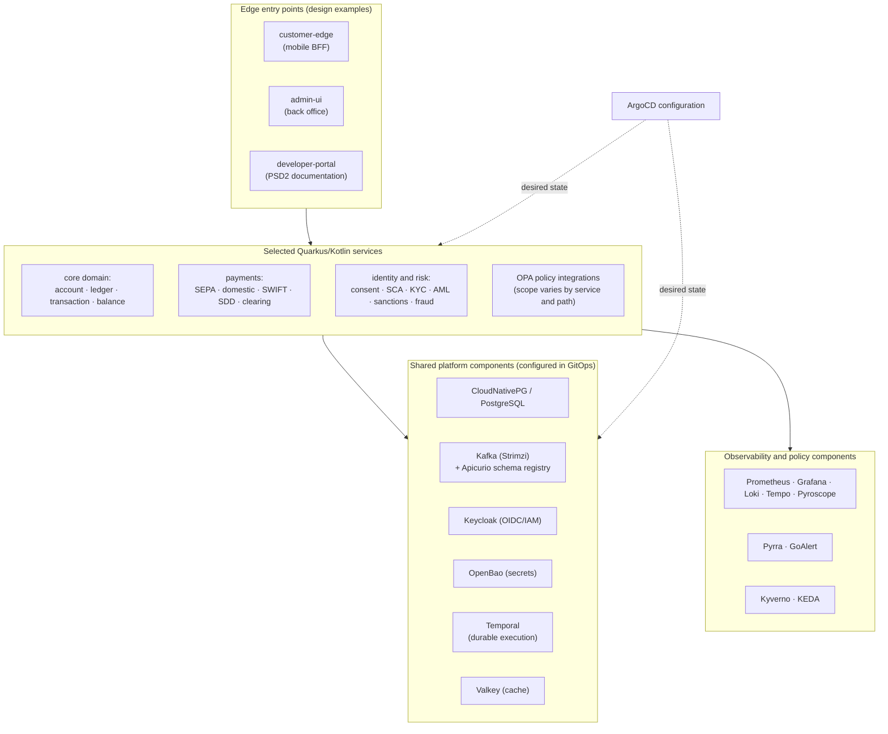

<!--
SPDX-License-Identifier: Apache-2.0
Copyright (c) OpenBank contributors. Licensed under the Apache License, Version 2.0.
-->

# OpenBank — Reference deployment for evaluators

This evaluator overview complements [`DEPLOYMENT.md`](../DEPLOYMENT.md), which describes the
repository's operational configuration. It summarizes a reference topology, example sizing,
legacy order-of-magnitude cost assumptions, and areas an adopter should assess before production.

> **Evidence and scope.** Repository sources were reviewed on **2026-10-03**. The diagrams and
> configuration references below describe design intent or checked-in configuration; they do not
> establish what is currently running in any environment. Sizing and cost figures are retained as
> **unvalidated planning assumptions**: they are not benchmarks, a capacity assessment, or current
> cloud-price estimates. OpenBank is a reference implementation, not a licensed bank. Anyone
> adapting it for banking must obtain the required regulatory approvals and meet their own
> security and operational obligations (see [README](../README.md) and [SECURITY.md](../SECURITY.md)).

## 1. Reference topology

The architecture uses in-cluster open-source components as a design target (ADR-0027). The
following diagram is illustrative, not an inventory of deployed workloads. Component membership
and configuration change; inspect the linked source before making deployment decisions.

```mermaid
flowchart TB
  subgraph edge["Edge entry points (design examples)"]
    ce["customer-edge<br/>(mobile BFF)"]
    aui["admin-ui<br/>(back office)"]
    dvp["developer-portal<br/>(PSD2 documentation)"]
  end

  subgraph svc["Selected Quarkus/Kotlin services"]
    direction TB
    core["core domain:<br/>account · ledger · transaction · balance"]
    pay["payments:<br/>SEPA · domestic · SWIFT · SDD · clearing"]
    reg["identity and risk:<br/>consent · SCA · KYC · AML · sanctions · fraud"]
    policy["OPA policy integrations<br/>(scope varies by service and path)"]
  end

  subgraph data["Shared platform components (configured in GitOps)"]
    pg["CloudNativePG / PostgreSQL"]
    kafka["Kafka (Strimzi)<br/>+ Apicurio schema registry"]
    kc["Keycloak (OIDC/IAM)"]
    bao["OpenBao (secrets)"]
    temp["Temporal<br/>(durable execution)"]
    val["Valkey (cache)"]
  end

  subgraph obs["Observability and policy components"]
    prom["Prometheus · Grafana · Loki · Tempo · Pyroscope"]
    slo["Pyrra · GoAlert"]
    kyv["Kyverno · KEDA"]
  end

  edge --> svc
  svc --> data
  svc --> obs
  argo["ArgoCD configuration"] -. desired state .-> svc
  argo -. desired state .-> data
```

Repository references for this design include the [GitOps tree](../openbank-infra/gitops/),
[ADR-0009](adr/0009-postgres-per-service.md) for data ownership, [ADR-0027](adr/0027-cloud-agnostic-in-cluster-substrate.md)
for the platform substrate, and [ADR-0034](adr/0034-unified-opa-authz-mcp-and-rest.md) for authorization.
The exact paths and filenames in the ADR directory are authoritative; use the [ADR index](adr/README.md)
if a linked decision has moved.

Evaluator notes:

- **Data ownership:** ADR-0009 describes database-per-service as the target pattern. Confirm the
  component's migrations, CNPG resources, and runtime configuration before assuming every service
  has an independent database deployment.
- **Authorization:** OPA integrations and policy bundles are represented in source and manifests,
  but this reference does not claim that every pod carries an OPA sidecar or that every API path is
  covered. Inspect the service's authorization code, policy bundle, and GitOps resources.
- **Identity and secrets:** Keycloak, OpenBao, and workload-identity configuration appear in the
  repository. This page makes no blanket claim about credential storage or the absence of
  long-lived credentials. Review the applicable IAM, secret, and deployment configuration privately.
- **Desired state:** ArgoCD and GitOps workflows are configured in the repository; that does not
  prove a cluster has reconciled a particular revision. See [deployment workflows](../.github/workflows/)
  and the [GitOps directory](../openbank-infra/gitops/).

## 2. Sizing assumptions

The following values are retained as **unvalidated reference-design assumptions**. They have not
been confirmed as current sandbox allocations or through load testing. Treat them as starting points
for an adopter's own capacity model, then measure workload demand and validate the applicable
Kubernetes and database manifests.

For context, the checked-in ledger workload manifest contains example resource requests at
[`openbank-infra/gitops/components/ledger/ledger-service.yaml`](../openbank-infra/gitops/components/ledger/ledger-service.yaml),
and the substrate example is in
[`openbank-infra/aws/envs/sandbox-substrate/main.tf`](../openbank-infra/aws/envs/sandbox-substrate/main.tf).
These are configuration inputs, not evidence of current allocations or utilization.

| | **dev** (local evaluation) | **pilot** (single-region reference) | **tier-A** (production-shaped design) |
|---|---|---|---|
| Where | Docker Compose development subset | EKS, 1 region, 1–2 AZ | EKS, 1 region, **3 AZ** |
| Compute assumption | 16 GB RAM min, 24 GB recommended | 2–4 × c7g.large (arm64) | 6–9 × c7g.2xlarge across 3 AZ (baseline services) + burst pool |
| Postgres assumption | one local container | CNPG, 1–2 instances per service cluster, gp3 | CNPG **3 instances** per money-path cluster, PITR + daily base backups to off-cluster object storage |
| Kafka assumption | single broker (KRaft) | Strimzi, 3 brokers, 1 AZ-set | 3 brokers across 3 AZ, `min.insync.replicas=2`, rack awareness |
| Temporal assumption | single container | 1 node per role | 2+ per role (frontend/history/matching/worker), dedicated persistence |
| Keycloak assumption | dev realm import | 1 replica, development realm | 2 replicas, production realm, externalized user federation |
| OpenBao assumption | local development service | 1 replica | 3 replicas with Raft HA; key-management procedures defined for the adopter's environment |
| OPA assumption | configuration varies | policy integration per protected path | policy integration per protected path; validate overhead and coverage |
| Scale-to-zero assumption | n/a | KEDA for latency-tolerant workloads | money-path tiers always-on; evaluate scale-to-zero for other workloads |
| Deployment assumption | local Compose | CI and GitOps workflow | same workflow plus adopter-defined change management |
| SLO assumption | set by evaluator | define per workload | tighter burn-rate windows and staffed alert response |

## 3. Legacy monthly cost assumptions

**These figures are unvalidated planning assumptions, not refreshed benchmarks, current prices, or
quotes.** They were not recalculated as part of the 2026-10-03 source review. The original assumptions
were AWS eu-central-1 on-demand Linux pricing, arm64 Graviton, no Reserved Instances or Savings
Plans, moderate log/trace volume, and a single region. Pricing, architecture, data transfer, and
retention vary; obtain a current estimate for the chosen region and workload before budgeting.

| Line item | **pilot** | **tier-A** |
|---|---:|---:|
| EKS control plane | ~$75 | ~$75 |
| Compute (nodes) | ~$90–180 (2–4 × c7g.large) | ~$1,000–1,600 (6–9 × c7g.2xlarge) |
| EBS gp3 storage (database clusters + Kafka + observability) | ~$50–100 (~300–600 GB) | ~$300–600 (2–4 TB including backups/WAL archive) |
| Data transfer + NAT | ~$50–150 | ~$200–500 |
| ECR + S3 (images, backups, evidence bundles) | ~$20–50 | ~$50–150 |
| Observability retention (self-hosted Prometheus/Loki/Tempo; major variable) | included above | ~$200–500 depending on retention |
| **Legacy total assumption** | **~$300–550 / month** | **~$1,800–3,400 / month** |

The original estimate excluded CI runners, a second region for disaster recovery, and people. It
also assumed roughly +60–80% of tier-A cost for a second region; that multiplier is unvalidated as
well. Rebuild the estimate from current provider pricing, region, service count, retention policy,
and recovery objectives before using it for a decision.

## 4. Production-readiness assessment

Use these as evaluation questions, not claims about current implementation or deployment state:

1. **External payment rails.** Identify the scheme connections required, admission process, sponsor
   or settlement-account arrangements, operational cutoffs, and R-transaction handling. The
   repository includes ISO 20022 payment and clearing components; inspect the relevant service
   contracts, simulator, and [roadmap](ROADMAP.md) for their stated scope.
2. **KYC/AML data and providers.** Determine how screening data is sourced, refreshed, licensed,
   retained, and audited. Review the sanctions, AML, and KYC service implementations and their
   provider interfaces; do not infer vendor integration from the presence of screening logic.
3. **Resilience and recovery.** Define region, RPO/RTO, backup retention, restore testing, and
   failure-domain requirements. Compare those requirements with the current
   [infrastructure configuration](../openbank-infra/aws/) and database manifests.
4. **Key management.** Decide on key custody, rotation, recovery, separation of duties, and hardware
   security requirements. Review the applicable OpenBao, workload identity, signing, and KMS
   configuration for the target environment.
5. **Identity operations.** Define realm separation, brute-force protection, user migration,
   federation, account recovery, and identity-provider disaster recovery for the adopter's needs.
6. **Support and change management.** Specify staffed incident response, release approval, rollback,
   post-incident review, and regulator-facing evidence requirements. See the configured
   [release workflow](../.github/workflows/release-please.yml) and [governance release guide](../openbank-libs/governance/RELEASE.md).
7. **Licensing and authorization.** Obtain applicable banking approvals and review the project's
   [license](../LICENSE) and [deployer security responsibilities](../SECURITY.md). This software
   does not itself grant permission to operate a bank.

## 5. Where to go next

- Operational configuration: [`DEPLOYMENT.md`](../DEPLOYMENT.md)
- Milestone plan: [`ROADMAP.md`](ROADMAP.md)
- Deployer security responsibilities: [`SECURITY.md`](../SECURITY.md)
- Current code and deployment configuration: the relevant service under `openbank-*` and the
  [GitOps tree](../openbank-infra/gitops/)
- CI/deployment behavior: [workflow definitions](../.github/workflows/)
