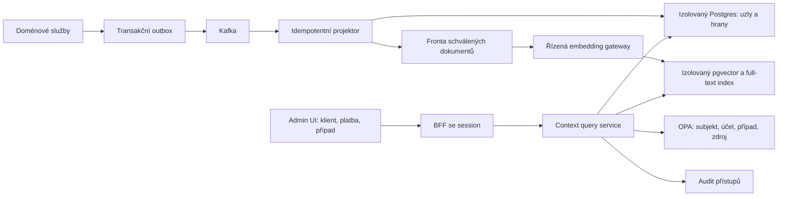

<!-- SPDX-License-Identifier: Apache-2.0 -->
<!-- Copyright (c) OpenBank contributors. Licensed under the Apache License, Version 2.0. -->

# Banking Context Graph — návrh produktu a technologie

Architektonické rozhodnutí přijato v [ADR-0303](../adr/0303-banking-context-graph-and-authorized-hybrid-retrieval.md), 2026-09-13. Implementační backlog: [#9945](https://github.com/JiRaska/open-bank-oss/issues/9945).
P0/P1 implementuje Customer 360 vizualizaci, bezpečný sdílený context-service, complaint
projekci a agregovaný dopad ICT incidentů v admin UI. Deployment je záměrně připraven s
nulovým počtem replik, dokud produkční workload gate nepotvrdí rozpočty. P2/P3 a hybridní
vektorové hledání zůstávají plánem; níže uvedené cíle nejsou tvrzením o již naměřeném výkonu.

## Co má operátor získat

Z klienta, účtu, platby nebo případu otevře „Prozkoumat souvislosti“. Dostane malý,
srozumitelný výřez s vysvětlením každé spojnice. Další sousedy načítá záměrně;
počáteční obrazovka neukazuje celou banku. Graf, tabulkový seznam a časová osa mají
stejný autorizovaný podklad. Výběr vztahu ukáže zdroj, platnost, čas zachycení a
možnost otevřít autoritativní detail s novou kontrolou oprávnění.

| Scénář | Příklad užitečné otázky | Vztahy a omezení |
| --- | --- | --- |
| Klientská 360 | Co s klientem souvisí a co se změnilo? | Účty, produkty, souhlasy, dokumenty, případy; běžná obsluha nevidí utajené investigace. |
| Fraud a převzetí účtu | Sdílí podezřelé případy zařízení nebo příjemce? | Zařízení → relace → klient → platba → příjemce; sdílené zařízení ani IP nejsou samy důkazem podvodu. |
| AML a tok peněz | Jak se prostředky přesouvaly v daném období? | Směrované převody, částky, měny, čas, protistrany; agregace zachovává směr a nemíchá měny. Schválený případ a časové okno. |
| Firemní KYC | Kdo firmu vlastní a kdo za ni může jednat? | Právnická osoba, vlastnický podíl, UBO, plná moc; oddělit vlastnictví od zastupování a historické od platného. |
| Reklamace a dohledání platby | Kde se tato platba zastavila? | Platební příkaz → clearing → zaúčtování → vrácení → reklamace; přímé odkazy na zdrojové stavy a události. |
| Úvěrové riziko | Které expozice sdílejí ručitele nebo zajištění? | Dlužník → úvěr → ručitel → zajištění; nezapočítat stejnou expozici vícekrát, zůstatky bere vlastník dat. |
| Interní kontrola | Kdo měl oprávnění při schválení operace? | Delegace → platné oprávnění → schválení → operace; časový snapshot, oddělená citlivá investigativní oprávnění. |
| Provozní incident | Které obchodní případy zasáhl výpadek? | Služba → událost → workflow → případ; provozní role vidí technický dopad, osobní detail jen s dalším oprávněním. |
| Sémantická investigace | Máme obdobný vyřešený případ a jaké podklady vedly k závěru? | Podobné schválené dokumenty a případy; podobnost je návrh k prověření, nikdy faktická vazba mezi klienty. |

## Doporučená technologie

**Explicitní graf vztahů + hybridní vyhledávání.** Vektor je index významové
podobnosti textu, nikoli evidence vlastnictví, toku peněz nebo oprávnění. Ani interní
HNSW graf vektorového indexu není bankovní graf vztahů. Číselné částky, identifikátory,
časové intervaly a oprávnění zůstávají typovanými poli a přesnými filtry.

Začít vlastní čtecí projekcí v **PostgreSQL spravovaném CloudNativePG**, s tabulkami
uzlů a hran a indexy pro sousednost. Pro schválený dokumentový korpus přidat
**pgvector + PostgreSQL full-text**, následně sloučit pořadí například RRF.
Vektory se počítají asynchronně přes řízenou inference gateway; otevření grafu žádný
embedding ani LLM nevyžaduje. Tento návrh rozšiřuje směr
[ADR-0183](../adr/0183-pgvector-retrieval-augmentation-for-the-copilot-knowledge-base.md),
který řeší menší help korpus. Není důkazem, že bankovní investigace má stejnou zátěž,
ani oprávněním vložit klientská data do help korpusu.

Pro plnou investigaci navrhuji samostatnou odpovědnost `context-service` v
Quarkus/Kotlin a vlastní databázi. Název i nový runtime podléhají architektonickému
rozhodnutí. Použít stejnou provozní technologii jako banka, ale **oddělený CNPG cluster,
pool, CPU, paměť a I/O rozpočet**, nikoli tabulky v databázi ledgeru nebo copilotova
help korpusu. Samostatný namespace sám výkonovou izolaci nezaručuje; pro produkci
oddělit i workload/node pool a omezit síťové a diskové soutěžení.

Šipky do úložišť představují čtení až po ověření kontextu a aplikaci serverových
filtrů. Služba znovu ověřuje vracené uzly, hrany a pole; UI není autorizační hranice.

| Varianta | Kdy ji volit | Cena a rozhodovací kritérium |
| --- | --- | --- |
| PostgreSQL adjacency + pgvector | Výchozí varianta: přesná sousednost 1–2 kroky, transakční změny projekce a schválený dokumentový korpus. | Nejmenší počet nových technologií. Ověřit plán dotazů, selektivitu ACL, latenci a paměť indexů na reálném rozdělení dat. |
| Neo4j | Vícekrokové vztahové analýzy jsou hlavní workload a Postgres nesplní přijaté SLO ani po indexaci a ohraničení dotazů. | Nový provozní stack; před rozhodnutím ověřit licenci/edici, HA, obnovu, autorizační integraci a náklady. Vektorové indexy jsou k dispozici, ale rovněž potřebují vlastní paměťový rozpočet. |
| Qdrant vedle vztahové projekce | Dominantní problém je velký sémantický korpus, kombinované filtry a samostatné škálování vektorového hledání. | Nenahrazuje vztahový model. Nový store a synchronizace životního cyklu. Payload/shard filtry musí vynucovat server, nejde o náhradu OPA. |

Oficiální dokumentace: [pgvector: indexy a filtrování](https://github.com/pgvector/pgvector),
[Neo4j: paměť vektorových indexů](https://neo4j.com/docs/operations-manual/current/performance/vector-index-memory-configuration/),
[Qdrant: filtrování](https://qdrant.tech/documentation/search/filtering/) a
[multitenancy](https://qdrant.tech/documentation/manage-data/multitenancy/).
U pgvector může ANN scan s následným filtrem vrátit méně výsledků; iterative scans
zvyšují hledání v rámci limitů. Proto měřit recall uvnitř oprávněného korpusu a
nejselektivnějších filtrů, nejen rychlost neomezeného top-k. Sdílený ANN index může
také ovlivňovat výkon/recall mezi tenanty; pro silné oddělení použít partitioning
nebo samostatná úložiště. Žádná tato optimalizace nesmí uvolnit autorizační predikát.

## Priority a sdílený cílový stack

Obchodní priorita říká, jak cenný problém řešíme. Pořadí nasazení říká, kdy máme
dostatečně prokázané bezpečnostní a výkonové předpoklady. Fraud/AML je obchodně
kritické, ale nezačíná jako první produkční pilot, protože jako první potřebuje
bezpečně procházet vazby mezi více klienty.

| Pořadí | Čočka | Důvod pořadí | ADR |
| --- | --- | --- | --- |
| P0 | Efektivní autorizace a audit přístupů | Společná bezpečnostní podmínka všech skutečných investigací. | [ADR-0308](../adr/0308-effective-time-authorization-evidence-graph.md) |
| P1 | Reklamace a dohledání platby | Jeden přidělený případ, omezená a ověřitelná cesta; první real-data pilot. | [ADR-0306](../adr/0306-payment-complaint-and-return-trace.md) |
| P1 | Dopad incidentu | Nejdřív agregovaný pohled bez identifikace klientů; prověří škálu a čerstvost. | [ADR-0309](../adr/0309-incident-business-impact-graph.md) |
| P2 | Fraud / AML | Kritická obchodní hodnota; až po důkazu izolace případů a skrytých cest. | [ADR-0304](../adr/0304-fraud-and-aml-relationship-investigation.md) |
| P2 | Firemní KYC | Vyžaduje více stran, bitemporalitu a rekurzivní vlastnictví. | [ADR-0305](../adr/0305-corporate-kyc-ownership-and-authority-graph.md) |
| P3 | Úvěrové expozice | Nejsložitější finanční agregace, sdílené zajištění a money-path citlivost. | [ADR-0307](../adr/0307-lending-exposure-guarantor-and-collateral-graph.md) |

Všechny čočky sdílejí jeden `context-service`, kanonický model, eventový projektor,
PostgreSQL adjacency store, pgvector/full-text retrieval, OPA integraci, audit,
observabilitu, obnovu a UI explorer. Čočka přidává pouze typované vztahy, zdrojové
kontrakty, policy balík, pevné query šablony, retenci a rozpočet. Data jsou oddělena
partitiony podle banky, citlivosti/čočky a podle naměřené distribuce entity; výpočetní
práce je rozdělena do tříd interactive, semantic, ingest a replay s vlastními pooly,
kvótami a admission control.

## Datový model a konzistence

- `context_node`: interní ID, bankovní/tenantní hranice, typ, odkaz na zdroj,
  klasifikace, verze zdroje. Popisné osobní údaje držet minimální a v oprávněném scope.
- `context_edge`: oba konce, typ a směr, zdrojová evidence, `valid_from/valid_to`
  (kdy vztah platil), `recorded_at` (kdy jsme se o něm dozvěděli), verze a klasifikace.
- Indexy `(bank_scope, from_id, relation_type, valid_from)` a odpovídající index pro
  `to_id`; UNIQUE na stabilní zdrojový klíč a verzi. Konkrétní indexy potvrdit EXPLAINem.
- `document_chunk`: odkaz na verzi dokumentu, hash obsahu, ACL/klasifikace, embedding,
  verze modelu a textového zpracování. Oprávnění chunku nesmějí být širší než dokumentu.
- Fakta mají autoritativní zdroj. Odvozené hypotézy mají oddělený typ, původ a model;
  nikdy nepřepisují fakta ani automaticky nespojují identity na základě podobnosti.

Konzumace je at-least-once s idempotentním upsertem; duplicita eventu nesmí vytvořit
druhou hranu. Starší event nesmí přepsat novější stav. Uchovat zdrojovou verzi,
event time a pořadí/offset, vyřešit změny a zániky vztahů. Replay staví novou generaci
projekce s kontrolou počtů a invariantu zdrojových referencí, následně atomický přepínač.
Kafka je transport, ne nekonečný archiv: rebuild závisí i na retenci, schématech a
autorizovaných snapshotech ze zdrojů. DLQ musí mít topic, ACL a dohled nad lagem.

Smazání, expirace a odvolání přístupu musí odstranit či znepřístupnit také hrany,
chunky, vektory, výsledkové cache a exporty. Bezpečnostní revokace se neodkládá do
doběhnutí datové projekce: aktuální autorizační rozhodnutí musí přístup zastavit hned.
Historický datový snapshot není historické oprávnění pro dnešního uživatele.

## Bezpečnost před rozšířením na investigace

Autorizace je průnik: aktivní session + explicitní oprávnění k funkci + oprávnění
ke zdroji + hranice banky/tenantu + přidělení případu/klientského portfolia + povolený
účel + klasifikace dat. `caseId` z URL se musí ověřit proti skutečnému případu a jeho
účastníkům. Administrátor infrastruktury nemá automatický nárok na klientské vazby.
Navrhované schopnosti rozdělit na čtení vztahů, rozšíření sousedů, sémantické hledání,
citlivý detail a export. Samotné `compliance:view` je pro takový rozsah příliš hrubé.

OPA rozhodnutí a bezpečné pevně definované dotazy vlastní server. Neumožnit klientovi
poslat libovolný SQL/Cypher ani vlastní security filtr. RLS může být druhá obranná
vrstva; používat neprivilegovanou roli, transakčně lokální kontext a otestovat pool
reuse, table-owner/BYPASSRLS výjimky. Změna policy či výpadek PDP nesmějí otevřít cestu.

Neoprávněné uzly ani hrany nesmějí projít do JSON, tooltipu, vyhledávání, návrhů jmen,
počtů, cache, exportu či LLM kontextu. Nevracet „existuje 7 skrytých sousedů“.
Procházet pouze autorizovaný podgraf, jinak i cesta přes skrytého prostředníka může
prozradit utajenou vazbu. Chování pro cizí a neexistující kořen sjednotit bez potvrzení
existence; výkonové testy zahrnou i pozorovatelné rozdíly časování.

Před zpřístupněním investigativního výsledku trvale zaznamenat subjekt, účel, případ,
kořen, operaci, policy verzi, rozhodnutí a reference vydané evidence; bez raw PII
v běžných logách. Audit nedostupný ⇒ investigativní detail nevydat. Export zvlášť
autorizovat, omezit, auditovat a při stažení znovu ověřit. Širší/citlivé zpřístupnění
vyžaduje schválení druhou osobou a expiraci.

Podklady pro sémantické hledání jsou nedůvěryhodný obsah, ne instrukce pro agenta.
Retrieval i citace respektují stejné ACL; similarity score není pravděpodobnost viny.
LLM může vysvětlit povolené důkazy s citacemi, nesmí si rozšířit scope ani vykonat
bankovní operaci. Embeddingy zacházet jako s citlivými odvozenými daty.

## Výkon: navržené rozpočty a důkaz před nasazením

Nulový dopad nelze slíbit bez měření sdílené infrastruktury. Architektura nesmí
přidat synchronní závislost do zaúčtování nebo platby. Projektor má vlastní consumer
group, throttling a backpressure; jeho selhání pouze zestárne investigativní pohled.
Na request path se nedělá fan-out do desítek doménových služeb ani bankovní full scan.

Počáteční rozpočty pro produkční kandidát, které musí potvrdit benchmark:

| Oblast | Cíl / tvrdý limit |
| --- | --- |
| První okolí uzlu | p95 ≤ 300 ms, p99 ≤ 1 s serverově, včetně autorizace a auditu |
| Rozšíření sousedů | 1 krok na request, nejvýše 2 kroky v synchronním dotazu; 100 uzlů / 200 hran / 256 KiB |
| Prohledaná práce | Nejvýše 5 000 kandidátních hran a 500 ms DB statement timeout; přerušení při zrušení requestu |
| Sémantické hledání | p95 ≤ 800 ms bez generování odpovědi; top-k ≤ 20, omezené ANN skenování |
| Čerstvost | p95 lag ≤ 10 s; nad 60 s viditelně opožděný pohled, bezpečnostní revokace nezávislá na tomto lagu |
| UI | Počáteční výřez ≤ 100 uzlů; žádný force-layout na neomezeném grafu v hlavním vlákně |
| Ochrana před zahlcením | Výchozí 2 aktivní dotazy na uživatele, limit fronty a celková concurrency podle kapacity; 429/503 při vyčerpání |

Samotný `LIMIT 100` na konci dotazu neomezuje počet prohledaných hran. Zvlášť omezit
fan-out, časové okno, mezivýsledky a práci DB. Velké huby, např. společný obchodník,
nabídnout jako povolenou agregaci nebo dávkovou úlohu se stejnými ACL. Limity jsou
serverové. Vrátit indikaci neúplnosti a kurzor svázaný se scope, filtrem a snapshotem;
nikdy vydat částečný výsledek jako „žádné další vztahy“.

Výsledkové cache až po důkazu správné invalidace: klíč zahrnuje autorizační scope,
účel, případ, policy verzi, generaci dat a filtry. Krátké TTL samo neřeší revokaci.
Oddělit graph query, sémantické hledání, embedding dávky a replay jejich pooly a kvótami.
Počítat kapacitu včetně hran, provenience, WAL, replik, backupů a obnovy. Například
1 milion 768D float32 vektorů znamená přibližně 3,1 GB samotných vektorových hodnot;
indexy, text, metadata a repliky jsou navíc, nikoli zahrnuté v tomto odhadu.

Benchmarkovat alespoň plánovaný roční objem a 10× růstový dataset, realistické
high-degree uzly, různé velikosti oprávněného korpusu, cold/warm cache, souběžnou
konzumaci, replay a revokace. Počáteční profil 50 souběžných vyšetřovatelů a 100 RPS
je testovací předpoklad, nikoli změřená poptávka. Předem dohodnout kontrolní platební
zátěž; kandidát neprojde při překročení jejího SLO nebo opakované regresi p95 > 2 %
proti srovnatelnému baseline. U semantiky měřit recall@20 na oprávněných datech vůči
exact referenci (počáteční cíl ≥ 0,95), nikoli jen latency benchmark výrobce.

## Dodání po krocích

1. **Viditelné ASAP:** komponenta v Customer 360 z téhož validovaného BFF response,
   bez nových fetchů, databáze, embeddingů či závislostí. Filtr, výběr uzlu, podklad,
   zoom a stránkování po 12 uzlech. BFF nadále před čtením ověřuje `compliance:view`.
   Graf zobrazuje pouze projekční souvislosti jednoho klienta a výslovně ukazuje jejich
   omezení. Nedodává nový auditní ani případový autorizační model.
2. **Bezpečná investigativní beta:** schválit model dat, OPA policy, hrozby a výkonové
   rozpočty; dodat izolovanou projekci, API kontrakt, audit a jednu trasu
   klient → účet → platba. Ověřit cross-role/cross-case/cross-tenant IDOR, skryté hrany,
   revokaci, výpadek PDP/auditu, duplicity a opožděné eventy. Až potom skutečná klientská
   data napříč případy. Pilot nejprve na syntetických datech.
3. **Sémantická vrstva:** schválené dokumenty a vyřešené případy, pgvector/full-text,
   relevance testy v češtině i angličtině, viditelně odlišené podobnosti od faktů.
4. **Pokročilé analýzy:** schválené víceklientské vzorce, historické snapshoty a dávkové
   úlohy; Neo4j/Qdrant jen na základě chybějící schopnosti nebo nevyhovujícího benchmarku.

Měřítkem vyspělosti je dohledatelný a reprodukovatelný důkaz, rychlá orientace
operátora a prokazatelná izolace dat i výkonu. Tvrzení „nejlepší na světě“ nenahrazuje
měření: sledovat čas do vysvětlení případu, úspěšnost úkolů analytiků, správnost
vztahů, relevance vyhledávání, výkon a nulové neoprávněné zpřístupnění v testech.

Rollback první UI verze odstraní komponentu a import bez migrace. Budoucí projekci
lze odpojit od UI a zastavit její consumer bez změny autoritativních bankovních dat;
návrat ke starší generaci vyžaduje zachování aktuálních revokací a tombstonů.
