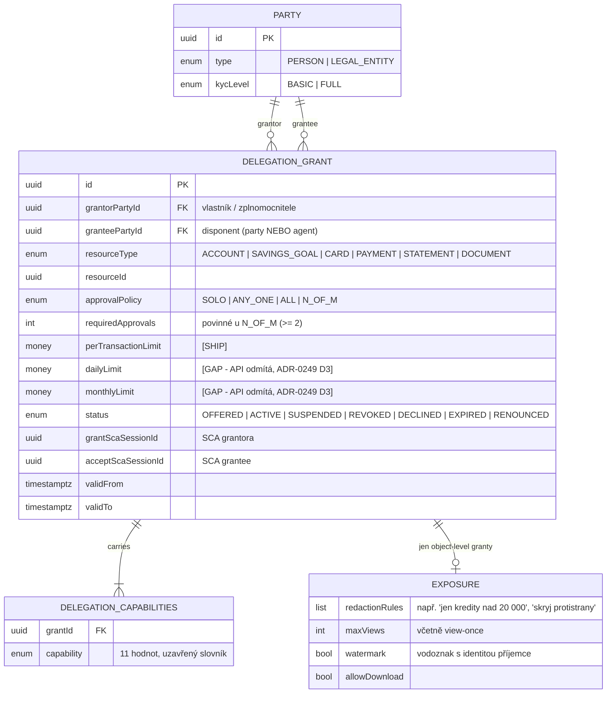
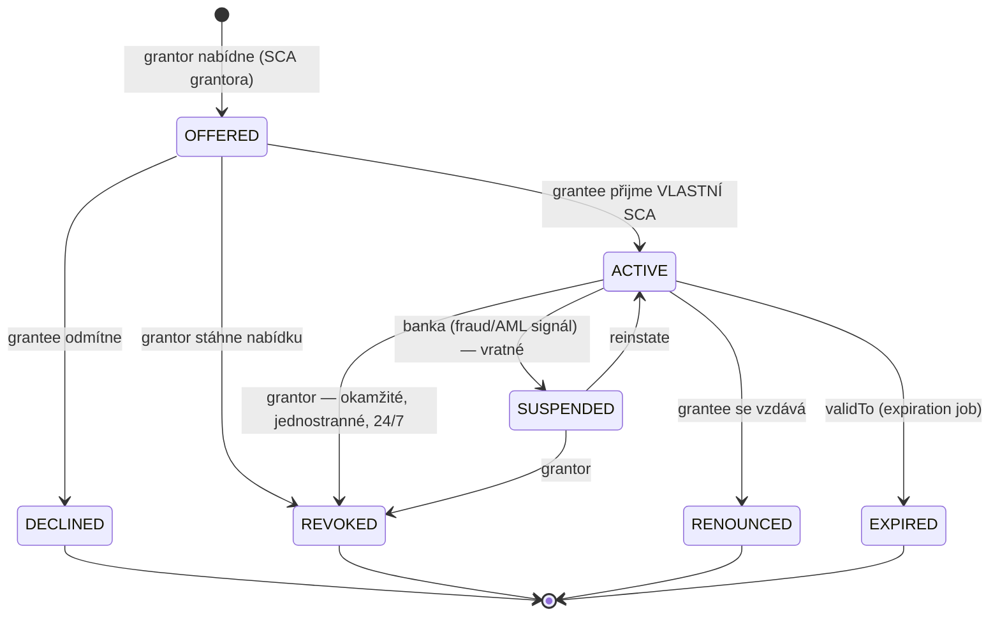
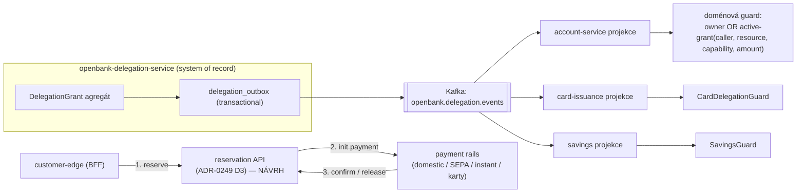
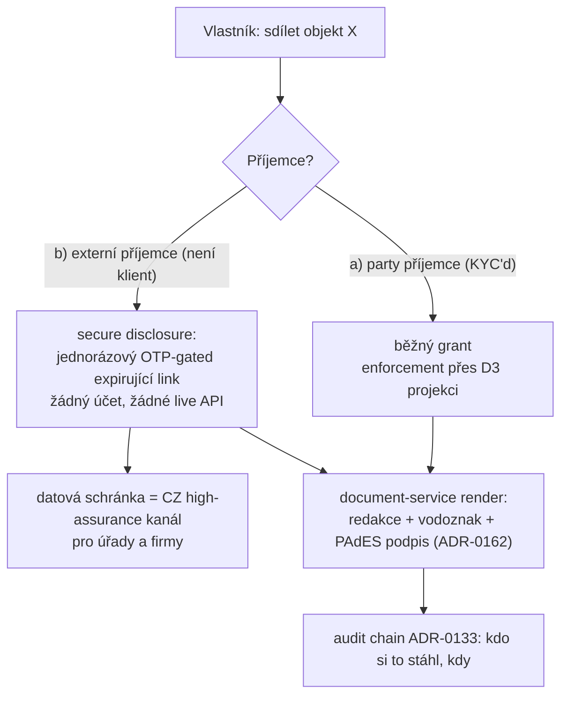
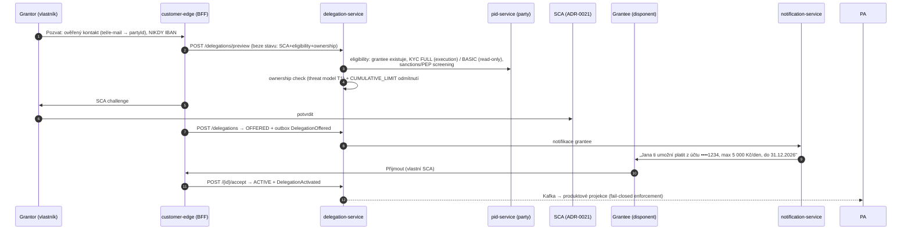
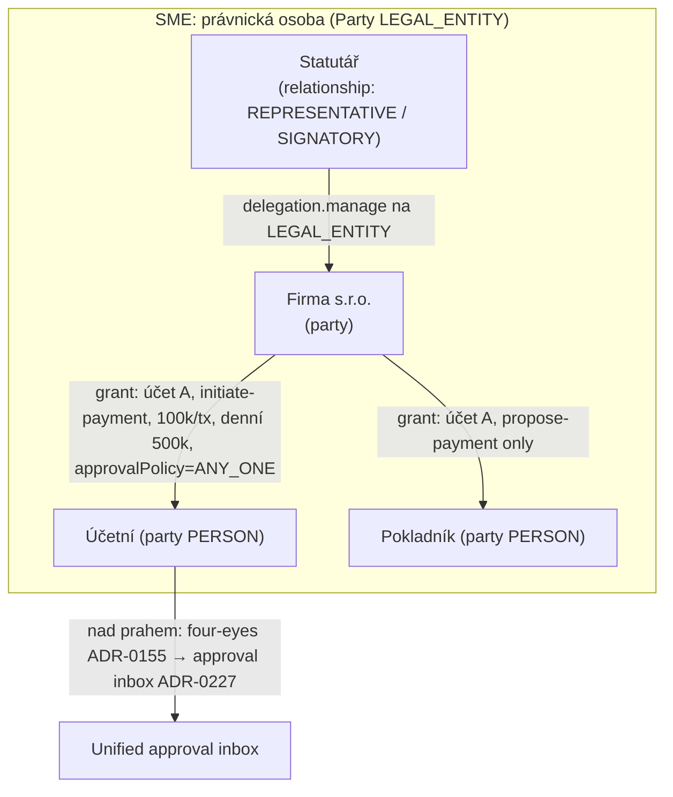
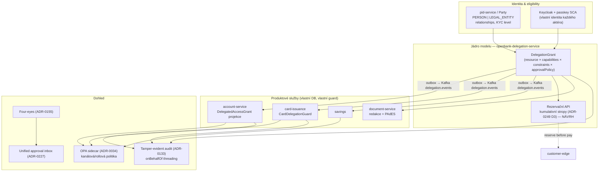

# Dispo & Share model — architektura a návrh

> Syntéza stávajících rozhodnutí (ADR-0232, ADR-0249, ADR-0233, ADR-0072, ADR-0126, …)
> a kódu (`openbank-delegation-service`, `account-service`, `pid-service`).
> Tento dokument je **design narrative**, ne ADR — nemění žádné rozhodnutí, jen je
> znázorňuje a doplňuje o pohled „jak to celé drží pohromadě". Změny modelu patří
> do nového ADR přes `docs/adr/new.sh`.

Stav k 2026-08-11. Rozlišujeme tři úrovně pravdy:
**[SHIP]** = existuje v kódu na main, **[NÁVRH]** = rozhodnuto v ADR, ještě nepostaveno,
**[GAP]** = vědomě neexistuje / záměrně odmítnuto.

---

## 1. Problém, který řešíme

Zákazník dnes může sdílet produkt (účet, kartu, spoření) s jiným člověkem **nula způsoby**
a jednotlivý *objekt* (konkrétní platbu, výpis, dokument) také ne. Běžný život potřebuje
obojí: partnerka s trvalým přístupem, účetní s vyrejtrovaným výpisem, kupující na
Marketplace, který chce důkaz o jedné konkrétní platbě, dítě, které smí *navrhnout*
platbu, ale ne odeslat. A za rohem je **SME segment**: právnická osoba, jejíž zaměstnanci
potřebují vymezená, odvolatelná, limitovaná a auditovatelná oprávnění — pokladník vs.
účetní vs. čtenář, duální autorizace nad prahem.

Tři sousední modely už existují, ale žádný z nich není customer-to-customer delegace:

| Model | Domov | Co je | Proč to NENÍ dispo model |
|---|---|---|---|
| `AccountAuthorization` | account-service | Role FULL_ACCESS / PAYMENT_ONLY / READ_ONLY / CARD_HOLDER, limity, `SigningRule` (SINGLE / JOINT_ALL / JOINT_ANY_TWO / OWNER_PLUS_ONE) | Account-lokální — karty, spořící cíle ani budoucí produkty ho nemůžou znovupoužít bez porušení database-per-service (ADR-0009); mimo account-service ho nic nevymáhá. Je to **seed**, migruje se do delegation-service. |
| consent-service | ADR-0126, ADR-0206 | Souhlasy pro *třetí strany* (TPP s eIDAS certifikátem, AI agenti) | Právně jiný instrument: PSD2 RTS omezuje AISP platnost na 90 dní a 4 čtení/den — pravidla, která se nesmějí přenést na manželku nebo zaměstnance, a naopak. |
| OPA + role (Keycloak) | ADR-0034, ADR-0229 | Autorizace *personálu a agentů* | Retailový disponent není realm role; „Pavel smí platit do 5 000 Kč z účtu Jany" v Keycloak groupách exploduje slovník rolí a neodnáší per-resource omezení. |

---

## 2. Jádro: jeden agregát `DelegationGrant` (ADR-0232 D1)

Celý dispo i share model je **jedna entita** v `openbank-delegation-service`
(`domain/model/DelegationGrant.kt`). Žádný „share service" navrch — sdílení objektu
je grant nad objektovým resource typem, dispo právo je grant nad produktovým resource
typem. Jedna lifecycle, jedna SCA ceremonie, jeden audit tvar.



Klíčové invarianty agregátu (vynucené v `init {}`, tj. strukturálně, ne policy):

- `grantor ≠ grantee`; aspoň jedna capability; capability musí patřit resource typu
  (matice níže).
- **Object-level granty (PAYMENT/STATEMENT/DOCUMENT) jsou vždy read-only** — execution
  capability na nich agregát odmítne. Sdílení objektu nikdy nehýbe penězi.
- `EXPOSURE` existuje jen na object-level grantech.
- `N_OF_M` vyžaduje `requiredApprovals >= 2`.

### 2.1 Uzavřený slovník capability × resource (ADR-0232 D2) — [SHIP]

Zdroj pravdy je dnes enum `DelegationCapability` (cílem generování z `rules.yaml`,
stejná disciplína jako role v ADR-0229). Presety („Karta pro dítě", „Účetní",
„Pokladník", „Kapskové", „Trusted contact") jsou jen data nad tímto slovníkem —
UX poleva, nikdy paralelní permission systém.

| Capability \ Resource | ACCOUNT | SAVINGS_GOAL | CARD | PAYMENT | STATEMENT | DOCUMENT |
|---|:---:|:---:|:---:|:---:|:---:|:---:|
| `ACCOUNT_READ_BALANCES` | ✅ | | | | | |
| `ACCOUNT_READ_TRANSACTIONS` | ✅ | | | | | |
| `ACCOUNT_INITIATE_PAYMENT` | ✅ *(execution — viz §5)* | | | | | |
| `ACCOUNT_PROPOSE_PAYMENT` | ✅ *(maker, nikdy nevykoná)* | | | | | |
| `DELEGATION_MANAGE` | ✅ | | | | | |
| `SAVINGS_DEPOSIT` | | ✅ | | | | |
| `SAVINGS_WITHDRAW` *(execution)* | | ✅ | | | | |
| `SAVINGS_PROPOSE_WITHDRAW` | | ✅ | | | | |
| `CARD_VIEW` | | | ✅ | | | |
| `CARD_MANAGE_LIMITS` | | | ✅ | | | |
| `OBJECT_READ` | | | | ✅ | ✅ | ✅ |

`LOAN` je v prvním slice **záměrně vynecháno** — žádná loan-scoped capability zatím
neexistuje, takže hodnota by byla nabízetelný resource typ s nulou grantovatelných
capabilities. Přidání je zpětně kompatibilní rozšíření enumu.

### 2.2 Životní cyklus — dvoustranný souhlas, odvolání jednostranné (D4) — [SHIP]



Pravidla:
- Grantor nabízí vázáno na SCA (ADR-0021), grantee přijímá **vlastní SCA** — model
  strukturálně neumí „přihlas se jako vlastník". Sdílení kredencí je vyloučeno
  konstrukčně, ne smlouvou.
- Grantor revokuje okamžitě a jednostranně; grantee se může vzdát; banka může
  suspendovat na fraud/AML signál.
- Grant payment capability nad bankovním prahem je four-eyes flagován (ADR-0155)
  a padá do unified approval inboxu (ADR-0227).
- Každý přechod = outbox event + notifikace oběma stranám. Každý grant, rezervace,
  potvrzení i revokace je audit event do tamper-evident chainu (ADR-0133).

---

## 3. Enforcement: jak se grant vymáhá (D3) — [SHIP částečně]



Tři pilíře:

1. **Decentralizované, fail-closed, nikdy synchronní na money path.** Produktové
   služby konzumují `DelegationOffered/Activated/Suspended/Revoked/Expired` eventy
   (transactional outbox, ADR-0003/0050) do **lokální projekce** a jejich doménová
   guard autorizuje `owner OR active-grant(...)`. Eventy nesou plný projekční payload
   (resource, strany, capabilities) — konzument staví projekci jen ze streamu, nikdy
   nedovolává zpátky.
2. **Outage delegation-service blokuje *změny* sdílení, nikdy existující čtení/platby.**
   Grant-check je doménová invarianta vlastníka zdroje.
3. **`onBehalfOf: grantorPartyId`** se protahuje audit chainem (ADR-0086/0133) na každé
   money-path akci vykonané disponentem — identity threading už existuje, jen se
   rozšiřuje claim. OPA dál rozhoduje kanálovou/rollovou politiku (ADR-0034).

**Změřený stav dosažitelnosti (ADR-0232, „Delivery status, measured", issue #3615):**
guards existují a jsou správně (`isAuthorizedForAmount`, `CardDelegationGuard`,
`POST /api/v1/delegations/check`), ale **žádná money-moving služba grant zatím nečte**
— customer-edge payment initiation vyžaduje debtor-owner == autentikovaná party, takže
disponent dostane 403 dřív, než se guard vůbec zavolá. Guards se **nechávají v kódu
beze změny** a jejich nedosažitelnost hlídá gate `enforcement-reachability`. Pořadí
opravy je záměrné: nejdřív delegovaná platební cesta, pak guard na ní, teprve pak
kumulativní čítač. Limit má smysl počítat až je co odmítnout.

---

## 4. Dispo model nad jednotlivými produkty

ADR-0249 zdůrazňuje, že „disponent" jsou **dva různé produkty**, které trh (a BIAN)
dávno odděluje — a jejich sloučení je obvyklá chyba:

| Co lidé žádají | Tržní název | Mechanismus v OpenBank | BIAN doména |
|---|---|---|---|
| „dej partnerce kartu k mému účtu" | dodatková karta | **Karta**, ne oprávnění: nový `Card` s `partyId` = disponent, `accountId` = účet grantora, vlastní PAN, vlastní limity, navázaná na grant | Card Transaction Authorisation |
| „ať účetní platí z účtu do limitu" | mandát / disponent | **Autorizace nad účtem** přes `ACCOUNT_INITIATE_PAYMENT` + kumulativní limity | Party Authorisation, Payment Order |

### 4.1 Karty — [SHIP model, NÁVRH wiring]

- `Card` nese `partyId` (držitel) **odděleně od** `accountId` → karta, jejíž držitel
  není vlastník účtu, je strukturálně vyjádřitelná dnes, bez změny schématu.
- `Card` nese `dailyLimitMinorUnits` / `monthlyLimitMinorUnits` a karetní rail je
  vymáhá → karetní stropy **jsou reálné**, na rozdíl od delegačních.
- D1/D2 (ADR-0249): disponentní karta = normální `Card` navázaná na grant;
  `CARD_MANAGE_LIMITS` + `CARD_VIEW` vymáhá edge přes `CardDelegationGuard` — disponent
  může zamrazit/odmrazit/přelimitovat kartu, kterou dostal. Grantor má nad kartou
  všechna práva bezpodmínečně, a **revokace grantu kartu blokuje, nejen skrývá** —
  karta, která dál transakčně žije po skončení oprávnění, je selhání, na které se
  nezapomene.
- Co se záměrně nestaví: delegovaný PIN/PAN reveal (PCI scope), delegace výběru z ATM
  (ATM rail rezervační API nekonzultuje — strop by byl slib, který neumíme držet).

### 4.2 Účty — [NÁVRH, klíčový mechanismus: rezervace]

`ACCOUNT_INITIATE_PAYMENT` se stává použitelným až s **autoritativním čítačem útraty**,
ne poradním. delegation-service získává rezervační API (ADR-0249 D3):

```
POST /api/v1/delegations/{id}/reservations   {amount, currency, idempotencyKey}
  -> 201 {reservationId}             všechny stropy OK
  -> 409 {reason: DAILY|MONTHLY|PER_TX}   odmítnuto, s kterým stropem a kolik zbývá
POST /api/v1/delegations/{id}/reservations/{rid}/confirm
POST /api/v1/delegations/{id}/reservations/{rid}/release
```

Edge rezervuje **před** iniciací platby, potvrzuje při settled, uvolňuje při selhání.
Reserve-then-confirm, ne count-after: počítat až po settlement znamená, že dvě
konkurentní platby projdou kontrolou, kterou by samostatně neprošly — „všimli jsme si
dodatečně" není limit.

**Proč v delegation-service a ne v payment rail** (amendment ADR-0232 D3): zákazník
s jedním grantem utrácí přes domestic, SEPA, instant i karty. Čítač per rail nevidí
ostatní, takže každý rail by vymáhal strop, který zákazník nemá. Grant je jediné místo,
které vidí všechno. **Čtyři čítače, z nichž každý podpočítává, jsou horší než jeden,
který je správně.**

**Bezpečnostní pravidla:** žádná útrata bez stropu — grant s `ACCOUNT_INITIATE_PAYMENT`
bez daily+monthly limitu se odmítá už při vytvoření („neomezený přístup k cizímu účtu"
je produktové rozhodnutí, které žádná banka nesmí udělat z nedbalosti). Nic se neděje
bez SCA grantora a nic není tiché — první použití nového oprávnění notifikuje grantora.

> Dnes: `dailyLimit`/`monthlyLimit` jsou na offer API **odmítnuty** (400
> `CUMULATIVE_LIMIT_UNSUPPORTED`, na customer-edge i delegation-service), protože
> platforma je nikde nepočítá. `perTransactionLimit` funguje (`withinLimits`) a je
> zrcadlen do projekce account-service.

### 4.3 Spořící cíle

`SAVINGS_DEPOSIT` / `SAVINGS_WITHDRAW` / `SAVINGS_PROPOSE_WITHDRAW`. Approval policy
platí per-resource, ne jen per-grant: sdílený spořící cíl může vyžadovat N_OF_M
spolupodepisovatelů k výběru („oba rodiče musí schválit výběr") — **stejný mechanismus,
jaký SME používá pro dual control nad prahem**. Preset „Společný cíl" = shared vault
s N_OF_M withdrawal.

### 4.4 Propose-only (maker-checker) — D8

`account.propose-payment` / `savings.propose-withdraw` dávají disponentovi maker roli
**bez exekučního práva**: návrh padne do approval inboxu vlastníka (ADR-0227) a vykoná
se až po jeho SCA. Retailový maker-checker na four-eyes strojírně ADR-0155, žádná nová
approvals infrastruktura. Preset „Kapskové" = propose-only + merchant-category pravidla
+ týdenní cap; „Senior trusted contact" = read-only + fraud alerty, strukturálně
neschopné transakce.

---

## 5. Share model: sdílení jednotlivých objektů (D7)

Grant může cílit **jednu instanci objektu** (`PAYMENT`, `STATEMENT`, `DOCUMENT`) s
capability `OBJECT_READ` a `Exposure` omezením. Dva režimy příjemce:



- **Redakce je GDPR data-minimalizace zmechanizovaná**: „jen kredity nad 20 000 Kč",
  „skryj protistrany". `maxViews` včetně view-once, vodoznak s identitou příjemce,
  download permission, krátká platnost (dny, ne měsíce).
- **Externí disclosure není delegace přístupu** — nic externího se nedotkne live API;
  je to zapečetěná, auditovatelná, odvolatelná *emise dokumentu* ze stejného agregátu,
  takže grantor transparency („kdo si to stáhl, kdy") a audit chain platí identicky.
  Hrozba: leak linku = leak dokumentu; mitigace OTP + expiry + maxViews + watermark,
  a threat model musí dokázat, že revokace zabije link.
- Nahrazuje dnešní šedou praxi e-mailování celých výpisů — privacy vítězství, za které
  konkurence účtuje účetním.
- **EUDI verifiable credentials** (banka jako issuer proof-of-payment / proof-of-balance
  včetně predicate proofs „zůstatek ≥ X" bez odhalení X) jsou záměrně MIMO scope a
  povýšené na follow-up ADR nad ADR-0094. Externí-disclosure port je tvarován tak, aby
  VC issuance se stala třetím doručovacím kanálem bez přepisování agregátu.

### 5.1 Čím sdílení NENÍ (odmítnuté alternativy)

- **Rozšíření consent-service o `CUSTOMER` grantee** — PSD2 instrument a smluvní mandát
  se liší v platnostech, SCA ceremonii, odpovědnosti i revokační sémantice; jeden
  agregát kódující opačné regulační režimy opakuje defektní třídu AISP/GDPR scope
  disjointness (ADR-0205) na doménové úrovni.
- **Replikace `AccountAuthorization` tabulky per produkt** — N divergentních modelů,
  žádná jediná odpověď „kdo má kam přístup" pro zákazníka ani pro compliance.
- **Centrální ReBAC engine (OpenFGA/SpiceDB)** — synchronní graph lookup na money path
  je nový availability SPOF a nový PII store; event-fed projekce dodá stejnou sémantiku
  na existujícím outbox/Kafka substrátu. Read port je navržen tak, aby ReBAC engine
  mohl projekci později nahradit bez dotčení produktových služeb.
- **Keycloak groups/attributes per grant** — žádná per-resource omezení, realm by se
  stal autorizační databází (proti ADR-0229), granty by obcházely audit chain.

---

## 6. Nastavování práv mezi klienty (UX & API)



Klíčová API (OpenAPI 3.1, `openbank-delegation-service/src/main/resources/openapi.yaml`):

| Endpoint | Účel |
|---|---|
| `POST /api/v1/delegations` | Nabídnout grant (idempotentní přes `X-Request-ID`; 400 `CUMULATIVE_LIMIT_UNSUPPORTED`; 422 eligibility/ownership) |
| `POST /api/v1/delegations/preview` | Stateless validace před SCA — zákazník nepřijde o ceremonii kvůli validaci |
| `POST /{id}/accept` `/decline` `/renounce` | Grantee strana (accept s vlastní SCA) |
| `DELETE /{id}` + `POST /{id}/suspend` `/reinstate` | Grantor / banka |
| `POST /{id}/revoke` | Okamžité, jednostranné, 24/7 |
| `POST /delegations/list` | Filtr: grantor, grantee, status, resource, capability |
| `GET /{id}/audit` | Audit stopa grantu |
| `GET /{id}/conflicts` · `POST /analyze-impact` · `GET /{id}/roles` | Co by se změnilo, kdyby grant byl ACTIVE |
| `POST /delegations/check` | Autorizační dotaz s částkou |

UX principy (D6): pozvánky přes ověřený kontakt; plain-language shrnutí před přijetím;
oba vidí „Shared by me / Shared with me" dashboard přes customer-edge; grantor má
per-delegate activity feed; WCAG 2.2 AA a cs/en od prvního dne (ADR-0149/0150).

---

## 7. SME segment: jedna delegace, jeden bridge (D5)

**SME zaměstnanec je jen grantee party grantora typu LEGAL_ENTITY.** Žádný druhý
systém. Celý retail→SME bridge je jediné pravidlo:

> Grantor-side aktér u grantora LEGAL_ENTITY musí sám držet `delegation.manage`
> na této entitě, nebo být jejím statutárním zástupcem.



Co SME potřebuje a odkud se to bere:

| Potřeba SME | Mechanismus | Stav |
|---|---|---|
| Role v osobě firmy (vlastník, účetní, signatář) | Party relationships (`REPRESENTATIVE`, `SIGNATORY`, `EMPLOYEE`, `BENEFICIAL_OWNER`) v pid-service (ADR-0072) | [SHIP] |
| Dual control nad prahem | `approvalPolicy: ANY_ONE | ALL | N_OF_M` + four-eyes (ADR-0155) + approval inbox (ADR-0227) | N_OF_M [SHIP v agregátu]; four-eyes enforcement [částečně] |
| Scopeovaná, limitovaná, revokovatelná práva | `DelegationGrant` constraints + okamžitá revokace | [SHIP per-tx; cumulative po ADR-0249 D3] |
| Auditovatelnost | Každá akce disponenta s `onBehalfOf` v tamper-evident chainu (ADR-0133) | [SHIP infrastruktura] |
| Firemní role jako SSOT (OWNER/ACCOUNTANT/SIGNATORY/APPROVER/MEMBER, lifecycle INVITED→…→TERMINATED) | **Zatím nerozhodnuto** — žádný member-service v tree; ADR-0229 v digesti se týká rolí pro backoffice UI. Toto je kandidát na nový ADR. | [GAP] |
| E-sign dokumentů s checklisty pro signatáře/delegáty | document-service async workflow (ADR-0162) nad object-sharing granty | [NÁVRH] |

Eligibility gate (D5) platí i pro SME: grantee = existující party, `KycLevel.FULL` pro
payment capability, `BASIC` pro read-only; sanctions/PEP screening při grantu i při
změně stavu grantee (stejný gate pattern jako ADR-0032). AML Act 253/2008 Sb. —
identifikační povinnost se vztahuje i na zmocněné osoby.

---

## 8. AI agent jako grantee: bounded agentic allowance (ADR-0233)

Zákazníci požádají o „ať můj AI agent zaplatí nákupy do X, dobije kartu když dochází,
sweepuje drobné do spoření". Bez konvergence by dvě systémy odpovídaly stejnou otázku
(delegační granty pro party, AP2 mandáty pro agenty) se dvěma lifecycles, dvěma
liability příběhy a dvěma audit tvary. Řešení: **charted AI agenti jsou first-class
grantee uvnitř ADR-0232 modelu, ne vedle něj.**

- **D1**: `granteeType: PARTY | AGENT`. AGENT grantee = charted `agent:` principal
  (agents.yaml charter, ADR-0031) vlastněný KYC'd party. Eligibility gate se aplikuje
  na *vlastníka* agenta.
- **D2**: Stropy jsou kontrolní plocha; nad nimi propose-only. Agent grant MUSÍ nést
  per-tx + denní + měsíční strop (agregát odmítá unlimited). Uvnitř stropu vykonává;
  nad stropem se akce stává návrhem v approval inboxu vlastníka s jeho SCA — agent jako
  permanentní maker.
- **D3**: Agenti nikdy sub-delegují a nikdy se sami nerozšiřují. `DELEGATION_MANAGE` je
  na AGENT grantech strukturálně zakázáno (agregát invariant) — containment přežije
  prompt injection z principu.
- **D4**: Jeden domov mandátů — AP2 verify endpoint (ADR-0193) se stává read projekcí
  téhož agregátu. Jedna lifecycle, jedna revokační cesta, jeden audit tvar.
- **D5 launch gates**: před prvním AGENT grantem s execution capability musí běžet
  fraud/anomaly agent konzumující AGENT granty jako risk signál, tool surface je
  policy-filtrován (ADR-0225) s money-mutations hard_denied defaultně, velocity limity
  pod grant stropy (kompromitovaný agent nemůže vyčerpat stropem rychlostí).

Každá agentní akce je dvojitě atributována (agent identity + onBehalfOf owner).

---

## 9. Celková mapa: jak to drží pohromadě



---

## 10. Compliance & hranice

- **PSD2**: disponent je zmocněnec vlastníka v rámcové smlouvě, **ne TPP** — žádné
  eIDAS/XS2A. SCA na vlastních kredencích disponenta per RTS; propose-only nikdy nehýbe
  penězi bez SCA vlastníka. Odpovědnost vlastníka do výše constraints musí do
  produktových podmínek.
- **GDPR**: právní základ je smlouva (mandát), ne consent-service souhlas; redakce D7
  je data-minimalizace zmechanizovaná; grantor transparency feed a access-log viditelnost
  vestavěny; delegation záznamy jsou smluvní důkaz pod retention schedule ADR-0118 —
  erasure anonymizuje, nemaže.
- **ČNB/AML**: disponenti jsou KYC'd a screenované party; grant/revoke, každá delegovaná
  money-path akce i každý externí disclosure padají do tamper-evident audit chainu.
- **PCI DSS**: scope beze změny — delegáti dostávají *management* karet, nikdy PAN
  disclosure (synthetic-PAN vault ADR-0194).
- **DORA**: delegation-service vstupuje do ICT risk registru a BCP (ADR-0134);
  threat model `docs/threat-models/openbank-delegation-service.md` (T1–T8).

## 11. Otevřené gapy a pořadí doplnění

1. **Delegovaná platební cesta** — customer-edge dnes odmítá disponenta 403 ještě před
   guardem; issue #3615. Pořadí: cesta → guard na ní → kumulativní čítač.
2. **Kumulativní stropy** — rezervační API (ADR-0249 D3), pak teprve znovupovolení
   `dailyLimit`/`monthlyLimit` na offer API.
3. **`CardDelegationGuard` wiring** — guard existuje bez produkčního volajícího
   (wiring gap, ne design gap).
4. **Firemní role jako SSOT** — party relationships existují, ale role-in-company
   (OWNER/ACCOUNTANT/SIGNATORY…) s lifecycle a eventy pro enforcement není
   rozhodnuto; kandidát na ADR.
5. **EUDI VC disclosure** — follow-up ADR nad ADR-0094 (proof-of-payment / predicate
   proofs), externí-disclosure port je na ně připraven.
6. **AccountAuthorization migrace** — dual-run období + backfill; do dokončení existují
   pro účty dva grant zdroje.

## Reference

- ADR-0232 (delegated access — základní model, D1–D8) · ADR-0249 (dispositor model,
  dodatkové karty, rezervace) · ADR-0233 (agent jako grantee) · ADR-0072 (party SOT) ·
  ADR-0126/0205/0206 (consent hranice) · ADR-0034/0223 (OPA) · ADR-0021 (SCA) ·
  ADR-0155 (four-eyes) · ADR-0227 (approval inbox) · ADR-0133 (audit) ·
  ADR-0162 (dokumenty/e-sign) · ADR-0032 (sanctions gate) · ADR-0193 (AP2 liability)
- Kód: `openbank-delegation-service/` (agregát, eventy, OpenAPI, V1–V3 migrace),
  `openbank-account-service/.../AccountAuthorization.kt` (seed),
  `openbank-pid-service/.../Party.kt` (LEGAL_ENTITY, AUTHORIZED_PERSON),
  `docs/threat-models/openbank-delegation-service.md`
- Issues: #3615 (enforcement reachability), #3000 (delegation fraud agent),
  #3001 (copilot delegation assistant), #2990 (enforcement projections)
