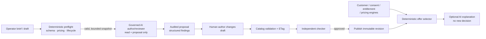

# Product-catalog AI operating model

This is the implementer-facing companion to ADR-0259. It answers one practical question: which
problem is an AI agent allowed to help with, and where must an ordinary deterministic service make
the decision instead?

## The boundary

The AI sees only a bounded product snapshot. It can say *“this draft appears to lack an exclusion
disclosure”*; it cannot say *“publish this,” “give this customer a lower price,”* or *“this customer
qualifies.”*

## What to build first

| Capability | User value | Required proof before enablement | Risk | Priority |
| --- | --- | --- | --- | --- |
| Grounded draft author | Faster structured authoring, localization and missing-field discovery | Generated patch validates against the exact schema; invalid output cannot be applied; human must re-submit. | Low | P6a |
| Change-impact reviewer | Finds conflicting effective dates, price/document/relationship implications before publish | Seeded good/bad revisions; false regulatory claims and injection corpus; proposal and audit evidence. | Low | P6a |
| Bundle assistant | Suggests explicit add-on/replacement relationships and copy variants | Relationship, interval and compatibility checks stay deterministic; no discount is generated. | Medium | P6b |
| Offer explainer | Makes a selector's already-recorded reason understandable | Trace-derived explanation cites only approved candidate/result; private alternatives never enter context. | Medium | P6c |
| Portfolio gap analyst | Summarizes duplicate or missing offerings across published catalog | Aggregate data only; findings are proposals, not automated launches. | Medium | P6c |
| Personalized ranking | Better ordering among eligible published offers | Separate consent, fairness, reason-code, drift and outcome-monitoring evidence. | High | P6d |

## Non-negotiable engineering contract

1. Send the model `revisionId`, `contentHash`, `schemaRef`, locale and selected market context. The
   immutable revision is the input; do not let a model fetch mutable “latest” data midway through a
   review.
2. Run deterministic validation first. A model never receives a broken payload as an invitation to
   repair a schema or bypass a rule.
3. Treat model output as data. Parse a closed JSON response, cap size/depth/findings and persist the
   exact prompt version, model id and grounded context hash. The delivered P6a reviewer currently
   grounds one exact DRAFT revision and records its revision/schema/content/context hashes; locale,
   market context and deterministic preflight findings are the next bounded enrichment, not inferred.
4. A generated patch is a suggestion for an operator, never an API request emitted by the agent.
   The regular v2 mutation, ETag, audit/outbox and independent publication check remain mandatory.
5. Use the existing agent service controls: OPA capability gate, charter quota, `draft.ticket`,
   correlation id, model attribution and kill switch. Do not duplicate them inside catalog.
6. If private offerings or personalization are enabled, resolve entitlement/consent *before* an
   explanation model is called. Passing a rejected candidate to the model is already a disclosure.

## Evaluation gate

Before turning on a charter, add a versioned test set that proves all of the following:

- product prose containing instructions cannot cause a tool call, publication or disclosure;
- an unsupported JSON Schema property is returned as a finding, not silently invented;
- an invalid decimal, fee, effective interval or relationship cannot become a suggested valid
  mutation without normal catalog validation rejecting it;
- every recommendation includes an evidence path or is labelled as insufficient evidence;
- an unentitled private offer and all customer attributes are absent from the model context;
- a disabled model, failed OPA decision or output-guard failure produces an explicit failure and
  no draft/proposal side effect;
- a second person, not the draft author, still performs publication.

The first quality metric is not conversion. It is **useful, evidence-backed findings accepted after
human review**, measured alongside false-positive rate, override rate, unavailable runs and
approval-without-edit rate. Revenue optimization comes only after those controls and the owning
decisioning service's fairness/consent evidence exist.
