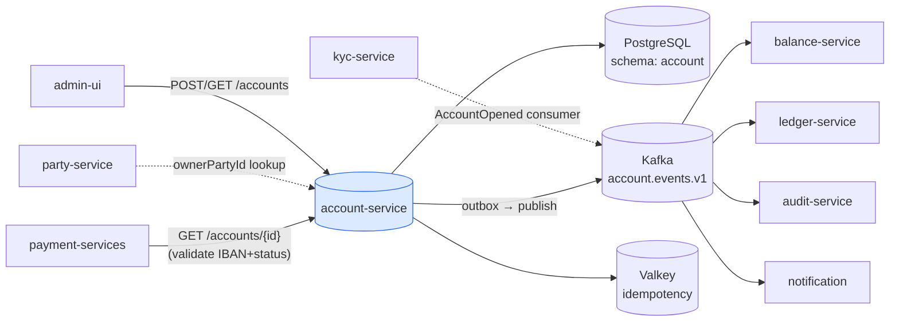
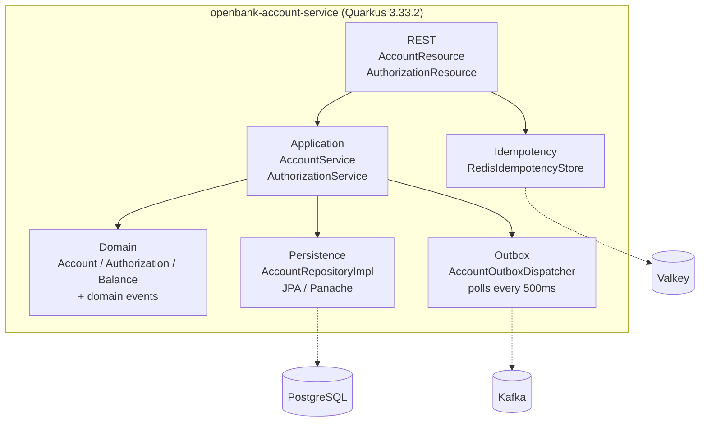
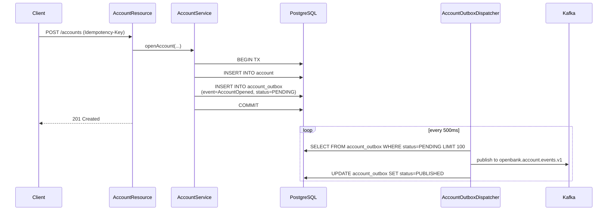

# Architecture

## C4 — System Context



## C4 — Container (vnitřní struktura)



## Hexagonální vrstvy

Adresářová struktura odráží **ports-and-adapters**:

```
com.openbank.account/
├── domain/                    ◄── core — žádné framework závislosti
│   ├── model/                 Account, AccountAuthorization, AccountBalance
│   ├── event/                 AccountOpened, AccountFrozen, …
│   ├── repository/            AccountRepository (port)
│   └── service/               domain logic (state transitions, invariants)
│
├── application/               ◄── use-case orchestrace
│   ├── port/                  inbound / outbound ports
│   └── usecase/               AccountService, AuthorizationService
│
└── infrastructure/            ◄── adapters
    ├── rest/                  JAX-RS resources, DTO mapping
    ├── persistence/           AccountRepositoryImpl (JPA/Panache)
    ├── outbox/                AccountOutboxDispatcher (scheduled)
    ├── messaging/             Kafka producer
    ├── idempotency/           Redis adapter
    └── config/                @Produces beans
```

**Pravidlo závislostí:** `domain` ← `application` ← `infrastructure`. Doménový kód nikdy nevidí JPA, Kafka, REST DTO.

## Outbox flow



**Proč outbox:** transakční konzistence mezi zápisem do DB a publikací do Kafky. At-least-once doručení, idempotentní spotřebitelé.

## Komponenty z `openbank-libs`

| Modul | Použití zde |
|---|---|
| `libs.domain.account.Iban` | validace + normalizace IBAN |
| `libs.domain.money.Money` + `CurrencyCode` | hodnoty pro počáteční zůstatek, limity |
| `libs.domain.identifiers.AccountId` | typesafe ID místo UUID |
| `libs.idempotency.IdempotencyStore` | Redis-backed implementace |
| `libs.persistence.outbox` | OutboxEntity, OutboxRepository, OutboxDispatcherBase |
| `libs.security.BootstrapVerifier` — ⬜ **nekonzumuje se, neexistuje** | **Nic.** Tato třída v `openbank-libs` není a nikdy nebyla (`git grep BootstrapVerifier -- '*.kt'` vrací 0); ADR-0017 ji předepisuje a její delivery note uvádí, že dodána nebyla. Dev hesla drží mimo prod injektáž přes ESO/OpenBao `secretKeyRef` (ADR-0007), ne kód z libs (#8426) |
| `libs.web.ServiceInfoResource` | `/api/v1/info` (build metadata) |
| `libs.docs.DocsResource` | **tahle dokumentace** (`/q/openbank/docs`) |
| `libs.util.BuildInfo` | runtime tech-stack snapshot |

## Principy

1. **Aggregate boundary = Account** — operace nad účtem jsou atomické, autorizace jsou child entity.
2. **Domain events first** — každá state-change emituje doménový event; infrastruktura ho serializuje.
3. **No remote calls in TX** — vše synchronní v rámci request-response, async přes outbox + Kafka.
4. **Idempotence at edge** — povinný `Idempotency-Key` na všech POST/PUT, deduplikace v Redis.
5. **PII minimalizace** — IBAN je PII (GDPR), v lozích maskován (`libs.security.PiiMask.maskIban`).
