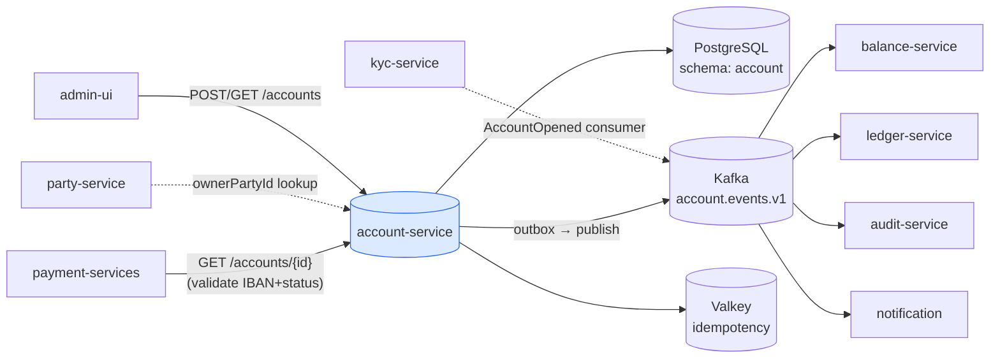
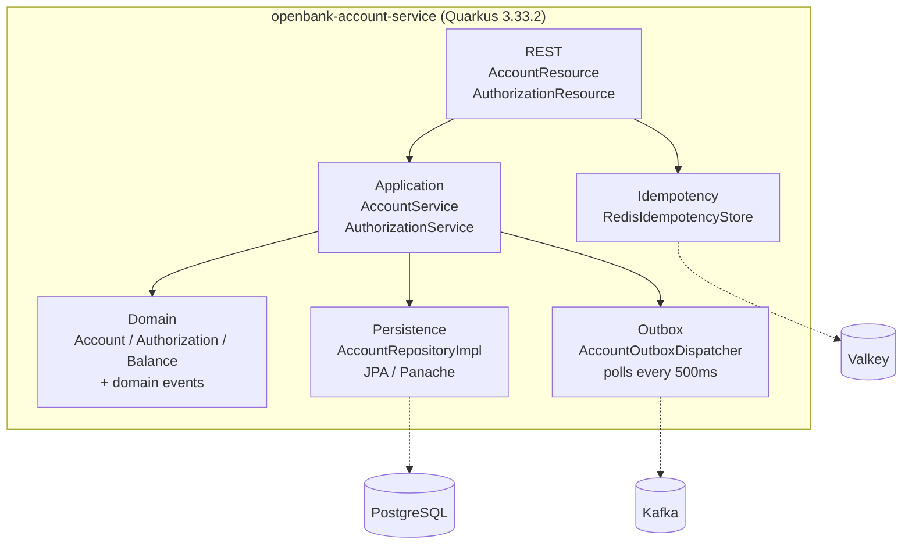
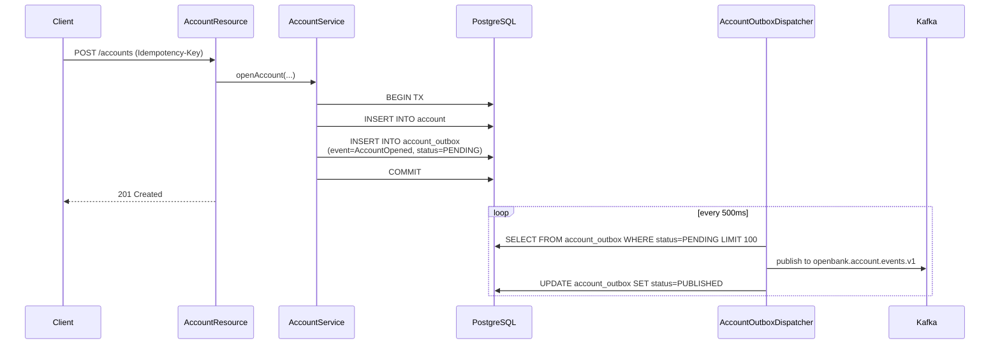

# Architecture

## C4 — System Context



## C4 — Container (internal structure)



## Hexagonal layers

The directory structure reflects **ports-and-adapters**:

```
com.openbank.account/
├── domain/                    ◄── core — no framework dependencies
│   ├── model/                 Account, AccountAuthorization, AccountBalance
│   ├── event/                 AccountOpened, AccountFrozen, …
│   ├── repository/            AccountRepository (port)
│   └── service/               domain logic (state transitions, invariants)
│
├── application/               ◄── use-case orchestration
│   ├── port/                  inbound / outbound ports
│   └── usecase/               AccountService, AuthorizationService
│
└── infrastructure/            ◄── adapters
    ├── rest/                  JAX-RS resources, DTO mapping
    ├── persistence/           AccountRepositoryImpl (JPA/Panache)
    ├── outbox/                AccountOutboxDispatcher (scheduled)
    ├── messaging/             Kafka producer
    ├── idempotency/           Redis adapter
    └── config/                @Produces beans
```

**Dependency rule:** `domain` ← `application` ← `infrastructure`. Domain code never sees JPA, Kafka, or REST DTOs.

## Outbox flow



**Why outbox:** transactional consistency between the DB write and Kafka publish. At-least-once delivery, idempotent consumers.

## Components from `openbank-libs`

| Module | Use here |
|---|---|
| `libs.domain.account.Iban` | IBAN validation + normalization |
| `libs.domain.money.Money` + `CurrencyCode` | values for initial balance, limits |
| `libs.domain.identifiers.AccountId` | typesafe ID instead of UUID |
| `libs.idempotency.IdempotencyStore` | Redis-backed implementation |
| `libs.persistence.outbox` | OutboxEntity, OutboxRepository, OutboxDispatcherBase |
| `libs.security.BootstrapVerifier` — ⬜ **not consumed, does not exist** | **Nothing.** This class is not in `openbank-libs` and never was (`git grep BootstrapVerifier -- '*.kt'` returns 0); ADR-0017 prescribes it and its own delivery note records that it was not shipped. Dev passwords are kept out of prod by ESO/OpenBao `secretKeyRef` injection (ADR-0007), not by libs code (#8426) |
| `libs.web.ServiceInfoResource` | `/api/v1/info` (build metadata) |
| `libs.docs.DocsResource` | **this documentation** (`/q/openbank/docs`) |
| `libs.util.BuildInfo` | runtime tech-stack snapshot |

## Principles

1. **Aggregate boundary = Account** — operations on an account are atomic; authorizations are child entities.
2. **Domain events first** — every state change emits a domain event; infrastructure serializes it.
3. **No remote calls in TX** — everything synchronous within request-response, async via outbox + Kafka.
4. **Idempotence at edge** — mandatory `Idempotency-Key` on all POST/PUT, deduplication in Redis.
5. **PII minimisation** — IBAN is PII (GDPR), masked in logs (`libs.security.PiiMask.maskIban`).
