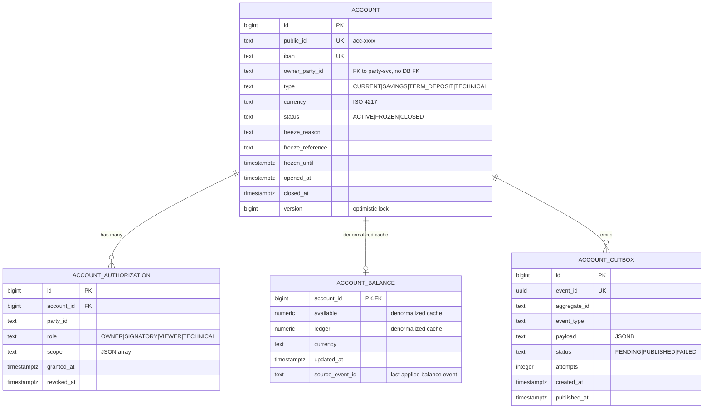

# Data

## Schema

Vlastní PostgreSQL schema `account` v databázi `openbank` (sdílená cluster, schema-per-service izolace).

## Migrace

Flyway, neměnné historické skripty, forward-only:

| Skript | Co dělá |
|---|---|
| `V1__init_accounts.sql` | Schema `account`, tabulka `account`, sekvence pro public_id |
| `V2__add_authorizations.sql` | Tabulka `account_authorization` + indexy |
| `V4__compliance_fields.sql` | Sloupce `freeze_reason`, `freeze_reference`, `frozen_until` |
| `V5__technical_accounts.sql` | Rozšíření `type` o `TECHNICAL`, partial index |
| `V6__create_account_outbox.sql` | Tabulka `account_outbox` (transakční outbox pattern) |

> Pozn.: V3 byla mergnuta do V4 (chybný design rejected v review).

## Indexy

- `account(iban)` — UNIQUE, použit při validaci platebních příkazů
- `account(owner_party_id)` — non-unique, list-by-party query
- `account(status) WHERE status != 'CLOSED'` — partial, ~80% rows
- `account_outbox(status, created_at) WHERE status = 'PENDING'` — dispatcher poll

## Retence

| Tabulka | Retence | Důvod |
|---|---|---|
| `account` | trvale | bankovní zákon, AML, audit |
| `account_authorization` | trvale (logical delete přes `revoked_at`) | audit, dispute resolution |
| `account_balance` | trvale (cache, ne primary) | rebuild z balance-service kdykoliv |
| `account_outbox` | 30 dní po PUBLISHED | troubleshooting, replay |

Cleanup outboxu: scheduled job v `AccountOutboxDispatcher.purgePublished()` — denně 03:00 UTC.

## PII fields (GDPR)

| Field | Klasifikace | Maskování v lozích |
|---|---|---|
| `iban` | PII (přímý identifikátor) | `CZ65…5399` (`PiiMask.maskIban`) |
| `owner_party_id` | pseudonymized id | nezobrazujeme v plaintextu |
| ostatní | non-PII | — |

GDPR **právo na výmaz** se NEAPLIKUJE na `account` — nadřazené pravidlo je AMLD (10 let). Klient může požádat o uzavření účtu; data zůstanou, ale `closed_at` se nastaví a viditelnost se omezí.

## Konzistence vs. balance-service

`account_balance` v této službě je **denormalizovaný cache** pro rychlé UI. Autoritativní zdroj zůstatku je `openbank-balance-service`. Synchronizace:

- balance-service publikuje `balance.updated.v1` event po každé akceptované transakci
- account-service to konzumuje a aktualizuje `account_balance.available/ledger`
- pokud sync zaostane > 5s → admin UI zobrazí "balance may be stale" badge

V případě divergence je **balance-service pravda** — `account_balance` se může rebuildnout přehráním eventů.

## Velikost (odhad pro 1M aktivních klientů)

- `account` ~1.5M rows × ~1 KB = **~1.5 GB**
- `account_authorization` ~3M rows × ~300 B = **~900 MB**
- `account_balance` ~1.5M × ~200 B = **~300 MB**
- `account_outbox` (30-day window) ~50M × ~2 KB = **~100 GB** (největší, plánujeme partitioning po měsíci)
