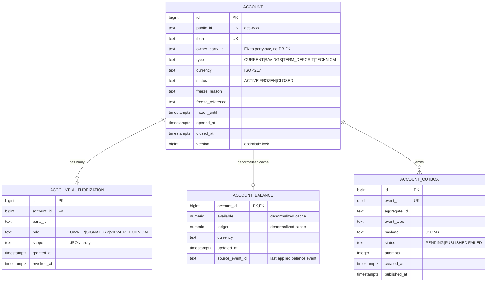

# Data

## Schema

Dedicated PostgreSQL schema `account` in the `openbank` database (shared cluster, schema-per-service isolation).

## Migrations

Flyway, immutable historical scripts, forward-only:

| Script | What it does |
|---|---|
| `V1__init_accounts.sql` | Schema `account`, table `account`, sequence for public_id |
| `V2__add_authorizations.sql` | Table `account_authorization` + indexes |
| `V4__compliance_fields.sql` | Columns `freeze_reason`, `freeze_reference`, `frozen_until` |
| `V5__technical_accounts.sql` | Extends `type` with `TECHNICAL`, partial index |
| `V6__create_account_outbox.sql` | Table `account_outbox` (transactional outbox pattern) |

> Note: V3 was merged into V4 (faulty design rejected in review).

## Indexes

- `account(iban)` — UNIQUE, used to validate payment instructions
- `account(owner_party_id)` — non-unique, list-by-party query
- `account(status) WHERE status != 'CLOSED'` — partial, ~80% of rows
- `account_outbox(status, created_at) WHERE status = 'PENDING'` — dispatcher poll

## Retention

| Table | Retention | Reason |
|---|---|---|
| `account` | forever | banking law, AML, audit |
| `account_authorization` | forever (logical delete via `revoked_at`) | audit, dispute resolution |
| `account_balance` | forever (cache, not primary) | can be rebuilt from balance-service at any time |
| `account_outbox` | 30 days after PUBLISHED | troubleshooting, replay |

Outbox cleanup: scheduled job in `AccountOutboxDispatcher.purgePublished()` — daily 03:00 UTC.

## PII fields (GDPR)

| Field | Classification | Log masking |
|---|---|---|
| `iban` | PII (direct identifier) | `CZ65…5399` (`PiiMask.maskIban`) |
| `owner_party_id` | pseudonymized id | not displayed in plaintext |
| others | non-PII | — |

GDPR **right to erasure** does NOT apply to `account` — AMLD overrides it (10 years). The customer can request account closure; the data remains but `closed_at` is set and visibility is restricted.

## Consistency vs. balance-service

`account_balance` in this service is a **denormalized cache** for fast UI rendering. The authoritative source of balance is `openbank-balance-service`. Synchronisation:

- balance-service publishes a `balance.updated.v1` event after every accepted transaction
- account-service consumes it and updates `account_balance.available/ledger`
- if sync lags > 5 s → admin UI shows a "balance may be stale" badge

In case of divergence, **balance-service is the truth** — `account_balance` can be rebuilt by replaying events.

## Size (estimate for 1M active customers)

- `account` ~1.5M rows × ~1 KB = **~1.5 GB**
- `account_authorization` ~3M rows × ~300 B = **~900 MB**
- `account_balance` ~1.5M × ~200 B = **~300 MB**
- `account_outbox` (30-day window) ~50M × ~2 KB = **~100 GB** (largest, monthly partitioning planned)
