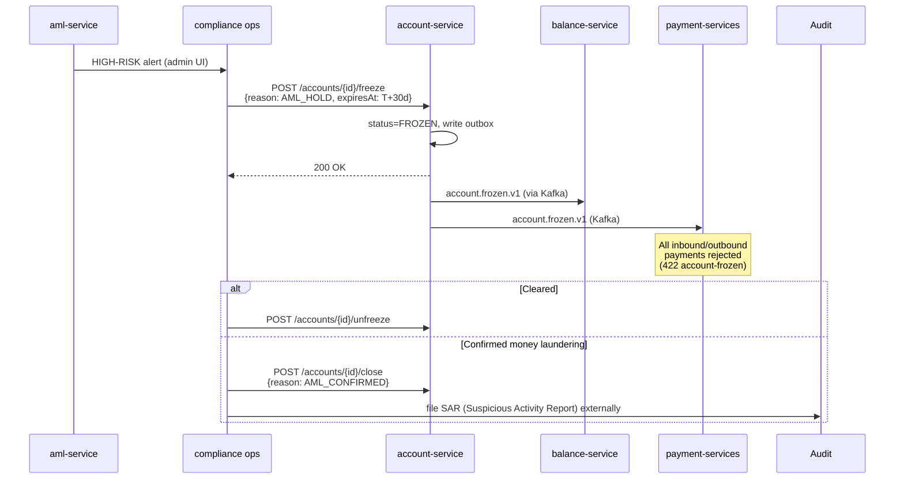

# Compliance

## Regulatorní rámec

| Regulace | Vztah ke službě | Implementace |
|---|---|---|
| **AMLD** (Anti-Money Laundering Directive) | Account = kandidát pro screening, freeze workflow pro suspicious activity | freeze/unfreeze API, event `account.frozen.v1` s `reason=AML_HOLD` |
| **GDPR** | IBAN je PII, owner_party_id pseudonymized | PiiMask v lozích, 10-letá AML-driven retence (overrides GDPR erasure) |
| **PSD2** | Account info accessible přes Open Banking | `consent-service` validuje TPP přístup; account-service serves account info |
| **DORA** | Operational resilience | health probes, audit eventy, SLO, runbooks. `BootstrapVerifier` byl uveden zde a neexistuje (#8426) — secrets místo něj drží injektáž přes ESO/OpenBao `secretKeyRef` (ADR-0007) |
| **NIS2** | Network & info security | mTLS přes Istio, network policies, audit log |
| **ČNB Vyhláška 163/2014** | Vedení účtů, IBAN per ISO 13616 | `libs.domain.account.Iban` validátor s mod-97 checksum |

## GDPR mapping

### Lawful basis (Art. 6)

- **Contract** (Art. 6(1)(b)) — primary: vedení účtu je nezbytné pro plnění smlouvy s klientem.
- **Legal obligation** (Art. 6(1)(c)) — secondary: AML, daňová evidence, FATCA/CRS reporting.

### Data subject rights

| Právo | Aplikace |
|---|---|
| Access (Art. 15) | `GET /api/v1/accounts?partyId=...` returns subject's data |
| Rectification (Art. 16) | typo opravy přes admin UI (audit logged) |
| Erasure (Art. 17) | **Nepoužitelné** — AMLD 6 přebíjí (10 let po uzavření) |
| Restriction (Art. 18) | `account.status=FROZEN` s reason=GDPR_RESTRICT |
| Portability (Art. 20) | bulk export přes `/api/v1/accounts/{id}/export` (CSV/JSON) |
| Object (Art. 21) | N/A (no marketing processing here) |

### Data flows out

- → **balance-service** (Kafka): `accountId`, `iban` (pseudonym pair) — same controller, intra-OpenBank.
- → **audit-service** (Kafka): full event payload incl. IBAN — same controller.
- → **kyc-service** (Kafka): `accountId`, `ownerPartyId` — kyc has its own KYC data, no IBAN.
- → **external** (PSD2 TPP přes consent-service): controlled by consent, scope `accounts:read`.

Žádná data NEopouštějí EU/EEA region (Czech Republic primary, Ireland DR).

### Retence (Art. 5(1)(e))

| Stav účtu | Retence po `closed_at` |
|---|---|
| ACTIVE | běží, žádná retence |
| CLOSED běžný účet | 10 let (AMLD 6 Art. 40) |
| CLOSED se suspicious activity flag | 10 let nebo do uzavření AML case + 5 let |

## DORA mapping (Reg. (EU) 2022/2554)

| Článek | Téma | Implementace |
|---|---|---|
| Art. 5 | ICT risk management | service je v central register operations |
| Art. 6 | ICT risk management framework | dependency = openbank-libs (centralized) |
| Art. 9 | Identification | `BuildInfo` (gitCommit, buildTime, version) v `/api/v1/info` |
| Art. 10 | Detection | metrics + alerting na error rate, latency |
| Art. 11 | Response & recovery | runbook v `05-operations.md`, RTO 15min, RPO 5min |
| Art. 16 | Incident management | events emitted to audit-service for evidence |
| Art. 17 | Reporting | major incidents reported přes audit pipeline |
| Art. 28 | Third-party risk | žádné third-party SaaS — vše self-hosted |

## PSD2 (Reg. (EU) 2015/2366) — Open Banking

PSD2 access NEJDE přímo na account-service. Flow:

```
TPP → consent-service (validate consent)
    → psd2-service (translate to internal)
    → account-service (read account info)
    → response back through chain
```

Account-service vidí standardní bearer token; **role `ROLE_SERVICE_PSD2`** authorizuje read-only přístup.

## AML — freeze workflow



## Audit trail

Každá mutace produkuje doménový event → `audit-service` perzistuje s tamper-evident chainem (předchozí event hash → next event payload). 10-letá retence.

Endpoint pro audit query: `audit-service /api/v1/audit/events?aggregateId=acc-...`.

## Bezpečnostní kontroly

- ✅ Input validation (Bean Validation, custom Iban checksum)
- ✅ Output encoding (Jackson, automatic)
- ✅ AuthN: Keycloak OIDC, RS256 JWT
- ✅ AuthZ: Quarkus `@RolesAllowed` + custom `AuthorizationService` per-account
- ✅ Rate limiting: `libs.web.RateLimitFilter` (100 req/min per token)
- ✅ Idempotency: required on mutations
- ✅ TLS: mTLS in-cluster (Istio), TLS termination at gateway
- ⬜ Secrets: **žádný `BootstrapVerifier` neexistuje** — na dev placeholder nespadne start ničemu. Vlastnost drží to, že `POSTGRES_PASSWORD` přichází v nasazeném manifestu přes `secretKeyRef` z ESO/OpenBao (ADR-0007) a placeholder v něm není. Konfigurace, ne boot-time kontrola (#8426)
- ✅ Audit: every state change → audit-service via event
- ⚠️ Tokenization (PCI-like for IBAN): not implemented yet, tracked as risk in regulatory audit
