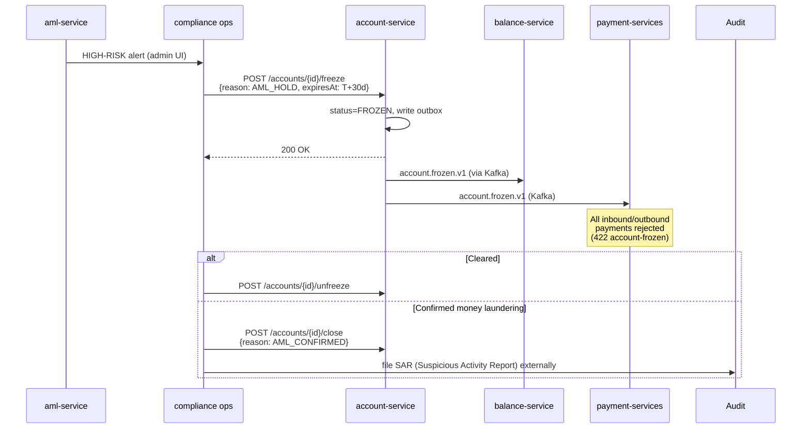

# Compliance

## Regulatory framework

| Regulation | Relation to this service | Implementation |
|---|---|---|
| **AMLD** (Anti-Money Laundering Directive) | Account = candidate for screening, freeze workflow for suspicious activity | freeze/unfreeze API, event `account.frozen.v1` with `reason=AML_HOLD` |
| **GDPR** | IBAN is PII, owner_party_id pseudonymized | PiiMask in logs, 10-year AML-driven retention (overrides GDPR erasure) |
| **PSD2** | Account info accessible via Open Banking | `consent-service` validates TPP access; account-service serves account info |
| **DORA** | Operational resilience | health probes, audit events, SLO, runbooks. `BootstrapVerifier` was listed here and does not exist (#8426) — secrets are held instead by ESO/OpenBao `secretKeyRef` injection (ADR-0007) |
| **NIS2** | Network & info security | mTLS via Istio, network policies, audit log |
| **CNB Decree 163/2014** | Account keeping, IBAN per ISO 13616 | `libs.domain.account.Iban` validator with mod-97 checksum |

## GDPR mapping

### Lawful basis (Art. 6)

- **Contract** (Art. 6(1)(b)) — primary: maintaining an account is necessary to perform the contract with the customer.
- **Legal obligation** (Art. 6(1)(c)) — secondary: AML, tax records, FATCA/CRS reporting.

### Data subject rights

| Right | Application |
|---|---|
| Access (Art. 15) | `GET /api/v1/accounts?partyId=...` returns the subject's data |
| Rectification (Art. 16) | typo corrections through the admin UI (audit logged) |
| Erasure (Art. 17) | **Not applicable** — AMLD 6 overrides (10 years after closure) |
| Restriction (Art. 18) | `account.status=FROZEN` with reason=GDPR_RESTRICT |
| Portability (Art. 20) | bulk export via `/api/v1/accounts/{id}/export` (CSV/JSON) |
| Object (Art. 21) | N/A (no marketing processing here) |

### Data flows out

- → **balance-service** (Kafka): `accountId`, `iban` (pseudonym pair) — same controller, intra-OpenBank.
- → **audit-service** (Kafka): full event payload incl. IBAN — same controller.
- → **kyc-service** (Kafka): `accountId`, `ownerPartyId` — KYC has its own KYC data, no IBAN.
- → **external** (PSD2 TPP via consent-service): controlled by consent, scope `accounts:read`.

No data leaves the EU/EEA region (Czech Republic primary, Ireland DR).

### Retention (Art. 5(1)(e))

| Account status | Retention after `closed_at` |
|---|---|
| ACTIVE | ongoing, no retention |
| CLOSED current account | 10 years (AMLD 6 Art. 40) |
| CLOSED with suspicious activity flag | 10 years or until AML case closure + 5 years |

## DORA mapping (Reg. (EU) 2022/2554)

| Article | Topic | Implementation |
|---|---|---|
| Art. 5 | ICT risk management | service is in the central register operations |
| Art. 6 | ICT risk management framework | dependency = openbank-libs (centralized) |
| Art. 9 | Identification | `BuildInfo` (gitCommit, buildTime, version) in `/api/v1/info` |
| Art. 10 | Detection | metrics + alerting on error rate, latency |
| Art. 11 | Response & recovery | runbook in `05-operations.md`, RTO 15 min, RPO 5 min |
| Art. 16 | Incident management | events emitted to audit-service for evidence |
| Art. 17 | Reporting | major incidents reported via audit pipeline |
| Art. 28 | Third-party risk | no third-party SaaS — all self-hosted |

## PSD2 (Reg. (EU) 2015/2366) — Open Banking

PSD2 access does NOT go directly to account-service. Flow:

```
TPP → consent-service (validate consent)
    → psd2-service (translate to internal)
    → account-service (read account info)
    → response back through chain
```

account-service sees a standard bearer token; **role `ROLE_SERVICE_PSD2`** authorises read-only access.

## AML — freeze workflow



## Audit trail

Every mutation produces a domain event → `audit-service` persists it with a tamper-evident chain (previous event hash → next event payload). 10-year retention.

Endpoint for audit query: `audit-service /api/v1/audit/events?aggregateId=acc-...`.

## Security controls

- ✅ Input validation (Bean Validation, custom Iban checksum)
- ✅ Output encoding (Jackson, automatic)
- ✅ AuthN: Keycloak OIDC, RS256 JWT
- ✅ AuthZ: Quarkus `@RolesAllowed` + custom `AuthorizationService` per-account
- ✅ Rate limiting: `libs.web.RateLimitFilter` (100 req/min per token)
- ✅ Idempotency: required on mutations
- ✅ TLS: mTLS in-cluster (Istio), TLS termination at gateway
- ⬜ Secrets: **no `BootstrapVerifier` exists** — nothing fails startup on a dev placeholder. The property is held by `POSTGRES_PASSWORD` arriving through `secretKeyRef` from ESO/OpenBao in the deployed manifest (ADR-0007), which carries no placeholder. Configuration, not a boot-time control (#8426)
- ✅ Audit: every state change → audit-service via event
- ⚠️ Tokenisation (PCI-like for IBAN): not implemented yet, tracked as a risk in the regulatory audit
