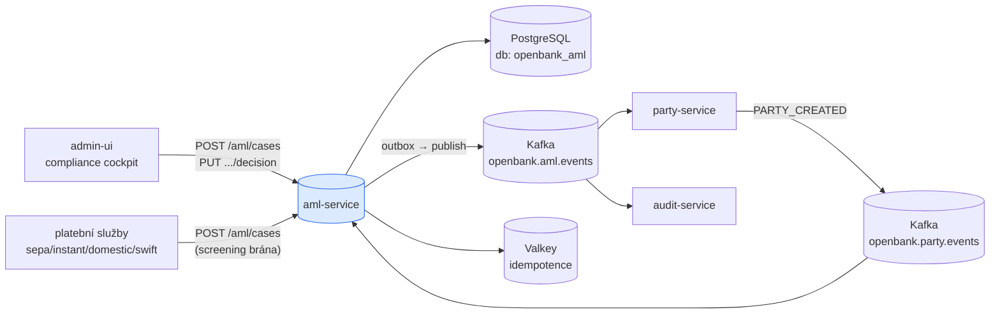
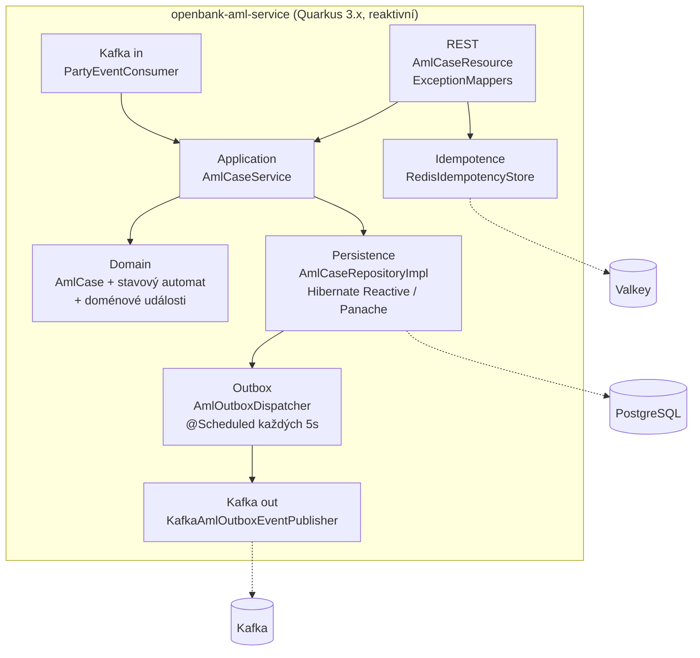
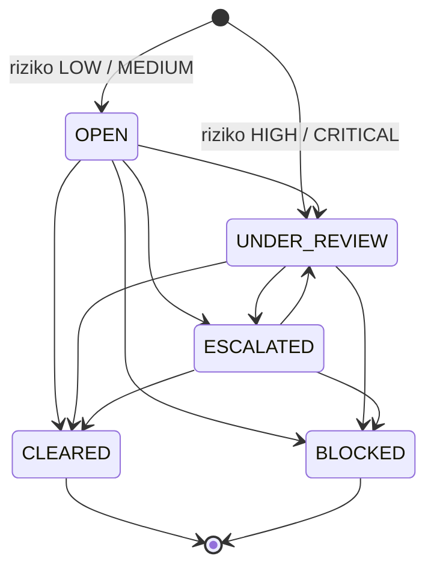
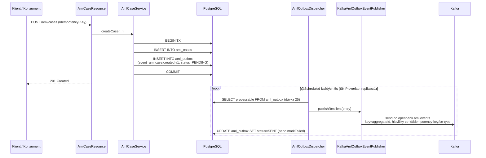

# Architektura

## C4 — Kontext systému



## C4 — Kontejner (vnitřní struktura)



## Hexagonální vrstvy

Struktura balíčků odráží **ports-and-adapters**:

```
com.openbank.aml/
├── domain/                    ◄── jádro — bez frameworkových závislostí
│   ├── model/                 AmlCase, AmlCaseStatus, ScreeningType, AmlRiskLevel
│   └── event/                 AmlCaseCreatedEvent, AmlCaseStatusChangedEvent
│
├── application/               ◄── orchestrace use-case
│   ├── port/in/               AmlCaseUseCase + commands/queries
│   ├── port/out/              AmlCaseRepository, AmlOutboxPort
│   └── usecase/               AmlCaseService
│
└── infrastructure/            ◄── adaptéry
    ├── rest/                  AmlCaseResource, DTO, ExceptionMappers
    ├── kafka/                 PartyEventConsumer (in), KafkaAmlOutboxEventPublisher (out)
    ├── outbox/                AmlOutboxDispatcher (scheduled)
    ├── persistence/           AmlCaseEntity, AmlOutboxEntity, mappery, repository impl
    ├── idempotency/           IdempotencyConfig (@Produces RedisIdempotencyStore)
    └── authz/                 AuthzProducer (OPA PDP, ADR-0034)
```

**Pravidlo závislostí:** `domain` ← `application` ← `infrastructure`. Doménový kód nikdy nevidí JPA, Kafku ani REST DTO. Stavový automat případu (`AmlCase.transitionTo` / `canTransitionTo`) žije celý v doménové vrstvě.

## Stavový automat případu



Invarianty vynucené v doméně: terminální stav (`CLEARED`/`BLOCKED`) nelze měnit; `decidedBy` je povinné při každém přechodu; `decisionReason` je povinné při přechodu na `BLOCKED`.

## Outbox tok (ADR-0050)



**Proč outbox:** transakční konzistence mezi zápisem do DB a publikací do Kafky. Dispatcher je **jediný writer** — `concurrentExecution = SKIP` brání překryvu v rámci JVM a Deployment je pinován na `replicas: 1`; položky se zpracovávají sekvenčně pro zachování pořadí v rámci agregátu. Selhání publikace jednoho řádku jsou izolována (recover → `markFailed`), takže jeden vadný řádek nikdy nezruší celou dávku; opakovaná selhání jsou omezena přechodem do DEAD (ADR-0050 N5). Publisher obaluje odeslání MicroProfile Fault Tolerance (`@Bulkhead`, `@CircuitBreaker`, `@Retry`, `@Timeout`).

## Tok příchozích událostí

`PartyEventConsumer` (`@Incoming("party-events-in")`) čte `openbank.party.events`, filtruje `eventType == PARTY_CREATED` a `partyType == INDIVIDUAL` a zakládá `CUSTOMER_ONBOARDING` případ s idempotenčním klíčem `"<partyId>:CUSTOMER_ONBOARDING"` (bezpečné při redelivery). **Pouze v sandboxu** (`openbank.aml.auto-clear=true`, výchozí `false`) případ následně auto-clearuje, aby klient prošel AML klíčem aktivační brány bez analytika. Produkce zachovává decision endpoint ve čtyřech očích jako jedinou cestu do terminálního stavu. Konzument je odolný vůči poison-pill: selhání jsou logována a ACK.

## Klíčové porty

| Port | Směr | Adaptér |
|---|---|---|
| `AmlCaseUseCase` | in | `AmlCaseService`, volá `AmlCaseResource` a `PartyEventConsumer` |
| `AmlCaseRepository` | out | `AmlCaseRepositoryImpl` (Hibernate Reactive / Panache) |
| `AmlOutboxPort` | out | `AmlOutboxRepositoryImpl` + `AmlOutboxDispatcher` |
| `IdempotencyStore` | out | `RedisIdempotencyStore` (openbank-libs) |
| `PolicyDecisionPoint` | out | `OpaSidecarPolicyDecisionPoint` (openbank-libs, přes `AuthzProducer`) |

## Komponenty z `openbank-libs`

| Modul | Využití zde |
|---|---|
| `libs.idempotency.IdempotencyStore` + `RedisIdempotencyStore` | edge idempotence na `POST` |
| `libs.authz.Authorize` + `PolicyDecisionPoint` | `@Authorize` na decision endpointu, OPA PDP |
| `libs.api.error.ApiError` / `ErrorCode` | jednotný model chyb v `ExceptionMappers` |
| `libs.web.ServiceInfoResource` | `/api/v1/info` (build metadata) |
| `libs.docs.DocsResource` | **tato dokumentace** (`/q/openbank/docs`) |

## Principy

1. **Hranice agregátu = AmlCase** — přechody případu jsou atomické; agregát a jeho doménová událost se commitují společně přes outbox.
2. **Doménové události na prvním místě** — každá změna stavu emituje verzovanou doménovou událost (`...v1`).
3. **Žádná vzdálená volání v TX** — synchronně v rámci request/response, asynchronně přes outbox + Kafka.
4. **Idempotence na hraně** — `Idempotency-Key` na `POST`, plus unikátní `idempotency_key` sloupec na případu.
5. **Čtyři oči pro terminální rozhodnutí** — sandbox auto-clear je za feature flagem vypnutý; produkce vyžaduje explicitní rozhodnutí analytika.
