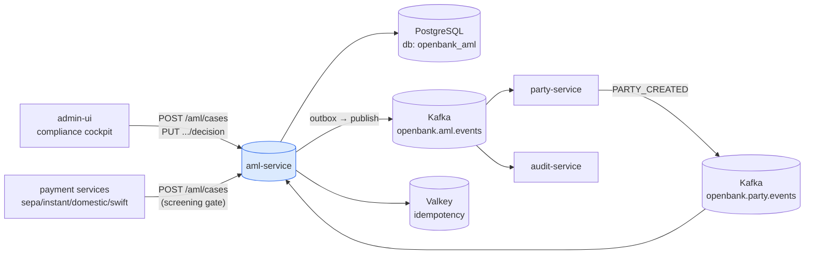
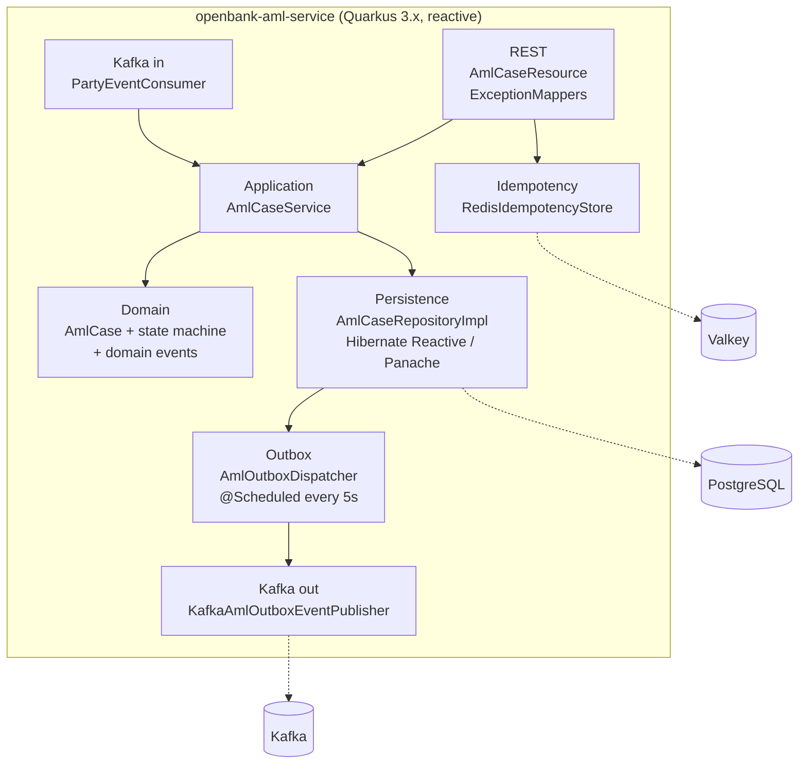
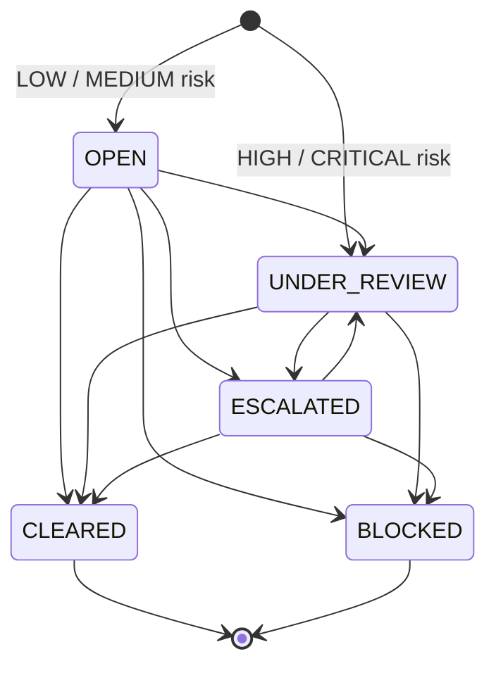
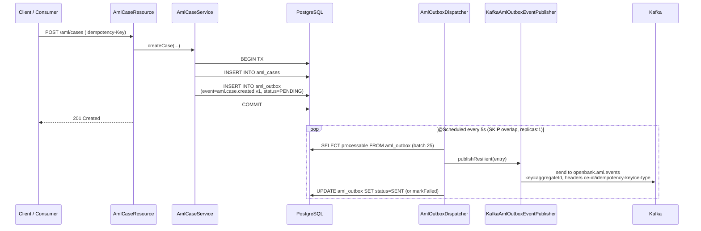

# Architecture

## C4 — System Context



## C4 — Container (internal structure)



## Hexagonal layers

The package structure reflects **ports-and-adapters**:

```
com.openbank.aml/
├── domain/                    ◄── core — no framework dependencies
│   ├── model/                 AmlCase, AmlCaseStatus, ScreeningType, AmlRiskLevel
│   └── event/                 AmlCaseCreatedEvent, AmlCaseStatusChangedEvent
│
├── application/               ◄── use-case orchestration
│   ├── port/in/               AmlCaseUseCase + commands/queries
│   ├── port/out/              AmlCaseRepository, AmlOutboxPort
│   └── usecase/               AmlCaseService
│
└── infrastructure/            ◄── adapters
    ├── rest/                  AmlCaseResource, DTOs, ExceptionMappers
    ├── kafka/                 PartyEventConsumer (in), KafkaAmlOutboxEventPublisher (out)
    ├── outbox/                AmlOutboxDispatcher (scheduled)
    ├── persistence/           AmlCaseEntity, AmlOutboxEntity, mappers, repository impls
    ├── idempotency/           IdempotencyConfig (@Produces RedisIdempotencyStore)
    └── authz/                 AuthzProducer (OPA PDP, ADR-0034)
```

**Dependency rule:** `domain` ← `application` ← `infrastructure`. Domain code never sees JPA, Kafka, or REST DTOs. The case state machine (`AmlCase.transitionTo` / `canTransitionTo`) lives entirely in the domain layer.

## Case state machine



Invariants enforced in the domain: a terminal state (`CLEARED`/`BLOCKED`) cannot transition; `decidedBy` is mandatory on every transition; `decisionReason` is mandatory when transitioning to `BLOCKED`.

## Outbox flow (ADR-0050)



**Why outbox:** transactional consistency between the DB write and the Kafka publish. The dispatcher is the **single writer** — `concurrentExecution = SKIP` prevents in-JVM overlap and the Deployment is pinned to `replicas: 1`; entries are processed sequentially to preserve per-aggregate ordering. Per-row publish failures are isolated (recover → `markFailed`) so one bad row never aborts the batch; repeated failures are bounded by a DEAD transition (ADR-0050 N5). The publisher wraps the send in MicroProfile Fault Tolerance (`@Bulkhead`, `@CircuitBreaker`, `@Retry`, `@Timeout`).

## Inbound event flow

`PartyEventConsumer` (`@Incoming("party-events-in")`) reads `openbank.party.events`, filters `eventType == PARTY_CREATED` and `partyType == INDIVIDUAL`, and opens a `CUSTOMER_ONBOARDING` case with idempotency key `"<partyId>:CUSTOMER_ONBOARDING"` (redelivery-safe). In the **sandbox only** (`openbank.aml.auto-clear=true`, default `false`) it then auto-clears the case so the party clears the AML key of the activation gate without an analyst. Production keeps the four-eyes decision endpoint as the only path to a terminal state. The consumer is poison-pill safe: failures are logged and acked.

## Key ports

| Port | Direction | Adapter |
|---|---|---|
| `AmlCaseUseCase` | in | `AmlCaseService`, called by `AmlCaseResource` and `PartyEventConsumer` |
| `AmlCaseRepository` | out | `AmlCaseRepositoryImpl` (Hibernate Reactive / Panache) |
| `AmlOutboxPort` | out | `AmlOutboxRepositoryImpl` + `AmlOutboxDispatcher` |
| `IdempotencyStore` | out | `RedisIdempotencyStore` (openbank-libs) |
| `PolicyDecisionPoint` | out | `OpaSidecarPolicyDecisionPoint` (openbank-libs, via `AuthzProducer`) |

## Components from `openbank-libs`

| Module | Use here |
|---|---|
| `libs.idempotency.IdempotencyStore` + `RedisIdempotencyStore` | edge idempotency on `POST` |
| `libs.authz.Authorize` + `PolicyDecisionPoint` | `@Authorize` on the decision endpoint, OPA PDP |
| `libs.api.error.ApiError` / `ErrorCode` | unified error model in `ExceptionMappers` |
| `libs.web.ServiceInfoResource` | `/api/v1/info` (build metadata) |
| `libs.docs.DocsResource` | **this documentation** (`/q/openbank/docs`) |

## Principles

1. **Aggregate boundary = AmlCase** — case transitions are atomic; the aggregate and its domain event commit together via the outbox.
2. **Domain events first** — every state change emits a versioned domain event (`...v1`).
3. **No remote calls in TX** — synchronous within request/response, async via outbox + Kafka.
4. **Idempotence at edge** — `Idempotency-Key` on `POST`, plus a unique per-case `idempotency_key` column.
5. **Four-eyes for terminal decisions** — sandbox auto-clear is feature-flagged off; production requires an explicit analyst decision.
