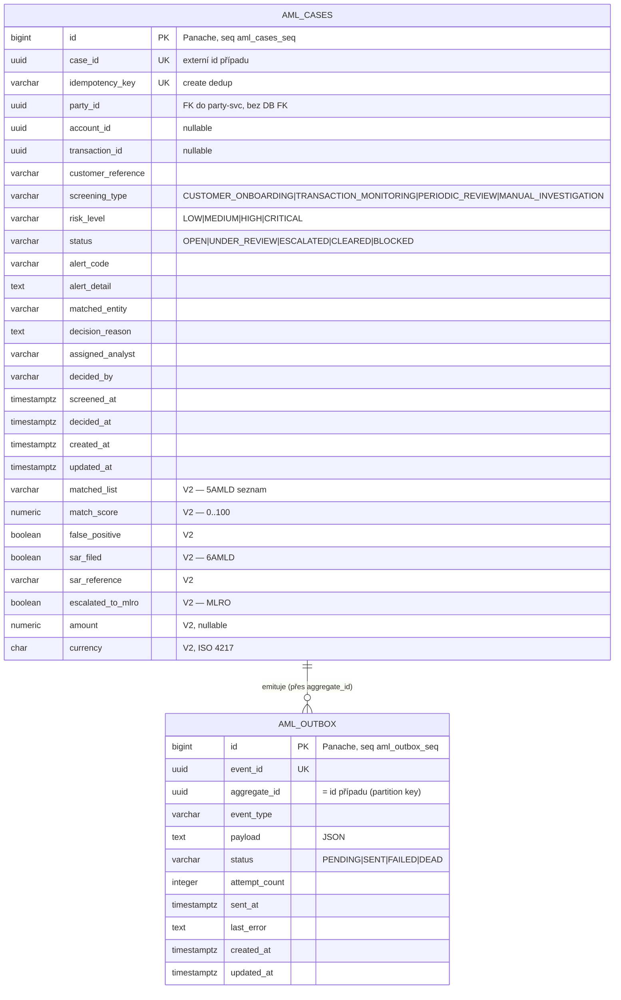

# Data

## Schéma

Služba vlastní **vyhrazenou PostgreSQL databázi** `openbank_aml` (reaktivní PG klient + JDBC pro Flyway). Tabulky migrace zakládají ve výchozím schématu `public`; **deklarovaný logický název schématu** v `governance.yaml` je `aml_schema` (datová doména `compliance`, klasifikace `restricted`). `quarkus.hibernate-orm.database.generation=none` — Flyway je jedinou autoritou schématu.

## Migrace

Flyway, neměnné historické skripty, forward-only (`migrate-at-start=true`):

| Skript | Co dělá | Poznámka k rollbacku |
|---|---|---|
| `V1__create_aml_cases.sql` | Tabulka `aml_cases` + indexy na party_id, status, screening_type, created_at | `DROP TABLE aml_cases;` |
| `V2__compliance_fields.sql` | Compliance sloupce FATF/5AMLD/6AMLD: matched_list, match_score, false_positive(+reason/by/at), sar_filed(+reference/at), reviewed_by/at, escalated_to_mlro(+at), transaction_id, amount, currency, notes; částečné indexy pro SAR / false-positive / MLRO / transaction | drop přidaných sloupců + jejich částečných indexů |
| `V3__create_aml_outbox.sql` | Tabulka `aml_outbox` (transakční outbox, ADR-0050) + indexy na (status, created_at) a aggregate_id | `DROP TABLE aml_outbox;` |
| `V4__hibernate_sequences.sql` | Sekvence `aml_cases_seq`, `aml_outbox_seq` (INCREMENT BY 50) — alokace id Panache při `generation:none` | `DROP SEQUENCE aml_cases_seq, aml_outbox_seq;` |
| `V5__amount_check_constraints.sql` | CHECK `amount IS NULL OR amount > 0`; CHECK `match_score` v 0..100 | drop dvou constraintů |

> Migrace sekvencí `V4` opravuje známý defekt alokace id Hibernate-Reactive + Panache (BIGSERIAL vytvoří jen `<table>_id_seq`, ale Panache očekává `<table>_seq`). Proti regresi hlídá `HibernateSequenceGuardTest`.

## Indexy

- `aml_cases(case_id)` UNIQUE, `aml_cases(idempotency_key)` UNIQUE — externí id + create dedup
- `aml_cases(party_id)`, `aml_cases(status)`, `aml_cases(screening_type)`, `aml_cases(created_at DESC)` — list/filter dotazy
- `aml_cases(sar_filed, created_at DESC) WHERE sar_filed` — reporting SAR dle 6AMLD
- `aml_cases(false_positive) WHERE NOT false_positive`, `aml_cases(escalated_to_mlro) WHERE escalated_to_mlro`, `aml_cases(transaction_id) WHERE transaction_id IS NOT NULL`
- `aml_outbox(status, created_at ASC)` — poll dispatcheru; `aml_outbox(aggregate_id)`

## Retence

| Tabulka | Retence | Důvod |
|---|---|---|
| `aml_cases` | 10 let (deklarovaný `retentionPolicy`) | AMLD 6 čl. 40 record-keeping; přebíjí GDPR výmaz |
| `aml_outbox` | do SENT + krátké okno | troubleshooting / replay; není dlouhodobé úložiště |

`evidenceExported: true` v `governance.yaml` — události životního cyklu případu jsou exportovány jako audit evidence přes Kafka → `audit-service`.

## PII pole (GDPR)

| Pole | Klasifikace | Poznámka |
|---|---|---|
| `party_id` | pseudonymizované id | reference na party-service; jméno se zde neukládá |
| `customer_reference` | pseudonymizovaná byznys reference | sama o sobě není přímým identifikátorem |
| `matched_entity` / `matched_entity_name` / `matched_list` | blízké zvláštní kategorii (AML shoda) | restricted; viditelné jen compliance rolím |
| `assigned_analyst` / `decided_by` / `false_positive_by` / `reviewed_by` | identifikátory pracovníků | odpovědnost operátora, audit |
| `account_id` / `transaction_id` | pseudonymizovaná id | nullable reference na jiné služby |

Záznam případu je **restricted** (`dataClassification: restricted`). GDPR **právo na výmaz** se NEUPLATŇUJE — record-keeping dle AMLD jej přebíjí po dobu 10 let (viz [06 — Compliance](./06-compliance.md)).

## Datová linie (governance.yaml)

- **Upstream (api):** sepa-payment, sepa-instant, domestic-payment, swift-service — platební rozhraní, která zakládají screeningové případy.
- **Upstream (topic):** kyc-service (triggers), sanctions-service (updates).
- **Vlastněné schéma:** `aml_schema`. **Závislá schémata:** sepa_schema, domestic_schema, swift_schema, sepa_instant_schema.
- `dataLineageRole: both` — služba je zároveň konzumentem i producentem compliance dat.
