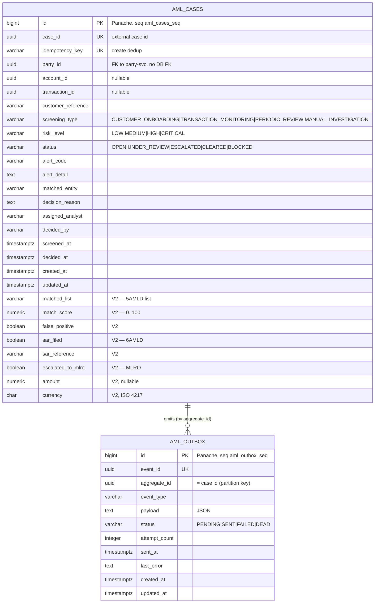

# Data

## Schema

The service owns a **dedicated PostgreSQL database** `openbank_aml` (reactive PG client + JDBC for Flyway). Tables are created in the default `public` schema by the migrations; the **declared logical schema name** in `governance.yaml` is `aml_schema` (data domain `compliance`, classification `restricted`). `quarkus.hibernate-orm.database.generation=none` — Flyway is the sole schema authority.

## Migrations

Flyway, immutable historical scripts, forward-only (`migrate-at-start=true`):

| Script | What it does | Rollback note |
|---|---|---|
| `V1__create_aml_cases.sql` | Table `aml_cases` + indexes on party_id, status, screening_type, created_at | `DROP TABLE aml_cases;` |
| `V2__compliance_fields.sql` | FATF/5AMLD/6AMLD compliance columns: matched_list, match_score, false_positive(+reason/by/at), sar_filed(+reference/at), reviewed_by/at, escalated_to_mlro(+at), transaction_id, amount, currency, notes; partial indexes for SAR / false-positive / MLRO / transaction | drop added columns + their partial indexes |
| `V3__create_aml_outbox.sql` | Table `aml_outbox` (transactional outbox, ADR-0050) + indexes on (status, created_at) and aggregate_id | `DROP TABLE aml_outbox;` |
| `V4__hibernate_sequences.sql` | Sequences `aml_cases_seq`, `aml_outbox_seq` (INCREMENT BY 50) — Panache id allocation under `generation:none` | `DROP SEQUENCE aml_cases_seq, aml_outbox_seq;` |
| `V5__amount_check_constraints.sql` | CHECK `amount IS NULL OR amount > 0`; CHECK `match_score` in 0..100 | drop the two constraints |

> The `V4` sequence migration fixes the known Hibernate-Reactive + Panache id-allocation defect (BIGSERIAL only creates `<table>_id_seq`, but Panache expects `<table>_seq`). A `HibernateSequenceGuardTest` guards against regressions.

## Indexes

- `aml_cases(case_id)` UNIQUE, `aml_cases(idempotency_key)` UNIQUE — external id + create dedup
- `aml_cases(party_id)`, `aml_cases(status)`, `aml_cases(screening_type)`, `aml_cases(created_at DESC)` — list/filter queries
- `aml_cases(sar_filed, created_at DESC) WHERE sar_filed` — 6AMLD SAR reporting
- `aml_cases(false_positive) WHERE NOT false_positive`, `aml_cases(escalated_to_mlro) WHERE escalated_to_mlro`, `aml_cases(transaction_id) WHERE transaction_id IS NOT NULL`
- `aml_outbox(status, created_at ASC)` — dispatcher poll; `aml_outbox(aggregate_id)`

## Retention

| Table | Retention | Reason |
|---|---|---|
| `aml_cases` | 10 years (declared `retentionPolicy`) | AMLD 6 Art. 40 record-keeping; overrides GDPR erasure |
| `aml_outbox` | until SENT + short window | troubleshooting / replay; not a long-term store |

`evidenceExported: true` in `governance.yaml` — case lifecycle events are exported as audit evidence via Kafka → `audit-service`.

## PII fields (GDPR)

| Field | Classification | Note |
|---|---|---|
| `party_id` | pseudonymized id | references party-service; no name stored here |
| `customer_reference` | pseudonymized business reference | not a direct identifier on its own |
| `matched_entity` / `matched_entity_name` / `matched_list` | special-category-adjacent (AML match) | restricted; visible to compliance roles only |
| `assigned_analyst` / `decided_by` / `false_positive_by` / `reviewed_by` | staff identifiers | operator accountability, audit |
| `account_id` / `transaction_id` | pseudonymized ids | nullable references to other services |

The case record is **restricted** (`dataClassification: restricted`). GDPR **right to erasure** does NOT apply — AMLD record-keeping overrides it for the 10-year period (see [06 — Compliance](./06-compliance.md)).

## Data lineage (governance.yaml)

- **Upstream (api):** sepa-payment, sepa-instant, domestic-payment, swift-service — payment surfaces that submit screening cases.
- **Upstream (topic):** kyc-service (triggers), sanctions-service (updates).
- **Owned schema:** `aml_schema`. **Dependent schemas:** sepa_schema, domestic_schema, swift_schema, sepa_instant_schema.
- `dataLineageRole: both` — the service is both a consumer and a producer of compliance data.
