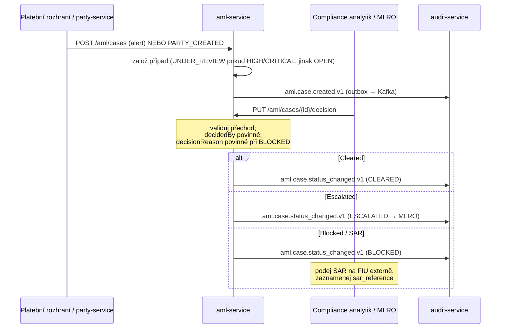

# Compliance

`aml-service` je **compliance-screeningová** služba (FinOps skupina `compliance-screening`, spolu se sanctions-service a kyc-service). **Není** money-path službou dle `rules.yaml: money_path_services` — proto se dodává s 1 schválením a bez povinného threat modelu ADR-0030. Její data jsou klasifikována `restricted` s 10letou retencí.

## Regulatorní rámec

| Regulace | Vztah k této službě | Implementace |
|---|---|---|
| **AMLD (4/5/6) + FATF + EBA AML Guidelines** | Hlavní mandát — správa AML případů, screeningová rozhodnutí, sledování SAR a MLRO | stavový automat případu, události `aml.case.*`, sloupce V2: `matched_list`, `match_score`, `false_positive`, `sar_filed`/`sar_reference`, `escalated_to_mlro` |
| **6AMLD čl. 6** | Suspicious Activity Report na FIU | `sar_filed` / `sar_reference` / `sar_filed_at`; částečný index `idx_aml_sar` (samotné podání je mimo systém) |
| **GDPR** | party_id, customer_reference, data nalezené entity jsou osobní/restricted | pseudonymizovaná id, restricted klasifikace, 10letá AML retence přebíjí výmaz |
| **PSD2** | Nepřímo — platební rozhraní screenují transakce přes tuto službu | volající (sepa/instant/domestic/swift) zakládají případy; AML nečelí TPP přímo |
| **DORA (Reg. (EU) 2022/2554)** | Provozní odolnost | health probes, fault-tolerance (circuit breaker/retry/timeout/bulkhead), audit trail outboxu, SLO, runbooky |
| **NIS2** | Síťová a informační bezpečnost | mTLS in-cluster, bezpečnostní response hlavičky, OPA autorizace, audit log |

## GDPR mapování

### Právní základ (čl. 6)

- **Právní povinnost** (čl. 6(1)(c)) — primární: AML/CFT screening a record-keeping jsou zákonné povinnosti dle AMLD.
- **Oprávněný zájem** (čl. 6(1)(f)) — sekundární: prevence podvodů a finanční kriminality pro interní monitoring.

Data adverse-media / PEP / sankčních shod mohou zasahovat do zvláštních kategorií; přístup je omezen na compliance role.

### Práva subjektu údajů

| Právo | Aplikace |
|---|---|
| Přístup (čl. 15) | `GET /api/v1/aml/cases?partyId=...` vrátí případy subjektu (zprostředkováno compliance) |
| Oprava (čl. 16) | příznak false-positive (`false_positive` + reason/by/at) opraví chybnou shodu |
| Výmaz (čl. 17) | **Neuplatňuje se** — record-keeping dle AMLD přebíjí (10 let) |
| Omezení (čl. 18) | terminální stavy `BLOCKED`/`CLEARED` zmrazí další automatické přechody |
| Přenositelnost (čl. 20) | N/A — AML záznamy nejsou data plnění smlouvy podléhající přenositelnosti |
| Námitka (čl. 21) | N/A — zpracování je právní povinnost, ne souhlas/marketing |

### Toky dat ven

- → **audit-service** (Kafka `openbank.aml.events`): kompletní payload události případu — stejný správce, intra-OpenBank, audit evidence (`evidenceExported: true`).
- → **party-service** (Kafka `openbank.aml.events`): `aml.case.status_changed.v1` napájí AML klíč aktivační brány klienta.
- ← **party-service** (Kafka `openbank.party.events`): `PARTY_CREATED` zakládá onboarding případy.
- ← **platební rozhraní** (REST): zakládají screeningové případy.

Žádná data neopouštějí region EU/EHP (primárně Česká republika).

### Retence (čl. 5(1)(e))

| Data | Retence | Důvod |
|---|---|---|
| `aml_cases` (všechny stavy) | 10 let | AMLD 6 čl. 40 record-keeping |
| případy s příznakem SAR | 10 let (nebo déle dle pokynu FIU) | 6AMLD reportingová evidence |
| `aml_outbox` | do doručení + krátké okno | provozní, ne úložiště záznamů |

## DORA mapování (Reg. (EU) 2022/2554)

| Článek | Téma | Implementace |
|---|---|---|
| čl. 5 | Řízení ICT rizik | služba v centrálním registru / governance.yaml |
| čl. 6 | Rámec ICT rizik | závislost = openbank-libs (centralizovaný plumbing) |
| čl. 9 | Identifikace | `BuildInfo` (gitCommit, buildTime, version) v `/api/v1/info` |
| čl. 10 | Detekce | metriky Micrometer/Prometheus, alerting na error-rate a outbox-lag |
| čl. 11 | Reakce a obnova | runbooky v [05-operations](./05-operations.md); fault-tolerance politiky |
| čl. 16 | Řízení incidentů | události případu + outboxu emitované do audit-service jako evidence |
| čl. 28 | Riziko třetích stran | žádný third-party SaaS — vše self-hosted |

## Životní cyklus AML případu (čtyři oči)

V **produkci** je decision endpoint jedinou cestou do terminálního `CLEARED`/`BLOCKED`. **Sandbox** flag `openbank.aml.auto-clear` (výchozí `false`) jej pro neprodukční onboarding toky přeskakuje a rozhodnutí připisuje sentinelu `decidedBy = SANDBOX_SYSTEM` — tento řetězec mimo sandbox je compliance incident (ADR-0268 §3).

> ⚠️ **Dnes to nejsou čtyři oči.** Tento odstavec dříve tvrdil „odpovědnost ve čtyřech očích přes `decidedBy`/`assignedAnalyst“. Neplatí to: `decidedBy` přichází v **těle requestu**, ne z autentizovaného security kontextu, a kontroluje se jen na neprázdnost — jeden operátor tedy může případ uzavřít a atribuci si sám vyplnit. Neexistuje ani oddělení maker-checker (`OPEN → CLEARED` je povolený přechod), `openbank-aml-service` není v `rules.yaml: money_path_services`, takže OPA nikdy neodvodí scope `aml` pro `four_eyes_required`, a `AUTHZ_ENFORCE` je zde `false`, takže `@Authorize` je pouze poradní. ADR-0268 §4 to zaznamenává a §5 vyjmenovává, co je třeba doplnit před jiným než sandbox prostředím. Srovnej ADR-0116 §3, která pro KYC dvojče vyžaduje identitu revizora ze security kontextu.

## Audit trail

Každé založení a přechod případu emituje verzovanou doménovou událost → `audit-service` ji perzistuje jako compliance evidenci. Outbox garantuje at-least-once doručení s pořadím v rámci případu (partition key = aggregate id) a dedup na straně konzumenta (hlavičky `ce-id`/`idempotency-key`).

## Bezpečnostní kontroly

- ✅ Validace vstupu (enumy DTO, povinný `Idempotency-Key`, doménové invarianty)
- ✅ AuthN: Keycloak OIDC, Bearer JWT
- ✅ AuthZ: `@RolesAllowed` (`ROLE_OPERATOR`/`ROLE_ADMIN`/`ROLE_COMPLIANCE`) + `@Authorize` OPA politika na decision endpointu (ADR-0034)
- ✅ Idempotence: povinná při create (Redis + unikátní DB sloupec)
- ✅ Bezpečnostní response hlavičky (CSP, HSTS, X-Frame-Options DENY, nosniff, Referrer-Policy, Permissions-Policy)
- ✅ Rate limiting + circuit breaker / retry / timeout / bulkhead
- ✅ Secrets: dev placeholdery (`CHANGE_ME_LOCAL_DEV_ONLY`) musí být v produkci přepsány přes Vault
- ✅ Audit: každá změna stavu → audit-service přes outbox událost
- ⚠️ OPA autorizace je ve výchozím stavu **advisory** (`AUTHZ_ENFORCE=false`) — před spolehnutím na policy zamítnutí přepni na enforce
- ⚠️ `openapi.yaml` je nesynchronní s implementovaným kontraktem — smířit před publikací specifikace jako autoritativní (viz [03-api](./03-api.md))
