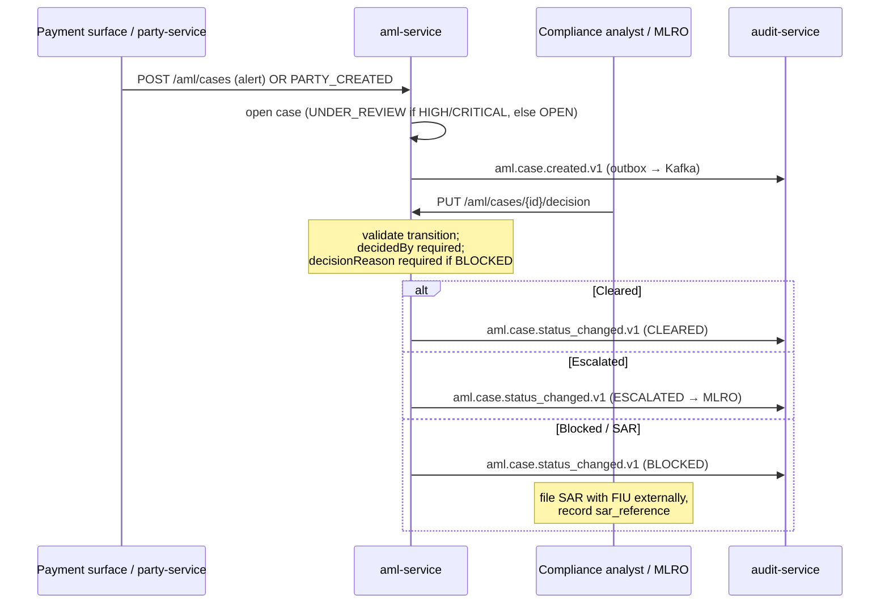

# Compliance

`aml-service` is a **compliance-screening** service (FinOps group `compliance-screening`, with sanctions-service and kyc-service). It is **not** a money-path service per `rules.yaml: money_path_services` — so it ships with 1 approval and no mandatory ADR-0030 threat model. Its data is classified `restricted` with a 10-year retention.

## Regulatory framework

| Regulation | Relation to this service | Implementation |
|---|---|---|
| **AMLD (4/5/6) + FATF + EBA AML Guidelines** | Core mandate — AML case management, screening decisions, SAR & MLRO tracking | case state machine, `aml.case.*` events, V2 columns: `matched_list`, `match_score`, `false_positive`, `sar_filed`/`sar_reference`, `escalated_to_mlro` |
| **6AMLD Art. 6** | Suspicious Activity Report to the FIU | `sar_filed` / `sar_reference` / `sar_filed_at`; partial index `idx_aml_sar` (filing itself is out-of-band) |
| **GDPR** | party_id, customer_reference, matched-entity data are personal/restricted | pseudonymized ids, restricted classification, 10-year AML retention overrides erasure |
| **PSD2** | Indirect — payment surfaces screen transactions through this service | callers (sepa/instant/domestic/swift) open cases; AML does not face the TPP directly |
| **DORA (Reg. (EU) 2022/2554)** | Operational resilience | health probes, fault-tolerance (circuit breaker/retry/timeout/bulkhead), outbox audit trail, SLO, runbooks |
| **NIS2** | Network & info security | mTLS in-cluster, security response headers, OPA authz, audit log |

## GDPR mapping

### Lawful basis (Art. 6)

- **Legal obligation** (Art. 6(1)(c)) — primary: AML/CFT screening and record-keeping are statutory obligations under AMLD.
- **Legitimate interest** (Art. 6(1)(f)) — secondary: fraud and financial-crime prevention for in-house monitoring.

Adverse-media / PEP / sanctions match data may touch special categories; access is restricted to compliance roles.

### Data subject rights

| Right | Application |
|---|---|
| Access (Art. 15) | `GET /api/v1/aml/cases?partyId=...` returns the subject's cases (compliance-mediated) |
| Rectification (Art. 16) | false-positive flagging (`false_positive` + reason/by/at) corrects an erroneous match |
| Erasure (Art. 17) | **Not applicable** — AMLD record-keeping overrides (10 years) |
| Restriction (Art. 18) | terminal `BLOCKED`/`CLEARED` states freeze further automated transitions |
| Portability (Art. 20) | N/A — AML records are not contract-performance data subject to portability |
| Object (Art. 21) | N/A — processing is a legal obligation, not consent/marketing |

### Data flows out

- → **audit-service** (Kafka `openbank.aml.events`): full case event payload — same controller, intra-OpenBank, audit evidence (`evidenceExported: true`).
- → **party-service** (Kafka `openbank.aml.events`): `aml.case.status_changed.v1` feeds the AML key of the party activation gate.
- ← **party-service** (Kafka `openbank.party.events`): `PARTY_CREATED` opens onboarding cases.
- ← **payment surfaces** (REST): submit screening cases.

No data leaves the EU/EEA region (Czech Republic primary).

### Retention (Art. 5(1)(e))

| Data | Retention | Reason |
|---|---|---|
| `aml_cases` (all states) | 10 years | AMLD 6 Art. 40 record-keeping |
| SAR-flagged cases | 10 years (or longer per FIU instruction) | 6AMLD reporting evidence |
| `aml_outbox` | until delivered + short window | operational, not a record store |

## DORA mapping (Reg. (EU) 2022/2554)

| Article | Topic | Implementation |
|---|---|---|
| Art. 5 | ICT risk management | service in the central register / governance.yaml |
| Art. 6 | ICT risk framework | dependency = openbank-libs (centralized plumbing) |
| Art. 9 | Identification | `BuildInfo` (gitCommit, buildTime, version) in `/api/v1/info` |
| Art. 10 | Detection | Micrometer/Prometheus metrics, error-rate & outbox-lag alerting |
| Art. 11 | Response & recovery | runbooks in [05-operations](./05-operations.md); fault-tolerance policies |
| Art. 16 | Incident management | case + outbox events emitted to audit-service for evidence |
| Art. 28 | Third-party risk | no third-party SaaS — all self-hosted |

## AML case lifecycle (four-eyes)

In **production** the decision endpoint is the only path to a terminal `CLEARED`/`BLOCKED`. The **sandbox** `openbank.aml.auto-clear` flag (default `false`) skips it for non-production onboarding flows, attributing the decision to the sentinel `decidedBy = SANDBOX_SYSTEM` — that string outside the sandbox is a compliance incident (ADR-0268 §3).

> ⚠️ **Not four-eyes today.** This paragraph used to claim "four-eyes accountability via `decidedBy`/`assignedAnalyst`". It does not hold: `decidedBy` arrives in the **request body**, not from the authenticated security context, and is only checked for non-blankness — so one operator can clear a case and self-declare any attribution. There is also no maker-checker separation (`OPEN → CLEARED` is a legal transition), `openbank-aml-service` is not in `rules.yaml: money_path_services` so OPA's `four_eyes_required` can never derive an `aml` scope, and `AUTHZ_ENFORCE` is `false` here so `@Authorize` is advisory. ADR-0268 §4 records this and §5 lists what is owed before a non-sandbox environment. Contrast ADR-0116 §3, which requires the reviewer identity to come from the security context for the KYC twin.

## Audit trail

Every case creation and transition emits a versioned domain event → `audit-service` persists it as compliance evidence. The outbox guarantees at-least-once delivery with per-case ordering (partition key = aggregate id) and consumer-side dedup (`ce-id`/`idempotency-key` headers).

## Security controls

- ✅ Input validation (DTO enums, mandatory `Idempotency-Key`, domain invariants)
- ✅ AuthN: Keycloak OIDC, Bearer JWT
- ✅ AuthZ: `@RolesAllowed` (`ROLE_OPERATOR`/`ROLE_ADMIN`/`ROLE_COMPLIANCE`) + `@Authorize` OPA policy on the decision endpoint (ADR-0034)
- ✅ Idempotency: mandatory on create (Redis + unique DB column)
- ✅ Security response headers (CSP, HSTS, X-Frame-Options DENY, nosniff, Referrer-Policy, Permissions-Policy)
- ✅ Rate limiting + circuit breaker / retry / timeout / bulkhead
- ✅ Secrets: dev placeholders (`CHANGE_ME_LOCAL_DEV_ONLY`) must be overridden via Vault in prod
- ✅ Audit: every state change → audit-service via outbox event
- ⚠️ OPA authz is **advisory** by default (`AUTHZ_ENFORCE=false`) — flip to enforce before relying on policy denials
- ⚠️ `openapi.yaml` is out of sync with the implemented contract — reconcile before publishing the spec as authoritative (see [03-api](./03-api.md))
