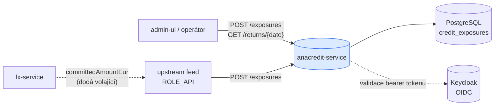
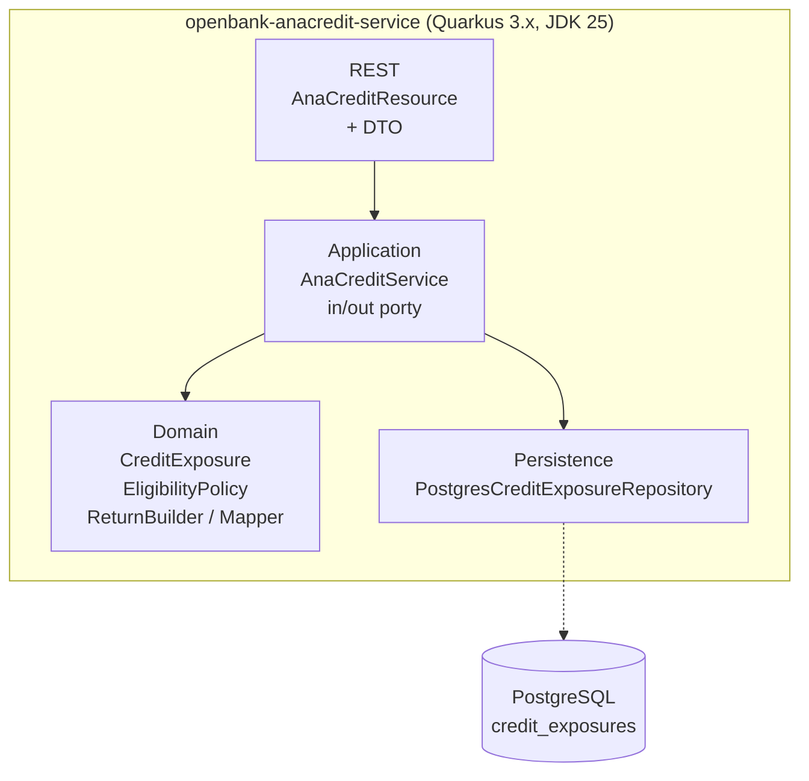
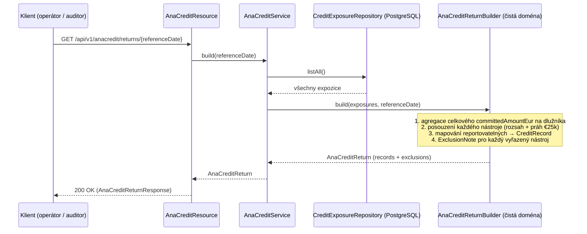

# Architektura

## C4 — Kontext systému



Neexistuje **žádná** odchozí integrace: anacredit-service nepublikuje žádné události a nevolá žádnou jinou službu OpenBank. Submisní kanál ČNB je ve v1 mimo rozsah.

## C4 — Kontejner (vnitřní struktura)



## Hexagonální vrstvy

Struktura balíčků odráží **ports-and-adapters** (ADR-0002); balíček `domain` má **nula** frameworkových importů:

```
com.openbank.anacredit/
├── domain/                          ◄── jádro — žádné frameworkové závislosti
│   ├── model/                       CreditExposure, CounterpartyType, InstrumentType
│   ├── eligibility/                 AnaCreditEligibilityPolicy, Eligibility (brána rozsah + práh)
│   └── report/                      AnaCreditCreditRecord, ExclusionNote, AnaCreditReturn,
│                                    AnaCreditReturnBuilder, AnaCreditMapper
│
├── application/                     ◄── orchestrace use-case
│   ├── port/in/                     RegisterExposureUseCase, ListExposuresUseCase,
│   │                                BuildAnaCreditReturnUseCase, RegisterExposureCommand
│   ├── port/out/                    CreditExposureRepository (odchozí port)
│   └── AnaCreditService             implementuje tři vstupní use-case
│
└── infrastructure/                  ◄── adaptéry
    ├── rest/                        AnaCreditResource (JAX-RS), dto/AnaCreditDtos
    └── persistence/                 CreditExposureEntity (Panache), PostgresCreditExposureRepository
```

**Pravidlo závislostí:** `domain` ← `application` ← `infrastructure`. Doménový kód nikdy nevidí JAX-RS, Jackson ani CDI.

## Porty

| Port | Směr | Definován v | Adaptér |
|---|---|---|---|
| `RegisterExposureUseCase` | vstupní | `application/port/in` | `AnaCreditService` |
| `ListExposuresUseCase` | vstupní | `application/port/in` | `AnaCreditService` |
| `BuildAnaCreditReturnUseCase` | vstupní | `application/port/in` | `AnaCreditService` |
| `CreditExposureRepository` (`upsert`/`findById`/`listAll`, vše `suspend`) | odchozí | `application/port/out` | `PostgresCreditExposureRepository` |

Port udržel výměnu z in-memory `ConcurrentHashMap` (v1) na reaktivní Panache adaptér nad
`anacredit_schema` (ADR-0037 v2) mechanickou: jediný nový odchozí adaptér; doménová a aplikační
vrstva se nezměnily.

## Render pipeline (žádný outbox — derive-only)

Na rozdíl od money-path služeb anacredit-service nemá **žádný transakční outbox** a **žádný tok událostí**. Výkaz se počítá synchronně, na vyžádání, ze stávající množiny expozic:



Práh €25 000 je test *na dlužníka*, takže `AnaCreditReturnBuilder` nejprve sečte celkový `committedAmountEur` dlužníka napříč všemi jeho nástroji a teprve poté aplikuje `AnaCreditEligibilityPolicy.assess(...)` per nástroj.

## Komponenty z `openbank-libs`

| Modul | Použití zde |
|---|---|
| `libs.web.ServiceInfoResource` | `/api/v1/info` (build metadata) |
| `libs.docs.DocsResource` | **tato dokumentace** (`/q/openbank/docs`) |
| `libs.util.BuildInfo` | runtime snapshot tech stacku |

## Principy

1. **Derive-only** — služba je projekce; nevlastní žádný peněžní stav a neemituje události, proto je mimo money-path bránu (ADR-0030).
2. **Čistá doménová pravidla** — rozsah + materialita žijí v `AnaCreditEligibilityPolicy`, frameworkově nezávislém objektu s deterministickými, auditně orientovanými důvodovými kódy.
3. **Vysvětli každé vyřazení** — reportovatelný nástroj se stane `CreditRecord`, vyřazený `ExclusionNote`. Nic nemizí tiše.
4. **Reportují nativní částky; EUR jen brání** — řádky datového souboru nesou částky v nativní měně; `committedAmountEur` se používá pouze pro práh.
5. **Úložiště je adaptér** — PostgreSQL store je implementační detail za `CreditExposureRepository`; byl vyměněn za původní in-memory store bez zásahu do jádra.
