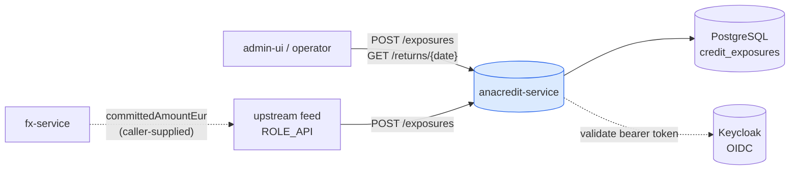
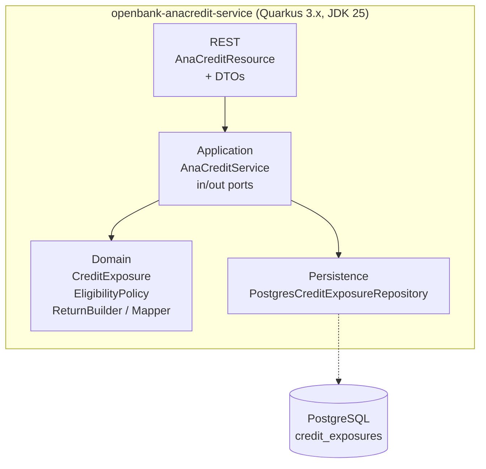
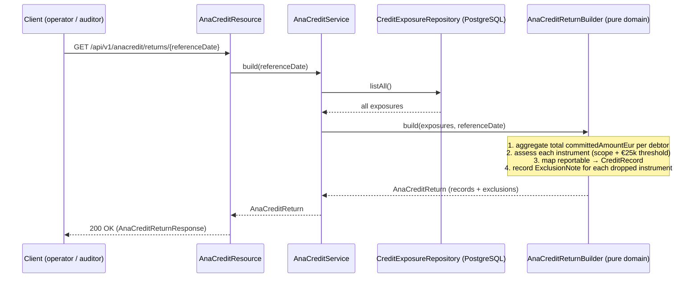

# Architecture

## C4 — System Context



There is **no** outbound integration: anacredit-service publishes no events and calls no other OpenBank service. The ČNB submission channel is out of scope in v1.

## C4 — Container (internal structure)



## Hexagonal layers

The package structure reflects **ports-and-adapters** (ADR-0002); the `domain` package has **zero** framework imports:

```
com.openbank.anacredit/
├── domain/                          ◄── core — no framework dependencies
│   ├── model/                       CreditExposure, CounterpartyType, InstrumentType
│   ├── eligibility/                 AnaCreditEligibilityPolicy, Eligibility (scope + threshold gate)
│   └── report/                      AnaCreditCreditRecord, ExclusionNote, AnaCreditReturn,
│                                    AnaCreditReturnBuilder, AnaCreditMapper
│
├── application/                     ◄── use-case orchestration
│   ├── port/in/                     RegisterExposureUseCase, ListExposuresUseCase,
│   │                                BuildAnaCreditReturnUseCase, RegisterExposureCommand
│   ├── port/out/                    CreditExposureRepository (outbound port)
│   └── AnaCreditService             implements the three inbound use cases
│
└── infrastructure/                  ◄── adapters
    ├── rest/                        AnaCreditResource (JAX-RS), dto/AnaCreditDtos
    └── persistence/                 CreditExposureEntity (Panache), PostgresCreditExposureRepository
```

**Dependency rule:** `domain` ← `application` ← `infrastructure`. Domain code never sees JAX-RS, Jackson, or CDI.

## Ports

| Port | Direction | Defined in | Adapter |
|---|---|---|---|
| `RegisterExposureUseCase` | inbound | `application/port/in` | `AnaCreditService` |
| `ListExposuresUseCase` | inbound | `application/port/in` | `AnaCreditService` |
| `BuildAnaCreditReturnUseCase` | inbound | `application/port/in` | `AnaCreditService` |
| `CreditExposureRepository` (`upsert`/`findById`/`listAll`, all `suspend`) | outbound | `application/port/out` | `PostgresCreditExposureRepository` |

The port kept the swap from the v1 in-memory `ConcurrentHashMap` to the reactive-Panache
`anacredit_schema`-backed adapter (ADR-0037 v2) mechanical: a single new outbound adapter; the
domain and application layers did not change.

## The render pipeline (no outbox — derive-only)

Unlike the money-path services, anacredit-service has **no transactional outbox** and **no event flow**. The return is computed synchronously, on demand, from the current exposure set:



The €25 000 threshold is a *per-debtor* test, so `AnaCreditReturnBuilder` first folds each debtor's total `committedAmountEur` across all their instruments, then applies `AnaCreditEligibilityPolicy.assess(...)` per instrument.

## Components from `openbank-libs`

| Module | Use here |
|---|---|
| `libs.web.ServiceInfoResource` | `/api/v1/info` (build metadata) |
| `libs.docs.DocsResource` | **this documentation** (`/q/openbank/docs`) |
| `libs.util.BuildInfo` | runtime tech-stack snapshot |

## Principles

1. **Derive-only** — the service is a projection; it owns no money state and emits no events, so it stays off the money-path gate (ADR-0030).
2. **Pure domain rules** — scope + materiality live in `AnaCreditEligibilityPolicy`, a framework-free object with deterministic, audit-facing reason codes.
3. **Explain every drop** — a reportable instrument becomes a `CreditRecord`; a dropped one becomes an `ExclusionNote`. Nothing disappears silently.
4. **Native amounts report; EUR only gates** — the dataset rows carry native-currency amounts; `committedAmountEur` is used solely for the threshold.
5. **Storage is an adapter** — the PostgreSQL store is an implementation detail behind `CreditExposureRepository`; it was swapped in from the original in-memory store without touching the core.
