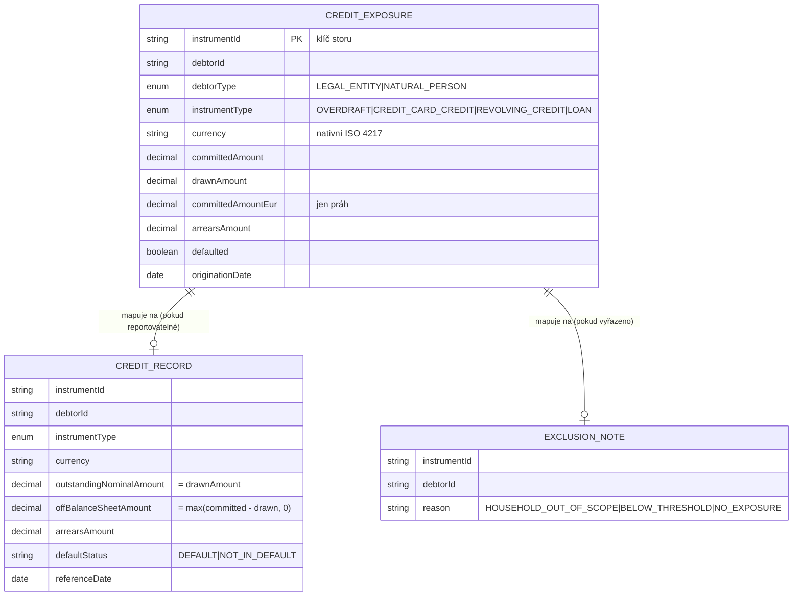

# Data

## Datový model (v2)

anacredit-service je **postavená na PostgreSQL** (ADR-0037 v2). Expozice žijí v tabulce
`credit_exposures` (databáze `openbank_anacredit`, governance schema label `anacredit_schema`),
jeden řádek na nástroj, klíčovaný `instrumentId`, za reaktivním Panache adaptérem
`PostgresCreditExposureRepository` implementujícím port `CreditExposureRepository` — stejný vzor
výměny adaptéru jako u `openbank-product-catalog`. `governance.yaml` deklaruje
`dataClassification: restricted`, `retentionPolicy: 10 years`. Expozice nyní **přežijí restart
podu**; in-memory `ConcurrentHashMap` z v1 (`InMemoryCreditExposureRepository`) byl odstraněn.

## Logické entity

`CreditExposure` je nyní skutečný řádek tabulky (`CREDIT_EXPOSURE` níže); `CreditRecord` a
`ExclusionNote` zůstávají počítané na vyžádání, nikdy neukládané:

`CreditRecord` a `ExclusionNote` se **neukládají** — počítá je na vyžádání `AnaCreditReturnBuilder` při vykreslení výkazu.

## Migrace

| Skript | Stav |
|---|---|
| `V2__create_credit_exposures.sql` | Aplikováno — vytváří `credit_exposures` + `idx_credit_exposures_debtor_id`. Rollback: `DROP TABLE credit_exposures;` |

## Pravidla způsobilosti (odvození, které produkuje data)

| Pravidlo | Podmínka | Výsledek |
|---|---|---|
| Rozsah | `debtorType == NATURAL_PERSON` | vyloučeno — `HOUSEHOLD_OUT_OF_SCOPE` |
| Bez expozice | `committedAmount <= 0 && drawnAmount <= 0` | vyloučeno — `NO_EXPOSURE` |
| Materialita | celkový `committedAmountEur` dlužníka `< €25 000` | vyloučeno — `BELOW_THRESHOLD` |
| Reportovatelné | jinak | mapováno na `CreditRecord` |

Práh €25 000 (`AnaCreditEligibilityPolicy.REPORTING_THRESHOLD_EUR`) se vyhodnocuje na **agregovaném** EUR závazku dlužníka napříč všemi nástroji, nikoliv per nástroj.

## Retence

| Data | Úložiště |
|---|---|
| úvěrové expozice | trvanlivé — tabulka `credit_exposures`, 10 let (`governance.yaml: retentionPolicy`), AML / regulatorní záznam |
| vykreslené výkazy | neukládají se (přepočítány při každém požadavku, odvozené) |

## PII / klasifikace dat

`governance.yaml` klasifikuje tato data jako **`restricted`**. Pohled na úrovni polí:

| Pole | Klasifikace | Poznámka |
|---|---|---|
| `debtorId` | identifikátor (právnická osoba / protistrana) | u reportovatelných řádků je to **právnická osoba** (např. LEI), ne fyzická osoba; dlužníci fyzické osoby jsou z výkazu vyloučeni jako `HOUSEHOLD_OUT_OF_SCOPE` |
| `committedAmount` / `drawnAmount` / `arrearsAmount` | finanční / obchodně citlivé | reportováno v nativní měně |
| `committedAmountEur` | odvozené finanční | použito jen pro práh |
| `instrumentId`, `instrumentType`, `currency`, `originationDate`, `defaulted` | ne-PII obchodní atributy | — |

Protože reportovatelný datový soubor AnaCredit pokrývá **pouze právnické osoby**, vykreslený výkaz neobsahuje z principu žádné PII fyzických osob. Expozice fyzických osob se mohou objevit ve storu expozic, ale z výkazu jsou vždy vyřazeny s důvodem `HOUSEHOLD_OUT_OF_SCOPE`. GDPR mapping viz [06 — Compliance](./06-compliance.md).

## Lineage

`governance.yaml: dataLineageRole: both` — anacredit-service je jak **konzument** dat o úvěrových expozicích (vkládáno přes REST; konzument událostí `balance.overdraft.*` zůstává samostatným, zatím nepostaveným navazujícím krokem), tak **producent** výkazu AnaCredit (odvozený regulatorní datový soubor). `evidenceExported: false` — aktuálně neexportuje důkazy do navazujícího evidence storu.
