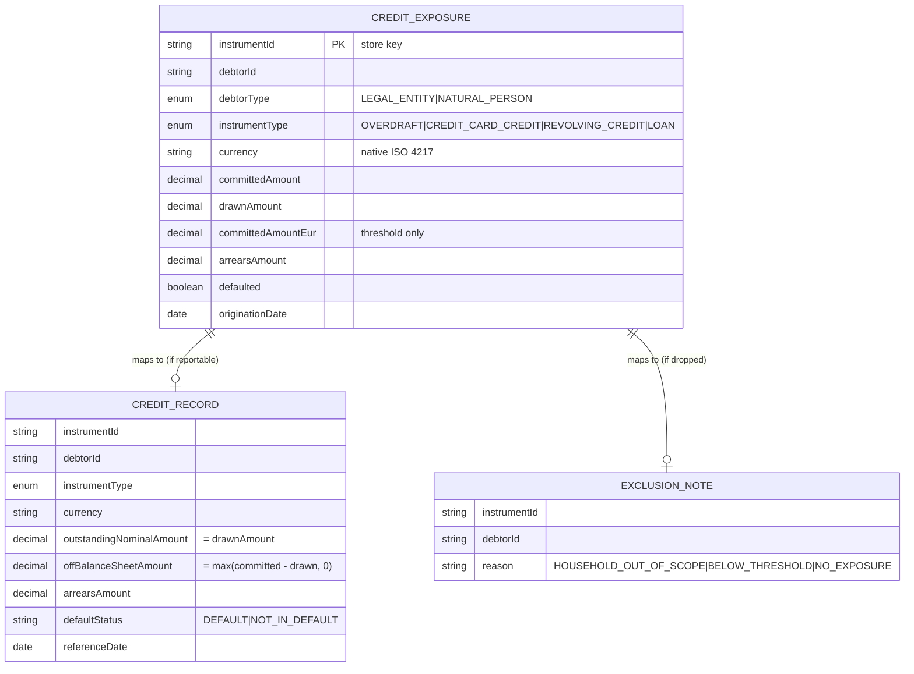

# Data

## Storage model (v2)

anacredit-service is **Postgres-backed** (ADR-0037 v2). Exposures live in the `credit_exposures`
table (database `openbank_anacredit`, governance schema label `anacredit_schema`), one row per
instrument keyed by `instrumentId`, behind a reactive-Panache `PostgresCreditExposureRepository`
implementing the `CreditExposureRepository` port — the same adapter-swap pattern used by
`openbank-product-catalog`. `governance.yaml` declares `dataClassification: restricted`,
`retentionPolicy: 10 years`. Exposures now **survive a pod restart**; v1's in-memory
`ConcurrentHashMap` (`InMemoryCreditExposureRepository`) has been removed.

## Logical entities

`CreditExposure` is now a real table row (`CREDIT_EXPOSURE` below); `CreditRecord` and
`ExclusionNote` remain computed-on-demand, never persisted:

`CreditRecord` and `ExclusionNote` are **not stored** — they are computed on demand by `AnaCreditReturnBuilder` when a return is rendered.

## Migrations

| Script | Status |
|---|---|
| `V1__create_credit_exposures.sql` | Applied — creates `credit_exposures` + `idx_credit_exposures_debtor_id`. Rollback: `DROP TABLE credit_exposures;` |

## Eligibility rules (the derivation that produces the data)

| Rule | Condition | Outcome |
|---|---|---|
| Scope | `debtorType == NATURAL_PERSON` | excluded — `HOUSEHOLD_OUT_OF_SCOPE` |
| No exposure | `committedAmount <= 0 && drawnAmount <= 0` | excluded — `NO_EXPOSURE` |
| Materiality | debtor's total `committedAmountEur` `< €25 000` | excluded — `BELOW_THRESHOLD` |
| Reportable | otherwise | mapped to a `CreditRecord` |

The €25 000 threshold (`AnaCreditEligibilityPolicy.REPORTING_THRESHOLD_EUR`) is evaluated on the **debtor's aggregated** EUR commitment across all instruments, not per instrument.

## Retention

| Data | Storage |
|---|---|
| credit exposures | durable — `credit_exposures` table, 10 years (`governance.yaml: retentionPolicy`), AML / regulatory record |
| rendered returns | not persisted (recomputed on each request, derived) |

## PII / data classification

`governance.yaml` classifies this data as **`restricted`**. Field-level view:

| Field | Classification | Note |
|---|---|---|
| `debtorId` | identifier (legal entity / counterparty) | for in-scope rows this is a **legal entity** (e.g. LEI), not a natural person; natural-person debtors are excluded from the return as `HOUSEHOLD_OUT_OF_SCOPE` |
| `committedAmount` / `drawnAmount` / `arrearsAmount` | financial / commercially sensitive | reported in native currency |
| `committedAmountEur` | derived financial | used only for the threshold |
| `instrumentId`, `instrumentType`, `currency`, `originationDate`, `defaulted` | non-PII business attributes | — |

Because the reportable AnaCredit dataset covers **legal entities only**, the rendered return contains no natural-person PII by design. Natural-person exposures may appear in the exposure store but are always dropped from the return with reason `HOUSEHOLD_OUT_OF_SCOPE`. See [06 — Compliance](./06-compliance.md) for the GDPR mapping.

## Lineage

`governance.yaml: dataLineageRole: both` — anacredit-service is both a **consumer** of credit-exposure data (fed in via REST; a `balance.overdraft.*` event consumer remains a separate, not-yet-built follow-up) and a **producer** of the AnaCredit return (a derived regulatory dataset). `evidenceExported: false` — it does not currently export evidence to a downstream evidence store.
