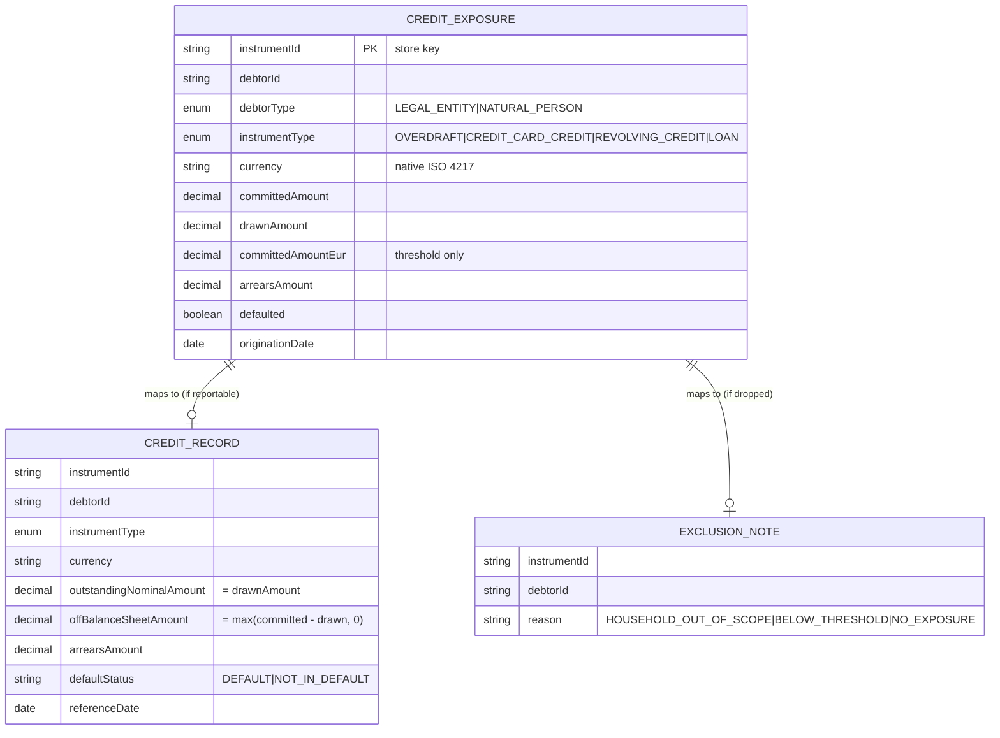

# Data

## Storage model (v1)

anacredit-service v1 has **no database**. Exposures are held in an **in-memory `ConcurrentHashMap`** (`InMemoryCreditExposureRepository`), keyed by `instrumentId`, following the `openbank-product-catalog` pattern. There are **no Flyway migrations** in this service yet.

> **Planned (not provisioned):** `governance.yaml` *declares* a dedicated PostgreSQL schema `anacredit_schema`, `dataClassification: restricted`, `retentionPolicy: 10 years`. This is the target for v2 persistence (a JPA/Panache adapter behind the existing `CreditExposureRepository` port) and is documented here as the intended end-state, **not** as a live schema. Until then, the in-memory store is **non-durable**: it is lost on pod restart and must be re-fed.

## Logical entities

These are the in-memory domain objects (not DB tables in v1):

`CreditRecord` and `ExclusionNote` are **not stored** — they are computed on demand by `AnaCreditReturnBuilder` when a return is rendered.

## Migrations

| Script | Status |
|---|---|
| — | **None.** No `db/migration` directory exists in v1 (in-memory store). |

When persistence lands, the first migration will create `anacredit_schema` and the `credit_exposure` table, with a rollback note per the repo's migration rule.

## Eligibility rules (the derivation that produces the data)

| Rule | Condition | Outcome |
|---|---|---|
| Scope | `debtorType == NATURAL_PERSON` | excluded — `HOUSEHOLD_OUT_OF_SCOPE` |
| No exposure | `committedAmount <= 0 && drawnAmount <= 0` | excluded — `NO_EXPOSURE` |
| Materiality | debtor's total `committedAmountEur` `< €25 000` | excluded — `BELOW_THRESHOLD` |
| Reportable | otherwise | mapped to a `CreditRecord` |

The €25 000 threshold (`AnaCreditEligibilityPolicy.REPORTING_THRESHOLD_EUR`) is evaluated on the **debtor's aggregated** EUR commitment across all instruments, not per instrument.

## Retention

| Data | v1 (in-memory) | Planned (PostgreSQL) |
|---|---|---|
| credit exposures | volatile — held only while the pod runs | 10 years (`governance.yaml: retentionPolicy`), AML / regulatory record |
| rendered returns | not persisted (recomputed on each request) | not persisted (derived) |

## PII / data classification

`governance.yaml` classifies this data as **`restricted`**. Field-level view:

| Field | Classification | Note |
|---|---|---|
| `debtorId` | identifier (legal entity / counterparty) | for in-scope rows this is a **legal entity** (e.g. LEI), not a natural person; natural-person debtors are excluded from the return as `HOUSEHOLD_OUT_OF_SCOPE` |
| `committedAmount` / `drawnAmount` / `arrearsAmount` | financial / commercially sensitive | reported in native currency |
| `committedAmountEur` | derived financial | used only for the threshold |
| `instrumentId`, `instrumentType`, `currency`, `originationDate`, `defaulted` | non-PII business attributes | — |

Because the reportable AnaCredit dataset covers **legal entities only**, the rendered return contains no natural-person PII by design. Natural-person exposures may appear in the exposure store but are always dropped from the return with reason `HOUSEHOLD_OUT_OF_SCOPE`. See [06 — Compliance](./06-compliance.md) for the GDPR mapping.

## Lineage

`governance.yaml: dataLineageRole: both` — anacredit-service is both a **consumer** of credit-exposure data (fed in via REST in v1; intended to consume `balance.overdraft.*` events later) and a **producer** of the AnaCredit return (a derived regulatory dataset). `evidenceExported: false` — it does not currently export evidence to a downstream evidence store.
