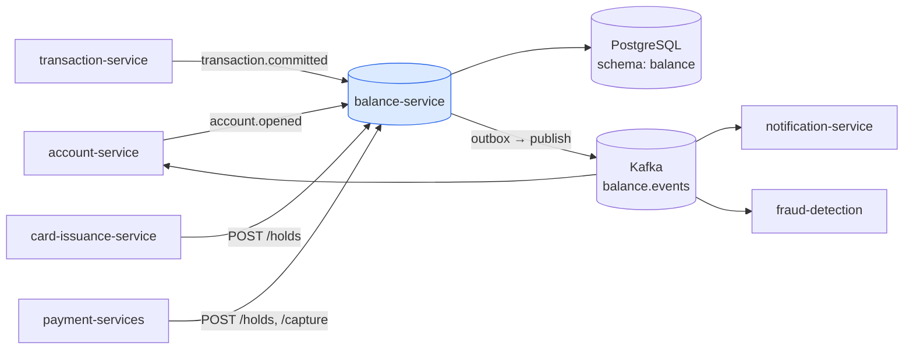
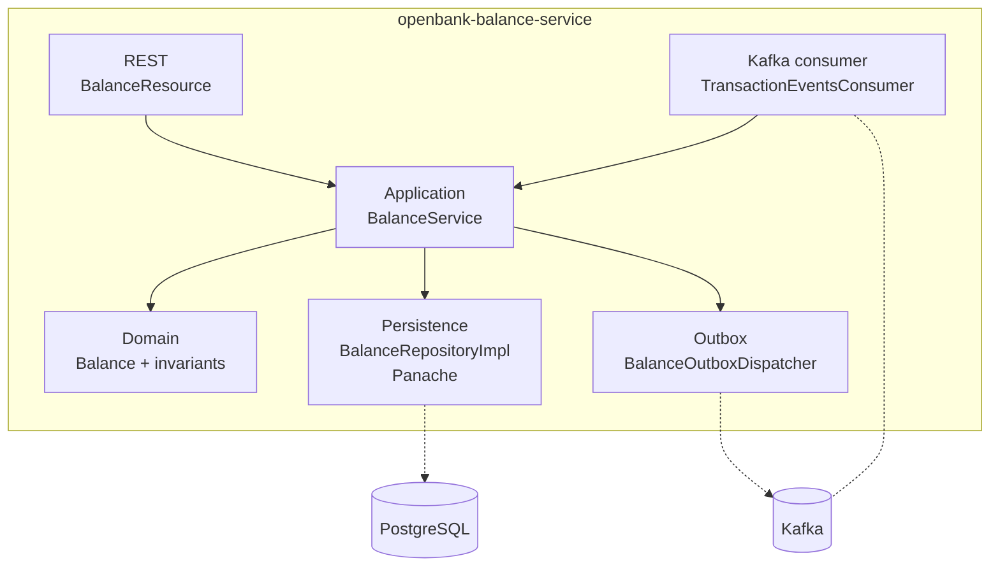
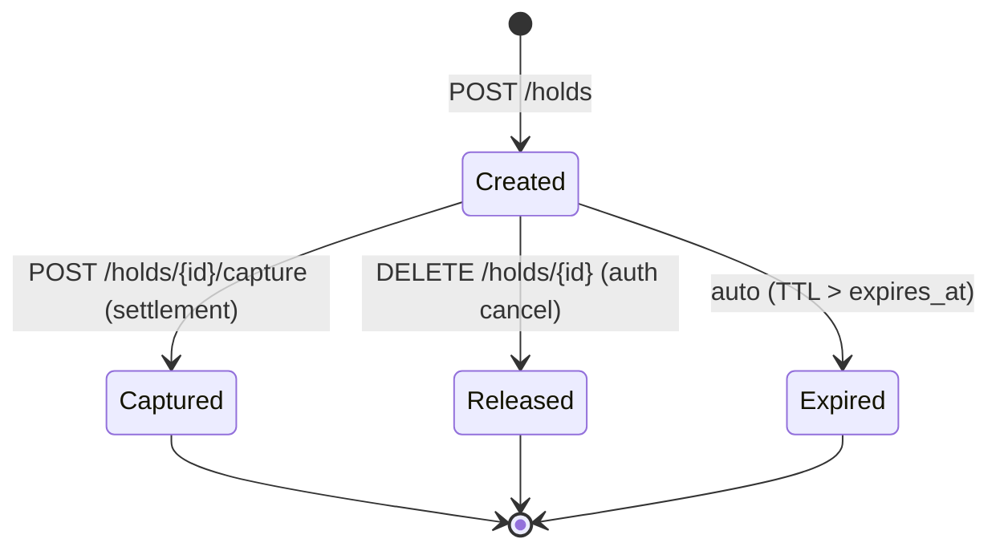

# Architecture

## C4 — System Context



## C4 — Container



## Vrstvy

```
com.openbank.balance/
├── domain/
│   └── model/Balance.kt              ← invarianty (arrangedOverdraft ≥ 0, version monotonic)
├── application/
│   ├── port/in/BalancePort.kt
│   ├── port/out/BalancePorts.kt + BalanceOutboxPort.kt
│   └── usecase/BalanceService.kt
└── infrastructure/
    ├── rest/                          BalanceResource, ExceptionMappers
    ├── persistence/repository/        BalanceRepositoryImpl (Panache)
    ├── persistence/entity/            BalanceEntity, BalanceOutboxEntity
    ├── outbox/                        BalanceOutboxDispatcher (@Scheduled)
    └── kafka/                         Producer + outbox publisher
```

## Klíčové invariantní

1. **`(account_id, currency)` UNIQUE** — jeden zůstatek per účet × měnu
2. **Optimistic lock** — `version` se zvyšuje atomicky; concurrent debit od různých autorizací nebude double-spend
3. **`arrangedOverdraftLimit ≥ 0`** — vynuceno v `Balance.init {}` block
4. **Available formula nezná podmínky**: `available = booked − reserved − pendingDebit + arranged_overdraft`. Nikde else nesmí být alternativní výpočet.
5. **Outbox-first**: každá změna zůstatku → DB UPDATE + outbox INSERT v jedné TX

## Hold lifecycle



V `Captured` se reserved snižuje a pending zvyšuje. Skutečný transaction event později booked zaktualizuje.

## Komponenty z openbank-libs

| Modul | Použití |
|---|---|
| `libs.domain.money.Money` + `CurrencyCode` | typesafe zůstatky |
| `libs.domain.identifiers.AccountId` | typesafe ID |
| `libs.persistence.outbox` | abstract outbox entity + dispatcher loop |
| `libs.web.ServiceInfoResource` | `/api/v1/info` |
| `libs.docs.DocsResource` | **tahle dokumentace** (`/q/openbank/docs`) |
| `libs.util.BuildInfo` | tech-stack snapshot |
