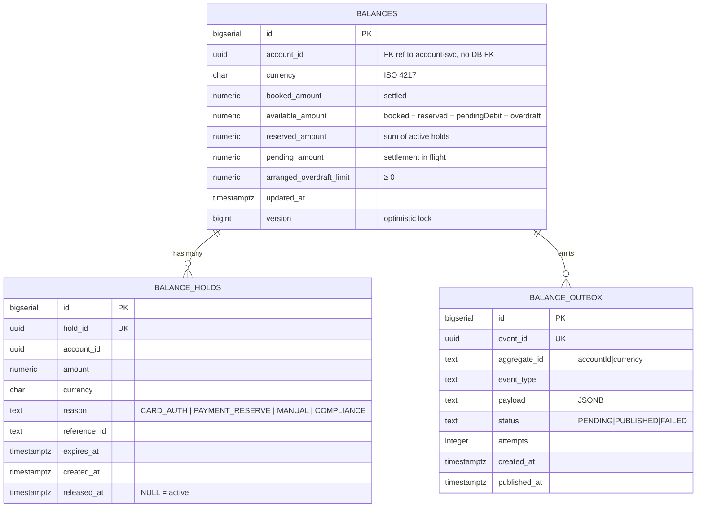

# Data

## Schema

PostgreSQL schema `balance` v openbank clusteru (schema-per-service).



## Migrace

Flyway, forward-only:

| Skript | Co dělá |
|---|---|
| `V1__init.sql` | Tabulky `balances` + `balance_holds` + indexy + UNIQUE(account_id, currency) |
| `V2__create_balance_outbox.sql` | Transakční outbox |
| `V3__arranged_overdraft_limit.sql` | Sloupec `arranged_overdraft_limit NUMERIC(19,4) NOT NULL DEFAULT 0` |
| `V4__balance_reconciliation.sql` | Read-only rekonciliační audit tabulka (ADR-0039 Phase A) |
| `V5__hibernate_sequences.sql` | Sekvence `<table>_seq` pro PanacheEntity (`balances`, `balance_holds`, `balance_outbox`, `balance_reconciliation`) |

## Indexy

- `balances(account_id, currency)` — UNIQUE; primární přístup
- `balances(account_id)` — list účtu napříč měnami
- `balance_holds(account_id)` — list aktivních holdů
- `balance_holds(reference_id)` — lookup pro karta auth ↔ capture
- `balance_holds(expires_at) WHERE released_at IS NULL` — partial pro expiry worker
- `balance_outbox(status, created_at) WHERE status='PENDING'` — dispatcher poll

## Retence

| Tabulka | Retence | Důvod |
|---|---|---|
| `balances` | trvale | nelze smazat aktivní účet |
| `balance_holds` | trvale (logical delete přes `released_at`) | audit + dispute |
| `balance_outbox` | 30 dní po PUBLISHED | troubleshooting + replay |

## PII

- `account_id` je UUID, nepřímý identifikátor. Sám o sobě není PII bez join na party-service.
- Žádný IBAN, name, email zde.

## Konzistence vs. ledger-service

`balance.booked` se aktualizuje **po commit-u v ledgeru**. Žádné booked > ledger sum (modulo eventually-consistent okno desítek ms). Kontrola:

```sql
-- reconciliation query, denně 02:00 UTC v audit
SELECT b.account_id, b.currency,
       b.booked_amount,
       (SELECT sum(amount) FROM ledger.journal_lines WHERE account_id=b.account_id AND currency=b.currency) as ledger_sum
FROM balance.balances b
WHERE b.booked_amount != (SELECT sum(amount) FROM ledger.journal_lines …)
LIMIT 100;
```

Pokud divergence > 0 → alert do PagerDuty.

## Velikost (1M aktivních klientů, ~1.2 měn per účet průměr)

| Tabulka | Rows | Velikost |
|---|---|---|
| `balances` | ~1.2M × 250 B | **~300 MB** |
| `balance_holds` | ~3M (incl. released) × 200 B | **~600 MB** |
| `balance_outbox` (30d) | ~30M × 500 B | **~15 GB** |
