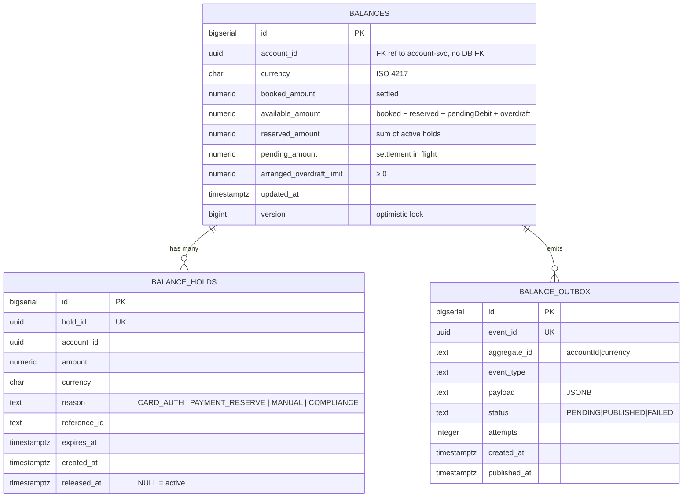

# Data

## Schema

PostgreSQL schema `balance` in the openbank cluster (schema-per-service).



## Migrations

Flyway, forward-only:

| Script | What it does |
|---|---|
| `V1__init.sql` | Tables `balances` + `balance_holds` + indexes + UNIQUE(account_id, currency) |
| `V2__create_balance_outbox.sql` | Transactional outbox |
| `V3__arranged_overdraft_limit.sql` | Column `arranged_overdraft_limit NUMERIC(19,4) NOT NULL DEFAULT 0` |
| `V4__balance_reconciliation.sql` | Read-only reconciliation audit table (ADR-0039 Phase A) |
| `V5__hibernate_sequences.sql` | `<table>_seq` sequences PanacheEntity needs (`balances`, `balance_holds`, `balance_outbox`, `balance_reconciliation`) |

## Indexes

- `balances(account_id, currency)` — UNIQUE; primary access path
- `balances(account_id)` — list account across currencies
- `balance_holds(account_id)` — list active holds
- `balance_holds(reference_id)` — lookup for card auth ↔ capture
- `balance_holds(expires_at) WHERE released_at IS NULL` — partial for the expiry worker
- `balance_outbox(status, created_at) WHERE status='PENDING'` — dispatcher poll

## Retention

| Table | Retention | Reason |
|---|---|---|
| `balances` | forever | cannot delete an active account |
| `balance_holds` | forever (logical delete via `released_at`) | audit + dispute |
| `balance_outbox` | 30 days after PUBLISHED | troubleshooting + replay |

## PII

- `account_id` is a UUID, an indirect identifier. By itself it is not PII without a join to party-service.
- No IBAN, name, or email here.

## Consistency vs. ledger-service

`balance.booked` is updated **after a commit in the ledger**. No booked > ledger sum (modulo the eventually-consistent window of tens of ms). Check:

```sql
-- reconciliation query, daily 02:00 UTC in audit
SELECT b.account_id, b.currency,
       b.booked_amount,
       (SELECT sum(amount) FROM ledger.journal_lines WHERE account_id=b.account_id AND currency=b.currency) as ledger_sum
FROM balance.balances b
WHERE b.booked_amount != (SELECT sum(amount) FROM ledger.journal_lines …)
LIMIT 100;
```

If divergence > 0 → alert to PagerDuty.

## Size (1M active customers, ~1.2 currencies per account average)

| Table | Rows | Size |
|---|---|---|
| `balances` | ~1.2M × 250 B | **~300 MB** |
| `balance_holds` | ~3M (incl. released) × 200 B | **~600 MB** |
| `balance_outbox` (30d) | ~30M × 500 B | **~15 GB** |
