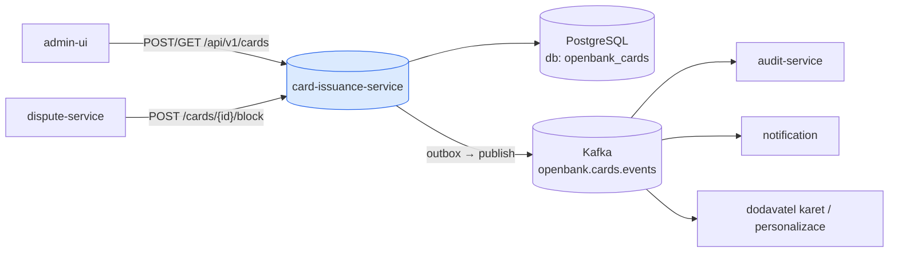
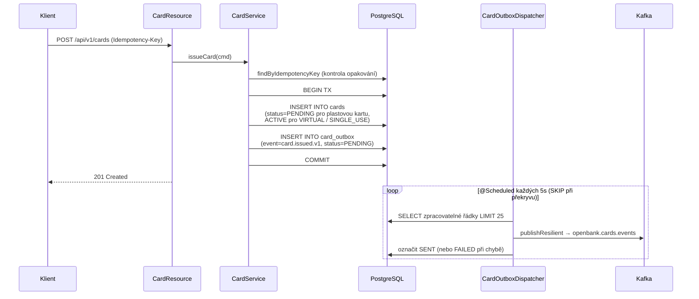

# Architektura

## C4 — Kontext systému



## C4 — Kontejner (vnitřní struktura)

```mermaid
graph TB
  subgraph "openbank-card-issuance-service (Quarkus 3.x)"
    direction TB
    rest[REST<br/>CardResource]
    uc[Application<br/>CardService<br/>CardUseCase]
    dom[Domain<br/>agregát Card + stavový automat<br/>CardIssued / CardStatusChanged]
    persist[Persistence<br/>CardRepositoryImpl<br/>Hibernate Reactive / Panache]
    outbox[Outbox<br/>CardOutboxDispatcher<br/>@Scheduled každých 5s]
    kpub[Kafka publisher<br/>KafkaCardOutboxEventPublisher<br/>fault-tolerant]
  end

  rest --> uc
  uc --> dom
  uc --> persist
  persist --> outboxtbl
  outbox --> kpub

  persist -.-> db[(PostgreSQL)]
  outboxtbl[(card_outbox)] -.-> db
  kpub -.-> kafka[(Kafka)]
```

## Hexagonální vrstvy

Struktura balíčků odráží **ports-and-adapters** (ADR-0002):

```
com.openbank.cardissuance/
├── domain/                    ◄── jádro — žádné framework závislosti
│   ├── model/                 agregát Card + CardStatus/CardType/CardNetwork, přechody stavů
│   └── event/                 CardEvent (CardIssued, CardStatusChanged)
│
├── application/               ◄── orchestrace use-case
│   ├── port/in/               CardUseCase, IssueCardCommand, CardStatusCommand
│   ├── port/out/              CardRepository, CardOutboxMessage / CardOutboxEntry, CardOutboxPort
│   └── usecase/               CardService
│
└── infrastructure/            ◄── adaptéry
    ├── rest/                  CardResource + DTO (JAX-RS / RESTEasy Reactive)
    ├── persistence/           CardEntity, CardOutboxEntity, mappery, repozitáře
    ├── outbox/                CardOutboxDispatcher (@Scheduled)
    └── kafka/                 KafkaCardOutboxEventPublisher
```

**Pravidlo závislostí:** `domain` ← `application` ← `infrastructure`. Doménový kód nikdy neimportuje Hibernate, Kafku ani REST DTO. Přechody stavů (`activate`, `suspend`, `resume`, `block`) žijí přímo na agregátu `Card` a vynucují své předpoklady přes `require(...)`.

## Tok outboxu (ADR-0050)



**Proč outbox:** řádek karty a jeho událost commitují v jedné transakci, takže pád mezi commitem do DB a publikací do Kafky nemůže událost ztratit ani duplikovat. Dispatcher poté outbox vyprazdňuje asynchronně.

### Invarianty dispatche (z `CardOutboxDispatcher` / `KafkaCardOutboxEventPublisher`)

- **N1 — reaktivně na event loopu.** Plánovaná metoda vrací `Uni<Void>` a celý řetězec je Mutiny-reaktivní, takže reaktivní Panache session se otevírají on-context (vyhne se třídě chyb `HR000068` na worker vlákně).
- **N2 — partition key = `aggregate_id` (id karty)**, takže každá událost jedné karty dopadne na stejnou partition a udrží pořadí.
- **N3 — `event.id` nesený jako hlavičky `ce-id` / `idempotency-key`**, plus `ce-type` pro typ události, takže at-least-once doručení konzumenti bezpečně deduplikují.
- **N4 — jediný zapisovatel.** `concurrentExecution = SKIP` brání překryvu v JVM; Deployment je připnut na `replicas: 1`. Řádky se zpracovávají sekvenčně (`transformToUniAndConcatenate`).
- **N5 — omezené chyby.** Chyby publikace jednotlivého řádku jsou izolované (`recoverWithUni → markFailed`), takže jeden vadný řádek nikdy nepřeruší dávku; publikace je obalená `@Retry` + `@CircuitBreaker` + `@Bulkhead` + `@Timeout`.

## Komponenty z `openbank-libs`

| Modul | Použití zde |
|---|---|
| `libs.web.ServiceInfoResource` | `/api/v1/info` (build metadata) |
| `libs.docs.DocsResource` | **tato dokumentace** (`/q/openbank/docs`) |
| `libs.util.BuildInfo` | runtime snímek tech-stacku |
| outbox helpery | sdílené outbox konvence (ADR-0050) |

## Principy

1. **Hranice agregátu = Card** — operace na kartě jsou atomické; stavový automat žije v doménovém modelu.
2. **Doménové události na prvním místě** — každá změna stavu emituje doménovou událost; infrastruktura ji serializuje do outboxu.
3. **Žádná vzdálená volání v TX** — synchronně v rámci request/response, asynchronně přes outbox + Kafku.
4. **Idempotence při vydání** — `Idempotency-Key` je povinný při vydání a deduplikovaný unikátním sloupcem `idempotency_key`.
5. **Minimalizace PCI scope** — z domény odchází jen maskovaný PAN; celý PAN / CVV / PIN v modelu neexistuje.
