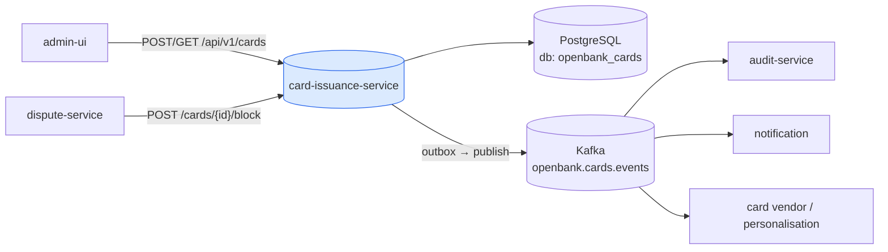
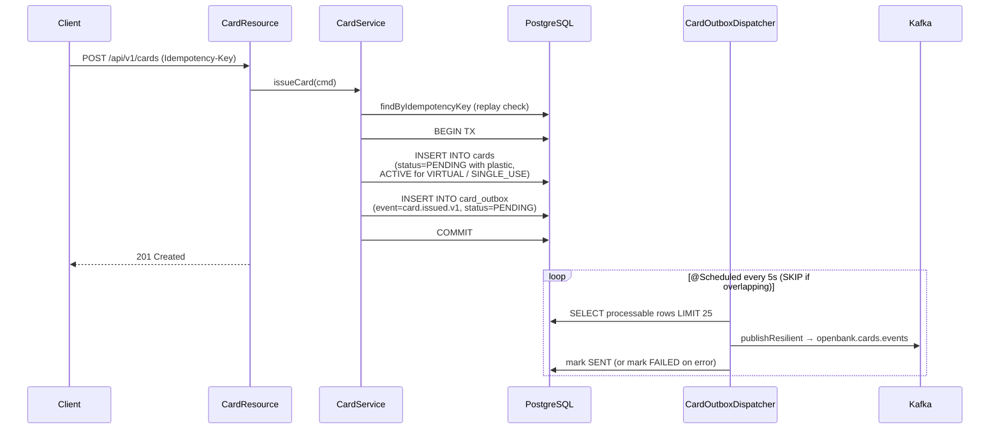

# Architecture

## C4 — System Context



## C4 — Container (internal structure)

```mermaid
graph TB
  subgraph "openbank-card-issuance-service (Quarkus 3.x)"
    direction TB
    rest[REST<br/>CardResource]
    uc[Application<br/>CardService<br/>CardUseCase]
    dom[Domain<br/>Card aggregate + state machine<br/>CardIssued / CardStatusChanged]
    persist[Persistence<br/>CardRepositoryImpl<br/>Hibernate Reactive / Panache]
    outbox[Outbox<br/>CardOutboxDispatcher<br/>@Scheduled every 5s]
    kpub[Kafka publisher<br/>KafkaCardOutboxEventPublisher<br/>fault-tolerant]
  end

  rest --> uc
  uc --> dom
  uc --> persist
  persist --> outboxtbl
  outbox --> kpub

  persist -.-> db[(PostgreSQL)]
  outboxtbl[(card_outbox)] -.-> db
  kpub -.-> kafka[(Kafka)]
```

## Hexagonal layers

The package structure reflects **ports-and-adapters** (ADR-0002):

```
com.openbank.cardissuance/
├── domain/                    ◄── core — no framework dependencies
│   ├── model/                 Card aggregate + CardStatus/CardType/CardNetwork, state transitions
│   └── event/                 CardEvent (CardIssued, CardStatusChanged)
│
├── application/               ◄── use-case orchestration
│   ├── port/in/               CardUseCase, IssueCardCommand, CardStatusCommand
│   ├── port/out/              CardRepository, CardOutboxMessage / CardOutboxEntry, CardOutboxPort
│   └── usecase/               CardService
│
└── infrastructure/            ◄── adapters
    ├── rest/                  CardResource + DTOs (JAX-RS / RESTEasy Reactive)
    ├── persistence/           CardEntity, CardOutboxEntity, mappers, repositories
    ├── outbox/                CardOutboxDispatcher (@Scheduled)
    └── kafka/                 KafkaCardOutboxEventPublisher
```

**Dependency rule:** `domain` ← `application` ← `infrastructure`. Domain code never imports Hibernate, Kafka, or REST DTOs. State transitions (`activate`, `suspend`, `resume`, `block`) live on the `Card` aggregate itself and enforce their own preconditions via `require(...)`.

## Outbox flow (ADR-0050)



**Why outbox:** the card row and its event commit in a single transaction, so a crash between the DB commit and the Kafka publish can neither lose nor double-emit an event. The dispatcher then drains the outbox asynchronously.

### Dispatch invariants (from `CardOutboxDispatcher` / `KafkaCardOutboxEventPublisher`)

- **N1 — reactive on the event loop.** The scheduled method returns `Uni<Void>` and the whole chain is Mutiny-reactive, so reactive Panache sessions open on-context (avoids the worker-thread `HR000068` failure class).
- **N2 — partition key = `aggregate_id` (card id)**, so every event for one card lands on the same partition and keeps its order.
- **N3 — `event.id` carried as `ce-id` / `idempotency-key` headers**, plus `ce-type` for the event type, so at-least-once delivery is safely de-duplicated by consumers.
- **N4 — single writer.** `concurrentExecution = SKIP` prevents in-JVM overlap; the Deployment is pinned to `replicas: 1`. Rows are processed sequentially (`transformToUniAndConcatenate`).
- **N5 — bounded failures.** Per-row publish failures are isolated (`recoverWithUni → markFailed`) so one bad row never aborts the batch; the publish is wrapped in `@Retry` + `@CircuitBreaker` + `@Bulkhead` + `@Timeout`.

## Components from `openbank-libs`

| Module | Use here |
|---|---|
| `libs.web.ServiceInfoResource` | `/api/v1/info` (build metadata) |
| `libs.docs.DocsResource` | **this documentation** (`/q/openbank/docs`) |
| `libs.util.BuildInfo` | runtime tech-stack snapshot |
| outbox helpers | shared outbox conventions (ADR-0050) |

## Principles

1. **Aggregate boundary = Card** — operations on a card are atomic; the state machine lives in the domain model.
2. **Domain events first** — every state change emits a domain event; infrastructure serialises it to the outbox.
3. **No remote calls in TX** — synchronous within request/response, async via outbox + Kafka.
4. **Idempotence at issue** — `Idempotency-Key` is required on issue and de-duplicated by the unique `idempotency_key` column.
5. **PCI scope minimisation** — only the masked PAN ever leaves the domain; no full PAN / CVV / PIN exists in the model.
