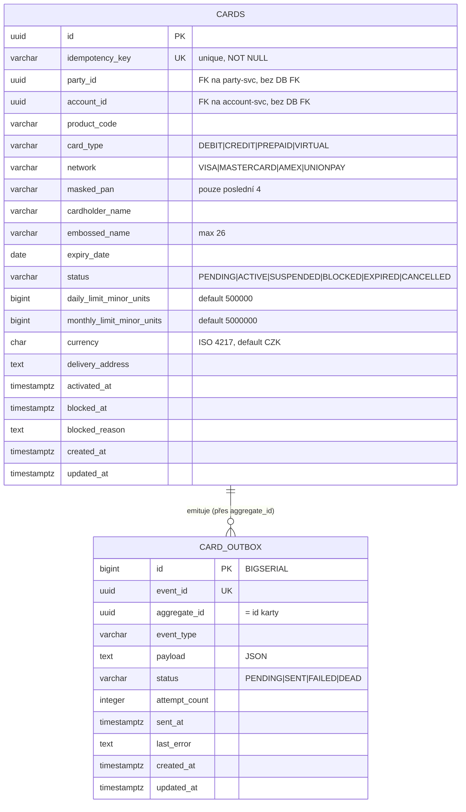

# Data

## Schéma

Služba vlastní PostgreSQL databázi `openbank_cards` (logické jméno schématu `cards_schema` dle `governance.yaml`; `dataClassification: restricted`, `dataLineageRole: producer`). Dvě tabulky: agregát `cards` a jeho transakční `card_outbox`.

## Migrace

Flyway, forward-only, `migrate-at-start: true`:

| Skript | Co dělá |
|---|---|
| `V1__create_cards.sql` | tabulka `cards` + indexy na `party_id`, `account_id`, `status`, `network`; komentář tabulky uvádí PCI DSS (PAN pouze maskovaný) |
| `V2__create_card_outbox.sql` | tabulka `card_outbox` + indexy na `(status, created_at)` a `aggregate_id` |
| `V3__hibernate_sequences.sql` | `CREATE SEQUENCE card_outbox_seq INCREMENT BY 50` — nutné, protože Hibernate Reactive/Panache alokuje id ze sekvence `<table>_seq`, zatímco tabulka použila `BIGSERIAL` a generace schématu je `none` (rollback: `DROP SEQUENCE card_outbox_seq`) |

## Indexy

- `cards(idempotency_key)` — UNIQUE, řídí kontrolu opakování při vydání
- `cards(party_id)` — dotaz seznam-podle-klienta
- `cards(account_id)` — dotaz seznam-podle-účtu
- `cards(status)` — filtrování dle stavu
- `cards(network)` — filtrování dle sítě
- `card_outbox(status, created_at ASC)` — pořadí pollu dispatcheru
- `card_outbox(aggregate_id)` — vyhledání událostí jedné karty

## Retence

`governance.yaml` deklaruje retenční politiku **7 let** a `evidenceExported: true` pro tuto službu.

| Tabulka | Retence | Důvod |
|---|---|---|
| `cards` | 7 let (dle `governance.yaml`); v souladu s AML / finanční evidencí | důkaz životního cyklu karty, řešení disputů |
| `card_outbox` | krátkodobá provozní data (purge po úspěšném doručení) | troubleshooting, replay |

> Poznámka: explicitní purge job pro outbox v kódu zatím není; řádky outboxu přetrvávají, dokud nebude přidán úklid (provozní follow-up).

## PII / citlivá pole

| Pole | Klasifikace | Zacházení |
|---|---|---|
| `masked_pan` | redukovaná cardholder data | uloženy pouze poslední 4 číslice; **nikde žádný celý PAN / CVV / PIN** (minimalizace PCI DSS scope) |
| `cardholder_name`, `embossed_name` | PII (identita) | restricted třída dat; nelogováno v plaintextu |
| `party_id`, `account_id` | pseudonymizovaná id | cizí reference, bez DB FK |
| `delivery_address` | PII (lokace) | restricted; minimalizováno |

Klasifikace dat celého úložiště je **restricted** (`governance.yaml`). GDPR právo na výmaz je omezeno AML / retencí finanční evidence (viz [06 — Compliance](./06-compliance.md)).

## Konzistence

Tabulka `cards` je **autoritativním zdrojem** existence a stavu karty. `party_id` a `account_id` referencují `party-service` resp. `account-service`, ale nenesou **žádný databázový cizí klíč** — referenční integrita se vynucuje na hranici aplikace/procesu, v souladu s izolací schéma-na-službu. Outbox zaručuje, že downstream konzumenti se eventuálně sladí se stavem karty.
