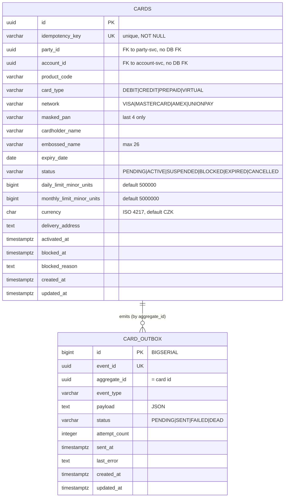

# Data

## Schema

The service owns the PostgreSQL database `openbank_cards` (logical schema name `cards_schema` per `governance.yaml`; `dataClassification: restricted`, `dataLineageRole: producer`). Two tables: the `cards` aggregate and its transactional `card_outbox`.

## Migrations

Flyway, forward-only, `migrate-at-start: true`:

| Script | What it does |
|---|---|
| `V1__create_cards.sql` | `cards` table + indexes on `party_id`, `account_id`, `status`, `network`; table comment notes PCI DSS (PAN masked only) |
| `V2__create_card_outbox.sql` | `card_outbox` table + indexes on `(status, created_at)` and `aggregate_id` |
| `V3__hibernate_sequences.sql` | `CREATE SEQUENCE card_outbox_seq INCREMENT BY 50` — required because Hibernate Reactive/Panache allocates ids from `<table>_seq` while the table used `BIGSERIAL` and schema generation is `none` (rollback: `DROP SEQUENCE card_outbox_seq`) |

## Indexes

- `cards(idempotency_key)` — UNIQUE, drives the issue replay check
- `cards(party_id)` — list-by-party query
- `cards(account_id)` — list-by-account query
- `cards(status)` — status filtering
- `cards(network)` — network filtering
- `card_outbox(status, created_at ASC)` — dispatcher poll order
- `card_outbox(aggregate_id)` — per-card event lookup

## Retention

`governance.yaml` declares a **7-year** retention policy and `evidenceExported: true` for this service.

| Table | Retention | Reason |
|---|---|---|
| `cards` | 7 years (per `governance.yaml`); aligns with AML / financial-record obligations | card lifecycle evidence, dispute resolution |
| `card_outbox` | short-lived operational data (purged after successful delivery) | troubleshooting, replay |

> Note: an explicit outbox-purge job is not present in the code yet; outbox rows persist until a cleanup is added (operational follow-up).

## PII / sensitive fields

| Field | Classification | Handling |
|---|---|---|
| `masked_pan` | reduced cardholder data | only last 4 digits stored; **no full PAN / CVV / PIN anywhere** (PCI DSS scope minimisation) |
| `cardholder_name`, `embossed_name` | PII (identity) | restricted data class; not logged in plaintext |
| `party_id`, `account_id` | pseudonymised ids | foreign references, no DB FK |
| `delivery_address` | PII (location) | restricted; minimised |

The data classification for the whole store is **restricted** (`governance.yaml`). GDPR right-to-erasure is constrained by AML / financial-record retention (see [06 — Compliance](./06-compliance.md)).

## Consistency

The `cards` table is the **authoritative source** for card existence and state. `party_id` and `account_id` reference `party-service` and `account-service` respectively but carry **no database foreign key** — referential integrity is enforced at the application/process boundary, consistent with schema-per-service isolation. The outbox guarantees that downstream consumers eventually converge with the card state.
