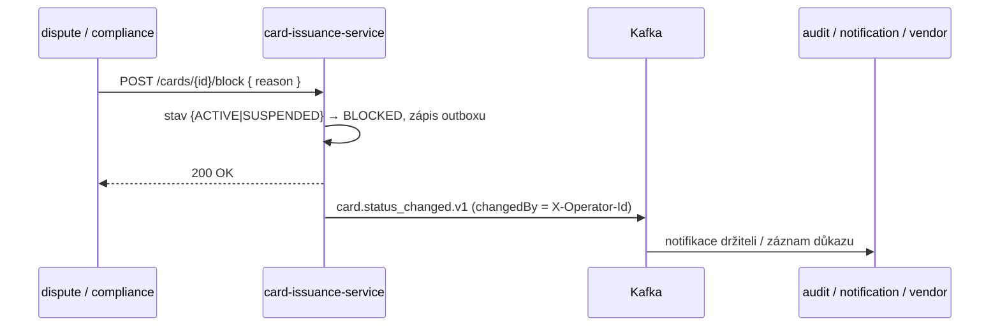

# Compliance

> **Klasifikace money-path:** `card-issuance` **NENÍ** v `rules.yaml: money_path_services`. Spravuje metadata karet a stav životního cyklu, ne pohyb peněz, takže money-path gate (2 schválení + threat model) neplatí. Přesto se dotýká **cardholder dat**, proto je dominantním kontrolním mechanismem minimalizace PCI DSS scope.

## Regulační rámec

| Regulace | Vztah k této službě | Implementace |
|---|---|---|
| **PCI DSS** | Scope prostředí karetních dat | Persistuje se pouze **maskovaný PAN** (poslední 4); **nikde žádný celý PAN, CVV/CVC ani PIN** v modelu ani DB. Komentář tabulky `cards` zaznamenává PCI záměr. Drží službu převážně mimo cardholder-data environment. |
| **GDPR** | Jméno držitele, embosované jméno, doručovací adresa jsou PII | restricted třída dat; nelogováno v plaintextu; retence omezená AML / finanční evidencí |
| **PSD2** | Karta = platební prostředek; block/suspend podporuje řešení fraudu | životní cyklus suspend/resume/block; události `card.status_changed.v1` |
| **AMLD** | Karta vydaná jen proti onboardovanému klientovi/účtu | vydání předpokládá upstream KYC/AML na klientovi; block workflow pro podezřelou aktivitu |
| **DORA** | Provozní odolnost | health proby, fault-tolerant Kafka publisher (retry/circuit-breaker/bulkhead/timeout), audit události, SLO, runbooky |
| **NIS2** | Síťová a informační bezpečnost | bezpečnostní hlavičky, OIDC, in-cluster mTLS (platforma), audit log |

## Mapování GDPR

### Právní základ (čl. 6)

- **Smlouva** (čl. 6(1)(b)) — vydání a provoz platební karty je nezbytné pro plnění smlouvy s klientem.
- **Právní povinnost** (čl. 6(1)(c)) — AML a retence finanční evidence.

### Práva subjektu údajů

| Právo | Aplikace |
|---|---|
| Přístup (čl. 15) | `GET /api/v1/cards/party/{partyId}` vrací karty subjektu |
| Oprava (čl. 16) | opravy jména/adresy přes admin UI (logováno událostí) |
| Výmaz (čl. 17) | **Omezený** — AML / retence finanční evidence (`governance.yaml`: 7 let) převažuje nad výmazem u aktivních/uzavřených-ale-retinovaných záznamů karet |
| Omezení (čl. 18) | stavy suspend (`SUSPENDED`) / block (`BLOCKED`) |
| Přenositelnost (čl. 20) | metadata karty jsou reprodukovatelná přes čtecí API |
| Námitka (čl. 21) | N/A (žádné marketingové zpracování zde) |

### Toky dat ven

- → **Kafka topic `openbank.cards.events`** (`card.issued.v1`, `card.status_changed.v1`): nese `cardId`, `partyId`, `accountId`, `cardType`, `network`, `maskedPan` — stejný správce, intra-OpenBank. **Nikdy se neemituje celý PAN/CVV/PIN.**
- → downstream konzumenti (audit, notification a případná integrace personalizace dodavatele karet) — read-only, řízeno kontraktem událostí.

Data jsou zpracovávána v regionu EU/EHP (primárně Česká republika).

### Retence (čl. 5(1)(e))

`governance.yaml` deklaruje retenci **7 let** a `evidenceExported: true`.

| Data | Retence | Důvod |
|---|---|---|
| záznamy `cards` | 7 let | AML / finanční evidence, řešení disputů |
| `card_outbox` | provozní (purge po doručení) | troubleshooting / replay |

## PCI DSS — minimalizace scope (primární kontrola)

```
požadavek na vydání → CardService vygeneruje maskovaný PAN ("**** **** **** 1234")
                    → persistuje pouze maskovaný PAN; celý PAN / CVV / PIN tato služba
                      NIKDY nepřijímá, negeneruje, neukládá, neloguje ani neemituje
```

Fyzická výroba karty / personalizace PANu je odpovědností downstream **dodavatele karet** (reaguje na `card.issued.v1`), čímž zůstává prostředí cardholder-data mimo tuto službu. Stejný postoj zaznamenává komentář tabulky `cards` a tag `CardResource` ("PCI DSS compliant").

## Mapování DORA (Nař. (EU) 2022/2554)

| Článek | Téma | Implementace |
|---|---|---|
| čl. 5 / 6 | Rámec řízení ICT rizik | závislost na centralizovaném `openbank-libs`; služba v centrálním registru |
| čl. 9 | Identifikace | `BuildInfo` (gitCommit, buildTime, version) přes `/api/v1/info` |
| čl. 10 | Detekce | Micrometer/Prometheus metriky + OpenTelemetry trasování |
| čl. 11 | Reakce a obnova | runbooky v [05-operations.md](./05-operations.md); fault-tolerant outbox publisher |
| čl. 16/17 | Řízení / hlášení incidentů | doménové události do audit pipeline |
| čl. 28 | Riziko třetích stran | self-hosted platforma; dodavatel karet je významnou třetí stranou (event-driven hranice) |

## AML — block workflow



`block` je trvalý a vyžaduje neprázdný důvod (doménový `require`); `suspend`/`resume` pokrývají dočasný případ. `ROLE_COMPLIANCE` může blokovat navíc k operátorům/adminům.

## Audit trail

Každý přechod životního cyklu emituje `card.status_changed.v1` nesoucí `previousStatus`, `newStatus`, `reason`, `changedBy` (= `X-Operator-Id`) a `occurredAt`. Vydání emituje `card.issued.v1`. Tyto tečou přes outbox do audit pipeline pro tamper-evident dlouhodobou retenci.

## Bezpečnostní kontroly

- ✅ AuthN: Keycloak OIDC, Bearer JWT
- ✅ AuthZ: Quarkus `@RolesAllowed` per endpoint (viewer / operator / admin / compliance)
- ✅ Idempotence: povinná při vydání (unikátní `idempotency_key`)
- ✅ Bezpečnostní hlavičky: nosniff, `X-Frame-Options: DENY`, CSP, HSTS, Referrer-Policy, Permissions-Policy
- ✅ Odolný egress: `@Retry` + `@CircuitBreaker` + `@Bulkhead` + `@Timeout` na publikaci do Kafky
- ✅ Transakční outbox: žádné ztracené / duplicitně emitované události (ADR-0050)
- ✅ Tajemství: dev placeholdery (`CHANGE_ME_LOCAL_DEV_ONLY`) musí být přepsány v prod přes Vault
- ✅ Minimalizace PCI scope: pouze maskovaný PAN; žádný celý PAN / CVV / PIN
- ⚠️ Jednotná obálka chyb problem+json: zatím nezapojena (follow-up hardening)
- ⚠️ Threat model: žádný pod `docs/threat-models/` (není vyžadován — služba není money-path)
