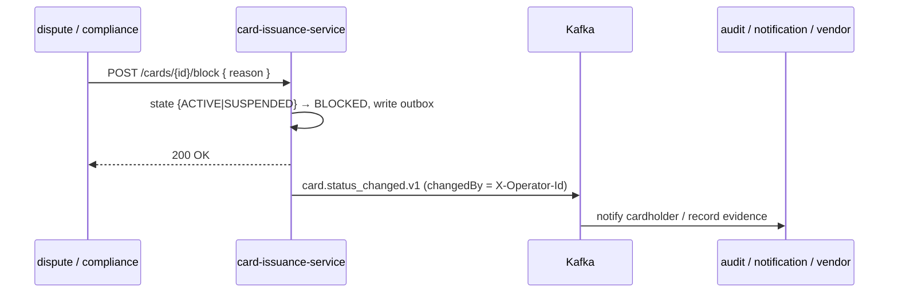

# Compliance

> **Money-path classification:** `card-issuance` is **NOT** in `rules.yaml: money_path_services`. It manages card metadata and lifecycle state, not money movement, so the 2-approval + threat-model money-path gate does not apply. It nonetheless touches **cardholder data**, so PCI DSS scope minimisation is the dominant control.

## Regulatory framework

| Regulation | Relation to this service | Implementation |
|---|---|---|
| **PCI DSS** | Card data environment scope | Only a **masked PAN** (last 4) is persisted; **no full PAN, CVV/CVC, or PIN** anywhere in the model or DB. `cards` table comment records the PCI intent. Keeps the service largely out of the cardholder-data environment. |
| **GDPR** | Cardholder name, embossed name, delivery address are PII | restricted data class; not logged in plaintext; retention bounded by AML/financial-record law |
| **PSD2** | Card = payment instrument; block/suspend supports fraud handling | suspend/resume/block lifecycle; `card.status_changed.v1` events |
| **AMLD** | Card issued only against an onboarded party/account | issuance assumes upstream KYC/AML on the party; block workflow for suspicious activity |
| **DORA** | Operational resilience | health probes, fault-tolerant Kafka publisher (retry/circuit-breaker/bulkhead/timeout), audit events, SLO, runbooks |
| **NIS2** | Network & info security | security headers, OIDC, in-cluster mTLS (platform), audit log |

## GDPR mapping

### Lawful basis (Art. 6)

- **Contract** (Art. 6(1)(b)) — issuing and operating a payment card is necessary to perform the customer contract.
- **Legal obligation** (Art. 6(1)(c)) — AML and financial-record retention.

### Data subject rights

| Right | Application |
|---|---|
| Access (Art. 15) | `GET /api/v1/cards/party/{partyId}` returns the subject's cards |
| Rectification (Art. 16) | name/address corrections through the admin UI (event-logged) |
| Erasure (Art. 17) | **Constrained** — AML / financial-record retention (`governance.yaml`: 7 years) overrides erasure for active/closed-but-retained card records |
| Restriction (Art. 18) | suspend (`SUSPENDED`) / block (`BLOCKED`) lifecycle states |
| Portability (Art. 20) | card metadata is reproducible via the read API |
| Object (Art. 21) | N/A (no marketing processing here) |

### Data flows out

- → **Kafka topic `openbank.cards.events`** (`card.issued.v1`, `card.status_changed.v1`): carries `cardId`, `partyId`, `accountId`, `cardType`, `network`, `maskedPan` — same controller, intra-OpenBank. **No full PAN/CVV/PIN is ever emitted.**
- → downstream consumers (audit, notification, and any card-vendor personalisation integration) — read-only, controlled by the event contract.

Data is processed within the EU/EEA region (Czech Republic primary).

### Retention (Art. 5(1)(e))

`governance.yaml` declares **7 years** retention and `evidenceExported: true`.

| Data | Retention | Reason |
|---|---|---|
| `cards` records | 7 years | AML / financial-record obligations, dispute resolution |
| `card_outbox` | operational (purged after delivery) | troubleshooting / replay |

## PCI DSS — scope minimisation (primary control)

```
issue request → CardService generates a masked PAN ("**** **** **** 1234")
             → persists masked PAN only; full PAN / CVV / PIN are NEVER received,
               generated, stored, logged, or emitted by this service
```

The physical card production / PAN personalisation is a downstream **card-vendor** responsibility (reacting to `card.issued.v1`), keeping the cardholder-data environment outside this service. This is the same posture noted in the `cards` table comment and the `CardResource` tag ("PCI DSS compliant").

## DORA mapping (Reg. (EU) 2022/2554)

| Article | Topic | Implementation |
|---|---|---|
| Art. 5 / 6 | ICT risk management framework | dependency on centralized `openbank-libs`; service in the central register |
| Art. 9 | Identification | `BuildInfo` (gitCommit, buildTime, version) via `/api/v1/info` |
| Art. 10 | Detection | Micrometer/Prometheus metrics + OpenTelemetry traces |
| Art. 11 | Response & recovery | runbooks in [05-operations.md](./05-operations.md); fault-tolerant outbox publisher |
| Art. 16/17 | Incident management / reporting | domain events to the audit pipeline |
| Art. 28 | Third-party risk | self-hosted platform; card vendor is the notable third party (event-driven boundary) |

## AML — block workflow



`block` is permanent and requires a non-blank reason (domain `require`); `suspend`/`resume` cover the temporary case. `ROLE_COMPLIANCE` can block in addition to operators/admins.

## Audit trail

Every lifecycle transition emits `card.status_changed.v1` carrying `previousStatus`, `newStatus`, `reason`, `changedBy` (the `X-Operator-Id`) and `occurredAt`. Issuance emits `card.issued.v1`. These flow through the outbox to the audit pipeline for tamper-evident, long-term retention.

## Security controls

- ✅ AuthN: Keycloak OIDC, Bearer JWT
- ✅ AuthZ: Quarkus `@RolesAllowed` per endpoint (viewer / operator / admin / compliance)
- ✅ Idempotency: required on issue (unique `idempotency_key`)
- ✅ Security headers: nosniff, `X-Frame-Options: DENY`, CSP, HSTS, Referrer-Policy, Permissions-Policy
- ✅ Resilient egress: `@Retry` + `@CircuitBreaker` + `@Bulkhead` + `@Timeout` on the Kafka publish
- ✅ Transactional outbox: no lost / double-emitted events (ADR-0050)
- ✅ Secrets: dev placeholders (`CHANGE_ME_LOCAL_DEV_ONLY`) must be overridden in prod via Vault
- ✅ PCI scope minimisation: masked PAN only; no full PAN / CVV / PIN
- ⚠️ Unified problem+json error envelope: not yet wired (hardening follow-up)
- ⚠️ Threat model: none present under `docs/threat-models/` (not required — service is not money-path)
