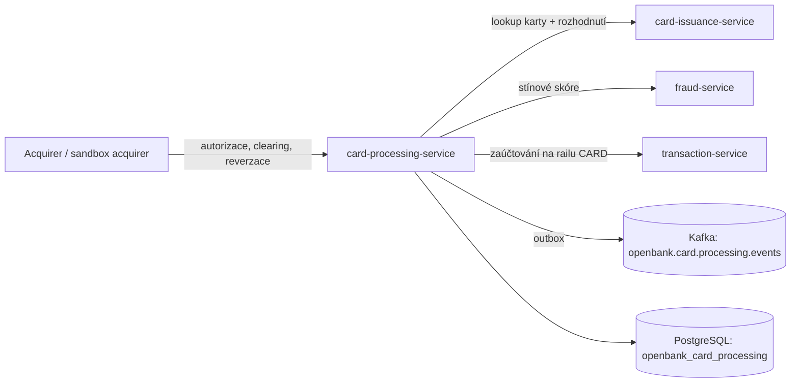

# Přehled

## Co služba dělá

`openbank-card-processing-service` je bounded context pro **karetní útratu** definovaný v [ADR-0283](../../../../docs/adr/0283-card-platform-scheme-agnostic-capability-ports.md). Vlastní:

- **Autorizaci** — acquirer předloží karetní transakci (`cardId`, částka v minor units, měna, kanál, MCC, obchodník). Služba zjistí účet a klienta karty z card-issuance, sečte útratu, kterou karta již provedla v aktuálním denním/měsíčním okně, a požádá card-issuance o rozhodnutí. Rozhodovacím bodem je card-issuance (ADR-0194 D3); tato služba odpověď zaznamená.
- **Hold** — schválená autorizace *je* hold. Dokud má stav `APPROVED` nebo `PARTIALLY_CLEARED`, blokuje `amount − cleared`. Blokovaná částka se odvozuje, nikdy se neukládá.
- **Clearing** — prezentace proti autorizaci, i částečná. Kumulativní clearing nikdy nesmí překročit autorizovanou částku a musí být ve stejné měně.
- **Zaúčtování** — každý přijatý clearing se zaúčtuje přes transaction-service jako transakce na railu `CARD`, až poté, co se clearing commitne.
- **Uvolnění** — reverzace od acquirera nebo expirace neprezentovaného holdu (výchozí 7 dní, sweep každých 15 minut).
- **Zamítnutí se také zaznamenávají** — zamítnutá autorizace je řádek a událost `card.declined.v1` nesoucí doslovně název důvodu z card-issuance.
- **Stínové fraud skórování** — každá commitnutá autorizace je oskórována fraud-service; verdikt nic nemění (ADR-0084).
- **Zrcadlo síťových tokenů** (ADR-0283 fáze 3) — přes `TokenisationPort` vydá síťový token pro kartu u wallet/merchant requestora, zaznamená ho, umožní operátorovi ho pozastavit, obnovit nebo smazat a vypíše tokeny karty ze sítě, pokud odpovídá, jinak z lokálního zrcadla se `source: LOCAL_MIRROR`.
- **Reklamační desk** (ADR-0283 fáze 3) — přes `DisputePort` otevře chargeback případ proti autorizaci, která byla zúčtována, podá důkazy a obnoví stav ze sítě. Žádný případ se nezaznamená, pokud síť nepřidělila id případu.
- **Capability porty schémat** (ADR-0283 fáze 2) — `BinLookupPort`, `MerchantDataPort`, `TokenisationPort` a `DisputePort` z `openbank-libs-domain`, každý se simulátorem. Viz [02 — Architektura](./02-architecture.md).

## Co služba **NEDĚLÁ**

- ❌ Nepřijímá, neukládá ani neloguje PAN, CVV ani kartové údaje. Karta je referencována svým id z card-issuance (ADR-0283 D7).
- ❌ Není issuer-processor: žádné 3-D Secure, žádné PIN ani HSM operace, žádné živé spojení s karetním schématem. Jedinou vazbou procesorové strany v tomto repozitáři je **sandbox acquirer**.
- ❌ Sama nerozhoduje o schválení/zamítnutí — to dělá card-issuance.
- ❌ Fraud skórování nic neblokuje (pouze stínové).
- ❌ Žádná tolerance přečerpání clearingu podle kategorie (palivo, pohostinství): jakékoli překročení je odmítnuto.
- ❌ Tokenizace (VTS / MDES) a reklamace (VROL / Mastercom) **nejsou napojeny na vendora** — tyto programy vyžadují smlouvu. Odpovídají jen simulátory. BIN lookup v této službě zatím nemá REST endpoint ani volajícího.
- ❌ Není trezor tokenů: neukládá se žádný tokenový údaj, kryptogram ani PAN. Tabulka tokenů je **zrcadlem** toho, co řekla síť.

## Pozice v doméně

## Klíčové případy užití

| Případ užití | API | Událost |
|---|---|---|
| Autorizovat karetní transakci | `POST /api/v1/card-authorizations` | `card.authorised.v1` nebo `card.declined.v1` |
| Započítat clearingovou prezentaci | `POST /api/v1/card-authorizations/{id}/clearing` | `card.cleared.v1` |
| Reverzovat zbývající hold | `POST /api/v1/card-authorizations/{id}/reversal` | `card.hold_released.v1` (`REVERSAL`) |
| Expirovat neprezentované holdy | plánovač `card-processing-hold-expiry` | `card.hold_released.v1` (`EXPIRY`) |
| Načíst jednu autorizaci | `GET /api/v1/card-authorizations/{id}` | — |
| Vypsat autorizace karty | `GET /api/v1/card-authorizations/card/{cardId}` | — |
| Vydat síťový token | `POST /api/v1/card-tokens` | `card.token.provisioned.v1` |
| Pozastavit, obnovit nebo smazat token | `POST /api/v1/card-tokens/{tokenReference}/status` | `card.token.status_changed.v1` |
| Vypsat tokeny karty (s původem odpovědi) | `GET /api/v1/card-tokens/card/{cardId}` | — |
| Otevřít chargeback případ | `POST /api/v1/card-disputes` | `card.dispute.opened.v1` |
| Podat důkazy | `POST /api/v1/card-disputes/{id}/evidence` | `card.dispute.evidence_submitted.v1` |
| Obnovit stav případu ze sítě | `POST /api/v1/card-disputes/{id}/refresh` | `card.dispute.status_changed.v1` (jen při změně) |
| Načíst případ / případy karty | `GET /api/v1/card-disputes/{id}`, `GET /api/v1/card-disputes/card/{cardId}` | — |
| Sandbox nákup (autorizace + volitelný clearing) | `POST /api/v1/sandbox/acquirer/purchase` | viz výše |

## Volající

- **Integrace na straně acquirera** autentizované OIDC tokenem s `ROLE_API` / `ROLE_OPERATOR` / `ROLE_ADMIN`. Produkční adaptér acquirera ani procesoru v tomto repozitáři dnes neexistuje.
- **admin-ui** — stránky Cards pro tokeny a reklamace (`/cards/tokens`, `/cards/disputes`).
- **Sandbox acquirer** (`/api/v1/sandbox/acquirer/purchase`) — zapnutý jen v `%dev` a `%test`; jinde odpovídá 404.

## Závislosti

- **card-issuance-service** — zjištění vlastníka karty a rozhodnutí o autorizaci (fail closed: nedostupnost ⇒ zamítnutí).
- **transaction-service** — zaúčtování zúčtované útraty na railu `CARD`.
- **fraud-service** — stínové skórování.
- **PostgreSQL**, **Kafka**, **Keycloak** (příchozí OIDC i odchozí client credentials), **OPA sidecar**.
- Volitelné sandboxy vendorů pro BIN lookup: Visa Developer Platform (mTLS + API klíč), Mastercard Developers (podepisování požadavků OAuth 1.0a). Bez přihlašovacích údajů odpovídají `NOT_BOUND` a žádný požadavek neodešlou.

## Obchodní hodnota

- Jedno místo, kde se karetní útrata stává penězi: rozhodnutí, hold, clearing i zaúčtování jsou dohledatelné pro každou autorizaci.
- Limity útraty započítávají holdy v plné výši, takže rozpracované autorizace nelze využít k překročení denního či měsíčního limitu.
- Síť je konfigurační volba (`openbank.card-processing.scheme.*`), ne změna kódu — a nenakonfigurovaná síť to řekne, místo aby tiše přešla na náhradní řešení.
