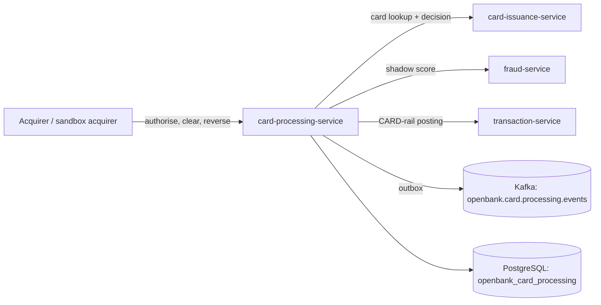

# Overview

## What the service does

`openbank-card-processing-service` is the bounded context for **card spend** defined by [ADR-0283](../../../../docs/adr/0283-card-platform-scheme-agnostic-capability-ports.md). It owns:

- **Authorisation** — an acquirer presents a card transaction (`cardId`, amount in minor units, currency, channel, MCC, merchant). The service resolves the card's account and party from card-issuance, counts the spend already taken on the card inside the current day/month window, and asks card-issuance for the decision. Card-issuance is the decision point (ADR-0194 D3); this service records the answer.
- **Hold** — an approved authorisation *is* the hold. While its status is `APPROVED` or `PARTIALLY_CLEARED` it holds `amount − cleared`. The held amount is derived, never stored.
- **Clearing** — a presentment against an authorisation, possibly partial. Cumulative clearing can never exceed the authorised amount and must be in the same currency.
- **Ledger posting** — each accepted clearing is posted through transaction-service as a `CARD`-rail transaction, after the clearing has committed.
- **Release** — a reversal from the acquirer, or expiry of an unpresented hold (default 7 days, swept every 15 minutes).
- **Declines are recorded too** — a declined authorisation is a row and a `card.declined.v1` event carrying card-issuance's own reason name verbatim.
- **Shadow fraud scoring** — every committed authorisation is scored by fraud-service; the verdict changes nothing (ADR-0084).
- **Scheme capability ports** (ADR-0283 phase 2) — `BinLookupPort`, `MerchantDataPort`, `TokenisationPort` and `DisputePort` from `openbank-libs-domain`, each with a simulator binding. See [02 — Architecture](./02-architecture.md).

## What the service does **NOT** do

- ❌ No PAN, CVV or card credential is accepted, stored or logged. A card is referenced by its card-issuance id (ADR-0283 D7).
- ❌ Not an issuer-processor: no 3-D Secure, no PIN or HSM operation, no live connection to a card scheme. The only binding of the processor side in this repository is the **sandbox acquirer**.
- ❌ Does not make the approve/decline decision itself — card-issuance does.
- ❌ Fraud scoring does not block anything (shadow only).
- ❌ No per-category over-clearing tolerance (fuel, hospitality): any overage is refused.
- ❌ Tokenisation (VTS / MDES) and disputes (VROL / Mastercom) are **not bound to a vendor** — those programmes are contract-only. Only the simulators answer. No REST endpoint of this service exposes tokenisation, disputes or BIN lookup yet.

## Position in the domain

## Key use cases

| Use case | API | Event |
|---|---|---|
| Authorise a card transaction | `POST /api/v1/card-authorizations` | `card.authorised.v1` or `card.declined.v1` |
| Apply a clearing presentment | `POST /api/v1/card-authorizations/{id}/clearing` | `card.cleared.v1` |
| Reverse the remaining hold | `POST /api/v1/card-authorizations/{id}/reversal` | `card.hold_released.v1` (`REVERSAL`) |
| Expire unpresented holds | scheduler `card-processing-hold-expiry` | `card.hold_released.v1` (`EXPIRY`) |
| Read one authorisation | `GET /api/v1/card-authorizations/{id}` | — |
| List a card's authorisations | `GET /api/v1/card-authorizations/card/{cardId}` | — |
| Sandbox purchase (authorise + optional clear) | `POST /api/v1/sandbox/acquirer/purchase` | as above |

## Callers

- **Acquirer-side integrations** authenticated with an OIDC token carrying `ROLE_API` / `ROLE_OPERATOR` / `ROLE_ADMIN`. No production acquirer or processor adapter exists in this repository today.
- **Sandbox acquirer** (`/api/v1/sandbox/acquirer/purchase`) — enabled in `%dev` and `%test` only; answers 404 elsewhere.

## Dependencies

- **card-issuance-service** — card ownership lookup and the authorisation decision (fails closed: unreachable ⇒ decline).
- **transaction-service** — `CARD`-rail posting of cleared spend.
- **fraud-service** — shadow scoring.
- **PostgreSQL**, **Kafka**, **Keycloak** (inbound OIDC and outbound client credentials), **OPA sidecar**.
- Optional vendor sandboxes for BIN lookup: Visa Developer Platform (mTLS + API key), Mastercard Developers (OAuth 1.0a request signing). Without credentials they answer `NOT_BOUND` and send no request.

## Business value

- One place where card spend becomes money: decision, hold, clearing and posting are traceable per authorisation.
- Spend limits count holds in full, so in-flight authorisations cannot be used to exceed a daily or monthly limit.
- The network is a configuration choice (`openbank.card-processing.scheme.*`), not a code change — and an unconfigured network says so rather than falling back silently.
