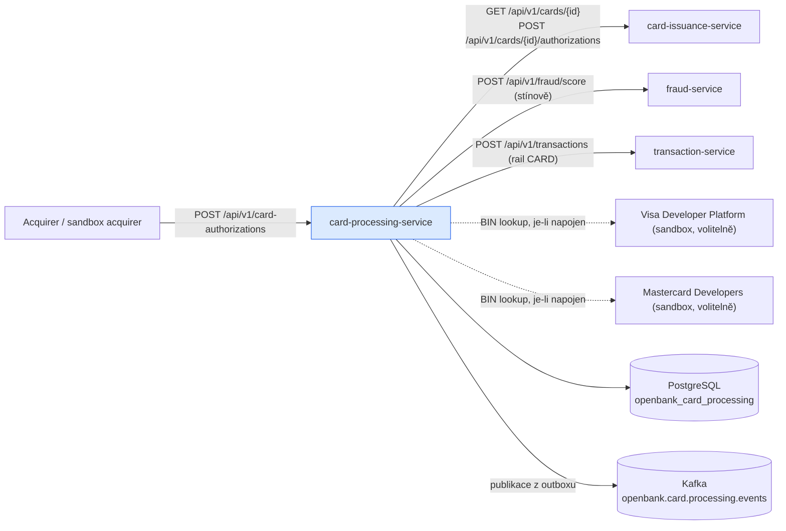
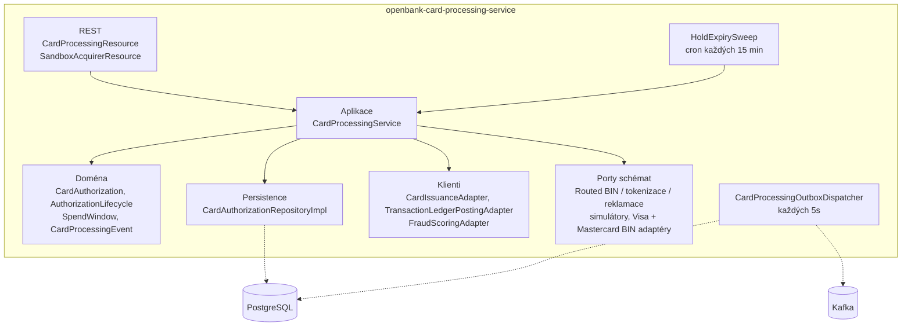
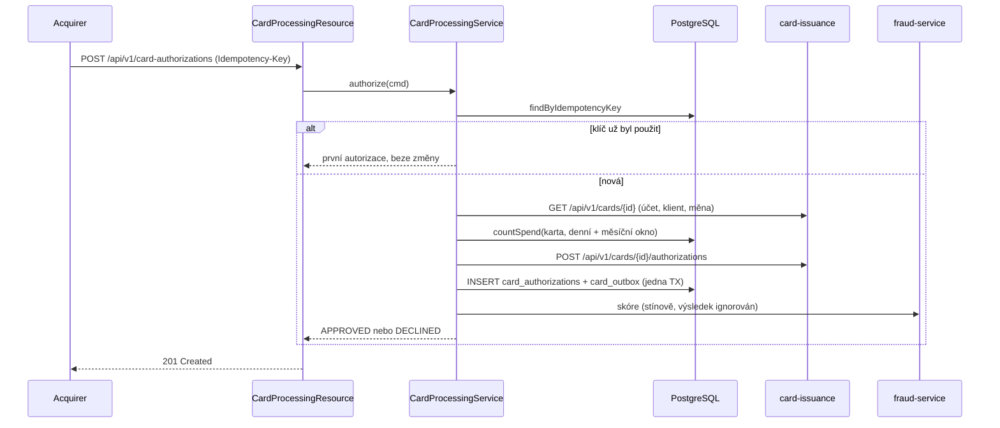
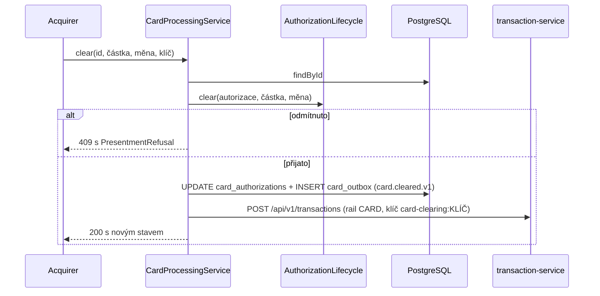
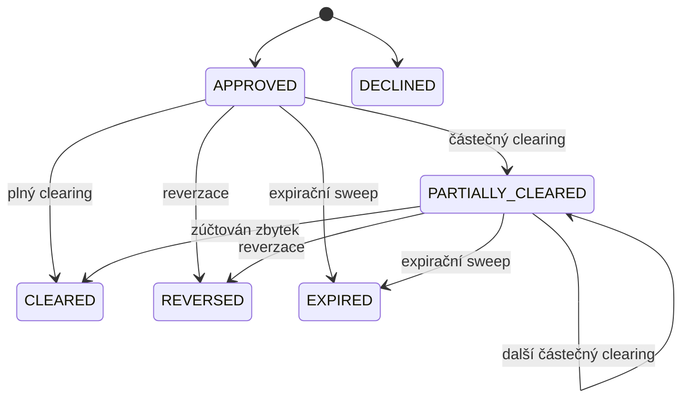

# Architektura

## C4 — Systémový kontext



Všechna odchozí volání platformních služeb se autentizují jako služba (client credentials `openbank-services` přes `quarkus-oidc-client`), protože card-processing se ptá na kartu, kterou volající nevlastní.

## C4 — Kontejner



## Hexagonální vrstvy (ADR-0002)

```
com.openbank.cardprocessing/
├── domain/
│   ├── model/      CardAuthorization, AuthorizationStatus, PresentmentChannel,
│   │               PresentmentRefusal/Outcome, SpendWindow, CountedSpend
│   ├── policy/     AuthorizationLifecycle (clear / reverse / expire — čisté, hodiny jako argument)
│   └── event/      CardAuthorised, CardDeclined, CardCleared, CardHoldReleased
├── application/
│   ├── port/in/    CardProcessingUseCase, AuthorizationCommand, PresentmentCommand
│   ├── port/out/   CardAuthorizationRepository, CardLookupPort, CardIssuancePolicyPort,
│   │               LedgerPostingPort, FraudScoringPort, CardProcessingMetricsPort
│   └── usecase/    CardProcessingService
└── infrastructure/
    ├── rest/       CardProcessingResource, DTO, CardNotFoundExceptionMapper
    ├── processor/  SandboxAcquirerResource
    ├── client/     REST klienti card-issuance, transaction-service a fraud-service
    ├── scheme/     Routed*Port, Simulated*Adapter, Visa/Mastercard BIN adaptéry, OAuth 1.0a signer
    ├── persistence/ entity + repozitáře
    ├── outbox/     dispatcher, gauge backlogu a dead-letter
    ├── kafka/      KafkaCardProcessingOutboxEventPublisher
    ├── scheduler/  HoldExpirySweep
    └── observability/ CardProcessingMetricsAdapter
```

Rozhraní portů schémat (`BinLookupPort`, `MerchantDataPort`, `TokenisationPort`, `DisputePort`, dále `PushPaymentPort` a `AccountUpdaterPort`) žijí v `openbank-libs-domain` (`com.openbank.libs.domain.cards.scheme`), takže do služby nenesou slovník žádného schématu.

## Tok autorizace



Poznámky z kódu:

- Neznámá karta ⇒ `CardNotFoundException` ⇒ **404**. Měna odlišná od měny karty nebo nekladná částka ⇒ **400**.
- `CardIssuanceAdapter` **selhává uzavřeně (fail closed)**: pokud card-issuance není dosažitelná, autorizace je zamítnuta.
- Útrata se počítá v databázi z řádků autorizací (žádný sloupec s průběžným součtem). Pokud card-issuance přiřadí MCC kategorii, útrata se přepočítá pro tuto kategorii a o rozhodnutí se žádá znovu jen tehdy, když se součty liší.
- Název obchodníka prochází přes `MerchantDataPort` (vazba na simulátor); nerozpoznaný deskriptor si ponechá text od acquirera.
- Hold vyprší `hold-expiry-days` (výchozí 7) po autorizaci.

## Clearing a zaúčtování



Zaúčtování proběhne **až po** commitu clearingu a nikdy se nevrací zpět: acquirer clearing již potvrdil. Jeho výsledek má tři hodnoty — `POSTED`, `SKIPPED_DISABLED`, `FAILED` — počítané v `openbank.card.processing.ledger.postings`, a zaúčtování `FAILED` se loguje jako chyba. Částky se převádějí z minor units podle počtu desetinných míst dané měny.

## Stavy autorizace



`DECLINED`, `CLEARED`, `REVERSED` a `EXPIRED` jsou koncové stavy. Reverzace částečně zúčtované autorizace uvolní jen neprezentovaný zbytek; zúčtovaná částka zůstává.

## Capability porty schémat

Každý port má router, který čte jeden konfigurační klíč a vybere vazbu. Nerozpoznaná nebo vendor hodnota nikdy nepřejde na simulátor.

| Port | Konfigurační klíč | `simulator` | `visa` | `mastercard` |
|---|---|---|---|---|
| `BinLookupPort` | `openbank.card-processing.scheme.bin-lookup` | deterministická tabulka publikovaných testovacích rozsahů (411111, 555555); jiné BINy ⇒ `NOT_FOUND` | `VisaBinLookupAdapter` — mTLS z key/trust store + API klíč | `MastercardBinLookupAdapter` — požadavek podepsaný OAuth 1.0a |
| `TokenisationPort` | `openbank.card-processing.scheme.tokenisation` | `SimulatedTokenisationAdapter` | `NOT_BOUND` (VTS jen se smlouvou) | `NOT_BOUND` (MDES jen se smlouvou) |
| `DisputePort` | `openbank.card-processing.scheme.dispute` | `SimulatedDisputeAdapter` | `NOT_BOUND` (VROL jen se smlouvou) | `NOT_BOUND` (Mastercom jen se smlouvou) |
| `MerchantDataPort` | — | `SimulatedSchemeAdapter` (jediná vazba) | — | — |

- Vendor BIN adaptér bez nakonfigurovaných přihlašovacích údajů odpoví `NOT_BOUND` a žádný požadavek neodešle. U Mastercardu se bez consumer key nebo podpisového klíče nevytvoří žádný signer bean.
- Výsledky jsou hodnoty `SchemeResult` nesoucí `CardScheme`, který odpověděl (`VISA`, `MASTERCARD`, `SIMULATOR`), nebo `SchemeFailure` (`NOT_BOUND`, `NOT_FOUND`, `UNAVAILABLE`, `UNAUTHENTICATED`, `MALFORMED`).
- **Zatím bez volajícího:** v této službě tok autorizace používá jen `MerchantDataPort`. `BinLookupPort`, `TokenisationPort` a `DisputePort` jsou napojené, ale žádný use case ani REST endpoint je zatím nevolá. Matice schopností je v [`docs/cards/capability-matrix.md`](../../../../docs/cards/capability-matrix.md).

## Outbox (ADR-0050)

- Řádek autorizace a jeho událost se zapisují v **jedné transakci** (`card_authorizations` + `card_outbox`).
- `CardProcessingOutboxDispatcher` běží každých `openbank.outbox.poll-interval` (výchozí 5s), `concurrentExecution = SKIP`, s `@Bulkhead`, `@CircuitBreaker`, `@Retry` a `@Timeout`. Je to `suspend fun`, takže má Vert.x kontext.
- Kafka klíč = id autorizace; nastavují se hlavičky `ce-id`, `idempotency-key` a `ce-type`. Sloupec `synthetic` (ADR-0252) se přenáší do transportní hlavičky.
- `openbank.outbox.dispatch-enabled: true` je nastaveno v `application.yaml`.

## Principy

1. **Odmítnutí jsou hodnoty, ne výjimky** — opakovaná nebo opožděná prezentace je běžný provoz schématu.
2. **Odvozené, ne uložené** — zůstatek holdu i započtená útrata se počítají z řádků.
3. **Databáze opakuje peněžní invarianty** — CHECK omezení pro cleared ≤ authorised a důvod-zamítnutí-právě-když-zamítnuto.
4. **Přeskočený nebo selhaný vedlejší efekt nikdy není úspěch** — zaúčtování i skórování mají vlastní výsledky `SKIPPED_DISABLED` / `FAILED`.
5. **Žádná kartová data** — reference pouze přes id z card-issuance.
