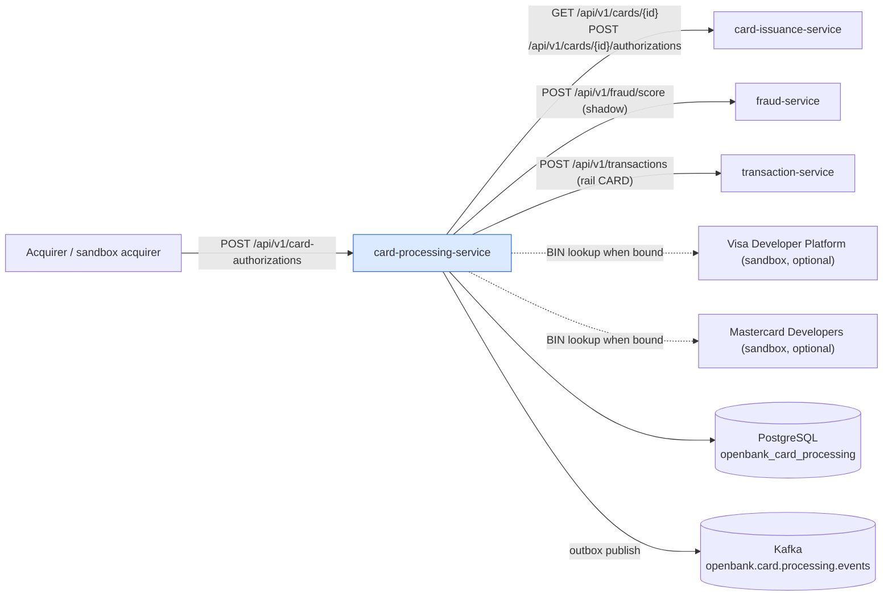
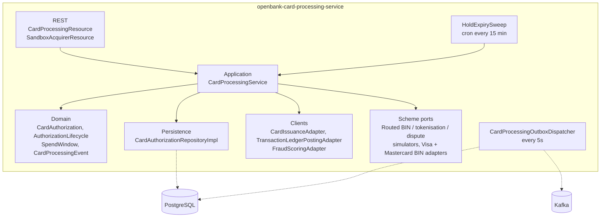
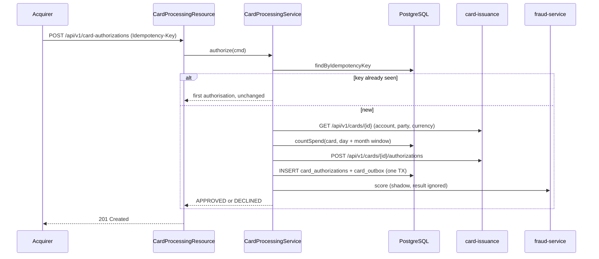
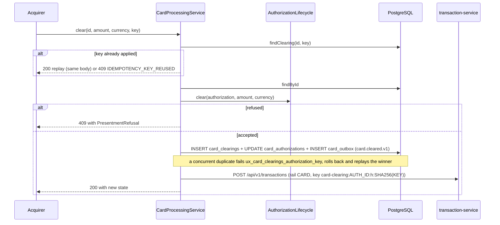
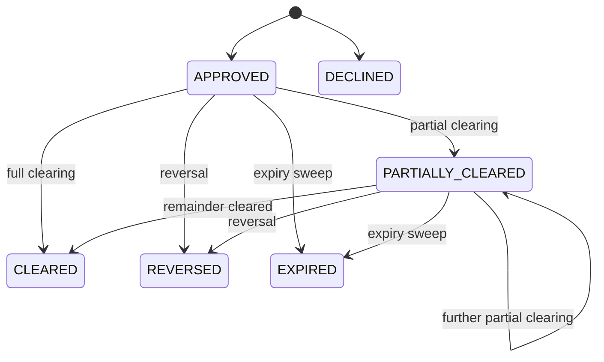

# Architecture

## C4 — System Context



All outbound calls to platform services authenticate as the service (`openbank-services` client credentials via `quarkus-oidc-client`), because card-processing asks about a card the caller does not own.

## C4 — Container



## Hexagonal layers (ADR-0002)

```
com.openbank.cardprocessing/
├── domain/
│   ├── model/      CardAuthorization, AuthorizationStatus, PresentmentChannel,
│   │               PresentmentRefusal/Outcome, SpendWindow, CountedSpend
│   ├── policy/     AuthorizationLifecycle (clear / reverse / expire — pure, clock passed in)
│   └── event/      CardAuthorised, CardDeclined, CardCleared, CardHoldReleased
├── application/
│   ├── port/in/    CardProcessingUseCase, AuthorizationCommand, PresentmentCommand
│   ├── port/out/   CardAuthorizationRepository, CardLookupPort, CardIssuancePolicyPort,
│   │               LedgerPostingPort, FraudScoringPort, CardProcessingMetricsPort
│   └── usecase/    CardProcessingService
└── infrastructure/
    ├── rest/       CardProcessingResource, DTOs, CardNotFoundExceptionMapper
    ├── processor/  SandboxAcquirerResource
    ├── client/     card-issuance, transaction-service and fraud-service REST clients
    ├── scheme/     Routed*Port, Simulated*Adapter, Visa/Mastercard BIN adapters, OAuth 1.0a signer
    ├── persistence/ entities + repositories
    ├── outbox/     dispatcher, backlog and dead-letter gauges
    ├── kafka/      KafkaCardProcessingOutboxEventPublisher
    ├── scheduler/  HoldExpirySweep
    └── observability/ CardProcessingMetricsAdapter
```

The scheme port interfaces (`BinLookupPort`, `MerchantDataPort`, `TokenisationPort`, `DisputePort`, plus `PushPaymentPort` and `AccountUpdaterPort`) live in `openbank-libs-domain` (`com.openbank.libs.domain.cards.scheme`), so they carry no scheme vocabulary into the service.

## Authorisation flow



Notes from the code:

- Unknown card ⇒ `CardNotFoundException` ⇒ **404**. A currency different from the card's currency, or a non-positive amount ⇒ **400**.
- `CardIssuanceAdapter` **fails closed**: if card-issuance cannot be reached, the authorisation is declined.
- Spend is counted in the database from the authorisation rows (no running-total column). If card-issuance maps the MCC to a category, spend is recounted for that category and the decision is asked again only if the counts differ.
- The merchant name is passed through `MerchantDataPort` (simulator binding); an unresolved descriptor keeps the acquirer's text.
- A hold expires `hold-expiry-days` (default 7) after authorisation.

## Clearing and ledger posting



A clearing key is applied at most once per authorisation (see [03 — API](./03-api.md#idempotency)); a replay never reaches the ledger again. Every write to an authorisation — clearing, reversal and expiry — goes through one optimistic lock (`card_authorizations.version`), so none can overwrite another computed from an older read. Concurrent clearings under different keys are serialised this way: the loser is re-evaluated once against the real remaining hold, so nothing is applied past the authorised amount.

The posting runs **after** the clearing commits and is never rolled back: the acquirer has already asserted the clearing. Its outcome is three-valued — `POSTED`, `SKIPPED_DISABLED`, `FAILED` — counted in `openbank.card.processing.ledger.postings`, and a `FAILED` posting is logged as an error. Amounts are converted from minor units using the currency's own fraction digits.

## Authorisation states



`DECLINED`, `CLEARED`, `REVERSED` and `EXPIRED` are terminal. A reversal of a partially cleared authorisation releases only the unpresented remainder; the cleared amount stays.

## Scheme capability ports

Each port has a router that reads one config key and picks a binding. An unrecognised or vendor value never falls back to the simulator.

| Port | Config key | `simulator` | `visa` | `mastercard` |
|---|---|---|---|---|
| `BinLookupPort` | `openbank.card-processing.scheme.bin-lookup` | deterministic table of the published test ranges (411111, 555555); other BINs ⇒ `NOT_FOUND` | `VisaBinLookupAdapter` — mTLS from key/trust store + API key | `MastercardBinLookupAdapter` — OAuth 1.0a signed request |
| `TokenisationPort` | `openbank.card-processing.scheme.tokenisation` | `SimulatedTokenisationAdapter` | `NOT_BOUND` (VTS is contract-only) | `NOT_BOUND` (MDES is contract-only) |
| `DisputePort` | `openbank.card-processing.scheme.dispute` | `SimulatedDisputeAdapter` | `NOT_BOUND` (VROL is contract-only) | `NOT_BOUND` (Mastercom is contract-only) |
| `MerchantDataPort` | — | `SimulatedSchemeAdapter` (only binding) | — | — |

- A vendor BIN adapter with no credential configured answers `NOT_BOUND` and makes no request. For Mastercard, no signer bean is produced when the consumer key or signing key is missing.
- Results are `SchemeResult` values carrying the `CardScheme` that answered (`VISA`, `MASTERCARD`, `SIMULATOR`) or a `SchemeFailure` (`NOT_BOUND`, `NOT_FOUND`, `UNAVAILABLE`, `UNAUTHENTICATED`, `MALFORMED`).
- **Not yet wired to a caller:** in this service only `MerchantDataPort` is used by the authorisation flow. `BinLookupPort`, `TokenisationPort` and `DisputePort` are bound but no use case or REST endpoint consumes them yet. The capability matrix is in [`docs/cards/capability-matrix.md`](../../../../docs/cards/capability-matrix.md).

## Outbox (ADR-0050)

- The authorisation row and its event are written in **one transaction** (`card_authorizations` + `card_outbox`).
- `CardProcessingOutboxDispatcher` runs every `openbank.outbox.poll-interval` (default 5s), `concurrentExecution = SKIP`, with `@Bulkhead`, `@CircuitBreaker`, `@Retry` and `@Timeout`. It is a `suspend fun`, so it has a Vert.x context.
- Kafka key = authorisation id; `ce-id`, `idempotency-key` and `ce-type` headers are set. The `synthetic` column (ADR-0252) is carried into the transport header.
- `openbank.outbox.dispatch-enabled: true` is set in `application.yaml`.

## Principles

1. **Refusals are values, not exceptions** — a repeated or late presentment is ordinary scheme traffic.
2. **Derived, not stored** — the hold balance and the counted spend are computed from rows.
3. **The database restates the money invariants** — CHECK constraints for cleared ≤ authorised and decline-reason-iff-declined.
4. **A skipped or failed side effect is never a success** — posting and scoring have their own `SKIPPED_DISABLED` / `FAILED` outcomes.
5. **No card data** — references by card-issuance id only.
