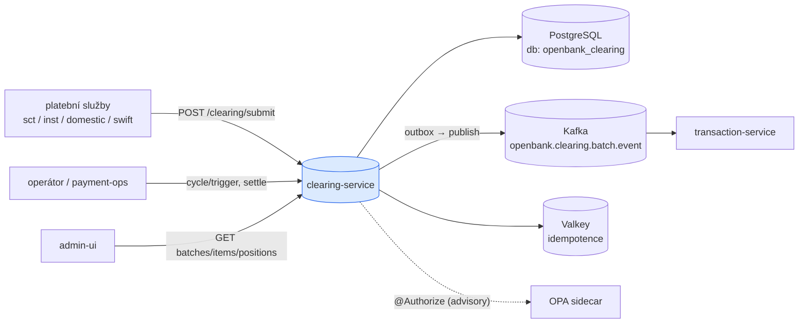
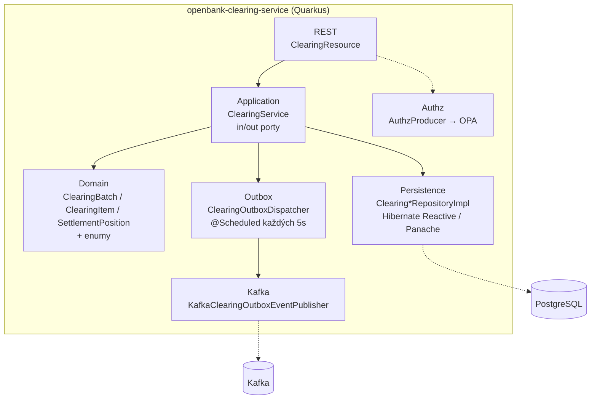
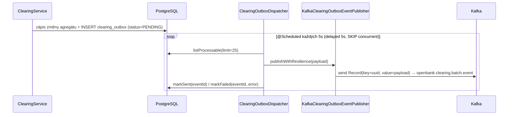

# Architektura

## C4 — Kontext systému



## C4 — Kontejner (vnitřní struktura)



## Hexagonální vrstvy

Struktura balíčků odráží **porty a adaptéry** (ADR-0002):

```
com.openbank.clearing/
├── domain/                       ◄── jádro — žádné frameworkové závislosti
│   └── model/                    ClearingModels.kt: ClearingBatch, ClearingItem,
│                                 SettlementPosition, SubmitPaymentRequest + enumy
│                                 (ClearingStatus, SettlementType, PaymentRail)
│
├── application/                  ◄── orchestrace use-case
│   ├── port/in/                  SubmitPaymentUseCase, GetBatchUseCase, GetItemUseCase,
│   │                             TriggerClearingUseCase, GetPositionsUseCase
│   ├── port/out/                 ClearingBatchRepository, ClearingItemRepository,
│   │                             SettlementPositionRepository, ClearingEventPublisher,
│   │                             ClearingOutboxRepository, ClearingOutboxEventPublisher
│   └── usecase/                  ClearingService (implementuje všechny vstupní porty)
│
└── infrastructure/               ◄── adaptéry
    ├── rest/                     ClearingResource (JAX-RS, reaktivní Uni)
    ├── persistence/              repository impl, entity, ClearingMapper
    ├── outbox/                   ClearingOutboxDispatcher (@Scheduled)
    ├── kafka/                    KafkaClearingOutboxEventPublisher, ClearingEventPublisherImpl
    └── authz/                    AuthzProducer (@Produces PolicyDecisionPoint)
```

**Pravidlo závislostí:** `domain` ← `application` ← `infrastructure`. Doménový model jsou prosté Kotlin data class; nevidí typy Hibernate, Kafka ani JAX-RS.

## Orchestrace use-case

`ClearingService` je jediný `@ApplicationScoped` bean implementující všech pět vstupních portů:

- `submit(...)` — vytvoří `ClearingItem` (status PENDING) s placeholder batch id `00000000-…`; skutečná dávka se přiřadí při cyklu. Anotováno `@Retry(maxRetries = 3)`.
- `triggerClearingCycle(rail)` — `@Timeout(30000)`. Načte až 1000 pending položek pro rail; pokud žádné nejsou, zapíše prázdnou SETTLED dávku; jinak vytvoří IN_CLEARING `ClearingBatch` (NET settlement), sečte `totalDebit`, připne všechny položky (status IN_CLEARING).
- `settleBatch(batchId)` — načte dávku, nastaví status SETTLED + `settledAt` a zavolá `batchRepo.settleWithEvent(batch, items, message)`, které commitne dávku, její položky i outbox řádek v JEDNÉ transakci (#8621). Publisher slouží jen k SESTAVENÍ zprávy (`batchSettledMessage`), nikoli k publikaci — skládání update/saveAll/publish zde dávalo každému vlastní transakci, takže pád po commitu dávky ve stavu SETTLED událost trvale ztratil.
- read cesty — `getBatch`, `listBatches`, `getItem`, `listItemsByBatch`, `listItemsByPayment`, `getPositions`.

## Outbox tok



**Resilience:** `publishWithResilience` je obalen `@Bulkhead(1)`, `@CircuitBreaker(threshold 10, ratio 0.5, delay 5s)`, `@Retry(2, delay 200, jitter 100)`, `@Timeout(3000)`. Scheduler polyká výjimky, aby nikdy nespadl; selhané řádky se označí FAILED pro retry. Životní cyklus outbox statusu: `PENDING → SENT | FAILED`.

> **Pozn. (aktuální stav):** `ClearingEventPublisherImpl.publishBatchSettled` a `publishItemCleared` NEJSOU stuby — každý zapisuje outbox řádek přes `Panache.withTransaction { outboxRepo.persistInTransaction(...) }` (řádky 41 a 85). Produkční cesta je transakční outbox vyprazdňovaný `ClearingOutboxDispatcher` do `clearing-events-out`. `publishBatchSettled` už navíc není na cestě settle vůbec — `settleWithEvent` zapisuje outbox řádek uvnitř transakce dávky — a `publishItemCleared` nemá produkčního volajícího, takže jeho vlastní transakce je latentní past, ne živá vada.

## Komponenty z `openbank-libs`

| Modul | Použití zde |
|---|---|
| `libs.authz.Authorize` | `@Authorize(action="clearingBatch.settle", resource="#id")` na settle |
| `libs.authz.OpaSidecarPolicyDecisionPoint` | OPA-backed `PolicyDecisionPoint` (advisory) |
| `libs.security.Roles` | konstanty rolí (`SERVICE`, `PAYMENTS`, `VIEWER`, `OPERATOR`, `ADMIN`) |
| outbox / persistence plumbing | konvence transakčního outboxu |
| `libs.docs.DocsResource` | **tato dokumentace** (`/q/openbank/docs`) |
| `libs.web.ServiceInfoResource` | `/api/v1/info` (build metadata) |

## Principy

1. **Hranice agregátů** — `ClearingItem`, `ClearingBatch`, `SettlementPosition` jsou samostatné agregáty; cyklus sešívá položky do dávky.
2. **Eventing přes outbox** — settlement události jdou přes transakční outbox, ne přímým inline Kafka send.
3. **Least-privilege na okraji** — operace s vysokým dopadem (settle, cycle trigger) jsou omezeny na `PAYMENTS`/`ADMIN`; čtení jsou širší.
4. **Reaktivně end-to-end** — Hibernate Reactive + Mutiny `Uni`; žádné blokující volání na request vlákně.
5. **Invariant kladné částky** — vynucený jak v doménovém záměru, tak DB CHECK constraintem (V4).
