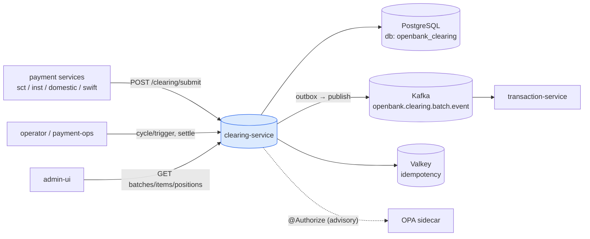
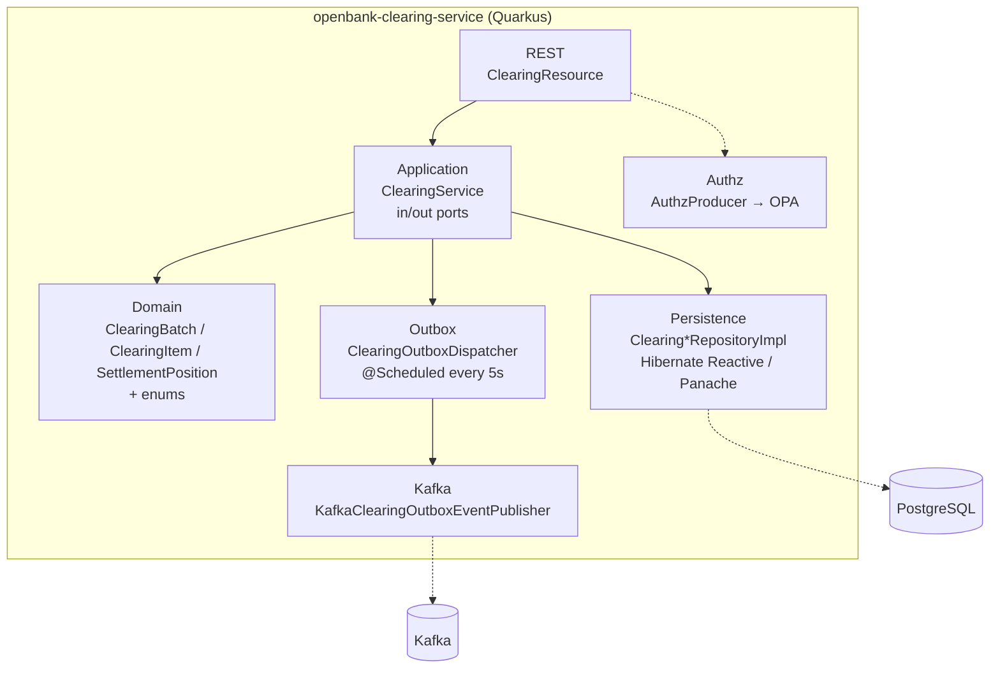
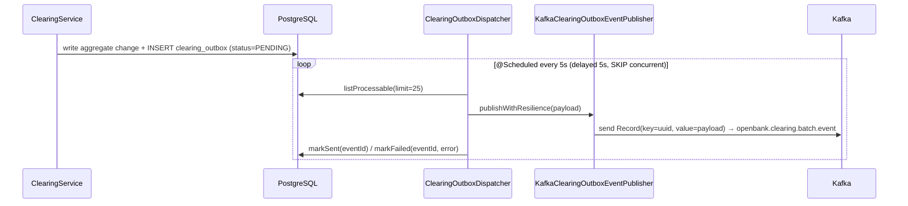

# Architecture

## C4 — System Context



## C4 — Container (internal structure)



## Hexagonal layers

The package structure reflects **ports-and-adapters** (ADR-0002):

```
com.openbank.clearing/
├── domain/                       ◄── core — no framework dependencies
│   └── model/                    ClearingModels.kt: ClearingBatch, ClearingItem,
│                                 SettlementPosition, SubmitPaymentRequest + enums
│                                 (ClearingStatus, SettlementType, PaymentRail)
│
├── application/                  ◄── use-case orchestration
│   ├── port/in/                  SubmitPaymentUseCase, GetBatchUseCase, GetItemUseCase,
│   │                             TriggerClearingUseCase, GetPositionsUseCase
│   ├── port/out/                 ClearingBatchRepository, ClearingItemRepository,
│   │                             SettlementPositionRepository, ClearingEventPublisher,
│   │                             ClearingOutboxRepository, ClearingOutboxEventPublisher
│   └── usecase/                  ClearingService (implements all inbound ports)
│
└── infrastructure/               ◄── adapters
    ├── rest/                     ClearingResource (JAX-RS, reactive Uni)
    ├── persistence/              repository impls, entities, ClearingMapper
    ├── outbox/                   ClearingOutboxDispatcher (@Scheduled)
    ├── kafka/                    KafkaClearingOutboxEventPublisher, ClearingEventPublisherImpl
    └── authz/                    AuthzProducer (@Produces PolicyDecisionPoint)
```

**Dependency rule:** `domain` ← `application` ← `infrastructure`. The domain model is plain Kotlin data classes; it sees no Hibernate, Kafka, or JAX-RS types.

## Use-case orchestration

`ClearingService` is a single `@ApplicationScoped` bean implementing all five inbound ports:

- `submit(...)` — creates a `ClearingItem` (status PENDING) with a placeholder batch id `00000000-…`; the real batch is assigned at cycle time. Annotated `@Retry(maxRetries = 3)`.
- `triggerClearingCycle(rail)` — `@Timeout(30000)`. Loads up to 1000 pending items for the rail; if none, writes an empty SETTLED batch; otherwise creates an IN_CLEARING `ClearingBatch` (NET settlement), sums `totalDebit`, attaches all items (status IN_CLEARING).
- `settleBatch(batchId)` — loads the batch, sets status SETTLED + `settledAt`, then calls `batchRepo.settleWithEvent(batch, items, message)`, which commits the batch, its items and the outbox row in ONE transaction (#8621). The publisher is used only to BUILD the message (`batchSettledMessage`), not to publish it — composing update/saveAll/publish here gave each its own transaction, so a crash after the batch committed SETTLED lost the event permanently.
- read paths — `getBatch`, `listBatches`, `getItem`, `listItemsByBatch`, `listItemsByPayment`, `getPositions`.

## Outbox flow



**Resilience:** `publishWithResilience` is wrapped with `@Bulkhead(1)`, `@CircuitBreaker(threshold 10, ratio 0.5, delay 5s)`, `@Retry(2, delay 200, jitter 100)`, `@Timeout(3000)`. The scheduler swallows exceptions so it never crashes; failed rows are marked FAILED for retry. Outbox status lifecycle: `PENDING → SENT | FAILED`.

> **Note (current state):** `ClearingEventPublisherImpl.publishBatchSettled` and `publishItemCleared` are NOT stubs — each writes an outbox row via `Panache.withTransaction { outboxRepo.persistInTransaction(...) }` (lines 41 and 85). The production path is the transactional outbox drained by `ClearingOutboxDispatcher` to `clearing-events-out`. Note that `publishBatchSettled` is no longer on the settle path at all — `settleWithEvent` writes the outbox row inside the batch's own transaction — and `publishItemCleared` has no production caller, so its self-opened transaction is a latent trap rather than a live defect.

## Components from `openbank-libs`

| Module | Use here |
|---|---|
| `libs.authz.Authorize` | `@Authorize(action="clearingBatch.settle", resource="#id")` on settle |
| `libs.authz.OpaSidecarPolicyDecisionPoint` | OPA-backed `PolicyDecisionPoint` (advisory) |
| `libs.security.Roles` | role constants (`SERVICE`, `PAYMENTS`, `VIEWER`, `OPERATOR`, `ADMIN`) |
| outbox / persistence plumbing | transactional outbox conventions |
| `libs.docs.DocsResource` | **this documentation** (`/q/openbank/docs`) |
| `libs.web.ServiceInfoResource` | `/api/v1/info` (build metadata) |

## Principles

1. **Aggregate boundaries** — `ClearingItem`, `ClearingBatch`, `SettlementPosition` are distinct aggregates; a cycle stitches items into a batch.
2. **Outbox-first eventing** — settlement events go through the transactional outbox, not direct inline Kafka sends.
3. **Least-privilege at the edge** — high-blast-radius operations (settle, cycle trigger) are restricted to `PAYMENTS`/`ADMIN`; reads are broader.
4. **Reactive end-to-end** — Hibernate Reactive + Mutiny `Uni`; no blocking calls on the request thread.
5. **Positive-amount invariant** — enforced both in the domain intent and by DB CHECK constraints (V4).
