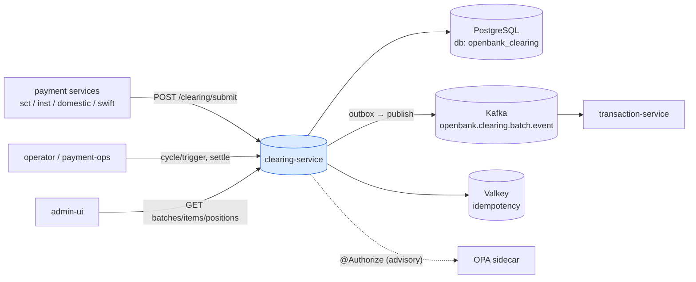
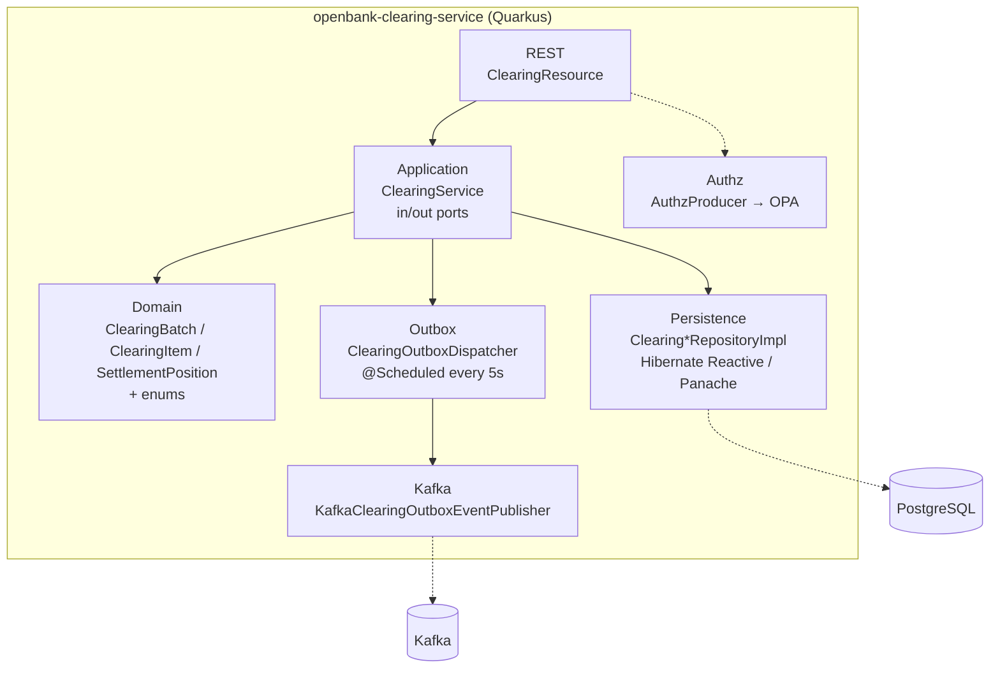
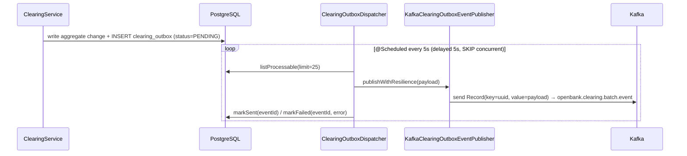

# Architecture

## C4 — System Context


```mermaid
graph LR
  pay[payment services<br/>sct / inst / domestic / swift]
  ops[operator / payment-ops]
  admin[admin-ui]

  clr[(clearing-service)]:::svc
  db[(PostgreSQL<br/>db: openbank_clearing)]
  kafka[(Kafka<br/>openbank.clearing.batch.event)]
  redis[(Valkey<br/>idempotency)]
  opa[OPA sidecar]
  tx[transaction-service]

  pay -- "POST /clearing/submit" --> clr
  ops -- "cycle/trigger, settle" --> clr
  admin -- "GET batches/items/positions" --> clr

  clr --> db
  clr -- "outbox → publish" --> kafka
  clr --> redis
  clr -. "@Authorize (advisory)" .-> opa
  kafka --> tx

  classDef svc fill:#dbeafe,stroke:#2563eb
```

## C4 — Container (internal structure)


```mermaid
graph TB
  subgraph "openbank-clearing-service (Quarkus)"
    direction TB
    rest[REST<br/>ClearingResource]
    uc[Application<br/>ClearingService<br/>in/out ports]
    dom[Domain<br/>ClearingBatch / ClearingItem / SettlementPosition<br/>+ enums]
    persist[Persistence<br/>Clearing*RepositoryImpl<br/>Hibernate Reactive / Panache]
    outbox["Outbox<br/>ClearingOutboxDispatcher<br/>@Scheduled every 5s"]
    kpub[Kafka<br/>KafkaClearingOutboxEventPublisher]
    authz[Authz<br/>AuthzProducer → OPA]
  end

  rest --> uc
  uc --> dom
  uc --> persist
  uc --> outbox
  rest -.-> authz

  persist -.-> db[(PostgreSQL)]
  outbox --> kpub
  kpub -.-> kafka[(Kafka)]
```

## Hexagonal layers

The package structure reflects **ports-and-adapters** (ADR-0002):

```
com.openbank.clearing/
├── domain/                       ◄── core — no framework dependencies
│   └── model/                    ClearingModels.kt: ClearingBatch, ClearingItem,
│                                 SettlementPosition, SubmitPaymentRequest + enums
│                                 (ClearingStatus, SettlementType, PaymentRail)
│
├── application/                  ◄── use-case orchestration
│   ├── port/in/                  SubmitPaymentUseCase, GetBatchUseCase, GetItemUseCase,
│   │                             TriggerClearingUseCase, GetPositionsUseCase
│   ├── port/out/                 ClearingBatchRepository, ClearingItemRepository,
│   │                             SettlementPositionRepository, ClearingEventPublisher,
│   │                             ClearingOutboxRepository, ClearingOutboxEventPublisher
│   └── usecase/                  ClearingService (implements all inbound ports)
│
└── infrastructure/               ◄── adapters
    ├── rest/                     ClearingResource (JAX-RS, reactive Uni)
    ├── persistence/              repository impls, entities, ClearingMapper
    ├── outbox/                   ClearingOutboxDispatcher (@Scheduled)
    ├── kafka/                    KafkaClearingOutboxEventPublisher, ClearingEventPublisherImpl
    └── authz/                    AuthzProducer (@Produces PolicyDecisionPoint)
```

**Dependency rule:** `domain` ← `application` ← `infrastructure`. The domain model is plain Kotlin data classes; it sees no Hibernate, Kafka, or JAX-RS types.

## Use-case orchestration

`ClearingService` is a single `@ApplicationScoped` bean implementing all five inbound ports:

- `submit(...)` — creates a `ClearingItem` (status PENDING) with a placeholder batch id `00000000-…`; the real batch is assigned at cycle time. Annotated `@Retry(maxRetries = 3)`.
- `triggerClearingCycle(rail)` — `@Timeout(30000)`. A clearing batch is per **(rail, currency)** (#11974). Loads up to 1000 pending items whose currency has a settlement GL pair (`SettlementAccountDirectory`, backed by `NetSettlementJournalFactory`: CZK/EUR/USD/GBP); if none, writes one empty SETTLED batch; otherwise groups them by currency and opens one IN_CLEARING `ClearingBatch` (NET settlement) per currency, reference `<cycleId>-<CCY>`, all sharing the `cycleId`. `totalDebit` is summed with kernel `Money`, so a mixed-currency group throws instead of adding euros to koruny — by construction it never is one. Each batch's `net_settlement.post` therefore posts to that currency's GL pair. Returns a `ClearingCycleResult` (`cycleId`, `rail`, `batches`, `unsettleablePending`).
- **Currency with no settlement account:** its items are **not selected** — they stay PENDING on the placeholder batch (never FAILED, never dropped), are counted per currency in `unsettleablePending`, logged at WARN on every cycle and exported as the gauge `openbank_clearing_unsettleable_pending_items{currency}`. Because they are excluded in the SELECT, they cannot fill the 1000-item window and starve settleable items. Seeding the GL pair (ledger migration + `NetSettlementJournalFactory`) makes them settle on the next cycle. This mirrors the posting side, which already refuses an unknown currency loudly (the consumer dead-letters) rather than guessing an account.
- `settleBatch(batchId)` — loads the batch, sets status SETTLED + `settledAt`, then calls `batchRepo.settleWithEvent(batch, items, message)`, which commits the batch, its items and the outbox row in ONE transaction (#8621). The publisher is used only to BUILD the message (`batchSettledMessage`), not to publish it — composing update/saveAll/publish here gave each its own transaction, so a crash after the batch committed SETTLED lost the event permanently.
- read paths — `getBatch`, `listBatches`, `getItem`, `listItemsByBatch`, `listItemsByPayment`, `getPositions`.

## Outbox flow


```mermaid
sequenceDiagram
  participant S as ClearingService
  participant DB as PostgreSQL
  participant D as ClearingOutboxDispatcher
  participant P as KafkaClearingOutboxEventPublisher
  participant K as Kafka

  S->>DB: write aggregate change + INSERT clearing_outbox (status=PENDING)
  loop @Scheduled every 5s (delayed 5s, SKIP concurrent)
    D->>DB: listProcessable(limit=25)
    D->>P: publishWithResilience(payload)
    P->>K: send Record(key=uuid, value=payload) → openbank.clearing.batch.event
    D->>DB: markSent(eventId)  / markFailed(eventId, error)
  end
```

**Resilience:** `publishWithResilience` is wrapped with `@Bulkhead(1)`, `@CircuitBreaker(threshold 10, ratio 0.5, delay 5s)`, `@Retry(2, delay 200, jitter 100)`, `@Timeout(3000)`. The scheduler swallows exceptions so it never crashes; failed rows are marked FAILED for retry. Outbox status lifecycle: `PENDING → SENT | FAILED`.

> **Note (current state):** `ClearingEventPublisherImpl.publishBatchSettled` and `publishItemCleared` are compatibility entry points that each open their own transaction. The production settlement path does not call either method: `settleWithEvents` builds the batch, net-settlement and per-item acknowledgement messages and commits every outbox row inside the same transaction as the batch and item transitions. `ClearingOutboxDispatcher` then drains those rows to `clearing-events-out`.

## Components from `openbank-libs`

| Module | Use here |
|---|---|
| `libs.authz.Authorize` | `@Authorize(action="clearingBatch.settle", resource="#id")` on settle |
| `libs.authz.OpaSidecarPolicyDecisionPoint` | OPA-backed `PolicyDecisionPoint` (advisory) |
| `libs.security.Roles` | role constants (`SERVICE`, `PAYMENTS`, `VIEWER`, `OPERATOR`, `ADMIN`) |
| outbox / persistence plumbing | transactional outbox conventions |
| `libs.docs.DocsResource` | **this documentation** (`/q/openbank/docs`) |
| `libs.web.ServiceInfoResource` | `/api/v1/info` (build metadata) |

## Principles

1. **Aggregate boundaries** — `ClearingItem`, `ClearingBatch`, `SettlementPosition` are distinct aggregates; a cycle stitches items into a batch.
2. **Outbox-first eventing** — settlement events go through the transactional outbox, not direct inline Kafka sends.
3. **Least-privilege at the edge** — high-blast-radius operations (settle, cycle trigger) are restricted to `PAYMENTS`/`ADMIN`; reads are broader.
4. **Reactive end-to-end** — Hibernate Reactive + Mutiny `Uni`; no blocking calls on the request thread.
5. **Positive-amount invariant** — enforced both in the domain intent and by DB CHECK constraints (V4).
