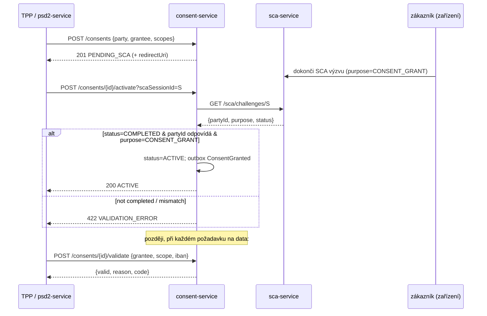

# Compliance

consent-service je **money-path služba** (`rules.yaml: money_path_services`) a regulatorní brána pro přístup k Open Bankingu: je to místo, kde se zaznamenává souhlas PSD2 a SCA evidence. Každá změna vyžaduje 2 schválení + aktuální threat model (ADR 0030).

## Regulatorní rámec

| Regulace | Vztah ke službě | Implementace |
|---|---|---|
| **PSD2** (Reg. (EU) 2015/2366) | Jádro mandátu — AIS/PIS/CBPII souhlas (čl. 64–67) | model scopů (`ACCOUNTS_READ`…`PAYMENTS_INITIATE`…`FUNDS_CONFIRMATION`), příjemce = eIDAS TPP, životní cyklus + validační API |
| **PSD2 RTS o SCA** (Reg. (EU) 2018/389) | Silné ověření zákazníka pro udělení souhlasu | aktivace gated na `COMPLETED` SCA výzvě (účel `CONSENT_GRANT`) z sca-service; 90denní strop AIS platnosti (RTS čl. 10); ≤4 AIS volání/den (RTS čl. 36, `frequency_per_day CHECK 1..4`) |
| **ČOBS / ČNB** (Český standard Open Banking) | Lokální AIS/PIS scopy | ČOBS-specifické scopy: `PAYMENT_ACCOUNTS_READ`, `STANDING_ORDERS_READ`, `DIRECT_DEBITS_READ`, `DOMESTIC_PAYMENT_INITIATE`, `SIPO_PAYMENT_INITIATE` |
| **GDPR** (Reg. (EU) 2016/679) | Záznam souhlasu drží PII (party, IBAN, IP/UA) | zákonný základ = souhlas (čl. 7); explicitní, scope-omezený, časově ohraničený, odvolatelný; PII minimalizováno v odpovědích |
| **eIDAS** (Reg. (EU) 910/2014) | Identita TPP | `granteeId` = eIDAS identifikátor organizace; prověření certifikátu je upstream (psd2-service) |
| **AMLD** (AML směrnice) | Souhlas + SCA evidence jako audit trail | události do audit-service; IP/UA/SCA reference uchovány jako evidence |
| **DORA** (Reg. (EU) 2022/2554) | Operační odolnost | health probes, odolné SCA + outbox, audit události, SLO, runbooky |
| **NIS2** | Bezpečnost sítí a informací | OIDC, OPA authz, striktní bezpečnostní hlavičky, mTLS in-cluster |
| **AI agent governance** (ADR 0031) | Delegovaný přístup agentů | scopy `AGENT_*` vyžadují explicitní souhlas; `AGENT_INITIATE` je per-transakce SCA |

## GDPR mapování

### Zákonný základ (čl. 6 / čl. 7)

- **Souhlas** (čl. 6(1)(a) + čl. 7) — *primární* základ: záznam souhlasu JE explicitní, informované, odvolatelné oprávnění subjektu údajů. Odvolání musí být tak snadné jako udělení (čl. 7(3)) — naplněno `DELETE /consents/{id}`.
- **Právní povinnost** (čl. 6(1)(c)) — uchování záznamu souhlasu/SCA po odvolání pro PSD2/AML evidenci.

### Práva subjektu údajů

| Právo | Aplikace |
|---|---|
| Přístup (čl. 15) | `GET /api/v1/consents/party/{partyId}` vrací souhlasy subjektu |
| Oprava (čl. 16) | souhlasy jsou neměnná evidence; oprava přes odvolání + nové udělení |
| Výmaz (čl. 17) | **Omezeno** — PSD2/AML retence evidence (5 let) přebíjí výmaz po dobu evidence |
| Omezení (čl. 18) | odvolání (`REVOKED`) zastaví veškerý další přístup |
| Přenositelnost (čl. 20) | metadata souhlasu exportovatelná přes endpoint seznamu dle party |
| Námitka (čl. 21) | N/A — žádné marketingové/profilovací zpracování |

### Toky dat ven

- → **audit-service** (Kafka, `openbank.consent.events`): `ConsentGranted` / `ConsentRevoked` / `ConsentRejected` / `ConsentExpired` — stejný správce, intra-OpenBank, tamper-evident audit řetězec.
- → **sca-service** (REST, read-only): pouze `scaSessionId` pro potvrzení dokončení výzvy — žádné PII souhlasu se neposílá.
- → **psd2-service / brána agentů**: výsledek validace (boolean + reason code) — žádné syrové PII.
- DTO `ConsentResponse` záměrně vynechává `ipAddress`, `userAgent`, `redirectUri`, `tppTransactionId`.

Žádná data neopouštějí region EU/EHP.

### Retence (čl. 5(1)(e))

| Stav | Retence |
|---|---|
| ACTIVE | po dobu života souhlasu (max 90 dní AIS / 365 dní ostatní) |
| REVOKED / EXPIRED / REJECTED | 5 let (PSD2/AML evidence) — záznam uchován jako důkaz, že přístup byl autorizován a poté odvolán |

## DORA mapování (Reg. (EU) 2022/2554)

| Článek | Téma | Implementace |
|---|---|---|
| čl. 5/6 | Rámec řízení ICT rizik | hexagonální design, centralizovaný `openbank-libs` |
| čl. 9 | Ochrana & prevence | OIDC + OPA authz, striktní bezpečnostní hlavičky, kontroly vlastnictví |
| čl. 9 (identifikace) | Provenance | `BuildInfo` (gitCommit, buildTime, version) v `/api/v1/info` |
| čl. 10 | Detekce | Micrometer metriky + OTel tracing, alerting na zpoždění outboxu |
| čl. 11 | Odezva & obnova | odolnost SCA + outbox (timeout/retry/circuit breaker), runbooky v [05](./05-operations.md) |
| čl. 16/17 | Řízení & reporting incidentů | události životního cyklu do audit-service pipeline |
| čl. 28 | Riziko třetích stran | závislost sca-service je interní; žádná třetí strana SaaS |

## PSD2 SCA-gated tok souhlasu

Neexistuje žádná **auto-approve cesta** — aktivace striktně vyžaduje, aby sca-service potvrdila dokončenou výzvu (ADR 0021).

## Audit trail

Každý přechod životního cyklu emituje doménovou událost ukládanou `audit-service` (tamper-evident řetězec). Transakční outbox (`consent_outbox`) garantuje, že událost je trvanlivá se změnou stavu a doručena at-least-once do Kafky.

## Bezpečnostní kontroly

- ✅ Validace vstupu: doménové invarianty v agregátu `Consent` (neprázdné scopy, okno platnosti, 90denní RTS strop)
- ✅ Vynucení vlastnictví: revoke kontroluje, že souhlas patří dodanému `partyId` (jinak `403`)
- ✅ AuthN: Keycloak OIDC, RS256 JWT
- ✅ AuthZ: OPA sidecar přes `@Authorize` (ADR 0034); defaultně advisory, `AUTHZ_ENFORCE=true` pro blokování
- ✅ Idempotence: na create (odvozena z `tppTransactionId`/`X-Request-ID`), Redis-backed
- ✅ Odolnost: ověření SCA a dispatch outboxu chráněny timeout/retry/circuit-breaker
- ✅ Bezpečnostní hlavičky: CSP, HSTS, `X-Frame-Options: DENY`, `nosniff`, referrer/permissions policy
- ✅ Minimalizace PII: IP/UA/redirect/tppTxn vynechány z odpovědí pro čtení; IBAN maskováno v logu
- ✅ Audit: každá změna stavu → audit-service přes událost
- ✅ Tajemství: dev placeholdery (`CHANGE_ME_LOCAL_DEV_ONLY`) musí být v prod přepsány přes Vault
- ⚠️ Vynucení OPA je defaultně advisory (`authz.enforce=false`) — přepínej per prostředí, jak policy bundle dozrává
