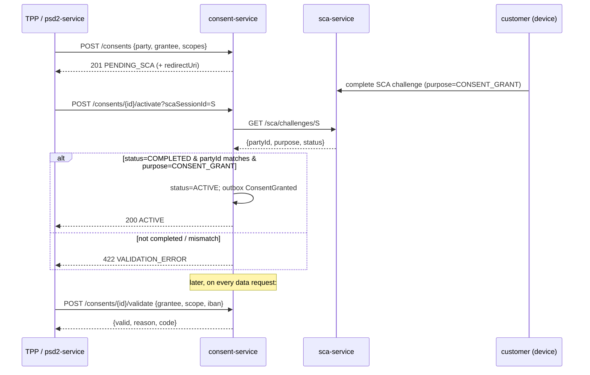

# Compliance

consent-service is a **money-path service** (`rules.yaml: money_path_services`) and the regulatory gate for Open Banking access: it is where PSD2 consent and SCA evidence are recorded. Every change requires 2 approvals + a current threat model (ADR 0030).

## Regulatory framework

| Regulation | Relation to this service | Implementation |
|---|---|---|
| **PSD2** (Reg. (EU) 2015/2366) | Core mandate — AIS/PIS/CBPII consent (Art. 64–67) | scope model (`ACCOUNTS_READ`…`PAYMENTS_INITIATE`…`FUNDS_CONFIRMATION`), grantee = eIDAS TPP, lifecycle + validation API |
| **PSD2 RTS on SCA** (Reg. (EU) 2018/389) | Strong Customer Authentication for consent grant | activation gated on a `COMPLETED` SCA challenge (purpose `CONSENT_GRANT`) from sca-service; 90-day AIS validity cap (RTS Art. 10); ≤4 AIS calls/day (RTS Art. 36, `frequency_per_day CHECK 1..4`) |
| **ČOBS / CNB** (Czech Open Banking Standard) | Local AIS/PIS scopes | ČOBS-specific scopes: `PAYMENT_ACCOUNTS_READ`, `STANDING_ORDERS_READ`, `DIRECT_DEBITS_READ`, `DOMESTIC_PAYMENT_INITIATE`, `SIPO_PAYMENT_INITIATE` |
| **GDPR** (Reg. (EU) 2016/679) | Consent record holds PII (party, IBAN, IP/UA) | lawful basis = consent (Art. 7); explicit, scoped, time-bounded, revocable; PII minimised in responses |
| **eIDAS** (Reg. (EU) 910/2014) | TPP identity | `granteeId` = eIDAS organisation identifier; certificate vetting is upstream (psd2-service) |
| **AMLD** (AML Directive) | Consent + SCA evidence as audit trail | events to audit-service; IP/UA/SCA reference retained as evidence |
| **DORA** (Reg. (EU) 2022/2554) | Operational resilience | health probes, fault-tolerant SCA + outbox, audit events, SLO, runbooks |
| **NIS2** | Network & info security | OIDC, OPA authz, strict security headers, mTLS in-cluster |
| **AI agent governance** (ADR 0031) | Delegated agent access | `AGENT_*` scopes require explicit consent; `AGENT_INITIATE` is per-transaction SCA |

## GDPR mapping

### Lawful basis (Art. 6 / Art. 7)

- **Consent** (Art. 6(1)(a) + Art. 7) — the *primary* basis: the consent record IS the data subject's explicit, informed, revocable authorisation. Withdrawal must be as easy as granting (Art. 7(3)) — satisfied by `DELETE /consents/{id}`.
- **Legal obligation** (Art. 6(1)(c)) — retaining the consent/SCA record after revocation for PSD2/AML evidence.

### Data subject rights

| Right | Application |
|---|---|
| Access (Art. 15) | `GET /api/v1/consents/party/{partyId}` returns the subject's consents |
| Rectification (Art. 16) | consents are immutable evidence; correct by revoking + re-granting |
| Erasure (Art. 17) | **Restricted** — PSD2/AML evidence retention (5 years) overrides erasure for the evidence window |
| Restriction (Art. 18) | revoke (`REVOKED`) stops all further access |
| Portability (Art. 20) | consent metadata exportable via the party-scoped list endpoint |
| Object (Art. 21) | N/A — no marketing/profiling processing here |

### Data flows out

- → **audit-service** (Kafka, `openbank.consent.events`): `ConsentGranted` / `ConsentRevoked` / `ConsentRejected` / `ConsentExpired` — same controller, intra-OpenBank, tamper-evident audit chain.
- → **sca-service** (REST, read-only): the `scaSessionId` only, to confirm challenge completion — no consent PII sent.
- → **psd2-service / agent gateway**: validation result (boolean + reason code) — no raw PII.
- The `ConsentResponse` DTO deliberately omits `ipAddress`, `userAgent`, `redirectUri`, `tppTransactionId`.

No data leaves the EU/EEA region.

### Retention (Art. 5(1)(e))

| State | Retention |
|---|---|
| ACTIVE | for the lifetime of the consent (max 90 days AIS / 365 days other) |
| REVOKED / EXPIRED / REJECTED | 5 years (PSD2/AML evidence) — record kept as proof access was authorised then withdrawn |

## DORA mapping (Reg. (EU) 2022/2554)

| Article | Topic | Implementation |
|---|---|---|
| Art. 5/6 | ICT risk management framework | hexagonal design, centralised `openbank-libs` |
| Art. 9 | Protection & prevention | OIDC + OPA authz, strict security headers, ownership checks |
| Art. 9 (identification) | Provenance | `BuildInfo` (gitCommit, buildTime, version) in `/api/v1/info` |
| Art. 10 | Detection | Micrometer metrics + OTel tracing, outbox-lag alerting |
| Art. 11 | Response & recovery | SCA + outbox fault tolerance (timeout/retry/circuit breaker), runbooks in [05](./05-operations.md) |
| Art. 16/17 | Incident management & reporting | lifecycle events to audit-service pipeline |
| Art. 28 | Third-party risk | sca-service dependency is internal; no third-party SaaS |

## PSD2 SCA-gated consent flow

There is **no auto-approve path** — activation strictly requires sca-service to confirm a completed challenge (ADR 0021).

## Audit trail

Every lifecycle transition emits a domain event persisted by `audit-service` (tamper-evident chain). The transactional outbox (`consent_outbox`) guarantees the event is durable with the state change and delivered at-least-once to Kafka.

## Security controls

- ✅ Input validation: domain invariants in the `Consent` aggregate (scopes non-empty, validity window, RTS 90-day cap)
- ✅ Ownership enforcement: revoke checks the consent belongs to the supplied `partyId` (`403` otherwise)
- ✅ AuthN: Keycloak OIDC, RS256 JWT
- ✅ AuthZ: OPA sidecar via `@Authorize` (ADR 0034); advisory by default, `AUTHZ_ENFORCE=true` to block
- ✅ Idempotency: required-ish on create (derived from `tppTransactionId`/`X-Request-ID`), Redis-backed
- ✅ Resilience: SCA verification and outbox dispatch are timeout/retry/circuit-breaker protected
- ✅ Security headers: CSP, HSTS, `X-Frame-Options: DENY`, `nosniff`, referrer/permissions policy
- ✅ PII minimisation: IP/UA/redirect/tppTxn omitted from read responses; IBAN masked in logs
- ✅ Audit: every state change → audit-service via event
- ✅ Secrets: dev placeholders (`CHANGE_ME_LOCAL_DEV_ONLY`) must be overridden via Vault in prod
- ⚠️ OPA enforcement is advisory (`authz.enforce=false`) by default — flip per environment as the policy bundle matures
