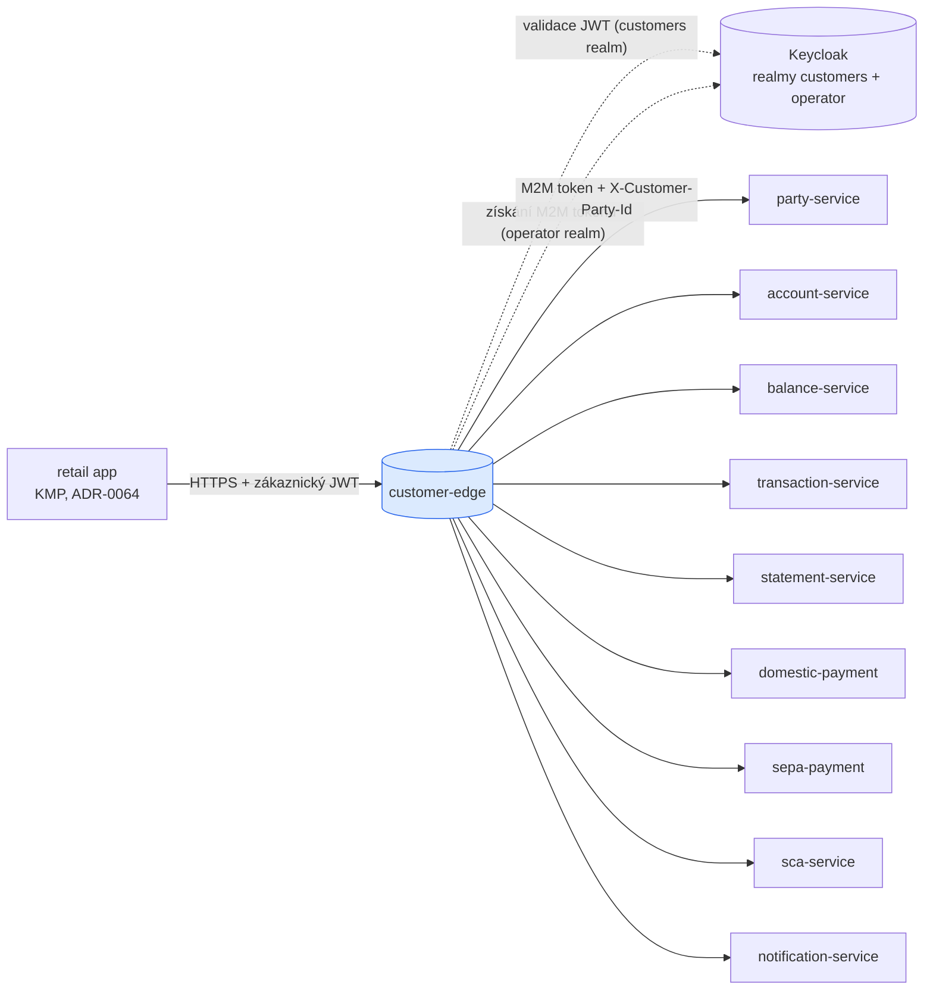
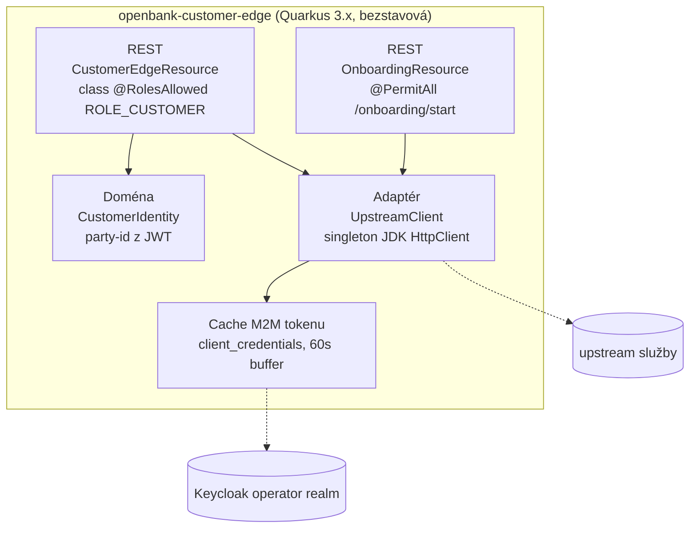
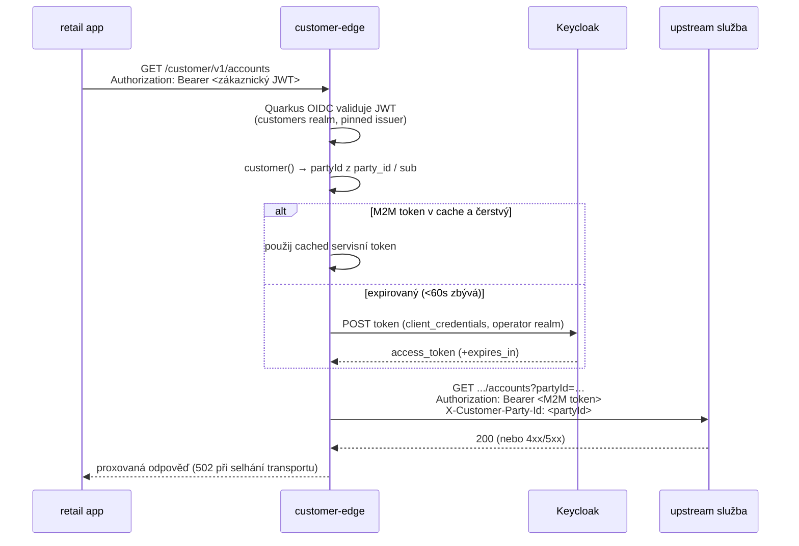

# Architektura

## C4 — Kontext systému



## C4 — Kontejner (vnitřní struktura)



## Hexagonální vrstvy

Rozložení balíčků odráží **ports-and-adapters**, doména je ale záměrně tenká — jde o bránu, ne vlastníka agregátu:

```
com.openbank.customeredge/
├── domain/
│   └── model/                  CustomerIdentity (autentizovaný principal party)
│
└── infrastructure/
    └── rest/                   CustomerEdgeResource  (autentizovaná allow-list proxy)
                                OnboardingResource    (anonymní start cesta)
                                UpstreamClient        (odchozí HTTP + M2M token)
```

**Pravidlo závislostí:** doménový model nemá žádné frameworkové importy; REST resources a upstream klient jsou infrastrukturní adaptéry. Není zde vrstva `application/usecase` ani perzistenční adaptér — edge nedrží stav.

## Proč dvě resource třídy

`CustomerEdgeResource` nese **třídní** `@RolesAllowed("ROLE_CUSTOMER")`. V Quarkusu tato třídní anotace předbíhá metodový `@PermitAll`: OIDC 401 challenge se vyvolá dřív, než se vyhodnotí metodová anotace, **i při lazy autentizaci** (`quarkus.http.auth.proactive=false`). Umístit neautentizovaný `POST /onboarding/start` do vlastní neanotované třídy (`OnboardingResource`) je jediný spolehlivý způsob, jak ho udělat skutečně veřejným, aby se aplikace mohla zaregistrovat ještě před Keycloak session.

## Příchozí vs. odchozí auth (výměna tokenu)



Zákaznický token (z customers realmu) se **nikdy nepřeposílá** — upstreamy validují vůči operátorskému realmu `openbank`. Edge razí vlastní M2M token a identitu volajícího předává jen hlavičkou `X-Customer-Party-Id` (oprava „B4" v `UpstreamClient`).

## UpstreamClient — poznámky k návrhu

- **Singleton `HttpClient`** po celou dobu života aplikace — jeden sdílený connection pool, žádný únik vlákna/fd na request.
- **Vynucené HTTP/1.1** — výchozí JDK (HTTP/2 přes cleartext h2c) rozbíjí POST-s-tělem během upgrade handshake vůči in-cluster serverům, projevuje se to jako falešné 502.
- **Explicitní timeouty** — connect timeout na builderu (`connect-timeout-ms`, default 5000), per-request timeout (`request-timeout-ms`, default 10000).
- **`@ConfigProperty` injekce do field (ne konstruktor)** — defaultní hodnoty Kotlin konstruktoru zastiňují Arc injekci, což tiše nechalo client secret `""` → každý fetch tokenu 401. Field injekce běží po konstrukci a aplikuje konfiguraci spolehlivě.
- **Cache M2M tokenu** — `client_credentials` token cachován do 60 s před expirací; refresh je `@Synchronized`.
- **Varianty operací** — `get` (JSON), `getRaw` (zachová upstream Content-Type pro camt.053 XML / MT940 / PDF, čte se jako `ByteArray`, aby nedošlo k poškození kódováním), `post` (idempotency-aware), `postAnonymous` (onboarding, bez party hlavičky).
- **Režim selhání** — jakákoli výjimka transportu degraduje na JSON `502 {"error":"upstream unavailable"}`.

## Model vlastnictví / IDOR

Některé upstreamy omezují jen podle `accountId` (party hlavička je tam jen poradní), takže edge je hranicí IDOR:

- `getAccount`, `getBalance`, `listTransactions`, `listStatements`, `renderStatement`, iniciace plateb — edge dohledá účet z account-service a ověří `account.partyId == party z JWT` (`ownsAccount`) před proxováním; nevlastněné/neexistující id vrací **403** (záměrně ne 404, aby se předešlo existenčnímu oraclu).
- `getProfile`, `listNotifications`, `listDevices` — implicitně omezeno na party (upstream dotaz používá party z JWT, nikdy klientské id).
- `enrollDevice` — path param `partyId` se musí rovnat party z JWT.
- `registerDevice`, `initiateChallenge`, `openAccount` — `partyId` se injektuje z JWT (přes Jackson, přepíše jakoukoli klientskou hodnotu), takže volající jej nemůže dodat.
- Debtor id platby se parsuje Jacksonem (last-wins, shodně s upstreamem), aby se zavřel obejití IDOR přes dvojitý klíč; `cursor` je URL-enkódovaný, aby nemohl injektovat další query parametry.

**Známé omezení:** `getChallenge` není na edge kontrolován na vlastnictví (neprůhledné id challenge, žádná citlivá data kromě status/method/expires) — sledováno v threat modelu. Plné vynucení přes OPA sidecar je follow-up fleet sweepu ADR-0034 (ADR-0065 §3).

## Principy

1. **Deny-by-default allow-list** — existují jen cesty v této službě; cokoli jiného je 404.
2. **Oddělení realmů** — validuje se příchozí token customers realmu; razí se odchozí M2M token operátorského realmu; nikdy ne tentýž token.
3. **Edge je hranicí IDOR** — vlastnictví se vynucuje zde vždy, když upstream omezuje jen podle id.
4. **Bezstavová** — bez DB, bez outboxu, bez doménového stavu; horizontálně škálovatelná, levně škáluje na nulu.
5. **Obohacuj na edge** — drž bankovní detail (rozdělení IBAN/BBAN, právní jméno, defaulty plateb) mimo mobilního klienta.
