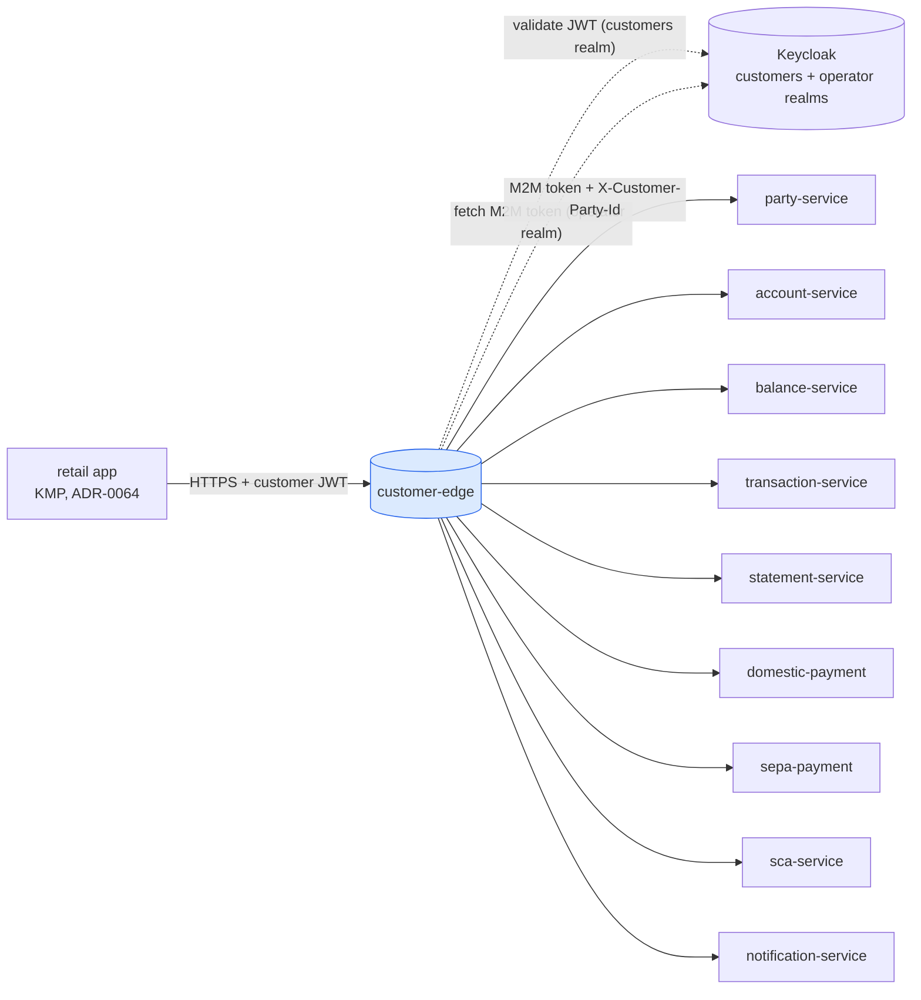
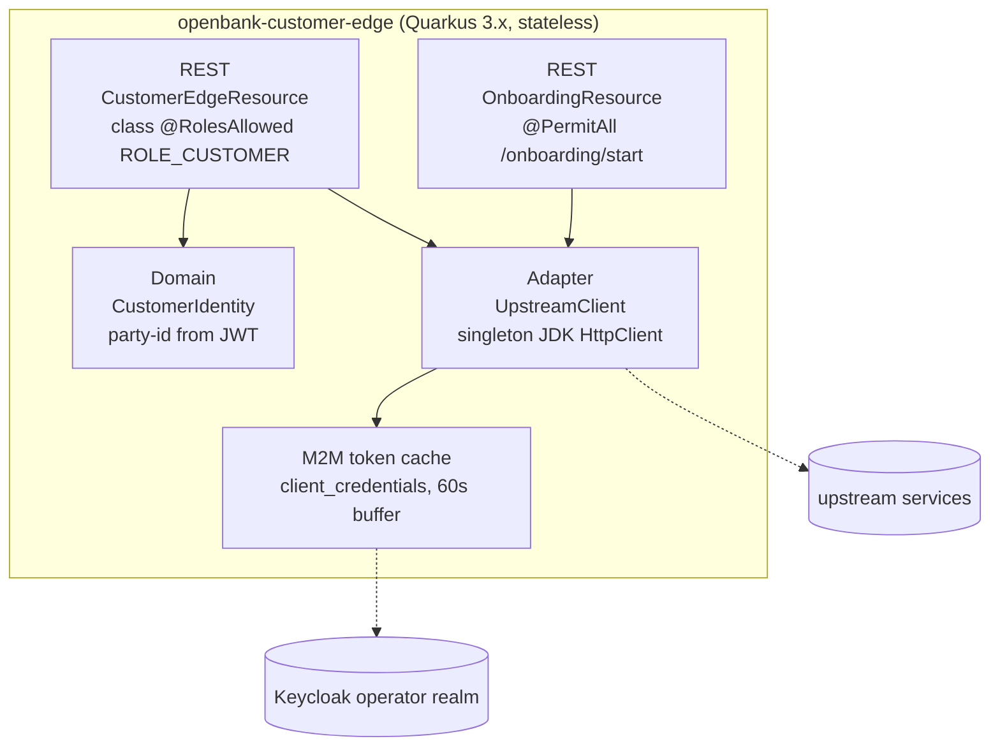
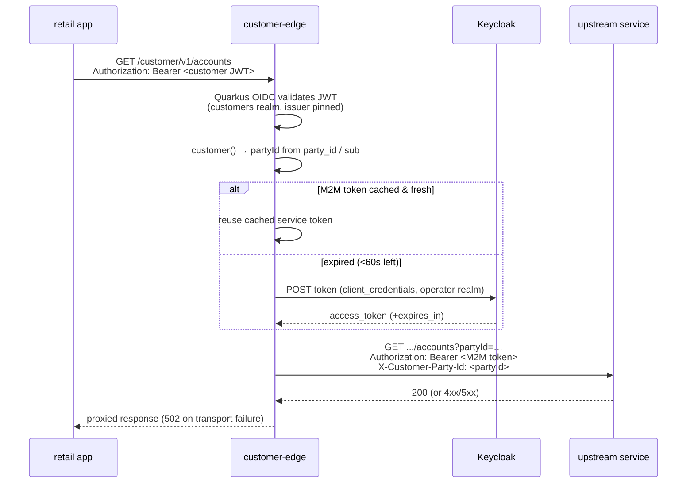

# Architecture

## C4 — System Context



## C4 — Container (internal structure)



## Hexagonal layers

The package layout reflects **ports-and-adapters**, though the domain is intentionally thin — this is a gateway, not an aggregate owner:

```
com.openbank.customeredge/
├── domain/
│   └── model/                  CustomerIdentity (the authenticated party principal)
│
└── infrastructure/
    └── rest/                   CustomerEdgeResource  (authenticated allow-list proxy)
                                OnboardingResource    (anonymous start route)
                                UpstreamClient        (outbound HTTP + M2M token)
```

**Dependency rule:** the `domain` model carries no framework imports; the REST resources and the upstream client are infrastructure adapters. There is no `application/usecase` layer and no persistence adapter — the edge holds no state.

## Why two resource classes

`CustomerEdgeResource` carries a **class-level** `@RolesAllowed("ROLE_CUSTOMER")`. With Quarkus, that class-level annotation pre-empts a method-level `@PermitAll`: an OIDC 401 challenge is raised before the method annotation is evaluated, **even with lazy authentication** (`quarkus.http.auth.proactive=false`). Hosting the unauthenticated `POST /onboarding/start` in its own un-annotated class (`OnboardingResource`) is the only reliable way to make it truly public, so the app can register before it has a Keycloak session.

## Inbound vs. outbound auth (the token swap)



The customer (customers-realm) token is **never forwarded** — upstreams validate against the operator `openbank` realm. The edge mints its own M2M token and conveys the caller's identity only via the `X-Customer-Party-Id` header (the "B4 fix" in `UpstreamClient`).

## UpstreamClient — design notes

- **Singleton `HttpClient`** for the application lifetime — one shared connection pool, no per-request thread/fd leak.
- **HTTP/1.1 forced** — the JDK default (HTTP/2 over cleartext h2c) breaks POST-with-body during the upgrade handshake against the in-cluster servers, surfacing as spurious 502s.
- **Explicit timeouts** — connect timeout on the builder (`connect-timeout-ms`, default 5000), per-request timeout (`request-timeout-ms`, default 10000).
- **`@ConfigProperty` field injection (not constructor params)** — Kotlin constructor default values shadow Arc injection, which silently left the client secret `""` → every token fetch 401. Field injection runs after construction and applies config reliably.
- **M2M token cache** — `client_credentials` token cached until 60 s before expiry; refresh is `@Synchronized`.
- **Operation variants** — `get` (JSON), `getRaw` (preserves upstream Content-Type for camt.053 XML / MT940 / PDF, read as `ByteArray` to avoid charset corruption), `post` (idempotency-aware), `postAnonymous` (onboarding, no party header).
- **Failure mode** — any transport exception degrades to a JSON `502 {"error":"upstream unavailable"}`.

## Ownership / IDOR model

Several upstreams scope only by `accountId` (the party header is advisory there), so the edge is the IDOR boundary:

- `getAccount`, `getBalance`, `listTransactions`, `listStatements`, `renderStatement`, payment initiation — the edge resolves the account from account-service and confirms `account.partyId == JWT party` (`ownsAccount`) before proxying; a non-owned/non-existent id returns **403** (deliberately not 404, to avoid an existence oracle).
- `getProfile`, `listNotifications`, `listDevices` — implicitly party-scoped (the upstream query uses the JWT party, never a client id).
- `enrollDevice` — the `partyId` path param must equal the JWT party.
- `registerDevice`, `initiateChallenge`, `openAccount` — `partyId` is injected from the JWT (via Jackson, overwriting any client value) so the caller cannot supply it.
- Payment debtor id is parsed with Jackson (last-wins, matching the upstream) to close a double-key IDOR bypass; `cursor` is URL-encoded so it cannot inject extra query params.

**Known limitation:** `getChallenge` is not ownership-checked at the edge (opaque challenge id, no sensitive data beyond status/method/expires) — tracked in the threat model. Full OPA-sidecar enforcement is an ADR-0034 fleet-sweep follow-up (ADR-0065 §3).

## Principles

1. **Deny-by-default allow-list** — only the routes in this service exist; anything else is 404.
2. **Realm separation** — inbound customers-realm token validated; outbound operator-realm M2M token minted; never the same token.
3. **Edge is the IDOR boundary** — ownership enforced here whenever an upstream scopes only by id.
4. **Stateless** — no DB, no outbox, no domain state; horizontally scalable, cheap to scale to zero.
5. **Enrich at the edge** — keep banking detail (IBAN/BBAN split, legal name, payment defaults) out of the mobile client.
