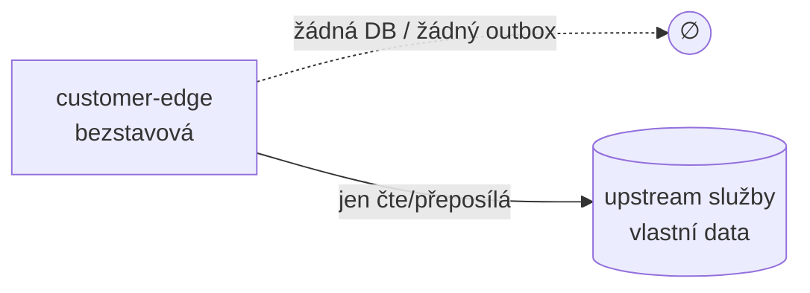

# Data

## Žádná vlastní databáze

`openbank-customer-edge` nevlastní žádná bankovní data. Má:

- ❌ žádnou PostgreSQL databázi — žádnou nevlastní, takže `governance.yaml` neuvádí `databaseName` (`primaryDatastore: Redis`, `ownsNoDatabase: true`, ADR-0071)
- ❌ žádné Flyway migrace
- ❌ žádnou outbox tabulku
- ✅ **Redis** úložiště — jediné, které používá: rozpracované onboardingy pozastavené na four-eyes ověření identity, klíčované `caseId` s TTL (`PendingOnboardingStore`, ADR-0072), a WebAuthn credentials klíčované id credentialu (`WebAuthnStore`, ADR-0066 F2)

Jediný stav v paměti je cachovaný M2M servisní token v `UpstreamClient` (řetězec JWT + jeho expirace, obnovovaný přes `client_credentials` do 60 s před expirací). Neobsahuje žádná zákaznická data a po restartu se sestaví znovu.

Autoritativní data žijí v upstream službách, na které edge proxuje (party, account, balance, transaction, statement, payment, sca, notification). Kromě výše uvedených záznamů v Redisu edge nedrží nic.

## Co edge tranzituje (a neukládá)

I když se nic neperzistuje, zákaznická data edgem **protékají** za letu. Pro mapování datových toků dle GDPR je důležité vědět, co protéká (viz [06 — Compliance](./06-compliance.md)).

| Data za letu | Směr | Uloženo na edge? |
|---|---|---|
| Zákaznický JWT (`party_id`/`sub`, role, scopy) | příchozí | ne (validuje se, party id se extrahuje do request-scoped `CustomerIdentity`) |
| Seznam účtů / detail účtu (vč. IBANu) | upstream → app | ne (proxováno) |
| Zůstatky, transakce, dokumenty výpisů | upstream → app | ne (proxováno / streamováno) |
| Profil (legalName, email, phone, kycStatus, address) | upstream → app | ne (proxováno) |
| Platební instrukce (debtor/creditor IBAN/BBAN, částka, jméno) | app → upstream | ne (obohaceno v paměti, přeposláno) |
| Push token zařízení (FCM/APNs) | app → upstream | ne (přeposláno; při čtení se nikdy nevrací) |
| SCA registrace / rozhodnutí (credentialId, veřejný klíč, podpis) | app ↔ upstream | ne (proxováno) |
| M2M servisní token | interní edge | jen v paměti, žádná zákaznická data |

## Zacházení s PII (GDPR)

Edge je **průchozí processor**, ne controller uložených záznamů. PII, které jím tranzituje:

| Pole | Klasifikace | Zacházení |
|---|---|---|
| `iban` / `accountNumber` | PII (přímý identifikátor) | proxováno; nelogováno v byznysové formě |
| `party_id` / `sub` | pseudonymizovaný identifikátor | extrahováno do `CustomerIdentity`, použito pro vlastnictví + `X-Customer-Party-Id` |
| `legalName`, `email`, `phone`, `address` | PII | proxováno z party-service; odpověď profilu je už zákaznicky bezpečná (bez AML stavu / rodného čísla / risk polí) |
| push `token` | identifikátor zařízení | přeposláno na notification-service; při `GET /devices` se nikdy nevrací |

Protože se nic neukládá, edge nemá **žádnou retenční povinnost** (`retentionPolicy: N/A`, `evidenceExported: false` v `governance.yaml`). Právo na výmaz a retenční povinnosti dle GDPR leží na upstream controllerech (account, party atd.).

## Logování

Selhání transportu se logují s upstream URL a třídou/zprávou výjimky (`UpstreamClient`), ne s těly zákazníka. Obsah tokenu se nikdy neloguje. Vyhněte se logování syrových těl requestů/odpovědí, která mohou nést IBANy nebo jména.
