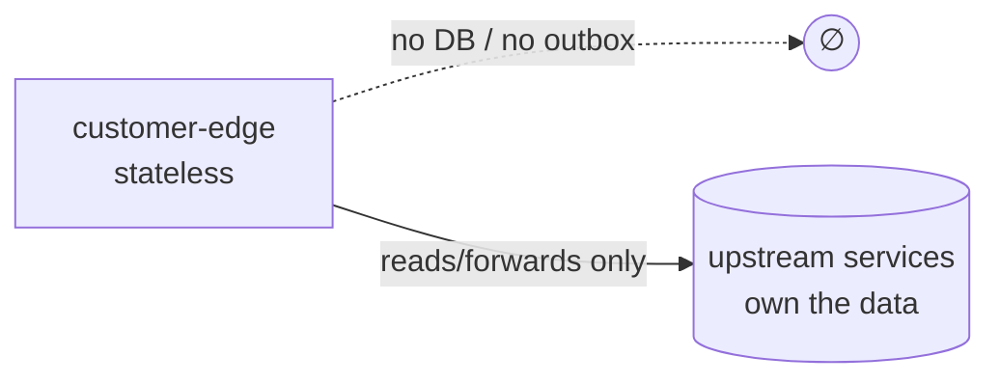

# Data

## No database of its own

`openbank-customer-edge` owns no banking data. It has:

- ❌ no PostgreSQL database — it owns none, so `governance.yaml` declares no `databaseName` (`primaryDatastore: Redis`, `ownsNoDatabase: true`, ADR-0071)
- ❌ no Flyway migrations
- ❌ no outbox table
- ✅ a **Redis** store — the only datastore it uses: pending onboardings paused on a four-eyes identity-verification case, keyed by `caseId` with a TTL (`PendingOnboardingStore`, ADR-0072), and WebAuthn credentials keyed by credential id (`WebAuthnStore`, ADR-0066 F2)

The only in-memory state is the cached M2M service-account token in `UpstreamClient` (a JWT string + its expiry, refreshed via `client_credentials` until 60 s before expiry). It contains no customer data and is rebuilt on restart.

The authoritative data lives in the upstream services the edge proxies to (party, account, balance, transaction, statement, payment, sca, notification). Beyond the Redis entries above, the edge holds nothing.

## What transits the edge (and is not stored)

Although nothing is persisted, customer data **passes through** in flight. Knowing what flows matters for GDPR data-flow mapping (see [06 — Compliance](./06-compliance.md)).

| Data in transit | Direction | Stored at edge? |
|---|---|---|
| Customer JWT (`party_id`/`sub`, roles, scopes) | inbound | no (validated, party id extracted to a request-scoped `CustomerIdentity`) |
| Account list / account detail (incl. IBAN) | upstream → app | no (proxied) |
| Balances, transactions, statement documents | upstream → app | no (proxied / streamed) |
| Profile (legalName, email, phone, kycStatus, address) | upstream → app | no (proxied) |
| Payment instruction (debtor/creditor IBAN/BBAN, amount, name) | app → upstream | no (enriched in memory, forwarded) |
| Push device token (FCM/APNs) | app → upstream | no (forwarded; never returned on read) |
| SCA enrolment / decision (credentialId, public key, signature) | app ↔ upstream | no (proxied) |
| M2M service-account token | edge-internal | in memory only, no customer data |

## PII handling (GDPR)

The edge is a **processor pass-through**, not a controller of stored records. PII that transits it:

| Field | Classification | Handling |
|---|---|---|
| `iban` / `accountNumber` | PII (direct identifier) | proxied; not logged in business form |
| `party_id` / `sub` | pseudonymized identifier | extracted to `CustomerIdentity`, used for ownership + `X-Customer-Party-Id` |
| `legalName`, `email`, `phone`, `address` | PII | proxied from party-service; profile response is already customer-safe (no AML status / national id / risk fields) |
| push `token` | device identifier | forwarded to notification-service; never returned on `GET /devices` |

Because nothing is stored, the edge has **no retention obligation** (`retentionPolicy: N/A`, `evidenceExported: false` in `governance.yaml`). The GDPR right-to-erasure and retention duties fall on the upstream controllers (account, party, etc.).

## Logging

Transport failures are logged with the upstream URL and exception class/message (`UpstreamClient`), not with customer bodies. Token contents are never logged. Avoid logging raw request/response bodies that may carry IBANs or names.
